# Diagrama de Clases — Sistema Web CUP FICCT

> [!NOTE]
> Este diagrama de clases modela la **estructura estática** del Sistema Web de Gestión del Proceso de Admisión y Curso Preuniversitario (CUP) para la FICCT — UAGRM. Está diseñado para ser implementado directamente en **PostgreSQL** usando las migraciones de Laravel (Eloquent ORM).

---

## Diagrama de Clases Completo (Mermaid)

```mermaid
classDiagram
    direction TB

    class Rol {
        +INT id PK
        +VARCHAR(50) nombre
        +TEXT descripcion
        +BOOLEAN activo
        +TIMESTAMP created_at
        +TIMESTAMP updated_at
    }

    class Usuario {
        +INT id PK
        +VARCHAR(100) nombre_completo
        +VARCHAR(150) email UNIQUE
        +VARCHAR(20) ci UNIQUE
        +VARCHAR(255) password_hash
        +INT rol_id FK
        +VARCHAR(20) estado
        +TIMESTAMP ultimo_acceso
        +INT intentos_fallidos
        +VARCHAR(500) token_sesion
        +BOOLEAN eliminado
        +TIMESTAMP created_at
        +TIMESTAMP updated_at
        --
        +iniciarSesion(email, password) Boolean
        +cerrarSesion() void
        +recuperarPassword(email) void
        +bloquearCuenta() void
        +validarCredenciales() Boolean
    }

    class BitacoraAcceso {
        +INT id PK
        +INT usuario_id FK
        +VARCHAR(20) accion
        +VARCHAR(45) direccion_ip
        +TEXT user_agent
        +TIMESTAMP fecha_hora
    }

    class GestionAcademica {
        +INT id PK
        +VARCHAR(10) codigo UNIQUE
        +VARCHAR(50) nombre
        +DATE fecha_inicio
        +DATE fecha_fin
        +VARCHAR(20) estado
        +TIMESTAMP created_at
        +TIMESTAMP updated_at
    }

    class Carrera {
        +INT id PK
        +VARCHAR(100) nombre
        +VARCHAR(20) codigo
        +TEXT descripcion
        +BOOLEAN activa
        +TIMESTAMP created_at
        +TIMESTAMP updated_at
    }

    class CupoCarrera {
        +INT id PK
        +INT carrera_id FK
        +INT gestion_id FK
        +INT cupo_maximo
        +INT cupo_ocupado
        --
        +verificarDisponibilidad() Boolean
        +incrementarOcupado() void
        +getCupoDisponible() INT
    }

    class Postulante {
        +INT id PK
        +VARCHAR(20) codigo_postulante UNIQUE
        +VARCHAR(20) ci UNIQUE
        +VARCHAR(100) nombres
        +VARCHAR(100) apellidos
        +DATE fecha_nacimiento
        +VARCHAR(10) sexo
        +VARCHAR(255) direccion
        +VARCHAR(50) ciudad
        +VARCHAR(20) telefono
        +VARCHAR(150) email
        +VARCHAR(150) colegio_procedencia
        +VARCHAR(255) titulo_bachiller_url
        +INT primera_opcion_carrera_id FK
        +INT segunda_opcion_carrera_id FK
        +VARCHAR(10) turno_preferencia
        +INT gestion_id FK
        +VARCHAR(30) estado
        +BOOLEAN es_recurrente
        +INT usuario_id FK
        +BOOLEAN eliminado
        +TIMESTAMP created_at
        +TIMESTAMP updated_at
        --
        +registrar() void
        +verificarRequisitos() Boolean
        +detectarRecurrente(ci) Boolean
        +cambiarEstado(nuevoEstado) void
        +calcularPromedioGeneral() DECIMAL
    }

    class Pago {
        +INT id PK
        +INT postulante_id FK
        +DECIMAL monto
        +VARCHAR(3) moneda
        +VARCHAR(255) stripe_payment_id
        +VARCHAR(30) estado_pago
        +VARCHAR(50) metodo_pago
        +TIMESTAMP fecha_pago
        +TEXT respuesta_pasarela
        +TIMESTAMP created_at
    }

    class Requisito {
        +INT id PK
        +VARCHAR(100) nombre
        +TEXT descripcion
        +BOOLEAN obligatorio
    }

    class RequisitoPostulante {
        +INT id PK
        +INT postulante_id FK
        +INT requisito_id FK
        +BOOLEAN cumplido
        +VARCHAR(255) documento_url
        +TIMESTAMP fecha_verificacion
    }

    class Materia {
        +INT id PK
        +VARCHAR(50) nombre
        +VARCHAR(10) codigo
        +BOOLEAN activa
    }

    class Docente {
        +INT id PK
        +VARCHAR(20) ci UNIQUE
        +VARCHAR(100) nombres
        +VARCHAR(100) apellidos
        +VARCHAR(50) especialidad
        +VARCHAR(50) grado_academico
        +VARCHAR(150) email
        +VARCHAR(20) telefono
        +VARCHAR(20) estado
        +INT usuario_id FK
        +TIMESTAMP created_at
        +TIMESTAMP updated_at
        --
        +getCargaHoraria() INT
        +puedeAsignarGrupo() Boolean
    }

    class Aula {
        +INT id PK
        +VARCHAR(20) numero
        +INT capacidad
        +VARCHAR(50) ubicacion
        +BOOLEAN disponible
    }

    class Grupo {
        +INT id PK
        +INT numero_grupo
        +INT gestion_id FK
        +VARCHAR(10) turno
        +INT aula_id FK
        +INT cantidad_estudiantes
        +VARCHAR(20) estado
        +TIMESTAMP created_at
        +TIMESTAMP updated_at
        --
        +estaCompleto() Boolean
        +agregarEstudiante() void
        +calcularCantidadGrupos(totalInscritos, maxPorGrupo) INT
    }

    class PostulanteGrupo {
        +INT id PK
        +INT postulante_id FK
        +INT grupo_id FK
        +TIMESTAMP fecha_asignacion
    }

    class DocenteGrupoMateria {
        +INT id PK
        +INT docente_id FK
        +INT grupo_id FK
        +INT materia_id FK
        +TIMESTAMP fecha_asignacion
    }

    class Examen {
        +INT id PK
        +INT postulante_id FK
        +INT materia_id FK
        +INT grupo_id FK
        +INT numero_examen
        +DECIMAL nota
        +DECIMAL ponderacion
        +DATE fecha_aplicacion
        +TIMESTAMP created_at
        +TIMESTAMP updated_at
        --
        +validarRangoNota() Boolean
        +calcularNotaPonderada() DECIMAL
    }

    class ResultadoMateria {
        +INT id PK
        +INT postulante_id FK
        +INT materia_id FK
        +DECIMAL nota_examen1
        +DECIMAL nota_examen2
        +DECIMAL nota_examen3
        +DECIMAL promedio_ponderado
        +VARCHAR(15) estado_materia
        --
        +calcularPromedioPonderado() DECIMAL
        +determinarEstado() VARCHAR
    }

    class ResultadoFinal {
        +INT id PK
        +INT postulante_id FK
        +INT gestion_id FK
        +DECIMAL promedio_general
        +VARCHAR(15) estado_final
        +TIMESTAMP fecha_calculo
        --
        +calcularPromedioGeneral() DECIMAL
        +determinarEstadoFinal() VARCHAR
        +todasMateriasAprobadas() Boolean
    }

    class Admision {
        +INT id PK
        +INT postulante_id FK
        +INT carrera_asignada_id FK
        +INT gestion_id FK
        +VARCHAR(50) mecanismo_asignacion
        +TIMESTAMP fecha_admision
        --
        +ejecutarAsignacion() void
        +reasignarCarrera() void
    }

    class Notificacion {
        +INT id PK
        +INT usuario_id FK
        +VARCHAR(50) tipo_evento
        +TEXT mensaje
        +VARCHAR(15) estado
        +TIMESTAMP fecha_generacion
        +TIMESTAMP fecha_lectura
    }

    class ConversacionChatbot {
        +INT id PK
        +INT postulante_id FK
        +TEXT pregunta
        +TEXT respuesta
        +BOOLEAN resuelta
        +TIMESTAMP fecha
    }

    class AuditoriaNotas {
        +INT id PK
        +INT examen_id FK
        +INT usuario_modificador_id FK
        +DECIMAL nota_anterior
        +DECIMAL nota_nueva
        +TEXT motivo
        +TIMESTAMP fecha_modificacion
    }

    %% ===== RELACIONES =====

    Rol "1" --> "*" Usuario : tiene
    Usuario "1" --> "*" BitacoraAcceso : registra
    Usuario "1" --> "*" Notificacion : recibe

    Usuario "1" -- "0..1" Postulante : es
    Usuario "1" -- "0..1" Docente : es

    GestionAcademica "1" --> "*" CupoCarrera : define cupos
    GestionAcademica "1" --> "*" Grupo : organiza
    GestionAcademica "1" --> "*" Postulante : inscribe
    GestionAcademica "1" --> "*" ResultadoFinal : evalúa
    GestionAcademica "1" --> "*" Admision : admite

    Carrera "1" --> "*" CupoCarrera : tiene cupos
    Carrera "1" --> "*" Admision : recibe admitidos

    Postulante "1" --> "1" Carrera : primera opción
    Postulante "1" --> "1" Carrera : segunda opción
    Postulante "1" --> "*" Pago : realiza
    Postulante "1" --> "*" RequisitoPostulante : cumple
    Postulante "1" --> "*" PostulanteGrupo : asignado a
    Postulante "1" --> "*" Examen : rinde
    Postulante "1" --> "*" ResultadoMateria : obtiene
    Postulante "1" --> "0..1" ResultadoFinal : tiene
    Postulante "1" --> "0..1" Admision : admitido en
    Postulante "1" --> "*" ConversacionChatbot : consulta

    Requisito "1" --> "*" RequisitoPostulante : verificado en

    Grupo "1" --> "*" PostulanteGrupo : contiene
    Grupo "1" --> "*" DocenteGrupoMateria : tiene docentes
    Grupo "1" --> "*" Examen : aplica
    Grupo "*" --> "1" Aula : usa

    Docente "1" --> "*" DocenteGrupoMateria : asignado a

    Materia "1" --> "*" DocenteGrupoMateria : impartida en
    Materia "1" --> "*" Examen : evaluada en
    Materia "1" --> "*" ResultadoMateria : evaluada en

    Examen "1" --> "*" AuditoriaNotas : auditada por
    Usuario "1" --> "*" AuditoriaNotas : modifica
```



---

## Descripción de las Clases y Justificación

### 1. Módulo de Autenticación y Autorización (RBAC)

| Clase | Descripción | Tabla PostgreSQL |
|-------|-------------|-----------------|
| **Rol** | Define los roles del sistema: Administrador, Coordinador, Docente, Postulante | `roles` |
| **Usuario** | Cuenta de acceso al sistema. Vinculada a un rol. Maneja hash bcrypt, JWT, intentos fallidos y soft delete | `usuarios` |
| **BitacoraAcceso** | Registro inmutable de cada LOGIN/LOGOUT con IP y timestamp | `bitacora_accesos` |

---

### 2. Módulo de Gestión Académica

| Clase | Descripción | Tabla PostgreSQL |
|-------|-------------|-----------------|
| **GestionAcademica** | Representa un período académico (ej: "1-2026", "2-2026"). Es la entidad temporal que agrupa todo el proceso del CUP | `gestiones_academicas` |
| **Carrera** | Las 4 carreras de la FICCT: Ing. Informática, Ing. Sistemas, Ing. Redes y Telecomunicaciones, Ing. Robótica | `carreras` |
| **CupoCarrera** | Tabla intermedia que define cuántos cupos hay por carrera en cada gestión. Controla `cupo_ocupado` vs `cupo_maximo` | `cupos_carreras` |

---

### 3. Módulo de Registro de Postulantes

| Clase | Descripción | Tabla PostgreSQL |
|-------|-------------|-----------------|
| **Postulante** | Entidad central del negocio. Contiene datos personales, opciones de carrera (1ª y 2ª), turno de preferencia, estado del proceso y flag de recurrente | `postulantes` |
| **Pago** | Registra el pago procesado por Stripe. Vinculado al postulante con `stripe_payment_id` para trazabilidad | `pagos` |
| **Requisito** | Catálogo de requisitos documentales (CI, título de bachiller, certificados, etc.) | `requisitos` |
| **RequisitoPostulante** | Tabla intermedia que controla el cumplimiento de cada requisito por postulante (check/uncheck) | `requisitos_postulantes` |

---

### 4. Módulo de Asignación de Grupos y Horarios

| Clase | Descripción | Tabla PostgreSQL |
|-------|-------------|-----------------|
| **Aula** | Aulas físicas con número, capacidad y ubicación | `aulas` |
| **Grupo** | Grupo de estudio del CUP. Máximo 70 estudiantes. Vinculado a gestión, turno y aula. `calcularCantidadGrupos()` implementa `CEIL(total/70)` | `grupos` |
| **PostulanteGrupo** | Tabla intermedia que asigna postulantes a grupos | `postulantes_grupos` |

---

### 5. Módulo de Gestión de Docentes

| Clase | Descripción | Tabla PostgreSQL |
|-------|-------------|-----------------|
| **Docente** | Profesional contratado para el CUP. Especialidad en una de las 4 materias. Requisitos: Licenciatura + Maestría + Diplomado en Educación Superior | `docentes` |
| **DocenteGrupoMateria** | Tabla intermedia que asigna un docente a un grupo para una materia específica. Controla que un docente tenga máximo 4 grupos | `docentes_grupos_materias` |

---

### 6. Módulo de Gestión Académica y Exámenes

| Clase | Descripción | Tabla PostgreSQL |
|-------|-------------|-----------------|
| **Materia** | Las 4 materias del CUP: Computación, Matemáticas, Inglés, Física | `materias` |
| **Examen** | Registro individual de cada nota. 3 exámenes por materia por postulante. Ponderación: 30%, 30%, 40%. Rango validado: 0-100 | `examenes` |
| **ResultadoMateria** | Promedio ponderado calculado por materia. Estado: APROBADO (≥60) o REPROBADO (<60) | `resultados_materias` |
| **ResultadoFinal** | Estado final del postulante. APROBADO solo si **las 4 materias** tienen nota ≥60 individualmente | `resultados_finales` |
| **AuditoriaNotas** | Bitácora de modificaciones de notas: quién cambió, cuándo, valor anterior y nuevo | `auditoria_notas` |

---

### 7. Módulo de Admisión y Asignación de Carreras

| Clase | Descripción | Tabla PostgreSQL |
|-------|-------------|-----------------|
| **Admision** | Asignación final de un postulante aprobado a una carrera. Registra el mecanismo: "Primera opción", "Segunda opción" o "Reasignación administrativa" | `admisiones` |

---

### 8. Módulos Diferenciadores

| Clase | Descripción | Tabla PostgreSQL |
|-------|-------------|-----------------|
| **Notificacion** | Notificaciones en tiempo real via WebSockets. Tipos: pago confirmado, grupo asignado, notas publicadas, resultado final, cupo agotado | `notificaciones` |
| **ConversacionChatbot** | Historial de interacciones del postulante con el asistente virtual IA | `conversaciones_chatbot` |

---

## Reglas de Negocio Implementadas en el Diagrama

| # | Regla de Negocio | Clase(s) Involucrada(s) | Implementación |
|---|-----------------|------------------------|----------------|
| RN1 | 3 exámenes por materia, no más | `Examen` | Constraint: `numero_examen IN (1, 2, 3)` + UNIQUE(`postulante_id`, `materia_id`, `numero_examen`) |
| RN2 | Ponderación 30% - 30% - 40% | `Examen`, `ResultadoMateria` | `calcularPromedioPonderado()` = nota1×0.30 + nota2×0.30 + nota3×0.40 |
| RN3 | Notas entre 0 y 100 | `Examen` | CHECK constraint: `nota >= 0 AND nota <= 100` |
| RN4 | Aprobación ≥60 por CADA materia | `ResultadoMateria`, `ResultadoFinal` | `todasMateriasAprobadas()`: verifica las 4 materias individualmente |
| RN5 | Máximo 70 estudiantes por grupo | `Grupo` | `estaCompleto()`: `cantidad_estudiantes >= 70` |
| RN6 | Cálculo de grupos: CEIL(inscritos/70) | `Grupo` | `calcularCantidadGrupos(total, 70)` |
| RN7 | Docente: máximo 4 grupos | `Docente`, `DocenteGrupoMateria` | `puedeAsignarGrupo()`: COUNT de asignaciones < 4 |
| RN8 | CI no duplicado en postulantes | `Postulante` | UNIQUE constraint en `ci` |
| RN9 | Requisitos deben cumplirse antes del pago | `RequisitoPostulante`, `Pago` | `verificarRequisitos()` precondición de pago |
| RN10 | Asignación de carrera: 1ª opción → 2ª opción → Reasignación | `Admision`, `CupoCarrera` | Algoritmo en `ejecutarAsignacion()` |
| RN11 | Postulante recurrente mantiene código | `Postulante` | `detectarRecurrente(ci)`: busca por CI, reutiliza código |
| RN12 | Bloqueo de cuenta tras 3 intentos fallidos | `Usuario` | `intentos_fallidos >= 3` → `bloquearCuenta()` |
| RN13 | Soft delete para preservar historial | `Usuario`, `Postulante` | Campo `eliminado` (boolean), nunca DELETE físico |

---

## Cardinalidades Clave

| Relación | Cardinalidad | Justificación |
|----------|-------------|---------------|
| Rol → Usuario | 1 : * | Un rol puede tener muchos usuarios |
| Usuario → Postulante | 1 : 0..1 | Un usuario puede o no ser postulante |
| Usuario → Docente | 1 : 0..1 | Un usuario puede o no ser docente |
| GestionAcademica → Grupo | 1 : * | Una gestión tiene muchos grupos |
| Postulante → Examen | 1 : * | Un postulante rinde hasta 12 exámenes (4 materias × 3) |
| Postulante → PostulanteGrupo | 1 : 1 | Un postulante se asigna a un solo grupo |
| Grupo → PostulanteGrupo | 1 : * (máx 70) | Un grupo tiene hasta 70 postulantes |
| Docente → DocenteGrupoMateria | 1 : * (máx 4) | Un docente se asigna a 1-4 grupos |
| Postulante → Pago | 1 : * | Un postulante puede tener múltiples pagos (recurrente) |
| Postulante → ResultadoMateria | 1 : 4 | Un postulante tiene resultado en 4 materias |
| Postulante → ResultadoFinal | 1 : 0..1 | Un postulante tiene un resultado final por gestión |
| Postulante → Admision | 1 : 0..1 | Un postulante aprobado tiene una admisión |
| Carrera → CupoCarrera | 1 : * | Cada carrera tiene cupos diferentes por gestión |

---

## Mapeo Clase → Tabla PostgreSQL

```
Rol                   → roles
Usuario               → usuarios
BitacoraAcceso        → bitacora_accesos
GestionAcademica      → gestiones_academicas
Carrera               → carreras
CupoCarrera           → cupos_carreras
Postulante            → postulantes
Pago                  → pagos
Requisito             → requisitos
RequisitoPostulante   → requisitos_postulantes
Materia               → materias
Docente               → docentes
Aula                  → aulas
Grupo                 → grupos
PostulanteGrupo       → postulantes_grupos
DocenteGrupoMateria   → docentes_grupos_materias
Examen                → examenes
ResultadoMateria      → resultados_materias
ResultadoFinal        → resultados_finales
Admision              → admisiones
Notificacion          → notificaciones
ConversacionChatbot   → conversaciones_chatbot
AuditoriaNotas        → auditoria_notas
```

> [!TIP]
> Para generar este diagrama visualmente fuera de Mermaid, puedes copiar la definición de clases en herramientas como **Draw.io**, **Lucidchart**, **StarUML** o **Visual Paradigm** para obtener un diagrama UML formal con notación estándar.
