```plantuml
@startuml FICCT_Sistema_Admision

!define TABLA_COLOR #E1F5FF
!define RELATION_COLOR #0288D1

' Temas y estilos
skinparam backgroundColor #F5F5F5
skinparam classBackgroundColor TABLA_COLOR
skinparam classBorderColor #01579B
skinparam classArrowColor RELATION_COLOR
skinparam defaultFontSize 11

' ===== ENTIDADES DE USUARIO =====
class User {
    - id: bigint (PK)
    - name: string
    - email: string (UNIQUE)
    - email_verified_at: timestamp
    - password: string
    - role: string (Administrador|Coordinador|Docente|Postulante)
    - active: boolean
    - created_at: timestamp
    - updated_at: timestamp
}

class BitacoraAcceso {
    - id: bigint (PK)
    - user_id: bigint (FK)
    - ip_address: string
    - action: string
    - created_at: timestamp
}

class Notificacion {
    - id: bigint (PK)
    - usuario_id: bigint (FK)
    - tipo_evento: string
    - mensaje: text
    - estado: string (NO_LEIDA|LEIDA)
    - fecha_generacion: timestamp
    - fecha_lectura: timestamp
}

' ===== ENTIDADES DE GESTIÓN =====
class Gestion {
    - id: bigint (PK)
    - codigo: string (UNIQUE)
    - activa: boolean
    - fecha_inicio: date
    - fecha_fin: date
    - created_at: timestamp
}

class Carrera {
    - id: bigint (PK)
    - nombre: string (UNIQUE)
    - codigo: string (UNIQUE)
}

class CupoGestion {
    - id: bigint (PK)
    - gestion_id: bigint (FK)
    - carrera_id: bigint (FK)
    - cupo_maximo: integer
    - cupos_disponibles: integer
    - created_at: timestamp
}

' ===== ENTIDADES DE POSTULANTES =====
class Postulante {
    - id: bigint (PK)
    - ci: string (UNIQUE)
    - nombres: string
    - apellidos: string
    - fecha_nacimiento: date
    - sexo: char
    - direccion: string
    - telefono: string
    - email: string
    - colegio_procedencia: string
    - ciudad: string
    - titulo_bachiller: string
    - primera_opcion_id: bigint (FK)
    - segunda_opcion_id: bigint (FK)
    - turno_preferencia: string
    - gestion_id: bigint (FK)
    - estado: string (Preinscrito|...)
    - recurrente: boolean
    - user_id: bigint (FK, nullable)
    - created_at: timestamp
    - updated_at: timestamp
}

class RequisitosDocumentales {
    - id: bigint (PK)
    - postulante_id: bigint (FK, UNIQUE)
    - ci_digitalizado: boolean
    - certificado_nacimiento: boolean
    - titulo_bachiller_legalizado: boolean
    - formulario_preinscripcion: boolean
    - verificado_bd_externa: boolean
    - updated_at: timestamp
}

class Pago {
    - id: bigint (PK)
    - postulante_id: bigint (FK)
    - stripe_checkout_id: string (UNIQUE)
    - monto: decimal
    - estado_pago: string
    - fecha_pago: timestamp
}

class Admision {
    - id: bigint (PK)
    - postulante_id: bigint (FK, UNIQUE)
    - carrera_id: bigint (FK)
    - via: string
    - fecha_admision: timestamp
}

class ConversacionChatbot {
    - id: bigint (PK)
    - postulante_id: bigint (FK)
    - pregunta: text
    - respuesta: text
    - resuelta: boolean
    - fecha: timestamp
}

' ===== ENTIDADES ACADÉMICAS =====
class Aula {
    - id: bigint (PK)
    - nombre: string
    - capacidad: integer
    - ubicacion: string
}

class Grupo {
    - id: bigint (PK)
    - numero: integer
    - gestion_id: bigint (FK)
    - turno: string
    - aula_id: bigint (FK)
    - created_at: timestamp
}

class Materia {
    - id: bigint (PK)
    - nombre: string (UNIQUE)
    - codigo: string (UNIQUE)
}

class AsignacionGrupo {
    - id: bigint (PK)
    - postulante_id: bigint (FK, UNIQUE)
    - grupo_id: bigint (FK)
    - created_at: timestamp
}

class Docente {
    - id: bigint (PK)
    - ci: string (UNIQUE)
    - nombres: string
    - apellidos: string
    - especialidad: string
    - grado_academico: string
    - correo: string
    - user_id: bigint (FK, nullable)
    - created_at: timestamp
}

class AsignacionDocente {
    - id: bigint (PK)
    - docente_id: bigint (FK)
    - grupo_id: bigint (FK)
    - materia_id: bigint (FK)
    - created_at: timestamp
}

' ===== ENTIDADES DE EVALUACIÓN =====
class Examen {
    - id: bigint (PK)
    - postulante_id: bigint (FK)
    - materia_id: bigint (FK)
    - numero_examen: integer
    - nota: decimal
    - created_at: timestamp
}

class NotaFinal {
    - id: bigint (PK)
    - postulante_id: bigint (FK)
    - materia_id: bigint (FK)
    - promedio: decimal
    - estado: string
    - updated_at: timestamp
}

class PreguntaSimulacro {
    - id: bigint (PK)
    - materia_id: bigint (FK)
    - enunciado: text
    - opciones: text
    - respuesta_correcta: string
    - created_at: timestamp
}

class AuditoriaNotas {
    - id: bigint (PK)
    - examen_id: bigint (FK)
    - usuario_modificador_id: bigint (FK)
    - nota_anterior: decimal
    - nota_nueva: decimal
    - motivo: text
    - fecha_modificacion: timestamp
}

' ===== RELACIONES =====

' User relationships
User "1" --> "*" BitacoraAcceso : registra
User "1" --> "*" Notificacion : recibe
User "1" --> "0..1" Postulante : se_registra_como
User "1" --> "0..1" Docente : se_registra_como
User "1" --> "*" AuditoriaNotas : modifica

' Gestion relationships
Gestion "1" --> "*" CupoGestion : define
Gestion "1" --> "*" Grupo : contiene
Gestion "1" --> "*" Postulante : tiene

' Carrera relationships
Carrera "1" --> "*" CupoGestion : tiene
Carrera "1" --> "*" Postulante : es_primera_opcion_de
Carrera "1" --> "*" Postulante : es_segunda_opcion_de
Carrera "1" --> "*" Admision : admite_a

' Postulante relationships
Postulante "1" --> "1" RequisitosDocumentales : tiene
Postulante "1" --> "*" Pago : realiza
Postulante "1" --> "1" AsignacionGrupo : asignado_a
Postulante "1" --> "*" Examen : presenta
Postulante "1" --> "*" NotaFinal : obtiene
Postulante "1" --> "*" ConversacionChatbot : participa_en
Postulante "1" --> "1" Admision : obtiene

' Aula relationships
Aula "1" --> "*" Grupo : contiene

' Grupo relationships
Grupo "1" --> "*" AsignacionGrupo : asigna
Grupo "1" --> "*" AsignacionDocente : enseña

' Materia relationships
Materia "1" --> "*" AsignacionDocente : se_enseña_en
Materia "1" --> "*" Examen : se_evalúa
Materia "1" --> "*" NotaFinal : tiene
Materia "1" --> "*" PreguntaSimulacro : contiene

' Docente relationships
Docente "1" --> "*" AsignacionDocente : imparte

' Examen relationships
Examen "1" --> "*" AuditoriaNotas : es_auditado_en

@enduml
```

## 📋 Descripción del Diagrama de Clases

Este diagrama representa el **MODELO CONCEPTUAL INTEGRAL** del Sistema de Admisión FICCT operando en todo el sistema.

### 🏗️ Módulos Principales:

#### 1. **USUARIOS (User Management)**
- `User`: Entidad central de autenticación
- `BitacoraAcceso`: Registro de actividades
- `Notificacion`: Sistema de notificaciones

#### 2. **GESTIÓN ACADÉMICA**
- `Gestion`: Semestres/períodos académicos
- `Carrera`: Programas académicos
- `CupoGestion`: Control de capacidad por carrera y gestión

#### 3. **POSTULANTES (Estudiantes aspirantes)**
- `Postulante`: Datos del aspirante
- `RequisitosDocumentales`: Documentación requerida
- `Pago`: Pagos mediante Stripe
- `ConversacionChatbot`: Soporte automático
- `Admision`: Confirmación de admisión

#### 4. **ACADÉMICO (Estructura curricular)**
- `Aula`: Espacios físicos
- `Grupo`: Cohortes/secciones de estudiantes
- `Materia`: Cursos/asignaturas
- `Docente`: Personal docente
- `AsignacionGrupo`: Asignación de postulantes a grupos
- `AsignacionDocente`: Asignación de docentes a grupos-materias

#### 5. **EVALUACIÓN (Calificaciones)**
- `Examen`: Notas de exámenes parciales
- `NotaFinal`: Promedio y estado final
- `PreguntaSimulacro`: Banco de preguntas
- `AuditoriaNotas`: Trazabilidad de cambios en calificaciones

### 🔗 Cardinalidad de Relaciones Clave:

| Relación | Cardinalidad | Descripción |
|----------|-------------|-------------|
| User → BitacoraAcceso | 1:N | Un usuario tiene muchos registros de acceso |
| Gestion → CupoGestion | 1:N | Una gestión define cupos para múltiples carreras |
| Carrera → Postulante | 1:N | Una carrera recibe múltiples postulantes |
| Postulante → Examen | 1:N | Un postulante presenta múltiples exámenes |
| Docente → AsignacionDocente | 1:N | Un docente enseña en múltiples grupos-materias |
| Grupo → AsignacionGrupo | 1:N | Un grupo tiene múltiples asignaciones de postulantes |

---

📌 **Nota**: Este diagrama es totalmente sincronizado con las migraciones de la base de datos y refleja la estructura operativa actual del sistema.
