Universidad Autónoma Gabriel René Moreno

FACULTAD DE INGENIERÍA EN CIENCIAS DE LA COMPUTACIÓN Y TELECOMUNICACIONES

---

**Sistema Web Inteligente de Gestión del Proceso de Admisión y Curso Preuniversitario (CUP) para la FICCT — UAGRM**

---

Integrantes:

- Alberto
- Andy

Docente: Msc. Ing. Angélica Garzón Cuéllar

Materia: Sistemas De Información I

Gestión: 1-2026

Grupo: 15

SANTA CRUZ — BOLIVIA

---

# ÍNDICE DE CONTENIDO

1. [PERFIL](#1-perfil)
   - 1.1 [INTRODUCCIÓN](#11-introducción)
   - 1.2 [OBJETIVOS](#12-objetivos)
     - 1.2.1 [Objetivo General](#121-objetivo-general)
     - 1.2.2 [Objetivos Específicos](#122-objetivos-específicos)
   - 1.3 [DESCRIPCIÓN DEL PROBLEMA](#13-descripción-del-problema)
   - 1.4 [ALCANCE](#14-alcance)
2. [MARCO TEÓRICO](#2-marco-teórico)
3. [MODELO DE NEGOCIO](#3-modelo-de-negocio)
   - 3.1 [Diagramas de Actividad - Situación Actual (AS-IS)](#diagramas-de-actividad---situación-actual-as-is)
   - 3.2 [Síntesis del Modelo de Negocio (AS-IS)](#síntesis-del-modelo-de-negocio-as-is)
   - 3.3 [Modelo de Negocio Propuesto (TO-BE)](#modelo-de-negocio-propuesto-to-be)
4. [CAPÍTULO 1: FLUJO DE TRABAJO — CAPTURA DE REQUISITOS](#4-capítulo-1-flujo-de-trabajo--captura-de-requisitos)
   - 4.1 [Identificar Actores y Casos de Uso](#41-identificar-actores-y-casos-de-uso)
     - 4.1.1 [Actores del Sistema](#411-actores-del-sistema)
     - 4.1.2 [Lista de Casos de Uso](#412-lista-de-casos-de-uso)
   - 4.2 [Priorizar Casos de Uso](#42-priorizar-casos-de-uso)
   - 4.3 [Especificación Detallada de Casos de Uso](#43-especificación-detallada-de-casos-de-uso)
     - 4.3.1 [CICLO 1: Arquitectura Base, Autenticación e Inscripción](#431-ciclo-1-arquitectura-base-autenticación-e-inscripción)
     - 4.3.2 [CICLO 2: Gestión Académica, Reportes y Admisión](#432-ciclo-2-gestión-académica-reportes-y-admisión)
   - 4.4 [Prototipos de Interfaz de Usuario](#44-prototipos-de-interfaz-de-usuario)
   - 4.5 [Estructurar el Modelo de Casos de Uso](#45-estructurar-el-modelo-de-casos-de-uso)
     - 4.5.1 [Diagrama de Casos de Uso: CICLO #1](#451-diagrama-de-casos-de-uso-ciclo-1)
     - 4.5.2 [Diagrama de Casos de Uso: CICLO #2](#452-diagrama-de-casos-de-uso-ciclo-2)
5. [CAPÍTULO 2: FLUJO DE TRABAJO — ANÁLISIS](#5-capítulo-2-flujo-de-trabajo--análisis)
   - 5.1 [Análisis de la Arquitectura](#51-análisis-de-la-arquitectura)
   - 5.2 [Análisis de Casos de Uso (Diagramas de Comunicación)](#52-análisis-de-casos-de-uso-diagramas-de-comunicación)
   - 5.3 [Análisis de Clases (Boundary, Control, Entity)](#53-análisis-de-clases-boundary-control-entity)
   - 5.4 [Análisis de Paquetes](#54-análisis-de-paquetes)
6. [CAPÍTULO 3: FLUJO DE TRABAJO — DISEÑO](#6-capítulo-3-flujo-de-trabajo--diseño)
   - 6.1 [Diseño de la Arquitectura (Lógica y Física)](#61-diseño-de-la-arquitectura-lógica-y-física)
   - 6.2 [Diseño de Casos de Uso (Diagramas de Secuencia)](#62-diseño-de-casos-de-uso-diagramas-de-secuencia)
   - 6.3 [Diseño de Datos (Modelo Lógico y DDL Físico)](#63-diseño-de-datos-modelo-lógico-y-ddl-físico)
7. [CAPÍTULO 4: FLUJO DE TRABAJO — IMPLEMENTACIÓN](#7-capítulo-4-flujo-de-trabajo--implementación)
   - 7.1 [Herramientas de Desarrollo](#71-herramientas-de-desarrollo)
   - 7.2 [Implementación de la Arquitectura (Diagrama de Componentes)](#72-implementación-de-la-arquitectura-diagrama-de-componentes)
   - 7.3 [Implementación de Subsistemas (Código y Algoritmos)](#73-implementación-de-subsistemas-código-y-algoritmos)
8. [CONCLUSIONES](#8-conclusiones)
9. [RECOMENDACIONES](#9-recomendaciones)
10. [BIBLIOGRAFÍA](#10-bibliografía)
11. [ANEXOS](#11-anexos)
    - 11.1 [Repositorio Oficial en GitHub](#repositorio-oficial-en-github)
    - 11.2 [Auditoría de Coherencia y Retroalimentación Metodológica](#112-auditoría-de-coherencia-y-retroalimentación-metodológica)

---

# 1. PERFIL

## 1.1 INTRODUCCIÓN

La Facultad de Ingeniería en Ciencias de la Computación y Telecomunicaciones (FICCT) de la Universidad Autónoma Gabriel René Moreno (UAGRM) constituye uno de los centros académicos con mayor demanda estudiantil del departamento de Santa Cruz, Bolivia. Cada gestión académica, la facultad recibe un volumen considerable de postulantes — cifras que en determinados periodos han superado los mil aspirantes — que desean ingresar a alguna de sus cuatro carreras de ingeniería: Informática, Sistemas, Redes y Telecomunicaciones, y Robótica. Estos postulantes deben inscribirse y aprobar un Curso Preuniversitario (CUP) como mecanismo de nivelación y selección antes de ser admitidos formalmente como estudiantes regulares.

El proceso de admisión mediante el CUP involucra múltiples subprocesos interrelacionados: la recepción de documentación y requisitos de los postulantes, la verificación de cumplimiento, el pago de la matrícula a través de mecanismos formales, el registro en el sistema, la organización de grupos por capacidad de aula, la asignación de docentes calificados a cada grupo y materia, la aplicación de tres exámenes por cada una de las cuatro materias evaluadas (Computación, Matemáticas, Inglés y Física), el cálculo de promedios ponderados, la determinación del estado final de cada postulante (aprobado o reprobado) según políticas de negocio específicas, y finalmente la asignación a una carrera respetando los cupos disponibles por gestión.

En la actualidad, una parte significativa de estos procesos se gestiona mediante procedimientos manuales, hojas de cálculo aisladas y comunicaciones informales, lo cual genera ineficiencias operativas, errores de cálculo, demoras en la publicación de resultados, dificultades para generar reportes consolidados y una experiencia deficiente tanto para los postulantes como para el personal administrativo y docente de la facultad.

El presente proyecto propone el desarrollo de un **Sistema Web Inteligente de Gestión del Proceso de Admisión y Curso Preuniversitario (CUP) para la FICCT**, una solución de software integral que permitirá digitalizar, centralizar y optimizar todos los procesos involucrados en la admisión universitaria. El sistema será desarrollado con tecnologías modernas: **PHP con el framework Laravel** en el backend, **React.js** como librería de frontend, **PostgreSQL** como motor de base de datos relacional, y será desplegado en **infraestructura cloud** para garantizar accesibilidad 24/7 desde cualquier dispositivo.

Como elemento diferenciador, el sistema incorporará capacidades de **inteligencia artificial para la generación de reportes mediante comandos de voz**, un **asistente virtual (chatbot) para guiar a los postulantes** en tiempo real durante el proceso de inscripción, y un **sistema de notificaciones en tiempo real** mediante WebSockets que mantendrá informados a todos los actores sobre el estado de sus trámites. Estas funcionalidades posicionan al sistema no solo como una herramienta administrativa, sino como una plataforma moderna centrada en la experiencia del usuario.

---

## 1.2 OBJETIVOS

### 1.2.1 Objetivo General

Analizar, diseñar y desarrollar un Sistema Web Inteligente para la Gestión Integral del Proceso de Admisión y Curso Preuniversitario (CUP) de la FICCT — UAGRM, que permita digitalizar, centralizar y automatizar los procesos de inscripción de postulantes, gestión académica de evaluaciones, asignación de grupos, contratación de docentes y generación de reportes estadísticos, aplicando la metodología del Proceso Unificado de Desarrollo de Software (PUDS) y el Lenguaje Unificado de Modelado (UML).

### 1.2.2 Objetivos Específicos

1. Recolectar los requisitos funcionales y no funcionales del sistema mediante el análisis de los procesos actuales de admisión de la FICCT, identificando las necesidades específicas de cada actor involucrado (postulantes, docentes, coordinadores y autoridades).

2. Analizar los requisitos recolectados para identificar los procesos críticos del CUP, definir los casos de uso por módulo funcional y establecer las especificaciones que guiarán el diseño del sistema, diferenciando claramente las reglas de negocio académicas de las reglas operativas.

3. Diseñar la arquitectura del sistema y el modelo de base de datos relacional en PostgreSQL, garantizando la integridad referencial y la trazabilidad de los datos entre los módulos de inscripción, evaluación, asignación de grupos y reportes.

4. Implementar el backend del sistema utilizando PHP con el framework Laravel, asegurando la conexión robusta con PostgreSQL, la validación de datos en servidor, el manejo de sesiones seguras y la implementación de roles y permisos diferenciados por tipo de usuario.

5. Implementar el frontend del sistema utilizando React.js con diseño responsivo, proporcionando una interfaz web intuitiva, accesible y profesional tanto para dispositivos de escritorio como para dispositivos móviles.

6. Desarrollar los módulos funcionales del sistema (autenticación, registro de postulantes, gestión de exámenes, asignación de grupos, gestión de docentes, reportes y panel administrativo), aplicando las reglas de negocio definidas por la administración académica de la FICCT.

7. Integrar una pasarela de pago electrónico (Stripe) para la gestión segura de los pagos de inscripción, condicionada a la verificación previa del cumplimiento de todos los requisitos documentales del postulante.

8. Implementar un módulo de reportes inteligentes con capacidad de generación mediante comandos de voz utilizando servicios de reconocimiento de voz con IA, exportación a formatos PDF y Excel, y visualización en un dashboard estadístico interactivo.

9. Desarrollar un asistente virtual (chatbot) integrado en la plataforma que guíe a los postulantes durante el proceso de inscripción, respondiendo preguntas frecuentes sobre requisitos, fechas, estados de trámite y resultados.

10. Realizar pruebas funcionales de cada módulo del sistema, gestionar el control de versiones mediante GitHub y desplegar la solución en infraestructura cloud, verificando el correcto funcionamiento integral del sistema.

---

## 1.3 DESCRIPCIÓN DEL PROBLEMA

La Facultad de Ingeniería en Ciencias de la Computación y Telecomunicaciones (FICCT) de la UAGRM administra cada gestión académica un proceso de admisión mediante el Curso Preuniversitario (CUP), destinado a evaluar, nivelar y seleccionar a los aspirantes que ingresarán como estudiantes regulares a alguna de sus cuatro carreras: Ingeniería Informática, Ingeniería de Sistemas, Ingeniería de Redes y Telecomunicaciones, e Ingeniería en Robótica. Este proceso involucra la recepción de documentación, la inscripción formal, la organización de grupos académicos, la asignación de docentes, la aplicación y calificación de exámenes, y la determinación final del estado de admisión de cada postulante. A continuación, se describen en detalle los problemas identificados en cada dimensión del proceso actual.

### 1. Proceso de inscripción manual y fragmentado

El problema más estructural que enfrenta la FICCT en su proceso de admisión es la inexistencia de un sistema de información unificado que integre y centralice los datos de todos los subprocesos del CUP. Actualmente, cada etapa del proceso — recepción de documentos, verificación de requisitos, registro de pago, asignación a grupo — opera de forma aislada, sin un mecanismo digital que permita compartir, relacionar ni consolidar la información en tiempo real.

Los postulantes deben presentar físicamente un conjunto de requisitos documentales (carnet de identidad, título de bachiller, certificados, entre otros). La verificación de estos requisitos se realiza de forma manual, lo que introduce demoras significativas y la posibilidad de que un postulante avance en el proceso sin haber cumplido la totalidad de los requisitos. No existe un mecanismo de validación automática con bases de datos externas que garantice la veracidad de los datos antes de habilitar el pago.

### 2. Gestión de pagos sin trazabilidad digital

El pago de la inscripción al CUP se gestiona actualmente mediante mecanismos presenciales que no están integrados con el registro académico del postulante. No existe una pasarela de pago electrónico que vincule automáticamente la transacción financiera con el expediente digital del aspirante. Esta desconexión genera situaciones en las que un postulante aparece como "pagado" en el área financiera pero no está registrado en el sistema académico, o viceversa.

La ausencia de una pasarela digital también impide que los postulantes de otras ciudades o del área rural puedan completar su inscripción de forma remota, obligándolos a desplazarse físicamente hasta las oficinas de la facultad, lo cual representa un costo adicional y una barrera de acceso para aspirantes de zonas alejadas.

### 3. Cálculo manual de grupos y asignación ineficiente de recursos

Cuando la cantidad de inscritos al CUP supera los mil postulantes, la organización de grupos se convierte en un desafío logístico considerable. Actualmente, el cálculo de la cantidad de grupos necesarios (considerando un máximo de 70 estudiantes por grupo) se realiza de forma manual o semi-manual, lo que retrasa el inicio de las clases y genera errores de asignación.

La distribución de estudiantes en grupos, la asignación de aulas, horarios (mañana, tarde, noche) y la vinculación de docentes a cada grupo y materia se realizan mediante hojas de cálculo que no están interconectadas. Si un grupo tiene 71 inscritos, se requiere la apertura inmediata de un segundo grupo, pero este dato no se refleja automáticamente en la planificación de aulas ni en la carga horaria docente. Esta falta de automatización provoca que se asignen aulas con capacidad insuficiente, que docentes queden con sobrecarga no detectada, o que grupos queden sin docente asignado en alguna materia.

### 4. Evaluación y calificación sin validación automatizada

El proceso de evaluación del CUP contempla tres exámenes por cada una de las cuatro materias evaluadas (Computación, Matemáticas, Inglés y Física), con ponderaciones definidas por la administración académica (30%, 30% y 40% respectivamente). La calificación se realiza en una escala de 0 a 100, donde el postulante debe obtener una nota final mayor o igual a 60 en **cada materia individualmente** para ser considerado aprobado — no basta con que el promedio general de las cuatro materias supere 60.

Actualmente, el registro de notas, el cálculo de promedios ponderados y la determinación del estado del postulante (aprobado/reprobado) se realizan mediante hojas de cálculo con fórmulas manuales. Este método presenta múltiples riesgos:

- **Errores de fórmula:** Una fórmula mal referenciada puede cambiar el estado de aprobación de decenas de estudiantes sin que nadie lo detecte.
- **Falta de validación de rango:** No existe un mecanismo que impida ingresar notas fuera del rango 0-100 o que detecte valores anómalos (ej: una nota de 999).
- **Demora en resultados:** Al depender de procesamiento manual para cientos o miles de postulantes, la publicación de resultados puede demorar días.
- **Política de negocio no enforced:** La regla de que cada materia debe aprobarse individualmente con ≥60 no está impuesta sistémicamente; depende de que el operador aplique correctamente la fórmula condicional en cada caso.

### 5. Asignación de carreras sin respeto automático de cupos

Cada carrera de la FICCT maneja un cupo máximo de admisión por gestión. Cuando un postulante aprueba el CUP, debe ser asignado a su primera opción de carrera. Si los cupos de esa carrera ya están agotados, el sistema (actualmente manual) debería reasignarlo automáticamente a su segunda opción de carrera. Si ambas opciones están llenas, el postulante queda en una situación excepcional que debe resolverse caso por caso.

La gestión manual de este proceso de asignación es altamente propensa a errores, especialmente cuando cientos de postulantes aprueban simultáneamente y los cupos se agotan en tiempo real. Sin un sistema que controle atómicamente la disponibilidad de cupos y realice la asignación de forma determinista, se producen situaciones de sobre-asignación (más estudiantes admitidos que cupos disponibles) o sub-asignación (cupos vacantes mientras postulantes aprobados quedan sin carrera asignada).

### 6. Contratación de docentes sin visibilidad de carga horaria

La contratación de docentes para el CUP requiere profesionales con título de licenciatura en el área correspondiente, maestría y diplomado en educación superior. Cada docente puede ser asignado de 1 hasta 4 grupos por materia. Sin embargo, la gestión actual no cuenta con un sistema que visualice en tiempo real la carga horaria acumulada de cada docente, lo que puede resultar en asignaciones inequitativas o en docentes con más grupos de los permitidos.

### 7. Ausencia de reportes consolidados y dashboard analítico

La generación de reportes estadísticos (cantidad total de inscritos, aprobados, reprobados, grupos habilitados, estadísticas por materia, carrera con mayor demanda, docentes por grupo, grupo con mayor cantidad de aprobados) se realiza de forma manual compilando datos dispersos en múltiples hojas de cálculo. Este proceso es lento, propenso a errores y no permite a las autoridades de la facultad tomar decisiones oportunas basadas en datos.

No existe un panel de control (dashboard) que presente indicadores estadísticos en tiempo real. Las autoridades deben esperar a que el personal administrativo compile manualmente los datos al finalizar cada ciclo de evaluación, lo que puede demorar varios días. En una gestión con más de mil postulantes, esta demora tiene un impacto directo en la capacidad de respuesta institucional.

### 8. Experiencia del postulante desatendida

El postulante actual carece de un canal digital oficial para consultar el estado de su inscripción, verificar si sus requisitos fueron aceptados, conocer el grupo y horario que le fue asignado, o consultar sus resultados de evaluación. La comunicación se realiza mediante tablones de anuncios físicos, grupos de WhatsApp informales o consultas presenciales en ventanilla.

Esta falta de transparencia genera ansiedad en los postulantes, saturación en las ventanillas de atención y una imagen institucional que no corresponde con una facultad de ingeniería en ciencias de la computación. La implementación de un chatbot asistente y un sistema de notificaciones en tiempo real resolvería esta problemática, proporcionando al postulante una experiencia digital moderna y accesible.

### 9. Gestión de postulantes recurrentes sin continuidad de datos

Los postulantes que reprobaron el CUP en una gestión anterior y desean volver a intentarlo en la siguiente gestión no deben re-registrarse como nuevos; deben conservar su código original y simplemente realizar un nuevo pago para habilitarse. Sin un sistema que identifique automáticamente a los postulantes recurrentes por su CI, se corre el riesgo de duplicar registros, perder el historial de intentos previos o permitir que un postulante que ya agotó sus oportunidades vuelva a inscribirse.

### 10. Impacto general y necesidad de intervención tecnológica

El conjunto de problemas descritos configura un escenario de vulnerabilidad operativa para la administración del CUP en la FICCT. La facultad se encuentra ante una demanda creciente de postulantes gestión tras gestión, pero sin las herramientas tecnológicas necesarias para gestionarla de forma eficiente, transparente y escalable. La dependencia de procesos manuales y hojas de cálculo no integradas constituye el principal obstáculo para ofrecer un proceso de admisión ágil, confiable y justo.

En conclusión, la problemática del proceso de admisión CUP de la FICCT puede sintetizarse en ocho dimensiones críticas interrelacionadas: (1) inscripción manual y fragmentada, (2) pagos sin trazabilidad digital, (3) cálculo y asignación ineficiente de grupos, (4) evaluación sin validación automatizada, (5) asignación de carreras sin control de cupos, (6) contratación docente sin visibilidad de carga, (7) ausencia de reportes y dashboard, y (8) experiencia del postulante desatendida. El desarrollo del Sistema Web propuesto busca dar respuesta integral a la totalidad de estos problemas.

---

## 1.4 ALCANCE

El Sistema Web Inteligente de Gestión del Proceso de Admisión y Curso Preuniversitario (CUP) para la FICCT abarcará la totalidad del ciclo de admisión, desde la inscripción del postulante hasta la asignación final a una carrera, estructurándose en **8 Módulos Funcionales principales** y **2 Módulos Diferenciadores** que incorporan inteligencia artificial y comunicación en tiempo real:

---

### 1.4.1 Módulo de Autenticación y Autorización (RBAC)

Permite gestionar el acceso seguro al sistema mediante un esquema de control de acceso basado en roles (Role-Based Access Control). Cada usuario del sistema (administrador, coordinador, docente, postulante) accede únicamente a las funcionalidades correspondientes a su perfil, garantizando la seguridad de la información y la segregación de responsabilidades. **Datos principales:**

- ID Usuario (PK, autoincremental)
- Nombre completo y Correo electrónico (único)
- Contraseña (almacenada mediante hash bcrypt, nunca en texto plano)
- Rol jerárquico (Administrador / Coordinador / Docente / Postulante)
- Estado de cuenta (Activo / Inactivo / Bloqueado)
- Último acceso (timestamp) y contador de intentos fallidos
- Token de sesión (JWT) con expiración configurable

**Funcionalidades clave:**

- Inicio de sesión seguro con validación de credenciales
- Cierre de sesión con destrucción de token
- Recuperación de contraseña mediante envío de enlace al correo electrónico
- Bloqueo temporal de cuenta tras 3 intentos fallidos consecutivos
- Cambio de contraseña propia con validación de políticas de seguridad (mínimo 8 caracteres, mayúsculas, minúsculas y números)
- Autogeneración de credenciales para nuevos postulantes: tras el pago exitoso (CU07), el sistema crea la cuenta con el correo ingresado como usuario y genera una contraseña usando la fórmula: CI + primera letra del primer nombre en MAYÚSCULA + primera letra del apellido en minúscula (ej. CI: 12345678, nombre: Alberto Perez -> contraseña: 12345678Ap), enviándolas automáticamente por correo electrónico
- Gestión de perfiles de usuario por parte del Administrador
- Registro de bitácora de accesos (login/logout) con fecha, hora e IP

---

### 1.4.2 Módulo de Registro y Gestión de Postulantes

Permite registrar, actualizar, buscar y listar a los postulantes que aspiran ingresar a la FICCT mediante el CUP. Implementa la verificación obligatoria de requisitos documentales como condición previa al pago e integra una pasarela de pago electrónico para la formalización de la inscripción. **Datos principales:**

- ID Postulante (PK) / Código único de postulante
- CI (Cédula de Identidad, único, validación de duplicidad)
- Nombres y Apellidos completos
- Fecha de nacimiento y Sexo
- Dirección domiciliaria y Ciudad de residencia
- Teléfono de contacto y Correo electrónico (validado)
- Colegio de procedencia
- Título de bachiller (referencia a documento digital subido)
- Primera opción de carrera (FK a tabla de carreras)
- Segunda opción de carrera (FK a tabla de carreras)
- Turno de preferencia (Mañana / Tarde / Noche)
- Gestión de inscripción (ej: 1-2026, 2-2026)
- Estado del postulante (Preinscrito / Inscrito / En Evaluación / Aprobado / Reprobado)
- Bandera de postulante recurrente (boolean) e historial de intentos previos

**Funcionalidades clave:**

- Registro de postulante: flujo público que inicia al hacer clic en "Iniciar Registro" desde la pantalla de login, donde el postulante ingresa su información básica, sexo, datos del colegio y título de bachiller
- Pantalla intermedia de verificación de datos: muestra un resumen con los datos ingresados para que el postulante confirme que son correctos, con un botón "Siguiente" para proceder y "Cancelar" para regresar al login
- Verificación de requisitos con pantalla de carga: al presionar "Siguiente", se muestra una pantalla de carga con el mensaje "Verificando datos con el SEGIP o las entidades que hay que verificar" mientras el sistema consulta APIs externas (SEGIP/SEDUCA) para validar la identidad y el bachillerato
- Integración con pasarela de pago Stripe para procesamiento seguro de la matrícula (habilitada únicamente tras verificación exitosa)
- Mensaje post-pago y entrega de credenciales: una vez procesado el pago correctamente, se le muestra al usuario el mensaje "Su cuenta ha sido enviada a su correo" y se dispara el correo con los datos de acceso
- Modificación de datos personales (mientras el estado sea Preinscrito o Inscrito)
- Búsqueda avanzada por CI, nombre, carrera, estado o gestión
- Detección automática de postulantes recurrentes por CI (mantiene código original, no genera duplicado)
- Listado paginado con filtros dinámicos y exportación
- Eliminación lógica (soft delete) preservando historial

---

### 1.4.3 Módulo de Gestión Académica y Exámenes

Centraliza el registro, cálculo y control de las evaluaciones del CUP. Cada postulante rinde tres exámenes por cada una de las cuatro materias (Computación, Matemáticas, Inglés, Física), con ponderaciones predefinidas. El sistema calcula automáticamente los promedios ponderados y determina el estado del postulante aplicando las reglas de negocio de forma sistémica e inquebrantable. **Datos principales:**

- ID Examen (PK)
- ID Postulante (FK)
- ID Materia (FK)
- Número de examen (1, 2 o 3)
- Nota obtenida (decimal, rango validado 0-100)
- Fecha de aplicación del examen

**Reglas de negocio implementadas sistémicamente:**

| Regla                            | Implementación                                                     |
| -------------------------------- | ------------------------------------------------------------------ |
| 3 exámenes por materia           | El sistema no permite registrar un 4° examen                       |
| Ponderación 30% - 30% - 40%      | Configurable por administración, aplicada automáticamente          |
| Nota entre 0 y 100               | Validación de rango en frontend y backend                          |
| Aprobación ≥ 60 por CADA materia | No se usa promedio general; cada materia se evalúa individualmente |
| Estado APROBADO                  | Solo si las 4 materias tienen nota final ≥ 60                      |
| Estado REPROBADO                 | Si al menos 1 materia tiene nota final < 60                        |

**Funcionalidades clave:**

- Registro individual de notas por examen con validación de rango
- Carga masiva de notas mediante archivo CSV/Excel (para procesar lotes de 500-1000 estudiantes)
- Cálculo automático del promedio ponderado por materia
- Determinación automática del estado del postulante (APROBADO/REPROBADO)
- Visualización de notas por postulante (el cual podrá consultar de manera individual sus calificaciones de los 3 exámenes y su promedio final por materia desde su dashboard de forma de solo lectura), por materia y por grupo
- Generación aleatoria de notas de prueba (mediante seed) para demostración del sistema con datos realistas
- Edición de notas con registro en bitácora de auditoría (quién modificó, cuándo, valor anterior y nuevo)

---

### 1.4.4 Módulo de Asignación de Grupos y Horarios

Gestiona la organización automática de los postulantes inscritos en grupos de estudio, respetando el límite máximo de 70 estudiantes por grupo. Vincula cada grupo con un aula, un horario y los docentes correspondientes. **Datos principales:**

- ID Grupo (PK)
- Número de grupo (secuencial por gestión)
- Gestión académica (FK)
- Turno / Horario (Mañana / Tarde / Noche)
- ID Aula asignada (FK)
- Cantidad actual de estudiantes (calculado dinámicamente)
- Estado del grupo (Abierto / Cerrado / Completo)

**Algoritmo de cálculo de grupos por turno:**

```
Cantidad de Grupos (por Turno) = CEIL(Total Inscritos en el Turno / 70)

Ejemplo (Turno Mañana):
- 70 inscritos  → 1 grupo
- 71 inscritos  → 2 grupos
- 141 inscritos → 3 grupos
```

**Funcionalidades clave:**

- Cálculo automático de la cantidad de grupos necesarios por turno según la preferencia de los inscritos
- Distribución de estudiantes en los grupos de su turno asegurando disponibilidad de cupo (máximo 70)
- Validación sistémica de cruce de horarios y aulas (impide que dos grupos choquen en la misma aula y horario)
- Asignación de aula y horario a cada grupo
- Visualización de la composición de cada grupo (listado de estudiantes asignados)
- Reasignación manual de estudiantes entre grupos (por el administrador)
- Indicador visual de capacidad (grupo lleno / con cupo disponible)

---

### 1.4.5 Módulo de Gestión de Docentes y Carga Horaria

Permite registrar a los docentes contratados para el CUP, gestionar sus datos profesionales y controlar su carga horaria de forma transparente. Cada docente puede ser asignado a entre 1 y 4 grupos, y el sistema garantiza que este límite no sea excedido. **Datos principales:**

- ID Docente (PK)
- CI del docente (único)
- Nombres y Apellidos completos
- Especialidad / Área de conocimiento (Computación / Matemáticas / Inglés / Física)
- Grado académico (Licenciatura, Maestría, Diplomado en Educación Superior)
- Correo electrónico institucional y Teléfono
- Estado (Activo / Inactivo)
- Carga horaria asignada (cantidad de grupos, máximo 4)

**Funcionalidades clave:**

- Registro de docentes con validación de requisitos profesionales
- Asignación de docentes a grupos y materias con control de carga máxima (1-4 grupos)
- Visualización de la carga horaria de cada docente (cuántos grupos tiene, en qué turnos)
- Alerta automática cuando un docente alcanza su carga máxima de 4 grupos
- Listado de docentes filtrable por materia, carga horaria y estado
- Los docentes acceden al sistema con su cuenta y pueden ver únicamente los datos de los grupos y estudiantes de su carga asignada

---

### 1.4.6 Módulo de Admisión y Asignación de Carreras

Ejecuta la lógica final de admisión, asignando a los postulantes aprobados a su carrera correspondiente según sus preferencias y la disponibilidad de cupos por gestión. Este módulo implementa el algoritmo de reasignación automática cuando la primera opción de carrera está agotada. **Datos principales:**

- ID Admisión (PK)
- ID Postulante (FK)
- Carrera asignada (FK a tabla de carreras)
- Gestión de admisión
- Mecanismo de asignación (Primera opción / Segunda opción / Reasignación administrativa)
- Fecha de admisión

**Cupos por carrera (configurables por gestión):**

| Carrera                                  | Cupo por Gestión (ejemplo)         |
| ---------------------------------------- | ---------------------------------- |
| Ingeniería Informática                   | Variable, definido por la facultad |
| Ingeniería de Sistemas                   | Variable, definido por la facultad |
| Ingeniería de Redes y Telecomunicaciones | Variable, definido por la facultad |
| Ingeniería en Robótica                   | Variable, definido por la facultad |

**Algoritmo de asignación:**

```
PARA cada postulante APROBADO (ordenado por promedio general descendente):
  SI hay cupo en su PRIMERA OPCIÓN de carrera:
    → Asignar a primera opción
  SINO SI hay cupo en su SEGUNDA OPCIÓN de carrera:
    → Asignar a segunda opción
  SINO:
    → Marcar como "Pendiente de Reasignación Administrativa"
    → Notificar al coordinador
FIN PARA
```

**Funcionalidades clave:**

- Ejecución del algoritmo de asignación masiva de carreras
- Visualización de cupos disponibles por carrera en tiempo real
- Configuración de cupos por gestión por el administrador
- Reasignación manual en casos excepcionales
- Reporte de postulantes asignados por carrera y mecanismo utilizado

---

### 1.4.7 Módulo de Reportes e Inteligencia Estadística

Genera reportes consolidados y exportables que permiten a las autoridades de la facultad tomar decisiones informadas basadas en datos puros. Incluye tres mecanismos de consulta: estructurada (preconfigurada), dinámica (filtros interactivos) y por comando de voz (IA). **Datos principales de los reportes:**

- Filtros de período temporal (Gestión, Desde Fecha — Hasta Fecha)
- Filtros por carrera, grupo, materia, docente y estado

**Reportes obligatorios:**

1. Lista general de postulantes (con estado y datos completos)
2. Postulantes aprobados (con notas por materia y promedio general)
3. Postulantes reprobados (identificando las materias no aprobadas)
4. Promedios generales por gestión
5. Cantidad de grupos habilitados por gestión
6. Estadísticas por materia (promedio, máximo, mínimo, desviación estándar)
7. Docentes asignados por grupo
8. Grupo con mayor cantidad de aprobados
9. Carrera con mayor demanda (1ª opción vs 2ª opción)
10. Comparativa histórica entre gestiones (tendencias de inscripción y aprobación)

**Formatos de exportación:**

- PDF (reportes formales con membrete institucional)
- Excel / CSV (para procesamiento externo)

**Mecanismos de consulta:**

1. **Reporte Estructurado:** Reportes predefinidos con formato fijo, generados con un clic
2. **Reporte Dinámico:** El usuario selecciona filtros interactivos (por nombre, grupo, gestión, materia) y el sistema genera el reporte a medida
3. **Reporte por Comando de Voz (IA):** El usuario dicta una consulta en lenguaje natural (ej: *"Muéstrame los aprobados de la gestión 1-2026 de Ingeniería de Sistemas"*). El sistema utiliza la Web Speech API para capturar el audio, lo convierte a texto, procesa la consulta mediante un servicio de IA y genera el reporte correspondiente

---

### 1.4.8 Módulo de Panel Administrativo (Dashboard)

Proporciona una vista consolidada y en tiempo real de los indicadores estadísticos más relevantes del proceso de admisión. Diseñado para que las autoridades de la facultad tengan visibilidad inmediata del estado del CUP sin necesidad de generar reportes individuales. **Indicadores del dashboard:**

- Total de postulantes inscritos (con indicador de variación respecto a la gestión anterior)
- Total de postulantes que completaron evaluaciones
- Total de aprobados y porcentaje de aprobación
- Total de reprobados y porcentaje de reprobación
- Cantidad de grupos habilitados (con indicador de ocupación)
- Distribución de postulantes por carrera (gráfico circular)
- Carrera con mayor demanda (destacada visualmente)
- Ranking de grupos por tasa de aprobación
- Ranking de docentes por promedio de sus estudiantes
- Evolución histórica de admisiones por gestión (gráfico de líneas)
- Estado de cupos por carrera (barra de progreso visual)
- Alerta de gestiones con postulantes pendientes de asignación

---

### 1.4.9 Módulo Diferenciador: Asistente Virtual Inteligente (Chatbot IA)

*(Funcionalidad exclusiva del Grupo 15 — Elemento diferenciador)*

Integra un asistente virtual basado en inteligencia artificial directamente en la plataforma web, accesible para los postulantes desde cualquier página del sistema. El chatbot responde preguntas frecuentes sobre el proceso de inscripción, requisitos documentales, fechas importantes, estado de trámites y resultados de evaluación, reduciendo la carga sobre las ventanillas de atención presencial y mejorando la experiencia del postulante. **Datos principales:**

- Historial de conversaciones por postulante
- Base de conocimiento del CUP (requisitos, fechas, políticas, FAQs)
- Registro de preguntas no respondidas (para mejora continua)

**Funcionalidades clave:**

- Interfaz de chat flotante accesible desde cualquier página (widget en esquina inferior derecha)
- Respuestas contextualizadas al proceso de admisión de la FICCT
- Consulta de estado de inscripción por CI del postulante
- Información sobre requisitos documentales y fechas límite
- Redirección a módulos específicos del sistema según la consulta del usuario
- Integración con servicio de IA (OpenAI API o similar) para procesamiento de lenguaje natural
- Funcionamiento 24/7 sin intervención humana

---

### 1.4.10 Módulo Diferenciador: Sistema de Notificaciones en Tiempo Real

*(Funcionalidad exclusiva del Grupo 15 — Elemento diferenciador)*

Implementa un sistema de notificaciones push en tiempo real mediante WebSockets que mantiene informados a todos los actores del sistema sobre eventos relevantes del proceso de admisión, sin necesidad de que el usuario refresque la página o consulte activamente. **Datos principales:**

- ID Notificación (PK)
- ID Usuario destinatario (FK)
- Tipo de evento (Inscripción confirmada / Pago procesado / Grupo asignado / Notas publicadas / Resultado final)
- Mensaje descriptivo
- Estado (Leída / No leída)
- Timestamp de generación y de lectura

**Eventos que disparan notificaciones:**

| Evento                      | Destinatario  | Mensaje ejemplo                                                                      |
| --------------------------- | ------------- | ------------------------------------------------------------------------------------ |
| Pago procesado exitosamente | Postulante    | "Tu pago ha sido verificado. Ya estás inscrito al CUP."                              |
| Asignación de grupo         | Postulante    | "Has sido asignado al Grupo 7, turno Mañana."                                        |
| Publicación de notas        | Postulante    | "Las notas del Examen 2 de Computación han sido publicadas."                         |
| Resultado final             | Postulante    | "¡Felicidades! Has sido APROBADO y admitido en Ingeniería de Sistemas."              |
| Cupo agotado                | Coordinador   | "El cupo de Ing. Informática se ha agotado. 12 postulantes reasignados a 2ª opción." |
| Carga máxima docente        | Administrador | "El docente Juan Pérez ha alcanzado su carga máxima de 4 grupos."                    |

**Funcionalidades clave:**

- Centro de notificaciones integrado en la barra de navegación (icono de campana con contador)
- Actualización en tiempo real sin refresco de página (WebSockets con Laravel Reverb o Pusher)
- Historial de notificaciones leídas y no leídas
- Marcar como leída individual o masivamente
- Notificaciones por correo electrónico como complemento (configurable por el usuario)

---

# 2. MARCO TEÓRICO

En este capítulo se establecen los fundamentos conceptuales, metodológicos y tecnológicos que sustentan el desarrollo del Sistema Web Inteligente de Gestión del CUP para la FICCT. El marco teórico se estructura en tres dimensiones: el marco conceptual (dominio del problema), el marco metodológico (proceso de ingeniería de software) y el marco tecnológico (herramientas y plataformas de implementación).

---

## 2.1 Marco Conceptual: Gestión Académica y Admisión Universitaria

### 2.1.1 Proceso de Admisión Universitaria

El proceso de admisión universitaria constituye el mecanismo formal mediante el cual una institución de educación superior selecciona a los aspirantes que ingresarán como estudiantes regulares. En el contexto de la UAGRM, la admisión se realiza a través de Cursos Preuniversitarios (CUP) que evalúan las competencias académicas de los postulantes en áreas fundamentales. Este proceso implica la gestión coordinada de múltiples actores (postulantes, docentes, coordinadores y autoridades) y subprocesos (inscripción, evaluación, calificación y admisión).

### 2.1.2 Sistemas de Información Académica

Un Sistema de Información Académica es una aplicación informática diseñada para capturar, almacenar, procesar y distribuir datos relacionados con los procesos educativos de una institución. Según la clasificación clásica de sistemas de información, el sistema propuesto se enmarca dentro de la categoría de un **Sistema de Procesamiento de Transacciones (TPS)**, cuya función principal es recolectar, procesar y almacenar los datos detallados de las transacciones rutinarias del proceso de admisión (inscripciones, pagos, calificaciones, asignaciones de grupo), permitiendo posteriormente la generación de reportes operativos e indicadores de rendimiento para la toma de decisiones.

### 2.1.3 Control de Acceso Basado en Roles (RBAC)

El modelo RBAC (Role-Based Access Control) es un enfoque de seguridad de la información que restringe el acceso a los recursos del sistema en función del rol asignado a cada usuario, en lugar de asignar permisos individuales. En el contexto del CUP, este modelo permite que los administradores gestionen todos los módulos, los docentes accedan solo a las evaluaciones de sus grupos asignados, los coordinadores supervisen la operación general, y los postulantes consulten únicamente su información personal y resultados.

### 2.1.4 Pasarelas de Pago Electrónico

Una pasarela de pago (Payment Gateway) es un servicio que autoriza y procesa pagos electrónicos de forma segura entre un comprador y un vendedor. El estándar PCI DSS (Payment Card Industry Data Security Standard) rige la seguridad de las transacciones. Para el presente proyecto, se utiliza **Stripe**, una plataforma de pagos que maneja internamente el cumplimiento PCI DSS, la tokenización de datos sensibles y la gestión de transacciones, liberando al sistema de la responsabilidad de almacenar datos de tarjetas.

---

## 2.2 Marco Metodológico: Ingeniería de Software

### 2.2.1 Proceso Unificado de Desarrollo de Software (PUDS)

El PUDS (también conocido como RUP — Rational Unified Process en su variante comercial) es un proceso de desarrollo de software que proporciona un marco disciplinado para asignar tareas y responsabilidades dentro de una organización de desarrollo. Según Jacobson, Booch y Rumbaugh, el PUDS se caracteriza por tres propiedades fundamentales:

1. **Dirigido por Casos de Uso:** Los casos de uso son el artefacto primario que guía todo el desarrollo. Cada funcionalidad del sistema se modela como un caso de uso que describe la interacción entre un actor y el sistema.

2. **Centrado en la Arquitectura:** La arquitectura del software se define tempranamente y sirve como esqueleto sobre el que se construyen iterativamente las funcionalidades. Las decisiones arquitectónicas prioritarias reducen el riesgo técnico.

3. **Iterativo e Incremental:** El software no se construye de una sola vez, sino mediante ciclos de realimentación (iteraciones) donde cada ciclo produce un incremento funcional verificable. Cada iteración incluye actividades de requisitos, análisis, diseño, implementación y pruebas.

**Fases del Ciclo de Vida del PUDS:**

| Fase                   | Propósito                                                              | Aplicación en este Proyecto                                                |
| ---------------------- | ---------------------------------------------------------------------- | -------------------------------------------------------------------------- |
| **Inicio (Inception)** | Establecer la visión, alcance y viabilidad del proyecto                | Perfil del proyecto, descripción del problema, alcance y objetivos         |
| **Elaboración**        | Analizar el dominio, establecer la arquitectura base y mitigar riesgos | Modelo de negocio, captura de requisitos, análisis y diseño arquitectónico |
| **Construcción**       | Implementar iterativamente todos los componentes del sistema           | Desarrollo de los módulos funcionales en 2 ciclos iterativos               |
| **Transición**         | Entregar el sistema al usuario y verificar su operación en producción  | Despliegue en la nube, pruebas finales y defensa                           |

**Plan de Iteraciones para el Proyecto:**

El desarrollo se organiza en **2 Ciclos de Construcción**, siguiendo el principio iterativo-incremental del PUDS:

- **Ciclo 1 (Presentación 1 — 31 de mayo):** Arquitectura base, autenticación, registro de postulantes, asignación de grupos y estructura de base de datos.
- **Ciclo 2 (Presentación 2 — 9 de junio):** Gestión de exámenes, cálculo de resultados, asignación de carreras, reportes, dashboard, chatbot y notificaciones.

### 2.2.2 Lenguaje Unificado de Modelado (UML 2.5)

UML (Unified Modeling Language) es el estándar internacional (ISO/IEC 19501) para visualizar, especificar, construir y documentar los artefactos de un sistema de software. UML proporciona un vocabulario gráfico común que permite a los ingenieros de software comunicar las decisiones de diseño de forma precisa y no ambigua.

**Diagramas UML utilizados en el proyecto:**

| Diagrama                 | Categoría      | Uso en el Proyecto                                                          |
| ------------------------ | -------------- | --------------------------------------------------------------------------- |
| Diagrama de Casos de Uso | Comportamiento | Modelar las interacciones entre actores y el sistema                        |
| Diagrama de Actividades  | Comportamiento | Modelar los procesos de negocio (AS-IS y TO-BE)                             |
| Diagrama de Secuencia    | Interacción    | Detallar la comunicación entre objetos en cada caso de uso                  |
| Diagrama de Clases       | Estructura     | Modelar la estructura estática del sistema y las relaciones entre entidades |
| Diagrama de Comunicación | Interacción    | Mostrar la interacción entre objetos con énfasis en las conexiones          |
| Diagrama de Componentes  | Estructura     | Representar la arquitectura física del sistema                              |
| Diagrama de Despliegue   | Estructura     | Modelar la distribución del sistema en nodos de hardware/cloud              |

---

## 2.3 Marco Tecnológico y de Infraestructura

### 2.3.1 PHP y Laravel Framework

PHP (Hypertext Preprocessor) es un lenguaje de programación del lado del servidor ampliamente utilizado para el desarrollo web. **Laravel** es un framework PHP de código abierto que implementa el patrón arquitectónico MVC (Model-View-Controller), proporcionando una estructura elegante y expresiva para el desarrollo de aplicaciones web. Laravel incluye de forma nativa: un ORM potente (Eloquent) para la interacción con la base de datos, un sistema de migraciones para el versionado del esquema de BD, un sistema de autenticación y autorización configurable, un motor de colas para trabajos asíncronos, y soporte nativo para WebSockets a través de Laravel Reverb.

### 2.3.2 React.js como Librería de Frontend

React.js es una librería de JavaScript desarrollada por Meta (Facebook) para la construcción de interfaces de usuario basadas en componentes reutilizables. React utiliza un DOM Virtual (Virtual DOM) que optimiza las actualizaciones de la interfaz, proporcionando una experiencia fluida similar a una aplicación nativa. Su modelo declarativo y basado en componentes facilita el mantenimiento y la escalabilidad del código frontend.

### 2.3.3 PostgreSQL como Motor de Base de Datos Relacional

PostgreSQL es un sistema de gestión de bases de datos relacional de código abierto que garantiza las propiedades **ACID** (Atomicidad, Consistencia, Aislamiento y Durabilidad). Estas propiedades son fundamentales para el sistema del CUP, ya que aseguran que las transacciones críticas — como el registro de un pago, el descuento de un cupo de carrera o la determinación del estado de un postulante — no se pierdan, corrompan ni dupliquen ante fallos eléctricos, de red o de concurrencia.

PostgreSQL soporta además funciones almacenadas (PL/pgSQL), triggers para auditoría automática, índices avanzados para consultas de alto rendimiento y tipos de datos JSON para almacenamiento flexible de metadatos.

### 2.3.4 Infraestructura Cloud y Despliegue

El sistema será desplegado en infraestructura cloud para garantizar accesibilidad 24/7, escalabilidad y tolerancia a fallos. La arquitectura de despliegue contempla:

- **Servidor de Aplicaciones:** Servicio de hosting cloud para la aplicación Laravel (Laravel Cloud)
- **Servidor de Base de Datos:** Instancia de PostgreSQL en la nube (Supabase, ElephantSQL o equivalente)
- **CDN y Frontend:** Distribución del frontend React mediante Content Delivery Network
- **Almacenamiento de Archivos:** Servicio de storage para documentos subidos por los postulantes

### 2.3.5 Inteligencia Artificial para Procesamiento de Lenguaje Natural

El módulo de reportes por voz y el chatbot utilizan servicios de IA para el procesamiento de lenguaje natural (NLP). La **Web Speech API** del navegador captura el audio del usuario y lo convierte a texto. Este texto se envía a través del backend al servicio de IA (OpenAI API o similar) que interpreta la intención del usuario, extrae los parámetros de la consulta (gestión, carrera, estado) y genera la consulta SQL correspondiente para obtener los datos solicitados.

### 2.3.6 WebSockets para Comunicación en Tiempo Real

WebSocket es un protocolo de comunicación bidireccional full-duplex que opera sobre una única conexión TCP. A diferencia del modelo HTTP tradicional (petición-respuesta), WebSocket mantiene una conexión persistente entre el servidor y el cliente, permitiendo que el servidor envíe datos al cliente en el momento exacto en que ocurre un evento sin que el cliente lo solicite. Laravel integra esta tecnología a través de **Laravel Reverb** (o alternativamente Pusher), habilitando las notificaciones push en tiempo real del sistema.

---

# 3. MODELO DE NEGOCIO

## Diagramas de Actividad — Situación Actual (AS-IS)

> **Nota Metodológica:** Los siguientes diagramas modelan los procesos **exactos que se ejecutan actualmente en la FICCT sin un sistema integrado** para la gestión del CUP. Reflejan explícitamente el uso de formularios físicos, hojas de cálculo aisladas, comunicación informal y cálculos manuales. Esto evidencia gráficamente las fallas descritas en la sección 1.3 que justifican el desarrollo del nuevo software.

---

## Diagrama 1: Proceso de Inscripción de Postulantes (Proceso Manual Actual)

**Herramientas Actuales:** Formularios físicos impresos, hojas de Excel, recibos de caja manuales.
**Problema Evidenciado:** Fragmentación del proceso, falta de validación de requisitos previa al pago, imposibilidad de inscripción remota, riesgo de registros duplicados.

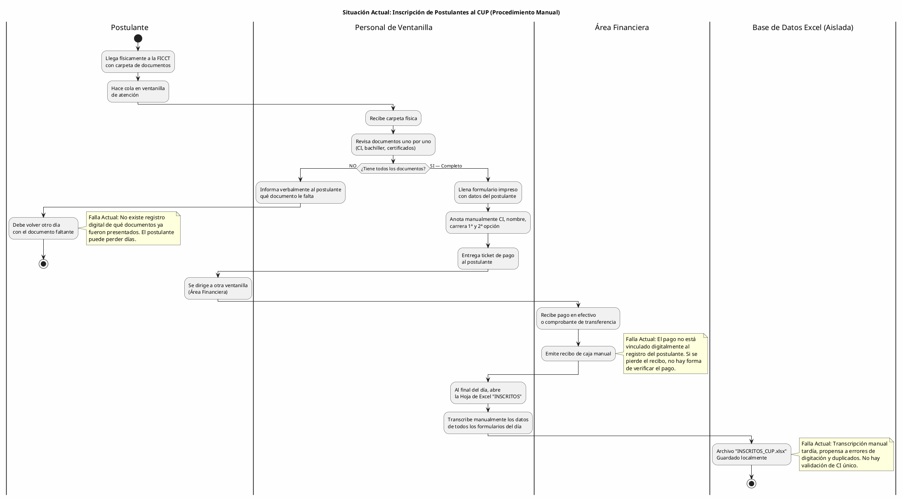

---

## Diagrama 2: Organización de Grupos y Asignación de Docentes (Proceso Manual Actual)

**Herramientas Actuales:** Hojas de Excel, pizarras físicas, reuniones presenciales de coordinación.
**Problema Evidenciado:** Cálculo manual de grupos, asignación descoordinada de docentes, posibilidad de grupos sin docente o docentes sobrecargados.

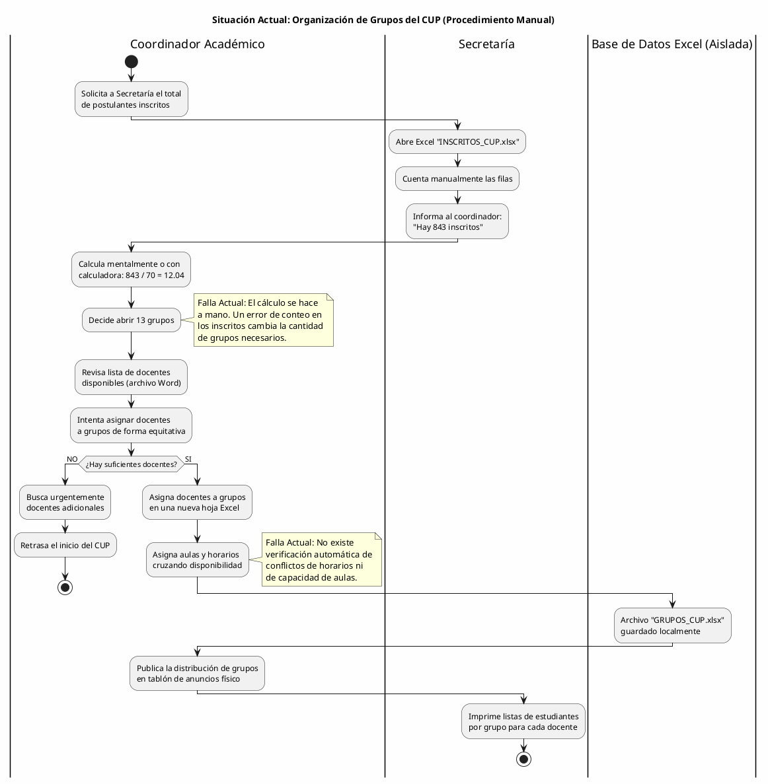

---

## Diagrama 3: Aplicación y Calificación de Exámenes (Proceso Descentralizado Actual)

**Herramientas Actuales:** Software de evaluación local, Bases de datos aisladas por laboratorio, Excel para consolidación.
**Problema Evidenciado:** Bases de datos aisladas que requieren consolidación manual (copiar/pegar) en Excel, cálculo de promedios ponderados vulnerable a errores de fórmula humana, no se fuerza automáticamente la regla de ≥60 por materia, demora en consolidar y publicar resultados.

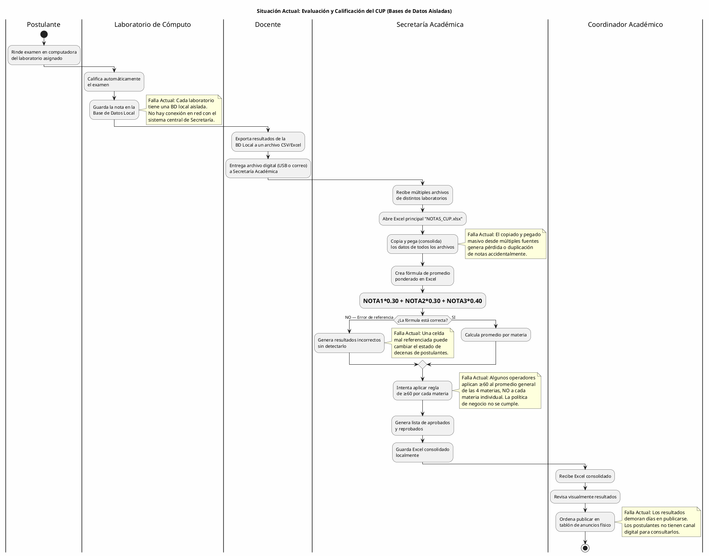

---

## Diagrama 4: Asignación de Carreras y Gestión de Cupos (Proceso Manual Actual)

**Herramientas Actuales:** Hojas de Excel, reuniones administrativas.
**Problema Evidenciado:** Control manual de cupos, riesgo de sobre-asignación, proceso lento que retrasa la admisión formal.

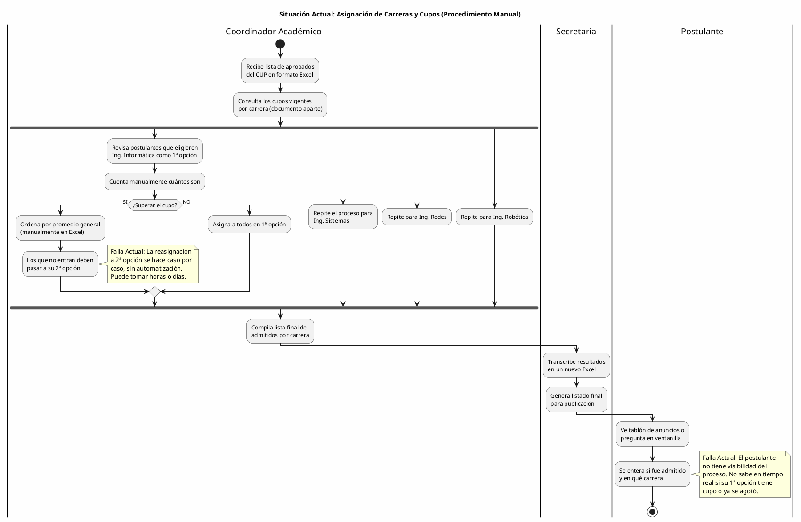

---

## Diagrama 5: Generación de Reportes y Estadísticas (Proceso Manual Actual)

**Herramientas Actuales:** Múltiples archivos Excel no conectados, calculadora.
**Problema Evidenciado:** Imposibilidad de generar reportes consolidados en tiempo real, datos dispersos, dependencia de una persona para compilar información.

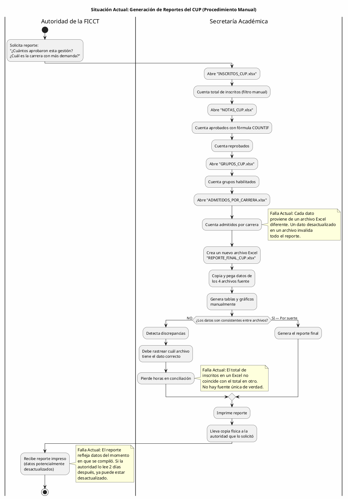

---

## Síntesis del Modelo de Negocio (AS-IS)

Los cinco diagramas de actividad presentados evidencian las siguientes **fallas sistémicas** en el proceso actual de admisión del CUP:

| #   | Falla Identificada                                         | Diagramas donde se evidencia | Impacto                                  |
| --- | ---------------------------------------------------------- | ---------------------------- | ---------------------------------------- |
| F1  | Inexistencia de un sistema de información integrado        | Todos (DA01-DA05)            | Fragmentación total de datos             |
| F2  | Transcripción manual tardía y propensa a errores           | DA01, DA03, DA05             | Errores de digitación, duplicados        |
| F3  | Pagos sin vinculación digital al expediente del postulante | DA01                         | Pérdida de trazabilidad financiera       |
| F4  | Cálculo manual de grupos sin verificación de conflictos    | DA02                         | Retrasos en inicio del CUP               |
| F5  | Consolidación manual de 12,000+ notas desde BDs locales    | DA03                         | Alto riesgo de pérdida de datos, demoras |
| F6  | Regla de negocio (≥60/materia) no enforced sistémicamente  | DA03                         | Aprobaciones/reprobaciones incorrectas   |
| F7  | Asignación de carreras sin control automático de cupos     | DA04                         | Sobre/sub-asignación de cupos            |
| F8  | Reportes compilados de archivos no conectados              | DA05                         | Datos inconsistentes, desactualizados    |
| F9  | Postulante sin canal digital de consulta                   | DA01, DA03, DA04             | Saturación de ventanillas, ansiedad      |
| F10 | Comunicación informal (tablón de anuncios, ventanilla)     | DA04, DA05                   | Información inoportuna, limitada         |

**Conclusión del diagnóstico AS-IS:** Las 10 fallas identificadas se derivan directa o indirectamente de una sola causa raíz: **la ausencia de un sistema de información integrado y centralizado** para la gestión del CUP. El sistema propuesto resolverá la totalidad de estas fallas mediante la digitalización, automatización y centralización de todos los procesos en una única plataforma web accesible desde cualquier dispositivo con conexión a internet.
---

# 4. CAPÍTULO 1: FLUJO DE TRABAJO — CAPTURA DE REQUISITOS

> **Nota Metodológica (PUDS):** Siguiendo el Proceso Unificado de Desarrollo de Software (Jacobson, Booch, Rumbaugh), el flujo de trabajo de Captura de Requisitos comprende cinco actividades secuenciales: **(1)** Identificar actores y casos de uso, **(2)** Priorizar los casos de uso, **(3)** Detallar cada caso de uso (especificación formal), **(4)** Diseñar prototipos de interfaz de usuario, y **(5)** Estructurar el modelo de casos de uso. Este capítulo documenta cada una de estas actividades aplicadas al Sistema Web de Gestión del CUP para la FICCT.

---

## 4.1 Identificar Actores y Casos de Uso

### 4.1.1 Actores del Sistema

#### A) Actores Internos (Usuarios con acceso al sistema)

1. **Administrador del Sistema:**
   - *Rol Sistémico:* Superusuario con control total sobre la plataforma.
   - *Impacto en Vida Real:* Es el responsable de configurar las gestiones académicas, definir los cupos por carrera, habilitar períodos de inscripción, gestionar usuarios del sistema y supervisar la operación global del CUP. Es el encargado exclusivo de cargar en el sistema las notas de los exámenes de los postulantes. Tiene acceso a todos los módulos sin restricción y puede generar cualquier tipo de reporte. Es el único actor que puede modificar parámetros críticos como las ponderaciones de exámenes (30%-30%-40%), el umbral de aprobación (≥60) y la capacidad máxima por grupo (70 estudiantes).

2. **Coordinador Académico:**
   - *Rol Sistémico:* Supervisor operativo del proceso de admisión.
   - *Impacto en Vida Real:* Supervisa el proceso completo del CUP: revisa la conformación de grupos, valida la asignación de docentes a grupos y materias, ejecuta el algoritmo de asignación de carreras tras la publicación de resultados finales, y monitorea el dashboard estadístico para tomar decisiones informadas sobre cupos y distribución de recursos. Recibe notificaciones automáticas cuando un cupo de carrera se agota o cuando un docente alcanza su carga máxima de 4 grupos.

3. **Docente del CUP:**
   - *Rol Sistémico:* Evaluador académico con acceso restringido a su carga horaria.
   - *Impacto en Vida Real:* Es el responsable de impartir las clases de nivelación a los postulantes de sus grupos asignados. Solo puede visualizar estadísticas de rendimiento de sus grupos. (Se elimina su rol de registrar notas, ya que las evaluaciones se realizan y califican automáticamente por el sistema).

4. **Postulante (Aspirante al CUP):**
   - *Rol Sistémico:* Beneficiario y usuario final del proceso de admisión.
   - *Impacto en Vida Real:* Se registra en el sistema proporcionando sus datos personales, documentación requerida y preferencias de carrera (1ª y 2ª opción). Tras la verificación de requisitos documentales, realiza el pago de inscripción mediante la pasarela Stripe. Una vez inscrito, puede consultar su grupo asignado, horario, visualizar detalladamente en su dashboard las calificaciones individuales obtenidas en los tres exámenes de cada materia junto con su promedio final, y el resultado final de admisión. Interactúa con el chatbot para resolver dudas y recibe notificaciones en tiempo real sobre el avance de su trámite.

#### B) Actores Externos (Entidades de soporte)

5. **Pasarela de Pago (Stripe):**
   - *Relación Sistémica:* Servicio externo de procesamiento de pagos.
   - *Impacto en Vida Real:* Procesa las transacciones de pago de matrícula de los postulantes de forma segura, tokenizando los datos de tarjeta. Envía confirmaciones de pago al sistema para actualizar automáticamente el estado del postulante de "Preinscrito" a "Inscrito". Gestiona internamente el cumplimiento PCI DSS.

6. **Servicio de IA (Reconocimiento de Voz / NLP):**
   - *Relación Sistémica:* Servicio externo de procesamiento de lenguaje natural.
   - *Impacto en Vida Real:* Recibe comandos de voz convertidos a texto desde la Web Speech API del navegador, interpreta la intención de la consulta del usuario (autoridad o coordinador), extrae los parámetros (gestión, carrera, estado del postulante) y genera la consulta estructurada correspondiente para obtener los reportes solicitados.

---

### 4.1.2 Lista de Casos de Uso

Derivados estrictamente del bloque de alcance del proyecto (sección 1.4) y de los módulos funcionales definidos, se enuncian los **25 Casos de Uso** que sostendrán el flujo completo del sistema de admisión del CUP:

- **CU01**: Iniciar Sesión en la Plataforma
- **CU02**: Cerrar Sesión Activa
- **CU03**: Recuperar Contraseña por Correo Electrónico
- **CU04**: Gestionar Perfiles de Usuario (CRUD por Administrador)
- **CU05**: Registrar Postulante Nuevo
- **CU06**: Verificar Requisitos Automáticamente (BD Externa SEGIP/SEDUCA)
- **CU07**: Procesar Pago de Matrícula (Pasarela Stripe)
- **CU08**: Detectar Postulante Recurrente por CI
- **CU09**: Buscar y Consultar Postulantes (Filtros Avanzados)
- **CU10**: Calcular y Crear Grupos Automáticamente
- **CU11**: Asignar Postulantes a Grupos
- **CU12**: Asignar Docente a Grupo y Materia
- **CU13**: Registrar Notas de Examen por el Administrador (Individual)
- **CU14**: Cargar Notas Masivamente por el Administrador (CSV/Excel)
- **CU15**: Calcular Promedio Ponderado por Materia
- **CU16**: Determinar Estado del Postulante (Aprobado/Reprobado)
- **CU17**: Ejecutar Asignación de Carreras por Cupo
- **CU18**: Configurar Cupos por Carrera y Gestión
- **CU19**: Generar Reporte Estructurado (Predefinido)
- **CU20**: Generar Reporte Dinámico (Filtros Interactivos)
- **CU21**: Generar Reporte por Comando de Voz (IA)
- **CU22**: Consultar Dashboard Estadístico en Tiempo Real
- **CU23**: Realizar Simulacro de Examen (Práctica)
- **CU24**: Registrar Postulación de Docente
- **CU25**: Aceptar Postulación de Docente

---

## 4.2 Priorizar Casos de Uso

Siguiendo las directrices del **Proceso Unificado de Desarrollo de Software (Jacobson, Booch, Rumbaugh)**, la construcción del modelo priorizó la mitigación de riesgos arquitectónicos (Architecture-Centric). El flujo de trabajo divide los 25 Casos de Uso en **2 Ciclos Iterativos Incrementales**, alineados con las fechas de presentación establecidas por la cátedra:

| # CU | Caso de Uso                            | Prioridad |
| ---- | -------------------------------------- | --------- |
| CU01 | Iniciar Sesión                         | Alta      |
| CU02 | Cerrar Sesión                          | Alta      |
| CU03 | Recuperar Contraseña                   | Media     |
| CU04 | Gestionar Perfiles de Usuario          | Alta      |
| CU05 | Registrar Postulante                   | Alta      |
| CU06 | Verificar Requisitos Documentales      | Alta      |
| CU07 | Procesar Pago (Stripe)                 | Alta      |
| CU08 | Detectar Postulante Recurrente         | Media     |
| CU09 | Buscar Postulantes                     | Media     |
| CU10 | Calcular y Crear Grupos                | Alta      |
| CU11 | Asignar Postulantes a Grupos           | Alta      |
| CU12 | Asignar Docente a Grupo                | Alta      |
| CU13 | Registrar Notas (Individual)           | Media     |
| CU14 | Cargar Notas Masivas (CSV)             | Alta      |
| CU15 | Calcular Promedio Ponderado            | Alta      |
| CU16 | Determinar Estado (Aprobado/Reprobado) | Alta      |
| CU17 | Asignación de Carreras por Cupo        | Alta      |
| CU18 | Configurar Cupos por Carrera           | Media     |
| CU19 | Reporte Estructurado                   | Alta      |
| CU20 | Reporte Dinámico                       | Media     |
| CU21 | Reporte por Voz (IA)                   | Baja      |
| CU22 | Dashboard Estadístico                  | Alta      |
| CU23 | Realizar Simulacro                     | Baja      |
| CU24 | Registrar Postulación de Docente       | Alta      |
| CU25 | Aceptar Postulación de Docente         | Alta      |

### Distribución por Ciclo

**Ciclo #1 — Arquitectura Base, Autenticación e Inscripción**

> **Justificación (PUDS) / Contexto:** Mitiga el riesgo arquitectónico fundacional. Sin seguridad, registro de postulantes y organización de grupos, no existe proceso de admisión operable. Este ciclo implementa la columna vertebral del sistema.

- **Actores Implicados:** Administrador, Coordinador, Postulante, Docente, Pasarela Stripe.

**Casos de Uso del Ciclo #1:**

| # CU | Caso de Uso                       | Prioridad | Justificación en el Ciclo                                                  |
| ---- | --------------------------------- | --------- | -------------------------------------------------------------------------- |
| CU01 | Iniciar Sesión                    | Alta      | Sin autenticación no existe sistema; riesgo arquitectónico fundacional     |
| CU02 | Cerrar Sesión                     | Alta      | Complemento obligatorio de seguridad de CU01                               |
| CU03 | Recuperar Contraseña              | Media     | Dependencia directa de la infraestructura de autenticación                 |
| CU04 | Gestionar Perfiles de Usuario     | Alta      | Sin gestión de roles, no hay segregación de accesos                        |
| CU05 | Registrar Postulante              | Alta      | Caso de uso central del negocio; sin postulantes no hay CUP                |
| CU06 | Verificar Requisitos Documentales | Alta      | Precondición obligatoria para el pago (regla de negocio)                   |
| CU07 | Procesar Pago (Stripe)            | Alta      | Formaliza la inscripción; dependencia de servicio externo crítico          |
| CU08 | Detectar Postulante Recurrente    | Media     | Previene duplicados; afecta integridad de datos desde el inicio            |
| CU09 | Buscar Postulantes                | Media     | Operación básica de consulta para todos los actores                        |
| CU10 | Calcular y Crear Grupos           | Alta      | Algoritmo central: CEIL(inscritos/70); habilita la organización académica  |
| CU11 | Asignar Postulantes a Grupos      | Alta      | Dependencia directa de CU10; completa el flujo de inscripción              |
| CU12 | Asignar Docente a Grupo           | Alta      | Sin docentes asignados, no hay quién evalúe                                |
| CU23 | Realizar Simulacro                | Baja      | Funcionalidad de práctica para el postulante; no afecta evaluación oficial |
| CU24 | Registrar Postulación de Docente  | Alta      | Alimenta el plantel docente; prerrequisito de CU25 y CU12                  |
| CU25 | Aceptar Postulación de Docente    | Alta      | Habilita docentes válidos (especialidad ↔ área); sin esto no hay CU12      |

**Ciclo #2 — Gestión Académica, Reportes y Admisión**

> **Justificación (PUDS) / Contexto:** Construye sobre la base arquitectónica estable del Ciclo 1. Implementa la lógica de evaluación, las reglas de negocio de aprobación, la asignación final de carreras y la capa de inteligencia analítica.

- **Actores Implicados:** Docente, Coordinador, Administrador, Servicio de IA.

**Casos de Uso del Ciclo #2:**

| # CU | Caso de Uso                            | Prioridad | Justificación en el Ciclo                                      |
| ---- | -------------------------------------- | --------- | -------------------------------------------------------------- |
| CU13 | Registrar Notas (Individual)           | Media     | Mecanismo de excepción para correcciones de calificaciones     |
| CU14 | Cargar Notas Masivas (CSV)             | Alta      | Mecanismo principal de integración con BDs de laboratorios     |
| CU15 | Calcular Promedio Ponderado            | Alta      | Regla de negocio central: ponderación 30%-30%-40%              |
| CU16 | Determinar Estado (Aprobado/Reprobado) | Alta      | Regla de negocio crítica: ≥60 por CADA materia individualmente |
| CU17 | Asignación de Carreras por Cupo        | Alta      | Lógica final de admisión; depende de CU16 completado           |
| CU18 | Configurar Cupos por Carrera           | Media     | Prerrequisito configurable de CU17                             |
| CU19 | Reporte Estructurado                   | Alta      | Entregable obligatorio de visibilidad para autoridades         |
| CU20 | Reporte Dinámico                       | Media     | Extensión de CU19 con filtros interactivos                     |
| CU21 | Reporte por Voz (IA)                   | Baja      | Funcionalidad diferenciadora; depende de servicio externo      |
| CU22 | Dashboard Estadístico                  | Alta      | Panel consolidado para toma de decisiones                      |

---

## 4.3 Especificación Detallada de Casos de Uso

### 4.3.1 CICLO 1: Arquitectura Base, Autenticación e Inscripción

#### CU01: Iniciar Sesión en la Plataforma

**A. Estructura del Modelo de CU (Diagrama Específico)**

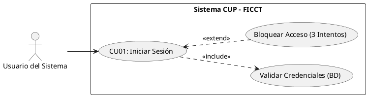

**B. Ficha de Especificación del Caso de Uso**

| Campo               | Descripción                                                                                                                                                                                                                                                                                                                                                                                                                                                                                                                                                                                                                                           |
| ------------------- | ----------------------------------------------------------------------------------------------------------------------------------------------------------------------------------------------------------------------------------------------------------------------------------------------------------------------------------------------------------------------------------------------------------------------------------------------------------------------------------------------------------------------------------------------------------------------------------------------------------------------------------------------------- |
| **CASO DE USO**     | CU01 — Iniciar Sesión en la Plataforma.                                                                                                                                                                                                                                                                                                                                                                                                                                                                                                                                                                                                               |
| **PROPÓSITO**       | Restringir y asegurar el acceso al sistema, autenticando la identidad del usuario según su rol asignado.                                                                                                                                                                                                                                                                                                                                                                                                                                                                                                                                              |
| **DESCRIPCIÓN**     | Permite que un usuario registrado (Administrador, Coordinador, Docente o Postulante) ingrese sus credenciales para acceder al panel correspondiente a su perfil. Para postulantes nuevos, la cuenta es autogenerada tras el pago exitoso (CU07) utilizando su email como usuario y su contraseña autogenerada (CI + primera letra del primer nombre en MAYÚSCULA + primera letra del apellido en minúscula) como contraseña inicial. El sistema valida las credenciales contra la base de datos, genera un token de sesión y redirige al usuario al módulo correspondiente.                                                                           |
| **ACTORES**         | Tablas de BD (`usuarios`, `roles`, `bitacora_accesos`).                                                                                                                                                                                                                                                                                                                                                                                                                                                                                                                                                                                               |
| **ACTOR INICIADOR** | Cualquier usuario registrado del sistema.                                                                                                                                                                                                                                                                                                                                                                                                                                                                                                                                                                                                             |
| **PRECONDICIÓN**    | El usuario debe existir en la tabla `usuarios` con estado "Activo".                                                                                                                                                                                                                                                                                                                                                                                                                                                                                                                                                                                   |
| **FLUJO PRINCIPAL** | 1. El actor ingresa a la URL base del sistema CUP-FICCT. 2. El sistema despliega el formulario de inicio de sesión, el cual incluye adicionalmente un botón destacado de "Iniciar Registro" para nuevos postulantes. 3. El actor introduce su correo electrónico y contraseña (o en caso de postulantes nuevos, su email y su contraseña autogenerada). 4. El sistema encripta la contraseña con bcrypt y verifica la coincidencia en la BD. 5. El sistema detecta coincidencia y extrae el rol. 6. El sistema registra el acceso en `bitacora_accesos` (LOGIN). 7. El sistema genera un token de sesión y lo almacena. 8. Redirige al panel del rol. |
| **POST CONDICIÓN**  | El usuario queda autenticado con su sesión activa. La bitácora conserva el registro inmutable del acceso.                                                                                                                                                                                                                                                                                                                                                                                                                                                                                                                                             |
| **EXCEPCIONES**     | *E1: Credenciales Inválidas.* El sistema incrementa el contador de intentos fallidos y notifica "Credenciales incorrectas". *E2: Usuario Inactivo/Bloqueado.* El sistema detiene el acceso con la alerta: "Su cuenta ha sido deshabilitada. Contacte al administrador". *E3: Bloqueo por 3 intentos fallidos.* Se bloquea el acceso temporalmente y se habilita el enlace "¿Olvidó su contraseña?" que redirige a CU03.                                                                                                                                                                                                                               |

**C. Prototipo UI (Directriz)**

> Pantalla de login en elegante modo oscuro con panel de vidrio templado (glassmorphism). Título destacado "Admisión CUP — FICCT", campos modernos para correo electrónico y contraseña, botón principal "Ingresar al sistema" y un separador visual de "¿Nuevo postulante?" que da paso a un botón destacado de "Iniciar Registro" para iniciar el flujo unificado sin autenticación previa.

---

#### CU02: Cerrar Sesión Activa

**A. Estructura del Modelo de CU (Diagrama Específico)**

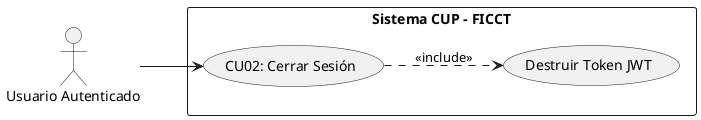

**B. Ficha de Especificación del Caso de Uso**

| Campo               | Descripción                                                                                                                                                                                                                                                                                                                                                                                            |
| ------------------- | ------------------------------------------------------------------------------------------------------------------------------------------------------------------------------------------------------------------------------------------------------------------------------------------------------------------------------------------------------------------------------------------------------ |
| **CASO DE USO**     | CU02 — Cerrar Sesión Activa.                                                                                                                                                                                                                                                                                                                                                                           |
| **PROPÓSITO**       | Revocar el acceso temporal del usuario al sistema para prevenir manipulaciones no autorizadas.                                                                                                                                                                                                                                                                                                         |
| **DESCRIPCIÓN**     | Permite que cualquier usuario finalice su sesión, ejecutando la destrucción inmediata del token JWT y limpiando la caché del navegador.                                                                                                                                                                                                                                                                |
| **ACTORES**         | Tablas de BD (`usuarios`, `bitacora_accesos`).                                                                                                                                                                                                                                                                                                                                                         |
| **ACTOR INICIADOR** | Cualquier usuario autenticado.                                                                                                                                                                                                                                                                                                                                                                         |
| **PRECONDICIÓN**    | El usuario debe tener una sesión activa (CU01 ejecutado).                                                                                                                                                                                                                                                                                                                                              |
| **FLUJO PRINCIPAL** | 1. El actor despliega el menú de perfil en la barra de navegación. 2. El actor hace clic en "Cerrar Sesión". 3. El sistema solicita confirmación: "¿Desea cerrar su sesión?". 4. El actor confirma. 5. El sistema registra en `bitacora_accesos` la acción `LOGOUT` con fecha, hora e IP. 6. El sistema destruye el token JWT y limpia la caché. 7. El sistema redirige a la pantalla de login (CU01). |
| **POST CONDICIÓN**  | Ninguna ruta interna del sistema es accesible sin volver a autenticarse.                                                                                                                                                                                                                                                                                                                               |
| **EXCEPCIONES**     | *E1: Cierre automático por inactividad (Timeout).* Si el usuario no interactúa durante 30 minutos, el sistema ejecuta un auto-logout registrando `LOGOUT_TIMEOUT` en la bitácora.                                                                                                                                                                                                                      |

---

#### CU03: Recuperar Contraseña por Correo Electrónico

**A. Estructura del Modelo de CU (Diagrama Específico)**

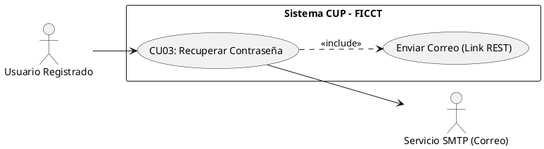


**B. Ficha de Especificación del Caso de Uso**

| Campo               | Descripción                                                                                                                                                                                                                                                                                                                                                                                                                                                                                                                                                                                                                                                                                                                                                                       |
| ------------------- | --------------------------------------------------------------------------------------------------------------------------------------------------------------------------------------------------------------------------------------------------------------------------------------------------------------------------------------------------------------------------------------------------------------------------------------------------------------------------------------------------------------------------------------------------------------------------------------------------------------------------------------------------------------------------------------------------------------------------------------------------------------------------------- |
| **CASO DE USO**     | CU03 — Recuperar Contraseña por Correo Electrónico.                                                                                                                                                                                                                                                                                                                                                                                                                                                                                                                                                                                                                                                                                                                               |
| **PROPÓSITO**       | Permitir que un usuario que olvidó su contraseña pueda restablecerla de forma segura sin intervención del administrador.                                                                                                                                                                                                                                                                                                                                                                                                                                                                                                                                                                                                                                                          |
| **DESCRIPCIÓN**     | El usuario solicita un enlace de restablecimiento ingresando su correo registrado. El sistema envía un token temporal de un solo uso al correo indicado. Al hacer clic en el enlace, el usuario es redirigido a un formulario donde establece su nueva contraseña cumpliendo las políticas de seguridad.                                                                                                                                                                                                                                                                                                                                                                                                                                                                          |
| **ACTORES**         | Tablas de BD (`usuarios`), Servicio SMTP de correo.                                                                                                                                                                                                                                                                                                                                                                                                                                                                                                                                                                                                                                                                                                                               |
| **ACTOR INICIADOR** | Cualquier usuario registrado.                                                                                                                                                                                                                                                                                                                                                                                                                                                                                                                                                                                                                                                                                                                                                     |
| **PRECONDICIÓN**    | El correo electrónico debe existir en la tabla `usuarios` con estado "Activo".                                                                                                                                                                                                                                                                                                                                                                                                                                                                                                                                                                                                                                                                                                    |
| **FLUJO PRINCIPAL** | 1. El actor hace clic en "¿Olvidó su contraseña?" en la pantalla de login. 2. El sistema despliega un formulario solicitando el correo electrónico. 3. El actor ingresa su correo y presiona "Enviar enlace". 4. El sistema verifica que el correo exista en la BD. 5. El sistema genera un token de restablecimiento (válido 1 hora) y lo envía al correo. 6. El actor accede a su correo, hace clic en el enlace recibido. 7. El sistema valida el token y despliega el formulario de nueva contraseña. 8. El actor ingresa la nueva contraseña (mínimo 8 caracteres, mayúsculas, minúsculas y números) y la confirma. 9. El sistema actualiza el hash en la BD e invalida el token usado. 10. El sistema redirige al login con mensaje: "Contraseña actualizada exitosamente". |
| **POST CONDICIÓN**  | La contraseña anterior queda invalidada. El token utilizado no puede reutilizarse.                                                                                                                                                                                                                                                                                                                                                                                                                                                                                                                                                                                                                                                                                                |
| **EXCEPCIONES**     | *E1: Correo no registrado.* El sistema muestra un mensaje genérico (por seguridad): "Si el correo existe en nuestro sistema, recibirá un enlace de recuperación". *E2: Token expirado.* El sistema muestra: "Este enlace ha expirado. Solicite uno nuevo".                                                                                                                                                                                                                                                                                                                                                                                                                                                                                                                        |

---

#### CU04: Gestionar Perfiles de Usuario (CRUD por Administrador)

**A. Estructura del Modelo de CU (Diagrama Específico)**

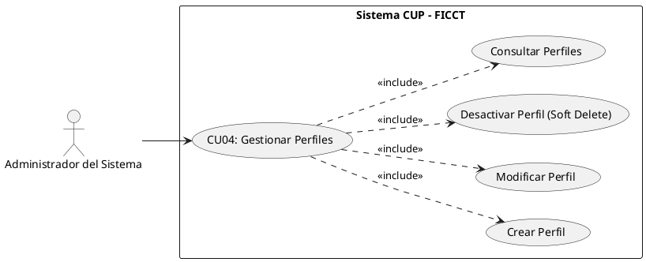


**B. Ficha de Especificación del Caso de Uso**

| Campo               | Descripción                                                                                                                                                                                                                                                                                                                                                                                                                                                                                                                                                         |
| ------------------- | ------------------------------------------------------------------------------------------------------------------------------------------------------------------------------------------------------------------------------------------------------------------------------------------------------------------------------------------------------------------------------------------------------------------------------------------------------------------------------------------------------------------------------------------------------------------- |
| **CASO DE USO**     | CU04 — Gestionar Perfiles de Usuario.                                                                                                                                                                                                                                                                                                                                                                                                                                                                                                                               |
| **PROPÓSITO**       | Permitir al Administrador crear, consultar, modificar y desactivar cuentas de usuario del sistema, asignando roles diferenciados.                                                                                                                                                                                                                                                                                                                                                                                                                                   |
| **DESCRIPCIÓN**     | El Administrador gestiona los usuarios del sistema (coordinadores, docentes y postulantes) desde un panel CRUD centralizado. Cada usuario se crea con un rol específico que determina su nivel de acceso. Las eliminaciones son lógicas (soft delete) para preservar la integridad referencial histórica.                                                                                                                                                                                                                                                           |
| **ACTORES**         | Tablas de BD (`usuarios`, `roles`).                                                                                                                                                                                                                                                                                                                                                                                                                                                                                                                                 |
| **ACTOR INICIADOR** | Administrador del Sistema.                                                                                                                                                                                                                                                                                                                                                                                                                                                                                                                                          |
| **PRECONDICIÓN**    | El Administrador debe estar autenticado (CU01).                                                                                                                                                                                                                                                                                                                                                                                                                                                                                                                     |
| **FLUJO PRINCIPAL** | 1. El Administrador ingresa al módulo "Gestión de Usuarios". 2. El sistema despliega la grilla de usuarios con filtros por rol y estado. 3. Para **crear**: presiona "+ Nuevo Usuario", completa nombre, correo, CI, rol y presiona "Guardar". El sistema genera credenciales temporales y envía un correo de activación. 4. Para **editar**: selecciona un usuario existente, modifica los campos necesarios y guarda. 5. Para **desactivar**: presiona "Desactivar" y confirma. El sistema cambia el estado a "Inactivo" e invalida la sesión activa del usuario. |
| **POST CONDICIÓN**  | El usuario creado/modificado refleja inmediatamente los cambios en sus permisos de acceso.                                                                                                                                                                                                                                                                                                                                                                                                                                                                          |
| **EXCEPCIONES**     | *E1: CI duplicado.* "Este CI ya está registrado en el sistema". *E2: Correo duplicado.* "Este correo electrónico ya pertenece a otro usuario". *E3: Auto-desactivación bloqueada.* Si es el único administrador activo, el sistema impide la operación.                                                                                                                                                                                                                                                                                                             |

---

#### CU05: Registrar Postulante Nuevo

**A. Estructura del Modelo de CU (Diagrama Específico)**

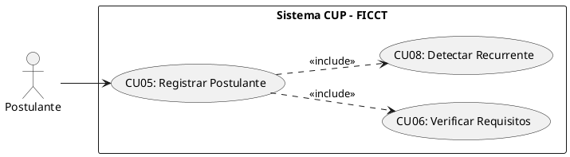

**B. Ficha de Especificación del Caso de Uso**

| Campo               | Descripción                                                                                                                                                                                                                                                                                                                                                                                                                                                                                                                                                                                                                                                                                                                                                                                                                                                                                                                                                                                                                                                                                                                                                                                                                                                                                                                                                                                      |
| ------------------- | ------------------------------------------------------------------------------------------------------------------------------------------------------------------------------------------------------------------------------------------------------------------------------------------------------------------------------------------------------------------------------------------------------------------------------------------------------------------------------------------------------------------------------------------------------------------------------------------------------------------------------------------------------------------------------------------------------------------------------------------------------------------------------------------------------------------------------------------------------------------------------------------------------------------------------------------------------------------------------------------------------------------------------------------------------------------------------------------------------------------------------------------------------------------------------------------------------------------------------------------------------------------------------------------------------------------------------------------------------------------------------------------------ |
| **CASO DE USO**     | CU05 — Registrar Postulante Nuevo.                                                                                                                                                                                                                                                                                                                                                                                                                                                                                                                                                                                                                                                                                                                                                                                                                                                                                                                                                                                                                                                                                                                                                                                                                                                                                                                                                               |
| **PROPÓSITO**       | Capturar los datos personales y académicos del aspirante al CUP, generando su expediente digital en el sistema.                                                                                                                                                                                                                                                                                                                                                                                                                                                                                                                                                                                                                                                                                                                                                                                                                                                                                                                                                                                                                                                                                                                                                                                                                                                                                  |
| **DESCRIPCIÓN**     | El postulante accede de forma pública (sin autenticación previa) desde la pantalla de login haciendo clic en el botón "Iniciar Registro". Completa sus datos personales, sexo, información de procedencia, título de bachiller, datos del colegio y selección de carreras (1ª y 2ª opción). Antes de procesar el registro, el sistema verifica automáticamente si el CI ya existe en la BD (postulante recurrente) para mantener el código original y no duplicar registros. Luego de registrarse, se le presenta una pantalla de verificación de datos con el resumen de la información ingresada y dos botones: "Siguiente" y "Cancelar". Si cancela, regresa al login.                                                                                                                                                                                                                                                                                                                                                                                                                                                                                                                                                                                                                                                                                                                        |
| **ACTORES**         | Tablas de BD (`postulantes`, `carreras`, `requisitos_documentales`).                                                                                                                                                                                                                                                                                                                                                                                                                                                                                                                                                                                                                                                                                                                                                                                                                                                                                                                                                                                                                                                                                                                                                                                                                                                                                                                             |
| **ACTOR INICIADOR** | Postulante (Público).                                                                                                                                                                                                                                                                                                                                                                                                                                                                                                                                                                                                                                                                                                                                                                                                                                                                                                                                                                                                                                                                                                                                                                                                                                                                                                                                                                            |
| **PRECONDICIÓN**    | El período de inscripción debe estar abierto (configurado por el Administrador). No requiere inicio de sesión.                                                                                                                                                                                                                                                                                                                                                                                                                                                                                                                                                                                                                                                                                                                                                                                                                                                                                                                                                                                                                                                                                                                                                                                                                                                                                   |
| **FLUJO PRINCIPAL** | 1. El postulante accede al portal de admisiones y hace clic en "Iniciar Registro" desde la pantalla de login. 2. El sistema despliega el formulario de registro con los campos: CI, nombres, apellidos, fecha de nacimiento, sexo, dirección, ciudad, teléfono, correo electrónico, colegio de procedencia, título de bachiller, datos del colegio, 1ª opción de carrera, 2ª opción de carrera y turno. 3. El postulante completa los campos y hace clic en "Iniciar Registro". 4. El sistema ejecuta `<<include>> CU08`: verifica si el CI ya existe. Si es recurrente, recupera el código original. 5. El sistema valida que el correo tenga formato válido, que la 1ª y 2ª opción de carrera sean diferentes y que todos los campos obligatorios estén completos. 6. El sistema despliega una pantalla intermedia de verificación con el resumen de los datos y dos botones: "Siguiente" y "Cancelar". 7. Si el postulante presiona "Cancelar", el sistema cancela el proceso y lo redirige a la pantalla de login. 8. Si presiona "Siguiente", el sistema despliega la pantalla de carga con el mensaje "Verificando datos con el SEGIP o las entidades que hay que verificar" y ejecuta `<<include>> CU06` en segundo plano. 9. Si la verificación es exitosa, el sistema actualiza el estado a "Verificado" y redirige automáticamente al postulante a la pasarela de pagos Stripe (CU07). |
| **POST CONDICIÓN**  | El postulante queda registrado y verificado en la BD con estado "Verificado". Es redirigido automáticamente a la pasarela de pagos (CU07).                                                                                                                                                                                                                                                                                                                                                                                                                                                                                                                                                                                                                                                                                                                                                                                                                                                                                                                                                                                                                                                                                                                                                                                                                                                       |
| **EXCEPCIONES**     | *E1: Período de inscripción cerrado.* "El período de inscripción para la gestión [X] no está habilitado". *E2: Correo ya registrado.* "Este correo electrónico ya está asociado a otro postulante". *E3: Misma carrera en ambas opciones.* "La 1ª y 2ª opción de carrera deben ser diferentes".                                                                                                                                                                                                                                                                                                                                                                                                                                                                                                                                                                                                                                                                                                                                                                                                                                                                                                                                                                                                                                                                                                  |

---

#### CU06: Verificar Requisitos Automáticamente (BD Externa SEGIP/SEDUCA)

**A. Estructura del Modelo de CU (Diagrama Específico)**

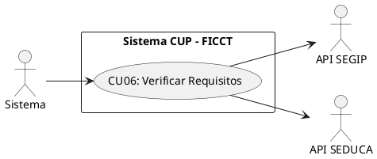

**B. Ficha de Especificación del Caso de Uso**

| Campo               | Descripción                                                                                                                                                                                                                                                                                                                                                                                                                                                                                                                                                                                                     |
| ------------------- | --------------------------------------------------------------------------------------------------------------------------------------------------------------------------------------------------------------------------------------------------------------------------------------------------------------------------------------------------------------------------------------------------------------------------------------------------------------------------------------------------------------------------------------------------------------------------------------------------------------- |
| **CASO DE USO**     | CU06 — Verificar Requisitos Automáticamente (BD Externa).                                                                                                                                                                                                                                                                                                                                                                                                                                                                                                                                                       |
| **PROPÓSITO**       | Garantizar la veracidad de la identidad y el título de bachiller del postulante conectándose a bases de datos externas, antes de habilitarlo para el pago.                                                                                                                                                                                                                                                                                                                                                                                                                                                      |
| **DESCRIPCIÓN**     | Se ejecuta automáticamente en segundo plano tras hacer clic en "Siguiente" en la pantalla de verificación de datos (CU05), mostrando una pantalla de carga con el mensaje: "Verificando datos con el SEGIP o las entidades que hay que verificar". El sistema realiza consultas automáticas a los servicios web de SEGIP y SEDUCA. Si se valida la identidad y la emisión del título de bachiller, se redirige al postulante al proceso de pago (CU07).                                                                                                                                                         |
| **ACTORES**         | API SEGIP, API SEDUCA, Tablas de BD (`postulantes`).                                                                                                                                                                                                                                                                                                                                                                                                                                                                                                                                                            |
| **ACTOR INICIADOR** | Sistema (invocado automáticamente tras la confirmación de datos).                                                                                                                                                                                                                                                                                                                                                                                                                                                                                                                                               |
| **PRECONDICIÓN**    | El postulante debe haber confirmado sus datos en la pantalla de verificación de CU05.                                                                                                                                                                                                                                                                                                                                                                                                                                                                                                                           |
| **FLUJO PRINCIPAL** | 1. El sistema despliega la pantalla de carga con el mensaje: "Verificando datos con el SEGIP o las entidades que hay que verificar". 2. El sistema toma el CI y fecha de nacimiento del postulante. 3. Ejecuta una petición HTTP a la API del SEGIP para validar la identidad. 4. Ejecuta una petición a la API del SEDUCA para verificar la emisión del título de bachiller. 5. Si ambas APIs retornan confirmación positiva, el sistema marca los requisitos como "Validados Automáticamente", actualiza el estado del postulante a "Verificado" y lo redirige automáticamente a la pasarela de pagos (CU07). |
| **POST CONDICIÓN**  | El postulante queda marcado como "Verificado" y es redirigido automáticamente a la pasarela de pagos Stripe (CU07).                                                                                                                                                                                                                                                                                                                                                                                                                                                                                             |
| **EXCEPCIONES**     | *E1: Datos no coinciden en SEGIP/SEDUCA.* El sistema notifica: "No se pudo validar su información automáticamente. Por favor, acérquese a las oficinas para verificación manual". *E2: API externa caída.* El sistema reintenta la validación y notifica posteriormente.                                                                                                                                                                                                                                                                                                                                        |

---

#### CU07: Procesar Pago de Matrícula mediante Pasarela Stripe

**A. Estructura del Modelo de CU (Diagrama Específico)**

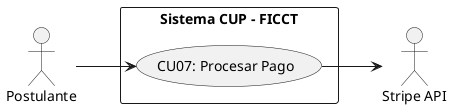

**B. Ficha de Especificación del Caso de Uso**

| Campo               | Descripción                                                                                                                                                                                                                                                                                                                                                                                                                                                                                                                                                                                                                                                                                                                                                                                                                                                                                                                                                                                                                                                                                                                                                              |
| ------------------- | ------------------------------------------------------------------------------------------------------------------------------------------------------------------------------------------------------------------------------------------------------------------------------------------------------------------------------------------------------------------------------------------------------------------------------------------------------------------------------------------------------------------------------------------------------------------------------------------------------------------------------------------------------------------------------------------------------------------------------------------------------------------------------------------------------------------------------------------------------------------------------------------------------------------------------------------------------------------------------------------------------------------------------------------------------------------------------------------------------------------------------------------------------------------------ |
| **CASO DE USO**     | CU07 — Procesar Pago de Matrícula mediante Pasarela Stripe.                                                                                                                                                                                                                                                                                                                                                                                                                                                                                                                                                                                                                                                                                                                                                                                                                                                                                                                                                                                                                                                                                                              |
| **PROPÓSITO**       | Formalizar la inscripción del postulante mediante el pago electrónico seguro de la matrícula del CUP, autogenerando su cuenta de usuario y notificándole sus accesos.                                                                                                                                                                                                                                                                                                                                                                                                                                                                                                                                                                                                                                                                                                                                                                                                                                                                                                                                                                                                    |
| **DESCRIPCIÓN**     | Una vez verificado (CU06), el postulante es redirigido automáticamente al portal de pago de Stripe. El sistema gestiona la sesión de pago (Checkout Session) en Stripe y recibe la confirmación mediante un Webhook. Al procesar el pago de la matrícula, el sistema actualiza su estado a "Inscrito", autogenera una cuenta en la tabla `users` con su correo electrónico como usuario y una contraseña estructurada bajo la fórmula: CI + primera letra del primer nombre en MAYÚSCULA + primera letra del apellido en minúscula. El sistema muestra la confirmación e indica que los accesos fueron enviados.                                                                                                                                                                                                                                                                                                                                                                                                                                                                                                                                                         |
| **ACTORES**         | Tablas de BD (`pagos`, `postulantes`, `users`), Stripe API.                                                                                                                                                                                                                                                                                                                                                                                                                                                                                                                                                                                                                                                                                                                                                                                                                                                                                                                                                                                                                                                                                                              |
| **ACTOR INICIADOR** | Postulante (Público).                                                                                                                                                                                                                                                                                                                                                                                                                                                                                                                                                                                                                                                                                                                                                                                                                                                                                                                                                                                                                                                                                                                                                    |
| **PRECONDICIÓN**    | Requisitos documentales del postulante verificados (CU06 completado).                                                                                                                                                                                                                                                                                                                                                                                                                                                                                                                                                                                                                                                                                                                                                                                                                                                                                                                                                                                                                                                                                                    |
| **FLUJO PRINCIPAL** | 1. El postulante es redirigido automáticamente tras la verificación de requisitos o accede ingresando su CI para buscar su registro. 2. El sistema crea una Checkout Session en Stripe con el monto de la matrícula y redirige al postulante. 3. El postulante ingresa los datos de su tarjeta y confirma el pago. 4. Stripe procesa la transacción y envía el webhook `checkout.session.completed` al backend. 5. El sistema registra el pago en la tabla `pagos` (ID transacción Stripe, monto, fecha, estado). 6. El sistema actualiza el estado del postulante a "Inscrito". 7. El sistema busca la cuenta del usuario en `users` por email; si no existe, la crea con: email = correo del postulante, contraseña = CI + primera letra del 1er nombre en MAYÚSCULA + primera letra del apellido en minúscula (ej. CI: 12345678, Alberto Perez -> contraseña: 12345678Ap), rol = "Postulante", activo = true. 8. El sistema muestra una pantalla de confirmación con el mensaje: "Su cuenta ha sido enviada a su correo". 9. El sistema envía un correo electrónico de confirmación al postulante conteniendo sus accesos detallados (usuario y contraseña generada). |
| **POST CONDICIÓN**  | El postulante queda con estado "Inscrito" y su cuenta de usuario es creada. El sistema le envía sus datos de acceso por correo y le muestra el mensaje de confirmación correspondiente.                                                                                                                                                                                                                                                                                                                                                                                                                                                                                                                                                                                                                                                                                                                                                                                                                                                                                                                                                                                  |
| **EXCEPCIONES**     | *E1: Pago rechazado por Stripe.* El sistema muestra: "El pago no pudo ser procesado. Verifique los datos de su tarjeta o intente con otro medio de pago". El estado del postulante no cambia. *E2: Webhook no recibido.* El sistema implementa un mecanismo de verificación de estado de pago con Stripe cada 5 minutos para reconciliar transacciones pendientes.                                                                                                                                                                                                                                                                                                                                                                                                                                                                                                                                                                                                                                                                                                                                                                                                       |

---

#### CU08: Detectar Postulante Recurrente por CI

**A. Estructura del Modelo de CU (Diagrama Específico)**

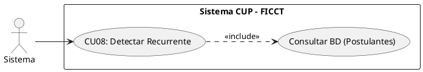


**B. Ficha de Especificación del Caso de Uso**

| Campo               | Descripción                                                                                                                                                                                                                                                                                                                                                                                                                                                                                                                                                                                                                                                              |
| ------------------- | ------------------------------------------------------------------------------------------------------------------------------------------------------------------------------------------------------------------------------------------------------------------------------------------------------------------------------------------------------------------------------------------------------------------------------------------------------------------------------------------------------------------------------------------------------------------------------------------------------------------------------------------------------------------------ |
| **CASO DE USO**     | CU08 — Detectar Postulante Recurrente por CI.                                                                                                                                                                                                                                                                                                                                                                                                                                                                                                                                                                                                                            |
| **PROPÓSITO**       | Identificar automáticamente a postulantes que ya intentaron ingresar en gestiones anteriores, preservando su código original y su historial.                                                                                                                                                                                                                                                                                                                                                                                                                                                                                                                             |
| **DESCRIPCIÓN**     | Cuando un postulante ingresa su CI durante el registro (CU05), el sistema consulta la tabla `postulantes` para verificar si ya existe un registro previo. Si se detecta un postulante recurrente, el sistema recupera su código original, su historial de intentos y le permite reutilizar sus datos personales, requiriendo únicamente un nuevo pago.                                                                                                                                                                                                                                                                                                                   |
| **ACTORES**         | Tablas de BD (`postulantes`).                                                                                                                                                                                                                                                                                                                                                                                                                                                                                                                                                                                                                                            |
| **ACTOR INICIADOR** | Sistema (invocado automáticamente desde CU05).                                                                                                                                                                                                                                                                                                                                                                                                                                                                                                                                                                                                                           |
| **PRECONDICIÓN**    | El CI ingresado debe tener formato válido.                                                                                                                                                                                                                                                                                                                                                                                                                                                                                                                                                                                                                               |
| **FLUJO PRINCIPAL** | 1. El sistema recibe el CI ingresado por el postulante en el formulario de registro. 2. El sistema ejecuta una consulta a la BD buscando coincidencia exacta de CI. 3. Si NO existe: el sistema continúa con el flujo normal de CU05 (nuevo registro). 4. Si SÍ existe: el sistema notifica: "Se detectó un registro previo con este CI. Código de postulante: [código original]". 5. El sistema recupera los datos personales del postulante y los precarga en el formulario. 6. El postulante puede actualizar sus datos y seleccionar nuevas opciones de carrera. 7. El sistema marca la bandera `postulante_recurrente = TRUE` e incrementa el contador de intentos. |
| **POST CONDICIÓN**  | El postulante recurrente mantiene su código original. El historial de gestiones previas queda vinculado al mismo registro.                                                                                                                                                                                                                                                                                                                                                                                                                                                                                                                                               |
| **EXCEPCIONES**     | *E1: Postulante con máximo de intentos.* (Configurable) Si la política de la facultad limita los intentos, el sistema verifica el contador y bloquea el nuevo registro si se excede el límite.                                                                                                                                                                                                                                                                                                                                                                                                                                                                           |

---

#### CU09: Buscar y Consultar Postulantes (Filtros Avanzados)

**A. Estructura del Modelo de CU (Diagrama Específico)**

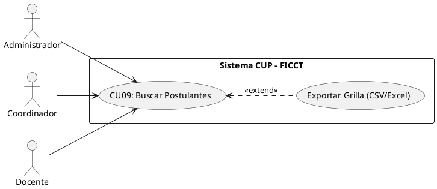


**B. Ficha de Especificación del Caso de Uso**

| Campo               | Descripción                                                                                                                                                                                                                                                                                                                                                                           |
| ------------------- | ------------------------------------------------------------------------------------------------------------------------------------------------------------------------------------------------------------------------------------------------------------------------------------------------------------------------------------------------------------------------------------- |
| **CASO DE USO**     | CU09 — Buscar y Consultar Postulantes con Filtros Avanzados.                                                                                                                                                                                                                                                                                                                          |
| **PROPÓSITO**       | Proveer a los actores administrativos visibilidad completa del universo de postulantes con capacidad de búsqueda y filtrado multidimensional.                                                                                                                                                                                                                                         |
| **DESCRIPCIÓN**     | Permite buscar postulantes por CI, nombre, carrera, estado, gestión y grupo asignado. Los resultados se presentan en una grilla paginada con opciones de exportación. Cada actor ve solo los datos que su rol le autoriza (el docente ve solo los postulantes de sus grupos).                                                                                                         |
| **ACTORES**         | Tablas de BD (`postulantes`, `grupos`, `carreras`).                                                                                                                                                                                                                                                                                                                                   |
| **ACTOR INICIADOR** | Administrador, Coordinador, Docente (con restricción de carga).                                                                                                                                                                                                                                                                                                                       |
| **PRECONDICIÓN**    | El actor debe estar autenticado con rol autorizado.                                                                                                                                                                                                                                                                                                                                   |
| **FLUJO PRINCIPAL** | 1. El actor ingresa al módulo "Postulantes". 2. El sistema despliega la grilla paginada con los postulantes (filtrados por rol). 3. El actor utiliza la barra de búsqueda o los filtros avanzados (CI, nombre, carrera, estado, gestión, grupo). 4. El sistema retorna los resultados coincidentes en tiempo real. 5. El actor puede exportar los resultados filtrados a PDF o Excel. |
| **POST CONDICIÓN**  | Operación de solo lectura. Ningún dato es modificado.                                                                                                                                                                                                                                                                                                                                 |
| **EXCEPCIONES**     | *E1: Sin resultados.* "No se encontraron postulantes con los criterios especificados".                                                                                                                                                                                                                                                                                                |

---

#### CU10: Calcular y Crear Grupos Automáticamente

**A. Estructura del Modelo de CU (Diagrama Específico)**

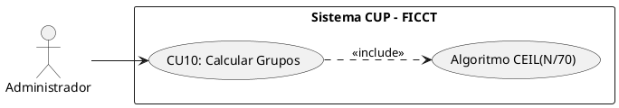

**B. Ficha de Especificación del Caso de Uso**

| Campo               | Descripción                                                                                                                                                                                                                                                                                                                                                                                                                                                                                                                                                                                                 |
| ------------------- | ----------------------------------------------------------------------------------------------------------------------------------------------------------------------------------------------------------------------------------------------------------------------------------------------------------------------------------------------------------------------------------------------------------------------------------------------------------------------------------------------------------------------------------------------------------------------------------------------------------- |
| **CASO DE USO**     | CU10 — Calcular y Crear Grupos Automáticamente.                                                                                                                                                                                                                                                                                                                                                                                                                                                                                                                                                             |
| **PROPÓSITO**       | Determinar la cantidad óptima de grupos necesarios para albergar a todos los postulantes inscritos, respetando el límite máximo de 70 estudiantes por grupo.                                                                                                                                                                                                                                                                                                                                                                                                                                                |
| **DESCRIPCIÓN**     | El Administrador ejecuta el algoritmo de creación de grupos una vez que el período de inscripción ha cerrado. El sistema aplica la fórmula `CEIL(Total_Inscritos / 70)` para calcular la cantidad de grupos, crea los registros correspondientes en la BD y asigna turnos (Mañana/Tarde/Noche) de forma equitativa.                                                                                                                                                                                                                                                                                         |
| **ACTORES**         | Tablas de BD (`grupos`, `aulas`, `postulantes`).                                                                                                                                                                                                                                                                                                                                                                                                                                                                                                                                                            |
| **ACTOR INICIADOR** | Administrador del Sistema.                                                                                                                                                                                                                                                                                                                                                                                                                                                                                                                                                                                  |
| **PRECONDICIÓN**    | El período de inscripción debe haber cerrado. Debe haber al menos 1 postulante con estado "Inscrito".                                                                                                                                                                                                                                                                                                                                                                                                                                                                                                       |
| **FLUJO PRINCIPAL** | 1. El Administrador ingresa al módulo "Gestión de Grupos" y presiona "Calcular Grupos". 2. El sistema cuenta el total de postulantes inscritos en la gestión actual. 3. El sistema aplica el algoritmo: `Cantidad_Grupos = CEIL(Total_Inscritos / 70)`. 4. El sistema muestra una previsualización: "Total inscritos: [N]. Grupos necesarios: [G]. ¿Confirmar creación?". 5. El Administrador confirma. 6. El sistema crea los G grupos con número secuencial, asigna turnos rotativamente y establece el estado como "Abierto". 7. El sistema muestra el resumen: "Se han creado [G] grupos exitosamente". |
| **POST CONDICIÓN**  | Los grupos existen en la BD con estado "Abierto", listos para recibir la asignación de postulantes (CU11) y docentes (CU12).                                                                                                                                                                                                                                                                                                                                                                                                                                                                                |
| **EXCEPCIONES**     | *E1: Grupos ya existen para esta gestión.* "Ya se han creado grupos para la gestión [X]. ¿Desea recalcular? (Los grupos existentes serán eliminados solo si no tienen postulantes asignados)". *E2: Cero inscritos.* "No hay postulantes inscritos para calcular grupos".                                                                                                                                                                                                                                                                                                                                   |

**Ejemplo del Algoritmo:**

```
Inscritos = 70   → CEIL(70/70)  = 1 grupo
Inscritos = 71   → CEIL(71/70)  = 2 grupos
Inscritos = 140  → CEIL(140/70) = 2 grupos
Inscritos = 141  → CEIL(141/70) = 3 grupos
Inscritos = 1000 → CEIL(1000/70)= 15 grupos
```

---

#### CU11: Asignar Postulantes a Grupos

**A. Estructura del Modelo de CU (Diagrama Específico)**

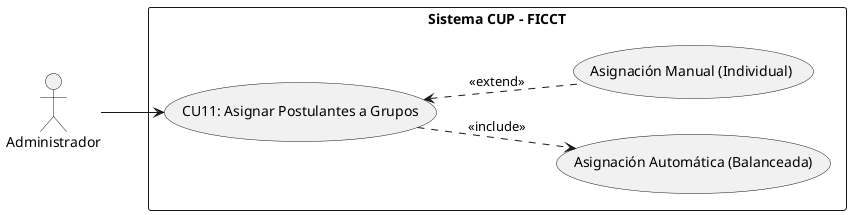

**B. Ficha de Especificación del Caso de Uso**

| Campo               | Descripción                                                                                                                                                                                                                                                                                                                                                                                                                                                                                                                          |
| ------------------- | ------------------------------------------------------------------------------------------------------------------------------------------------------------------------------------------------------------------------------------------------------------------------------------------------------------------------------------------------------------------------------------------------------------------------------------------------------------------------------------------------------------------------------------ |
| **CASO DE USO**     | CU11 — Asignar Postulantes a Grupos.                                                                                                                                                                                                                                                                                                                                                                                                                                                                                                 |
| **PROPÓSITO**       | Distribuir equitativamente a los postulantes inscritos entre los grupos creados, garantizando que ningún grupo exceda la capacidad máxima de 70 estudiantes.                                                                                                                                                                                                                                                                                                                                                                         |
| **DESCRIPCIÓN**     | El sistema ejecuta un algoritmo de distribución equitativa que asigna a cada postulante inscrito a un grupo disponible, balanceando la cantidad de estudiantes entre todos los grupos. La asignación puede ser automática (distribución aleatoria balanceada) o manual (reasignación individual por el Administrador).                                                                                                                                                                                                               |
| **ACTORES**         | Tablas de BD (`postulantes`, `grupos`, `asignaciones_grupo`).                                                                                                                                                                                                                                                                                                                                                                                                                                                                        |
| **ACTOR INICIADOR** | Administrador del Sistema.                                                                                                                                                                                                                                                                                                                                                                                                                                                                                                           |
| **PRECONDICIÓN**    | Los grupos deben estar creados (CU10 ejecutado). Debe haber postulantes con estado "Inscrito" sin grupo asignado.                                                                                                                                                                                                                                                                                                                                                                                                                    |
| **FLUJO PRINCIPAL** | 1. El Administrador presiona "Asignar Postulantes a Grupos". 2. El sistema calcula la distribución: `Postulantes_por_Grupo = FLOOR(Total_Inscritos / Total_Grupos)`, distribuyendo el remanente entre los primeros grupos. 3. El sistema muestra la previsualización con la distribución propuesta. 4. El Administrador confirma. 5. El sistema ejecuta la asignación masiva y actualiza el estado de cada postulante a "En Evaluación". 6. El sistema envía una notificación a cada postulante indicando su grupo y turno asignado. |
| **POST CONDICIÓN**  | Todos los postulantes inscritos quedan vinculados a un grupo. Cada grupo muestra su composición actual.                                                                                                                                                                                                                                                                                                                                                                                                                              |
| **EXCEPCIONES**     | *E1: Postulante ya asignado.* El sistema omite los postulantes que ya tienen grupo asignado. *E2: Reasignación manual.* El Administrador puede mover un postulante de un grupo a otro, siempre que el grupo destino no haya alcanzado su capacidad máxima.                                                                                                                                                                                                                                                                           |

---

#### CU12: Asignar Docente a Grupo y Materia

**A. Estructura del Modelo de CU (Diagrama Específico)**

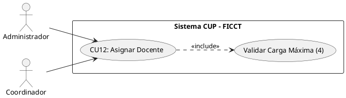

**B. Ficha de Especificación del Caso de Uso**

| Campo               | Descripción                                                                                                                                                                                                                                                                                                                                                                                                                                                                                                                                                                                                                                                                                                                                           |
| ------------------- | ----------------------------------------------------------------------------------------------------------------------------------------------------------------------------------------------------------------------------------------------------------------------------------------------------------------------------------------------------------------------------------------------------------------------------------------------------------------------------------------------------------------------------------------------------------------------------------------------------------------------------------------------------------------------------------------------------------------------------------------------------- |
| **CASO DE USO**     | CU12 — Asignar Docente a Grupo y Materia.                                                                                                                                                                                                                                                                                                                                                                                                                                                                                                                                                                                                                                                                                                             |
| **PROPÓSITO**       | Vincular a cada docente del CUP con los grupos y materias que impartirá, controlando que no exceda su carga máxima de 4 grupos.                                                                                                                                                                                                                                                                                                                                                                                                                                                                                                                                                                                                                       |
| **DESCRIPCIÓN**     | El Administrador o Coordinador selecciona un docente registrado, elige el grupo y la materia a asignar. El sistema verifica automáticamente que el docente no tenga ya 4 grupos asignados y que el grupo no tenga ya un docente para esa materia. Cada grupo requiere 4 docentes (uno por materia: Computación, Matemáticas, Inglés, Física).                                                                                                                                                                                                                                                                                                                                                                                                         |
| **ACTORES**         | Tablas de BD (`docentes`, `grupos`, `asignaciones_docente`).                                                                                                                                                                                                                                                                                                                                                                                                                                                                                                                                                                                                                                                                                          |
| **ACTOR INICIADOR** | Administrador o Coordinador Académico.                                                                                                                                                                                                                                                                                                                                                                                                                                                                                                                                                                                                                                                                                                                |
| **PRECONDICIÓN**    | Los grupos deben existir (CU10). El docente debe estar registrado y activo.                                                                                                                                                                                                                                                                                                                                                                                                                                                                                                                                                                                                                                                                           |
| **FLUJO PRINCIPAL** | 1. El actor ingresa al módulo "Gestión de Docentes" → "Asignaciones". 2. El sistema despliega la lista de docentes activos con su carga actual (grupos asignados / 4). 3. El actor selecciona un docente y presiona "Asignar a Grupo". 4. El sistema despliega los grupos disponibles y las materias sin docente asignado. 5. El actor selecciona el grupo y la materia correspondiente a la especialidad del docente. 6. El sistema verifica que el docente no tenga 4 grupos (carga máxima) y que el grupo no tenga ya un docente para esa materia. 7. El sistema registra la asignación y actualiza la carga horaria del docente. 8. Si el docente alcanza 4 grupos, el sistema muestra una alerta visual y envía una notificación al Coordinador. |
| **POST CONDICIÓN**  | El docente queda vinculado al grupo y materia. Solo podrá ver y evaluar a los postulantes de sus grupos asignados.                                                                                                                                                                                                                                                                                                                                                                                                                                                                                                                                                                                                                                    |
| **EXCEPCIONES**     | *E1: Carga máxima alcanzada.* "El docente [nombre] ya tiene 4 grupos asignados. No puede asumir más grupos". *E2: Grupo ya tiene docente para esa materia.* "El Grupo [N] ya tiene un docente asignado para [materia]". *E3: Especialidad no coincide.* Advertencia: "El docente [nombre] tiene especialidad en [X] pero se le está asignando [Y]. ¿Confirmar?".                                                                                                                                                                                                                                                                                                                                                                                      |

---

#### CU23: Realizar Simulacro de Examen (Práctica)

**A. Estructura del Modelo de CU (Diagrama Específico)**

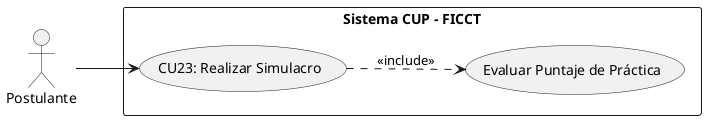

**B. Ficha de Especificación del Caso de Uso**

| Campo               | Descripción                                                                                                                                                                                                                                                                                                                                                                                                                                                                                                                                                                                      |
| ------------------- | ------------------------------------------------------------------------------------------------------------------------------------------------------------------------------------------------------------------------------------------------------------------------------------------------------------------------------------------------------------------------------------------------------------------------------------------------------------------------------------------------------------------------------------------------------------------------------------------------ |
| **CASO DE USO**     | CU23 — Realizar Simulacro de Examen (Práctica).                                                                                                                                                                                                                                                                                                                                                                                                                                                                                                                                                  |
| **PROPÓSITO**       | Proveer al postulante una herramienta de preparación que no afecte su nota oficial, permitiéndole familiarizarse con el formato del examen y medir sus conocimientos previos.                                                                                                                                                                                                                                                                                                                                                                                                                    |
| **DESCRIPCIÓN**     | El postulante inscrito puede acceder a un banco de preguntas aleatorias para las 4 materias. El sistema genera un examen simulado de 40 preguntas, provee un temporizador y al finalizar calcula el puntaje obtenido. Los resultados son puramente informativos y no se guardan en el historial académico oficial del postulante.                                                                                                                                                                                                                                                                |
| **ACTORES**         | Tablas de BD (`preguntas_simulacro`).                                                                                                                                                                                                                                                                                                                                                                                                                                                                                                                                                            |
| **ACTOR INICIADOR** | Postulante.                                                                                                                                                                                                                                                                                                                                                                                                                                                                                                                                                                                      |
| **PRECONDICIÓN**    | El postulante debe tener estado "Inscrito" (CU07 completado).                                                                                                                                                                                                                                                                                                                                                                                                                                                                                                                                    |
| **FLUJO PRINCIPAL** | 1. El postulante ingresa al módulo "Área de Práctica". 2. El sistema despliega las instrucciones del simulacro. 3. El postulante presiona "Iniciar Simulacro". 4. El sistema selecciona aleatoriamente 40 preguntas del banco de preguntas de práctica (10 por cada materia). 5. El sistema muestra la interfaz de examen con un temporizador (ej. 60 minutos). 6. El postulante responde las opciones de selección múltiple. 7. El postulante presiona "Finalizar" o el tiempo expira. 8. El sistema evalúa automáticamente las respuestas y muestra el puntaje obtenido detallado por materia. |
| **POST CONDICIÓN**  | El postulante recibe su retroalimentación. La base de datos de notas oficiales no sufre ninguna alteración.                                                                                                                                                                                                                                                                                                                                                                                                                                                                                      |
| **EXCEPCIONES**     | *E1: Banco de preguntas vacío.* "El módulo de práctica no está disponible en este momento".                                                                                                                                                                                                                                                                                                                                                                                                                                                                                                      |

---

#### CU24: Registrar Postulación de Docente

**A. Estructura del Modelo de CU (Diagrama Específico)**

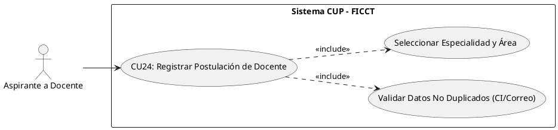

**B. Ficha de Especificación del Caso de Uso**

| Campo               | Descripción                                                                                                                                                                                                                                                                                                                                                                                                                                                                                                                                                                                                                                                                                                                                                                                                          |
| ------------------- | ------------------------------------------------------------------------------------------------------------------------------------------------------------------------------------------------------------------------------------------------------------------------------------------------------------------------------------------------------------------------------------------------------------------------------------------------------------------------------------------------------------------------------------------------------------------------------------------------------------------------------------------------------------------------------------------------------------------------------------------------------------------------------------------------------------------- |
| **CASO DE USO**     | CU24 — Registrar Postulación de Docente.                                                                                                                                                                                                                                                                                                                                                                                                                                                                                                                                                                                                                                                                                                                                                                            |
| **PROPÓSITO**       | Capturar los datos personales y académicos del aspirante a docente del CUP, registrando su postulación con la especialidad y el área (materia) en la que desea enseñar, generando su expediente en estado "Pendiente de Revisión".                                                                                                                                                                                                                                                                                                                                                                                                                                                                                                                                                                                  |
| **DESCRIPCIÓN**     | El aspirante a docente accede de forma pública (sin autenticación previa) al portal de convocatoria docente. Completa sus datos personales (CI, nombres, apellidos, correo, teléfono), su grado académico y, lo más importante, declara su **especialidad** y selecciona el **área/materia** en la que desea enseñar (Computación, Matemáticas, Inglés o Física), adjuntando su hoja de vida y respaldos académicos. Antes de procesar el registro, el sistema verifica que el CI y el correo no estén duplicados. La postulación NO genera una cuenta de usuario: queda almacenada en estado "Pendiente de Revisión" a la espera de ser evaluada y aceptada por el Administrador o Coordinador (CU25).                                                                                                                  |
| **ACTORES**         | Tablas de BD (`docentes`, `especialidades`, `areas` / `materias`).                                                                                                                                                                                                                                                                                                                                                                                                                                                                                                                                                                                                                                                                                                                                                  |
| **ACTOR INICIADOR** | Aspirante a Docente (Público).                                                                                                                                                                                                                                                                                                                                                                                                                                                                                                                                                                                                                                                                                                                                                                                      |
| **PRECONDICIÓN**    | El período de convocatoria docente debe estar abierto (configurado por el Administrador). No requiere inicio de sesión.                                                                                                                                                                                                                                                                                                                                                                                                                                                                                                                                                                                                                                                                                              |
| **FLUJO PRINCIPAL** | 1. El aspirante accede al portal y hace clic en "Postular como Docente". 2. El sistema despliega el formulario de postulación con los campos: CI, nombres, apellidos, fecha de nacimiento, correo electrónico, teléfono, grado académico, especialidad y el área/materia en la que desea enseñar (Computación, Matemáticas, Inglés, Física), además de la carga de hoja de vida y respaldos. 3. El aspirante completa los campos y adjunta los documentos. 4. El sistema ejecuta `<<include>>` la validación de que el CI y el correo no estén ya registrados como docente. 5. El sistema valida que se haya declarado una especialidad y seleccionado al menos un área. 6. El sistema registra la postulación en la tabla `docentes` con estado "Pendiente de Revisión". 7. El sistema muestra el mensaje: "Su postulación fue registrada exitosamente y será revisada por la coordinación". |
| **POST CONDICIÓN**  | La postulación del docente queda registrada con estado "Pendiente de Revisión", vinculada a su especialidad y área declaradas, lista para ser evaluada en CU25. Aún no existe cuenta de usuario asociada.                                                                                                                                                                                                                                                                                                                                                                                                                                                                                                                                                                                                            |
| **EXCEPCIONES**     | *E1: Convocatoria cerrada.* "La convocatoria docente para la gestión [X] no está habilitada". *E2: CI ya registrado como docente.* "Ya existe una postulación o un docente registrado con este CI". *E3: Correo duplicado.* "Este correo electrónico ya está asociado a otra postulación docente". *E4: Sin especialidad/área.* "Debe declarar su especialidad y seleccionar el área en la que desea enseñar".                                                                                                                                                                                                                                                                                                                                                                                                       |

**C. Prototipo UI (Directriz)**

> Formulario público de postulación docente en tarjeta blanca amplia con tipografía limpia (Inter/Roboto). Campos para datos personales, un selector de "Grado Académico", un campo de "Especialidad" y un selector de "Área en la que desea enseñar" (Computación, Matemáticas, Inglés, Física), además de una zona de arrastre para adjuntar hoja de vida y respaldos. Botón principal "Enviar Postulación" en azul institucional y mensaje de confirmación tras el envío indicando que la postulación quedará en revisión.

---

#### CU25: Aceptar Postulación de Docente

**A. Estructura del Modelo de CU (Diagrama Específico)**

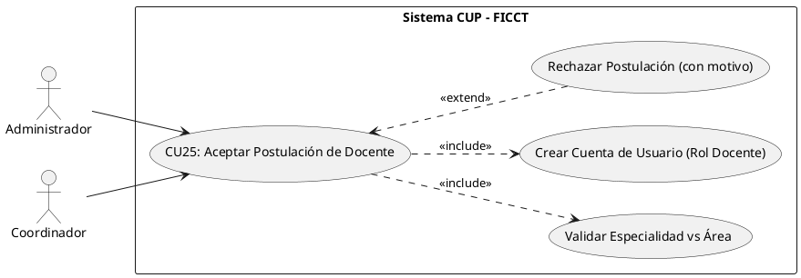

**B. Ficha de Especificación del Caso de Uso**

| Campo               | Descripción                                                                                                                                                                                                                                                                                                                                                                                                                                                                                                                                                                                                                                                                                                                                                                                                          |
| ------------------- | ------------------------------------------------------------------------------------------------------------------------------------------------------------------------------------------------------------------------------------------------------------------------------------------------------------------------------------------------------------------------------------------------------------------------------------------------------------------------------------------------------------------------------------------------------------------------------------------------------------------------------------------------------------------------------------------------------------------------------------------------------------------------------------------------------------------- |
| **CASO DE USO**     | CU25 — Aceptar Postulación de Docente.                                                                                                                                                                                                                                                                                                                                                                                                                                                                                                                                                                                                                                                                                                                                                                              |
| **PROPÓSITO**       | Permitir al Administrador o Coordinador revisar y validar las postulaciones de docentes, aceptando únicamente a quienes acrediten una especialidad correspondiente al área en la que desean enseñar, y generando su cuenta de usuario con rol Docente.                                                                                                                                                                                                                                                                                                                                                                                                                                                                                                                                                                |
| **DESCRIPCIÓN**     | El Administrador o Coordinador accede al módulo de "Revisión de Postulaciones Docentes" y consulta las postulaciones en estado "Pendiente de Revisión". Revisa los datos, la hoja de vida y los respaldos de cada aspirante y valida la **regla de negocio crítica**: el docente debe poseer una especialidad que corresponda al área/materia en la que se postula (p. ej. una especialidad en Álgebra/Cálculo para postular a Matemáticas). Si la especialidad es coherente con el área, **acepta** la postulación: el sistema cambia el estado a "Aceptado", crea automáticamente la cuenta de usuario con rol "Docente" (credenciales autogeneradas y enviadas por correo) y deja al docente habilitado para ser asignado a grupos y materias (CU12). Si la especialidad no corresponde al área o faltan respaldos, **rechaza** la postulación indicando el motivo.                                  |
| **ACTORES**         | Tablas de BD (`docentes`, `users`, `especialidades`, `areas` / `materias`), Servicio SMTP de correo.                                                                                                                                                                                                                                                                                                                                                                                                                                                                                                                                                                                                                                                                                                                |
| **ACTOR INICIADOR** | Administrador o Coordinador Académico.                                                                                                                                                                                                                                                                                                                                                                                                                                                                                                                                                                                                                                                                                                                                                                              |
| **PRECONDICIÓN**    | El actor debe estar autenticado (CU01) con rol Administrador o Coordinador. Debe existir al menos una postulación docente en estado "Pendiente de Revisión" (CU24).                                                                                                                                                                                                                                                                                                                                                                                                                                                                                                                                                                                                                                                  |
| **FLUJO PRINCIPAL** | 1. El actor ingresa al módulo "Gestión de Docentes" → "Postulaciones Pendientes". 2. El sistema despliega la grilla de postulaciones en estado "Pendiente de Revisión" con su especialidad y área declaradas. 3. El actor selecciona una postulación y presiona "Revisar". 4. El sistema muestra el detalle del aspirante (datos, hoja de vida, respaldos, especialidad y área). 5. El sistema ejecuta `<<include>>` la validación de coincidencia entre la especialidad del docente y el área a la que postula. 6. Si la especialidad corresponde al área, el actor presiona "Aceptar Postulación". 7. El sistema cambia el estado del docente a "Aceptado". 8. El sistema ejecuta `<<include>>` la creación de la cuenta de usuario en `users` con rol "Docente" y credenciales autogeneradas. 9. El sistema envía un correo al docente con sus accesos y muestra: "Docente aceptado y notificado correctamente". |
| **POST CONDICIÓN**  | El docente queda con estado "Aceptado" y con una cuenta de usuario activa de rol "Docente". Queda habilitado para ser asignado a grupos y materias (CU12) conforme a su especialidad.                                                                                                                                                                                                                                                                                                                                                                                                                                                                                                                                                                                                                                |
| **EXCEPCIONES**     | *E1: Especialidad no corresponde al área.* El sistema advierte: "La especialidad del docente [X] no corresponde al área [Y]. No es posible aceptar la postulación en esta área". *E2: Respaldos incompletos.* El sistema impide la aceptación: "La postulación no cuenta con los respaldos académicos requeridos". *E3: Rechazo de postulación (`<<extend>>`).* El actor presiona "Rechazar", el sistema solicita el motivo, cambia el estado a "Rechazado" y notifica al aspirante por correo. *E4: Docente ya aceptado.* "Esta postulación ya fue procesada anteriormente".                                                                                                                                                                                                                                          |

**C. Prototipo UI (Directriz)**

> Vista de administración de "Revisión de Postulaciones Docentes" con sidebar institucional y panel principal. Tabla de postulaciones pendientes con columnas Nombre, CI, Especialidad, Área Postulada y un Badge de estado ("Pendiente" en ámbar). Al abrir el detalle, mostrar una ficha del aspirante con su hoja de vida embebida y un indicador semántico de validación "Especialidad ↔ Área" (verde si coincide, rojo si no). Dos botones de acción: "Aceptar Postulación" (verde, crea la cuenta de usuario) y "Rechazar" (rojo, abre un modal para capturar el motivo).

---

### 4.3.2 CICLO 2: Gestión Académica, Reportes y Admisión

#### CU13: Registrar Notas de Examen por el Administrador (Individual)

**A. Estructura del Modelo de CU (Diagrama Específico)**

```plantuml
@startuml
left to right direction
actor "Administrador" as Admin
rectangle "Sistema CUP - FICCT" {
  usecase "CU13: Registrar Nota" as CU13
  usecase "Validar Rango 0-100" as Validar
  usecase "CU15: Calcular Promedio" as CU15
}
Admin --> CU13
CU13 ..> Validar : <<include>>
CU13 ..> CU15 : <<include>>
@enduml
```

**B. Ficha de Especificación del Caso de Uso**

| Campo               | Descripción                                                                                                                                                                                                                                                                                                                                                                                                                                                                                                                                 |
| ------------------- | ------------------------------------------------------------------------------------------------------------------------------------------------------------------------------------------------------------------------------------------------------------------------------------------------------------------------------------------------------------------------------------------------------------------------------------------------------------------------------------------------------------------------------------------- |
| **CASO DE USO**     | CU13 — Registrar Notas de Examen por el Administrador (Individual).                                                                                                                                                                                                                                                                                                                                                                                                                                                                         |
| **PROPÓSITO**       | Actuar como mecanismo de excepción para que el Administrador registre o corrija la calificación individual de un examen (ej. rezagados, correcciones manuales o fallos técnicos en la BD local).                                                                                                                                                                                                                                                                                                                                            |
| **DESCRIPCIÓN**     | El Administrador selecciona un grupo, una materia y un número de examen (1, 2 o 3). El sistema despliega la lista de postulantes y permite ingresar la nota individual. Este CU se usa principalmente para correcciones, ya que el flujo normal es la carga masiva (CU14). Tras el registro, el sistema recalcula automáticamente el promedio ponderado de la materia (CU15).                                                                                                                                                               |
| **ACTORES**         | Tablas de BD (`examenes`, `postulantes`, `asignaciones_grupo`).                                                                                                                                                                                                                                                                                                                                                                                                                                                                             |
| **ACTOR INICIADOR** | Administrador del Sistema.                                                                                                                                                                                                                                                                                                                                                                                                                                                                                                                  |
| **PRECONDICIÓN**    | Los postulantes deben estar asignados al grupo (CU11).                                                                                                                                                                                                                                                                                                                                                                                                                                                                                      |
| **FLUJO PRINCIPAL** | 1. El Administrador ingresa al módulo "Calificaciones". 2. Selecciona un grupo y materia. 3. El sistema despliega la lista de postulantes con columnas: Examen 1, Examen 2, Examen 3, Promedio Ponderado. 4. El Administrador selecciona el número de examen a calificar (1, 2 o 3). 5. Ingresa la nota (0-100) para el postulante excepcionado. 6. El sistema valida el rango. 7. El sistema guarda la nota y ejecuta `<<include>> CU15`: recalcula el promedio ponderado. 8. El sistema actualiza visualmente la columna correspondiente. |
| **POST CONDICIÓN**  | La nota queda registrada con auditoría (administrador, fecha, hora). El promedio ponderado se recalcula automáticamente.                                                                                                                                                                                                                                                                                                                                                                                                                    |
| **EXCEPCIONES**     | *E1: Nota fuera de rango.* "La nota debe estar entre 0 y 100". *E2: Examen ya calificado.* "Este examen ya fue registrado. Use la función de edición para modificarlo". *E3: 4° examen bloqueado.* El sistema no permite registrar un cuarto examen por materia.                                                                                                                                                                                                                                                                            |

---

#### CU14: Cargar Notas Masivamente por el Administrador (CSV/Excel)

**A. Estructura del Modelo de CU (Diagrama Específico)**

```plantuml
@startuml
left to right direction
actor "Administrador" as Admin
rectangle "Sistema CUP - FICCT" {
  usecase "CU14: Cargar Notas Masivamente" as CU14
  usecase "Validar Formato CSV" as ValidarCSV
  usecase "CU15: Calcular Promedio" as CU15
}
Admin --> CU14
CU14 ..> ValidarCSV : <<include>>
CU14 ..> CU15 : <<include>>
@enduml
```

**B. Ficha de Especificación del Caso de Uso**

| Campo               | Descripción                                                                                                                                                                                                                                                                                                                                                                                                                                       |
| ------------------- | ------------------------------------------------------------------------------------------------------------------------------------------------------------------------------------------------------------------------------------------------------------------------------------------------------------------------------------------------------------------------------------------------------------------------------------------------- |
| **CASO DE USO**     | CU14 — Cargar Notas Masivamente por el Administrador (CSV/Excel).                                                                                                                                                                                                                                                                                                                                                                                 |
| **PROPÓSITO**       | Integrar los resultados de evaluación generados automáticamente por los laboratorios de cómputo, permitiendo subir directamente los archivos CSV exportados sin digitación manual.                                                                                                                                                                                                                                                                |
| **DESCRIPCIÓN**     | El Administrador recibe los archivos CSV exportados por las Bases de Datos locales de los laboratorios y los sube directamente al sistema central. El sistema parsea el archivo, valida que los IDs coincidan con los postulantes y confirma la carga masiva.                                                                                                                                                                                     |
| **ACTORES**         | Tablas de BD (`examenes`, `postulantes`).                                                                                                                                                                                                                                                                                                                                                                                                         |
| **ACTOR INICIADOR** | Administrador del Sistema.                                                                                                                                                                                                                                                                                                                                                                                                                        |
| **PRECONDICIÓN**    | Los postulantes deben estar asignados a grupos. El archivo CSV debe coincidir con la estructura esperada por el sistema.                                                                                                                                                                                                                                                                                                                          |
| **FLUJO PRINCIPAL** | 1. El Administrador ingresa a "Calificaciones" → "Carga Masiva". 2. Selecciona el archivo CSV recibido desde el laboratorio de cómputo. 3. Sube el archivo CSV al sistema. 4. El sistema parsea el archivo y ejecuta validaciones: códigos existentes, notas en rango 0-100, no duplicidad. 5. El sistema muestra un resumen: "N registros válidos, M errores". 6. El Administrador confirma. 7. El sistema inserta las notas masivamente (CU15). |
| **POST CONDICIÓN**  | Todas las notas válidas quedan registradas y centralizadas en la BD principal.                                                                                                                                                                                                                                                                                                                                                                    |
| **EXCEPCIONES**     | *E1: Archivo vacío o formato incorrecto.* "El archivo no cumple con el formato esperado". *E2: Notas duplicadas.* "Se detectaron [N] notas duplicadas que serán omitidas".                                                                                                                                                                                                                                                                        |

---

#### CU15: Calcular Promedio Ponderado por Materia

**A. Estructura del Modelo de CU (Diagrama Específico)**

```plantuml
@startuml
left to right direction
actor "Sistema (Automático)" as Sistema
rectangle "Sistema CUP - FICCT" {
  usecase "CU15: Calcular Promedio" as CU15
  usecase "CU16: Determinar Estado" as CU16
}
Sistema --> CU15
CU15 ..> CU16 : <<extend>>
@enduml
```

**B. Ficha de Especificación del Caso de Uso**

| Campo               | Descripción                                                                                                                                                                                                                                                                                                                                                                                                                                                                                              |
| ------------------- | -------------------------------------------------------------------------------------------------------------------------------------------------------------------------------------------------------------------------------------------------------------------------------------------------------------------------------------------------------------------------------------------------------------------------------------------------------------------------------------------------------- |
| **CASO DE USO**     | CU15 — Calcular Promedio Ponderado por Materia.                                                                                                                                                                                                                                                                                                                                                                                                                                                          |
| **PROPÓSITO**       | Aplicar automáticamente la fórmula de ponderación (30%-30%-40%) para determinar la nota final de cada materia de cada postulante.                                                                                                                                                                                                                                                                                                                                                                        |
| **DESCRIPCIÓN**     | El sistema calcula automáticamente el promedio ponderado cada vez que se registra o modifica una nota de examen. La fórmula aplicada es: `Nota_Final_Materia = (Examen1 × 0.30) + (Examen2 × 0.30) + (Examen3 × 0.40)`. Las ponderaciones son configurables por el Administrador.                                                                                                                                                                                                                        |
| **ACTORES**         | Tablas de BD (`examenes`, `notas_finales`).                                                                                                                                                                                                                                                                                                                                                                                                                                                              |
| **ACTOR INICIADOR** | Sistema (invocado automáticamente desde CU13 o CU14).                                                                                                                                                                                                                                                                                                                                                                                                                                                    |
| **PRECONDICIÓN**    | Debe existir al menos una nota registrada para el postulante en la materia.                                                                                                                                                                                                                                                                                                                                                                                                                              |
| **FLUJO PRINCIPAL** | 1. El sistema detecta un INSERT o UPDATE en la tabla `examenes`. 2. El sistema recupera las notas registradas del postulante para esa materia. 3. Si las 3 notas están presentes: aplica la fórmula ponderada completa. 4. Si faltan notas: calcula un promedio parcial indicando "(Incompleto — faltan N exámenes)". 5. El sistema almacena el resultado en la tabla `notas_finales` (postulante, materia, nota_final, estado). 6. El sistema invoca CU16 si las 4 materias tienen nota final completa. |
| **POST CONDICIÓN**  | La nota final ponderada queda registrada y visible para docentes, coordinadores y el postulante.                                                                                                                                                                                                                                                                                                                                                                                                         |
| **EXCEPCIONES**     | Ninguna. El cálculo es determinístico y automático.                                                                                                                                                                                                                                                                                                                                                                                                                                                      |

**Ejemplo de cálculo:**

| Materia     | Examen 1 (30%)   | Examen 2 (30%)   | Examen 3 (40%) | Nota Final |
| ----------- | ---------------- | ---------------- | -------------- | ---------- |
| Computación | 80 × 0.30 = 24   | 70 × 0.30 = 21   | 90 × 0.40 = 36 | **81.0** ✅ |
| Matemáticas | 50 × 0.30 = 15   | 55 × 0.30 = 16.5 | 60 × 0.40 = 24 | **55.5** ❌ |
| Inglés      | 75 × 0.30 = 22.5 | 80 × 0.30 = 24   | 85 × 0.40 = 34 | **80.5** ✅ |
| Física      | 60 × 0.30 = 18   | 65 × 0.30 = 19.5 | 70 × 0.40 = 28 | **65.5** ✅ |

> **Resultado:** REPROBADO — Matemáticas (55.5) no alcanza el ≥60 requerido por materia.

---

#### CU16: Determinar Estado del Postulante (Aprobado/Reprobado)

**A. Estructura del Modelo de CU (Diagrama Específico)**

```plantuml
@startuml
left to right direction
actor "Sistema (Automático)" as Sistema
rectangle "Sistema CUP - FICCT" {
  usecase "CU16: Determinar Estado" as CU16
  usecase "Evaluar ≥60 por CADA materia" as Regla
  usecase "CU17: Asignar Carrera" as CU17
}
Sistema --> CU16
CU16 ..> Regla : <<include>>
CU16 ..> CU17 : <<extend>>
@enduml
```

**B. Ficha de Especificación del Caso de Uso**

| Campo               | Descripción                                                                                                                                                                                                                                                                                                                                                                                                                                                                                                                                                                                              |
| ------------------- | -------------------------------------------------------------------------------------------------------------------------------------------------------------------------------------------------------------------------------------------------------------------------------------------------------------------------------------------------------------------------------------------------------------------------------------------------------------------------------------------------------------------------------------------------------------------------------------------------------- |
| **CASO DE USO**     | CU16 — Determinar Estado del Postulante (Aprobado/Reprobado).                                                                                                                                                                                                                                                                                                                                                                                                                                                                                                                                            |
| **PROPÓSITO**       | Aplicar sistémicamente la regla de negocio de aprobación del CUP: el postulante debe obtener ≥60 en CADA una de las 4 materias individualmente para ser considerado APROBADO.                                                                                                                                                                                                                                                                                                                                                                                                                            |
| **DESCRIPCIÓN**     | Una vez que las 4 materias del postulante tienen nota final calculada (CU15), el sistema evalúa automáticamente la regla de negocio. **NO se utiliza el promedio general de las 4 materias.** Cada materia se evalúa de forma independiente. Si TODAS las materias tienen nota final ≥60, el estado es APROBADO. Si al menos UNA materia tiene nota final <60, el estado es REPROBADO.                                                                                                                                                                                                                   |
| **ACTORES**         | Tablas de BD (`notas_finales`, `postulantes`).                                                                                                                                                                                                                                                                                                                                                                                                                                                                                                                                                           |
| **ACTOR INICIADOR** | Sistema (invocado automáticamente tras completar CU15 para las 4 materias).                                                                                                                                                                                                                                                                                                                                                                                                                                                                                                                              |
| **PRECONDICIÓN**    | Las 4 materias del postulante deben tener nota final calculada (los 3 exámenes por materia registrados).                                                                                                                                                                                                                                                                                                                                                                                                                                                                                                 |
| **FLUJO PRINCIPAL** | 1. El sistema detecta que las 4 materias del postulante tienen nota final completa. 2. El sistema evalúa cada nota final individualmente contra el umbral ≥60. 3. **Si las 4 materias ≥60:** El sistema actualiza el estado del postulante a "APROBADO". El sistema envía una notificación al postulante y al coordinador. El sistema invoca `<<extend>> CU17` para la asignación de carrera. 4. **Si alguna materia <60:** El sistema actualiza el estado a "REPROBADO" indicando las materias no aprobadas. El sistema envía una notificación al postulante con el detalle de las materias reprobadas. |
| **POST CONDICIÓN**  | El estado del postulante queda determinado de forma inmutable (solo el Administrador puede corregir en caso de error de digitación).                                                                                                                                                                                                                                                                                                                                                                                                                                                                     |
| **EXCEPCIONES**     | Ninguna. La regla es determinística e inquebrantable por diseño.                                                                                                                                                                                                                                                                                                                                                                                                                                                                                                                                         |

**Regla de negocio implementada:**

```
PARA cada postulante CON 4 materias evaluadas:
  SI nota_final_computacion >= 60
     Y nota_final_matematicas >= 60
     Y nota_final_ingles >= 60
     Y nota_final_fisica >= 60:
    → Estado = APROBADO
  SINO:
    → Estado = REPROBADO
    → Registrar materias reprobadas (las que tienen < 60)
FIN PARA
```

> ⚠️ **IMPORTANTE:** La regla de negocio establece que el umbral ≥60 se aplica a CADA materia individualmente. NO al promedio general de las 4 materias. Un postulante con notas 100, 100, 90, 55 queda REPROBADO porque una materia (55) no alcanza el umbral, aunque su promedio general sea 86.25.

---

#### CU17: Ejecutar Asignación de Carreras por Cupo

**A. Estructura del Modelo de CU (Diagrama Específico)**

```plantuml
@startuml
left to right direction
actor "Coordinador" as Coord
rectangle "Sistema CUP - FICCT" {
  usecase "CU17: Asignar Carreras" as CU17
  usecase "CU18: Configurar Cupos" as CU18
}
Coord --> CU17
CU17 ..> CU18 : <<include>>
@enduml
```

**B. Ficha de Especificación del Caso de Uso**

| Campo               | Descripción                                                                                                                                                                                                                                                                                                                                                                                                                                                                                                                                                                 |
| ------------------- | --------------------------------------------------------------------------------------------------------------------------------------------------------------------------------------------------------------------------------------------------------------------------------------------------------------------------------------------------------------------------------------------------------------------------------------------------------------------------------------------------------------------------------------------------------------------------- |
| **CASO DE USO**     | CU17 — Ejecutar Asignación de Carreras por Cupo.                                                                                                                                                                                                                                                                                                                                                                                                                                                                                                                            |
| **PROPÓSITO**       | Asignar a los postulantes aprobados a su carrera correspondiente según sus preferencias y la disponibilidad de cupos vigentes por gestión.                                                                                                                                                                                                                                                                                                                                                                                                                                  |
| **DESCRIPCIÓN**     | El Coordinador ejecuta el algoritmo de asignación masiva de carreras. El sistema recorre la lista de postulantes aprobados (ordenados por promedio general descendente), intentando asignar primero la 1ª opción de carrera. Si los cupos están agotados, intenta la 2ª opción. Si ambas están llenas, marca al postulante como "Pendiente de Reasignación".                                                                                                                                                                                                                |
| **ACTORES**         | Tablas de BD (`postulantes`, `carreras`, `cupos_gestion`, `admisiones`).                                                                                                                                                                                                                                                                                                                                                                                                                                                                                                    |
| **ACTOR INICIADOR** | Coordinador Académico.                                                                                                                                                                                                                                                                                                                                                                                                                                                                                                                                                      |
| **PRECONDICIÓN**    | Los estados de todos los postulantes deben estar determinados (CU16). Los cupos por carrera deben estar configurados (CU18).                                                                                                                                                                                                                                                                                                                                                                                                                                                |
| **FLUJO PRINCIPAL** | 1. El Coordinador ingresa al módulo "Admisión" → "Asignar Carreras". 2. El sistema muestra el resumen: "Aprobados: [N]. Cupos totales disponibles: [M]". 3. El Coordinador presiona "Ejecutar Asignación". 4. El sistema ordena los aprobados por promedio general descendente. 5. Para cada aprobado: verifica cupo en 1ª opción → asigna; si no hay → verifica 2ª opción → asigna; si no hay → marca "Pendiente". 6. El sistema muestra el resultado detallado con métricas. 7. El sistema envía notificaciones a cada postulante aprobado indicando la carrera asignada. |
| **POST CONDICIÓN**  | Los postulantes aprobados quedan asignados a una carrera. Los cupos se descuentan atómicamente.                                                                                                                                                                                                                                                                                                                                                                                                                                                                             |
| **EXCEPCIONES**     | *E1: Ambas opciones agotadas.* El postulante queda como "Pendiente de Reasignación Administrativa". Se notifica al Coordinador para resolución manual (asignar a la carrera con menor cantidad de inscritos).                                                                                                                                                                                                                                                                                                                                                               |

---

#### CU18: Configurar Cupos por Carrera y Gestión

**A. Estructura del Modelo de CU (Diagrama Específico)**

```plantuml
@startuml
left to right direction
actor "Administrador" as Admin
rectangle "Sistema CUP - FICCT" {
  usecase "CU18: Configurar Cupos" as CU18
}
Admin --> CU18
@enduml
```

**B. Ficha de Especificación del Caso de Uso**

| Campo               | Descripción                                                                                                                                                                                                                                                                                                                                                                             |
| ------------------- | --------------------------------------------------------------------------------------------------------------------------------------------------------------------------------------------------------------------------------------------------------------------------------------------------------------------------------------------------------------------------------------- |
| **CASO DE USO**     | CU18 — Configurar Cupos por Carrera y Gestión.                                                                                                                                                                                                                                                                                                                                          |
| **PROPÓSITO**       | Permitir al Administrador definir la cantidad máxima de estudiantes que cada carrera puede admitir en una gestión específica.                                                                                                                                                                                                                                                           |
| **DESCRIPCIÓN**     | El Administrador establece los cupos de admisión para cada una de las 4 carreras de la FICCT (Informática, Sistemas, Redes y Telecomunicaciones, Robótica) para la gestión académica en curso. Los cupos son independientes por gestión y carrera.                                                                                                                                      |
| **ACTORES**         | Tablas de BD (`cupos_gestion`, `carreras`).                                                                                                                                                                                                                                                                                                                                             |
| **ACTOR INICIADOR** | Administrador del Sistema.                                                                                                                                                                                                                                                                                                                                                              |
| **PRECONDICIÓN**    | Las carreras deben estar registradas. La gestión académica debe estar activa.                                                                                                                                                                                                                                                                                                           |
| **FLUJO PRINCIPAL** | 1. El Administrador ingresa al módulo "Configuración" → "Cupos por Carrera". 2. El sistema despliega las 4 carreras con su cupo actual (o vacío si es una nueva gestión). 3. El Administrador ingresa la cantidad de cupo para cada carrera. 4. El Administrador presiona "Guardar Configuración". 5. El sistema valida que los cupos sean números positivos y guarda la configuración. |
| **POST CONDICIÓN**  | Los cupos quedan definidos para la gestión y serán utilizados por CU17 durante la asignación de carreras.                                                                                                                                                                                                                                                                               |
| **EXCEPCIONES**     | *E1: Cupo menor a admitidos actuales.* "No puede reducir el cupo por debajo de los [N] ya admitidos en [carrera]".                                                                                                                                                                                                                                                                      |

---

#### CU19: Generar Reporte Estructurado (Predefinido)

**A. Estructura del Modelo de CU (Diagrama Específico)**

```plantuml
@startuml
left to right direction
actor "Coordinador / Admin" as User
rectangle "Sistema CUP - FICCT" {
  usecase "CU19: Reporte Estructurado" as CU19
}
User --> CU19
@enduml
```

**B. Ficha de Especificación del Caso de Uso**

| Campo               | Descripción                                                                                                                                                                                                                                                                                                                                                                                                                                                                                                                |
| ------------------- | -------------------------------------------------------------------------------------------------------------------------------------------------------------------------------------------------------------------------------------------------------------------------------------------------------------------------------------------------------------------------------------------------------------------------------------------------------------------------------------------------------------------------- |
| **CASO DE USO**     | CU19 — Generar Reporte Estructurado (Predefinido).                                                                                                                                                                                                                                                                                                                                                                                                                                                                         |
| **PROPÓSITO**       | Generar reportes con formato fijo predefinido con un solo clic, cubriendo los indicadores estadísticos más solicitados por las autoridades de la facultad.                                                                                                                                                                                                                                                                                                                                                                 |
| **DESCRIPCIÓN**     | El sistema ofrece un catálogo de reportes predefinidos (lista de inscritos, aprobados, reprobados, por grupo, por materia, por carrera, etc.). El usuario selecciona el reporte deseado y el sistema lo genera automáticamente en pantalla con opción de exportación a PDF o Excel.                                                                                                                                                                                                                                        |
| **ACTORES**         | Tablas de BD (todas las tablas transaccionales).                                                                                                                                                                                                                                                                                                                                                                                                                                                                           |
| **ACTOR INICIADOR** | Administrador, Coordinador.                                                                                                                                                                                                                                                                                                                                                                                                                                                                                                |
| **PRECONDICIÓN**    | Deben existir datos registrados para la gestión consultada.                                                                                                                                                                                                                                                                                                                                                                                                                                                                |
| **FLUJO PRINCIPAL** | 1. El actor ingresa al módulo "Reportes" → "Estructurados". 2. El sistema muestra el catálogo de reportes disponibles: Lista general de postulantes, Postulantes aprobados, Postulantes reprobados, Grupos habilitados, Estadísticas por materia, Docentes por grupo, Grupo con mayor tasa de aprobación, Carrera con mayor demanda. 3. El actor selecciona un reporte. 4. El sistema genera el reporte en pantalla con los datos actualizados. 5. El actor puede exportar a PDF (con membrete institucional) o Excel/CSV. |
| **POST CONDICIÓN**  | Operación de solo lectura. El reporte generado refleja los datos del momento exacto de la consulta.                                                                                                                                                                                                                                                                                                                                                                                                                        |
| **EXCEPCIONES**     | *E1: Sin datos.* "No hay datos disponibles para generar este reporte en la gestión seleccionada".                                                                                                                                                                                                                                                                                                                                                                                                                          |

---

#### CU20: Generar Reporte Dinámico (Filtros Interactivos)

**A. Estructura del Modelo de CU (Diagrama Específico)**

```plantuml
@startuml
left to right direction
actor "Coordinador / Admin" as User
rectangle "Sistema CUP - FICCT" {
  usecase "CU20: Reporte Dinámico" as CU20
}
User --> CU20
@enduml
```

**B. Ficha de Especificación del Caso de Uso**

| Campo               | Descripción                                                                                                                                                                                                                                                                                                                                                                                       |
| ------------------- | ------------------------------------------------------------------------------------------------------------------------------------------------------------------------------------------------------------------------------------------------------------------------------------------------------------------------------------------------------------------------------------------------- |
| **CASO DE USO**     | CU20 — Generar Reporte Dinámico con Filtros Interactivos.                                                                                                                                                                                                                                                                                                                                         |
| **PROPÓSITO**       | Permitir la generación de reportes personalizados donde el usuario selecciona los criterios de filtrado, campos a incluir y agrupamiento de datos.                                                                                                                                                                                                                                                |
| **DESCRIPCIÓN**     | El usuario construye su reporte seleccionando filtros interactivos (por nombre, grupo, gestión, materia, carrera, estado, docente, rango de fechas). El sistema genera el reporte a medida en tiempo real según la combinación de filtros aplicados.                                                                                                                                              |
| **ACTORES**         | Tablas de BD (todas las tablas transaccionales).                                                                                                                                                                                                                                                                                                                                                  |
| **ACTOR INICIADOR** | Administrador, Coordinador.                                                                                                                                                                                                                                                                                                                                                                       |
| **PRECONDICIÓN**    | Deben existir datos registrados.                                                                                                                                                                                                                                                                                                                                                                  |
| **FLUJO PRINCIPAL** | 1. El actor ingresa al módulo "Reportes" → "Dinámicos". 2. El sistema despliega el panel de filtros: Gestión, Carrera, Grupo, Materia, Estado (Aprobado/Reprobado), Docente, Rango de Fechas. 3. El actor selecciona los filtros deseados (puede combinar múltiples filtros). 4. El sistema genera el reporte en tiempo real con cada cambio de filtro. 5. El actor puede exportar a PDF o Excel. |
| **POST CONDICIÓN**  | Operación de solo lectura.                                                                                                                                                                                                                                                                                                                                                                        |
| **EXCEPCIONES**     | *E1: Combinación de filtros sin resultados.* "No se encontraron datos con los filtros seleccionados. Modifique los criterios de búsqueda".                                                                                                                                                                                                                                                        |

---

#### CU21: Generar Reporte por Comando de Voz (IA)

**A. Estructura del Modelo de CU (Diagrama Específico)**

```plantuml
@startuml
left to right direction
actor "Administrador" as Admin
actor "Servicio IA" as IA
rectangle "Sistema CUP - FICCT" {
  usecase "CU21: Reporte por Voz" as CU21
  usecase "Capturar Audio (Web Speech API)" as Audio
  usecase "Interpretar Consulta (NLP)" as NLP
}
Admin --> CU21
CU21 ..> Audio : <<include>>
CU21 --> IA
IA ..> NLP : <<include>>
@enduml
```

**B. Ficha de Especificación del Caso de Uso**

| Campo               | Descripción                                                                                                                                                                                                                                                                                                                                                                                                                                                                                                                                                                                                                                                                                                         |
| ------------------- | ------------------------------------------------------------------------------------------------------------------------------------------------------------------------------------------------------------------------------------------------------------------------------------------------------------------------------------------------------------------------------------------------------------------------------------------------------------------------------------------------------------------------------------------------------------------------------------------------------------------------------------------------------------------------------------------------------------------- |
| **CASO DE USO**     | CU21 — Generar Reporte por Comando de Voz (IA).                                                                                                                                                                                                                                                                                                                                                                                                                                                                                                                                                                                                                                                                     |
| **PROPÓSITO**       | Permitir la generación de reportes mediante comandos de voz en lenguaje natural, utilizando servicios de inteligencia artificial para la interpretación de la consulta.                                                                                                                                                                                                                                                                                                                                                                                                                                                                                                                                             |
| **DESCRIPCIÓN**     | El usuario activa el micrófono y dicta una consulta en lenguaje natural (ej: "Muéstrame los aprobados de la gestión 1-2026 de Ingeniería de Sistemas"). El sistema utiliza la Web Speech API para convertir el audio a texto, envía el texto al servicio de IA (OpenAI o similar) para interpretar la intención y extraer los parámetros, y genera la consulta SQL correspondiente para obtener los datos solicitados.                                                                                                                                                                                                                                                                                              |
| **ACTORES**         | Tablas de BD (transaccionales), Web Speech API, Servicio de IA.                                                                                                                                                                                                                                                                                                                                                                                                                                                                                                                                                                                                                                                     |
| **ACTOR INICIADOR** | Administrador o Coordinador.                                                                                                                                                                                                                                                                                                                                                                                                                                                                                                                                                                                                                                                                                        |
| **PRECONDICIÓN**    | El navegador debe soportar Web Speech API. El micrófono debe estar habilitado.                                                                                                                                                                                                                                                                                                                                                                                                                                                                                                                                                                                                                                      |
| **FLUJO PRINCIPAL** | 1. El actor ingresa al módulo "Reportes" → "Consulta por Voz". 2. El actor presiona el botón de micrófono. 3. El sistema activa la Web Speech API y escucha el audio. 4. El actor dicta su consulta (ej: "Aprobados de la gestión 1-2026 del grupo 3"). 5. El sistema convierte el audio a texto y lo muestra para confirmación. 6. El actor confirma el texto. 7. El sistema envía el texto al servicio de IA para interpretación NLP. 8. El servicio de IA extrae los parámetros: entidad=postulantes, estado=aprobado, gestión=1-2026, grupo=3. 9. El sistema genera la consulta SQL y ejecuta contra la BD. 10. El sistema presenta los resultados en formato de reporte interactivo con opción de exportación. |
| **POST CONDICIÓN**  | El reporte generado refleja los datos consultados por voz. El historial de consultas de voz queda registrado.                                                                                                                                                                                                                                                                                                                                                                                                                                                                                                                                                                                                       |
| **EXCEPCIONES**     | *E1: Audio no reconocido.* "No se pudo reconocer su consulta. Por favor, intente nuevamente con mayor claridad". *E2: Consulta no interpretable.* "No se pudo interpretar la intención de su consulta. Intente reformularla (ej: 'aprobados de gestión 1-2026')". *E3: Micrófono no disponible.* "No se detectó un micrófono. Verifique los permisos del navegador".                                                                                                                                                                                                                                                                                                                                                |

---

#### CU22: Consultar Dashboard Estadístico en Tiempo Real

**A. Estructura del Modelo de CU (Diagrama Específico)**

```plantuml
@startuml
left to right direction
actor "Usuario Autenticado" as User
rectangle "Sistema CUP - FICCT" {
  usecase "CU22: Consultar Dashboard" as CU22
  usecase "Actualizar vía WebSockets" as WS
}
User --> CU22
CU22 ..> WS : <<include>>
@enduml
```

**B. Ficha de Especificación del Caso de Uso**

| Campo               | Descripción                                                                                                                                                                                                                                                                                                                                                                                                                                                                                                                                                                                                                                                              |
| ------------------- | ------------------------------------------------------------------------------------------------------------------------------------------------------------------------------------------------------------------------------------------------------------------------------------------------------------------------------------------------------------------------------------------------------------------------------------------------------------------------------------------------------------------------------------------------------------------------------------------------------------------------------------------------------------------------ |
| **CASO DE USO**     | CU22 — Consultar Dashboard Estadístico en Tiempo Real.                                                                                                                                                                                                                                                                                                                                                                                                                                                                                                                                                                                                                   |
| **PROPÓSITO**       | Proporcionar a las autoridades de la facultad una vista consolidada e interactiva de los indicadores más relevantes del proceso de admisión del CUP, y a los postulantes una vista de sus calificaciones individuales y promedio final por materia.                                                                                                                                                                                                                                                          |
| **DESCRIPCIÓN**     | El dashboard presenta tarjetas de indicadores (KPI cards), gráficos circulares, de barras y de líneas que se actualizan en tiempo real mediante WebSockets (para administradores y coordinadores), y una tabla consolidada con el detalle de notas de los tres exámenes y nota final por materia (para postulantes).                                                                                                                                                                                                                      |
| **ACTORES**         | Tablas de BD (todas las tablas transaccionales), WebSockets.                                                                                                                                                                                                                                                                                       |
| **ACTOR INICIADOR** | Administrador, Coordinador, Docente (con vista restringida de sus grupos asignados), Postulante (con vista de sus calificaciones individuales).                                                                                                                                                                                                                                                                                                                                                                                                                                                                                                                          |
| **PRECONDICIÓN**    | El actor debe estar autenticado con rol de Administrador, Coordinador, Docente o Postulante.                                                                                                                                                                                                                                                                                                                     |
| **FLUJO PRINCIPAL** | 1. El actor ingresa al módulo "Dashboard". <br>2. El sistema determina el rol del actor autenticado:<br>&nbsp;&nbsp;&nbsp;&nbsp;- **Si el actor es Administrador o Coordinador:** El sistema carga las métricas agregadas globales (Total inscritos, aprobados, reprobados, grupos habilitados, gráficos de distribución por carrera y materias, etc.).<br>&nbsp;&nbsp;&nbsp;&nbsp;- **Si el actor es Docente:** El sistema carga los indicadores de rendimiento de sus grupos asignados.<br>&nbsp;&nbsp;&nbsp;&nbsp;- **Si el actor es Postulante:** El sistema carga los datos académicos del postulante (grupo y horario asignado) y recupera para cada materia las notas individuales de sus 3 exámenes (Parcial 1, Parcial 2, Examen Final) y el promedio final.<br>3. El sistema renderiza la interfaz correspondiente al rol del usuario en la pantalla (Gráficos/KPIs para administradores o la tabla de calificaciones de solo lectura para el postulante).<br>4. Para administradores y coordinadores, los datos se actualizan en tiempo real sin necesidad de refrescar la página (WebSockets). |
| **POST CONDICIÓN**  | Operación de solo lectura. Los indicadores reflejan el estado actual del CUP o las calificaciones del postulante logueado.                                                                                                                                                                                                                                                        |
| **EXCEPCIONES**     | *E1: Sin datos para la gestión actual.* El dashboard muestra los indicadores en cero con el mensaje: "No hay datos registrados para la gestión actual". <br>*E2: Notas pendientes de publicación.* Si el postulante no cuenta con exámenes cargados, la tabla muestra guiones (-) o valores en cero con la leyenda "Calificaciones pendientes de publicación". |

## 4.4 Prototipos de Interfaz de Usuario

> **Nota:** Los prototipos de interfaz de usuario se desarrollarán de forma iterativa acompañando la implementación de cada caso de uso. Se utilizarán herramientas de generación de mockups (Figma, Draw.io o herramientas con IA) para diseñar las interfaces antes de su implementación en código. A continuación se presentan las directrices de diseño para los prototipos principales.

### Directrices de Diseño General

| Criterio              | Especificación                                                                                                                                   |
| --------------------- | ------------------------------------------------------------------------------------------------------------------------------------------------ |
| **Diseño Responsivo** | La aplicación debe ser completamente funcional en dispositivos de escritorio, tablets y móviles                                                  |
| **Framework CSS**     | Diseño profesional y limpio, con tipografía moderna (Inter/Roboto)                                                                               |
| **Paleta de Colores** | Azul institucional como color primario, gris oscuro para texto, verde para estados positivos (Aprobado), rojo para estados negativos (Reprobado) |
| **Navegación**        | Sidebar lateral con iconos para cada módulo + Navbar superior con perfil de usuario y notificaciones                                             |
| **Tablas de Datos**   | Grillas paginadas con 20 registros por página, filtros en cabecera, exportación integrada                                                        |
| **Formularios**       | Validación en tiempo real con mensajes inline, campos obligatorios marcados con asterisco (*), botones de acción con colores semánticos          |
| **Accesibilidad**     | Contraste WCAG AA, navegación por teclado, labels en todos los inputs                                                                            |

### 4.4.1 Prototipos de Interfaz — CICLO 1

*A continuación, se presentan las directrices en formato de "Prompt" listas para ser ingresadas en herramientas de IA de Mockups (Figma AI, Uizard, v0.dev).*

**CU01 - Iniciar Sesión**
*Prompt a ingresar textual en tu IA de mockups (Google/Uizard/Figma):*
> "Diseñar un Layout de Iniciar Sesión para uso Web/Desktop de estilo corporativo moderno, para el uso del sistema de admisión de la facultad FICCT. Debe utilizar la estética 'Glassmorphism' (paneles levemente transparentes emulando vidrio sobre un fondo degradado en tonos azul oscuro y cian). Dividir la pantalla en 50/50: La mitad izquierda muestra una fotografía elegante, desaturada y nítida de estudiantes universitarios colaborando frente a pantallas con código y diagramas técnicos en un laboratorio moderno. La mitad derecha aloja el formulario de ingreso encajado en un panel translúcido blanco con bordes suavemente redondeados y sombra sutil. Los elementos obligatorios son: Logo institucional 'CUP-FICCT' en alta resolución, Gran encabezado 'Portal de Acceso Centralizado', Campo de texto redondeado con ícono interno para 'Correo Electrónico', Campo protegido por puntos con ícono de ojo para 'Contraseña', un gran Botón de acción (accent color azul de alta intensidad #0D6EFD) que ordene 'INGRESAR AL SISTEMA', y un separador visual de '¿Nuevo postulante?' que da paso a un botón destacado de 'Iniciar Registro' para iniciar el flujo unificado sin autenticación previa, y debajo un enlace discreto '¿Olvidó su contraseña?' que dirija al flujo de recuperación (CU03). No incluir botón para registrarse de manera pública; las cuentas de usuarios internos son gestionadas exclusivamente por el Administrador (CU04)."

**CU02 - Cerrar Sesión**
*Prompt a ingresar textual en tu IA de mockups (Google/Uizard/Figma):*
> "Diseñar un Componente de Menú Desplegable (Dropdown Menu) para uso Web/Desktop, de estilo moderno y minimalista, que emerge al hacer clic en el avatar del usuario ubicado en el Navbar superior derecho del sistema CUP-FICCT. El Navbar debe ser blanco con una fina línea divisoria inferior de color gris claro. El menú flotante debe utilizar un fondo blanco con bordes redondeados y una sombra suave difuminada para dar profundidad. Los elementos obligatorios dentro del dropdown son: Información resumida del usuario activo (Foto de perfil circular pequeña, Nombre completo 'Ing. Carlos Mendoza' en negrita y su Rol 'Coordinador Académico' en color gris secundario), una línea divisoria sutil, opciones interactivas con íconos vectoriales delgados para 'Mi Perfil' e 'Historial de Actividades', otra línea divisoria y la opción final 'Cerrar Sesión' resaltada visualmente con un ícono de puerta de salida y texto en color rojo semántico (#DC3545). Al pasar el cursor (hover), las opciones deben mostrar un fondo gris muy claro y bordes de selección redondeados."

**CU03 - Recuperar Contraseña**
*Prompt a ingresar textual en tu IA de mockups (Google/Uizard/Figma):*
> "Diseñar una Pantalla de Recuperación de Credenciales para uso Web/Desktop, de estilo corporativo limpio y confiable. El fondo de la pantalla debe ser un degradado suave de gris claro a blanco. En el centro, mostrar una tarjeta (Card) rectangular blanca con esquinas redondeadas y una sombra profunda. Los elementos obligatorios son: un ícono circular en la parte superior con un candado abierto en color azul institucional, un título claro y centrado '¿Problemas para ingresar?', un párrafo explicativo en tipografía legible que indique 'Ingrese su dirección de correo electrónico corporativo registrado para enviarle las instrucciones de restablecimiento', un campo de entrada de texto redondeado con un ícono de sobre para 'Correo Electrónico Corporativo', un botón primario de acción en color azul rey con texto en mayúsculas 'ENVIAR ENLACE DE RECUPERACIÓN', y en la base de la tarjeta un enlace interactivo con flecha hacia la izquierda que diga 'Volver al Inicio de Sesión' para retornar al flujo principal (CU01). Evitar cualquier elemento distractor o enlaces de soporte externos."

**CU04 - Gestionar Perfiles de Usuario**
*Prompt a ingresar textual en tu IA de mockups (Google/Uizard/Figma):*
> "Diseñar una Vista de Administración Web de estilo moderno y limpio para la 'Gestión de Perfiles y Cuentas de Usuario' del sistema CUP-FICCT. El diseño debe basarse en Material Design 3, organizado en un layout de dos paneles: un Sidebar izquierdo de navegación en color azul oscuro con íconos lineales y un Panel de Contenido principal con fondo gris claro. En el panel principal, colocar un gran encabezado 'Administración de Usuarios' acompañado de un subtítulo explicativo. Los elementos obligatorios son: una barra de herramientas superior con un campo de búsqueda redondeado 'Buscar por nombre o CI', selectores dropdown para filtrar por 'Rol' (Administrador, Coordinador, Docente, Postulante) y 'Estado' (Activo, Inactivo), y un botón de acción principal en color azul intenso con el texto '+ Agregar Nuevo Usuario'. Abajo, una tabla de datos (Data Grid) estilizada que contenga columnas para Foto, Nombre Completo, Nombre de Usuario, Rol, Estado (representado con un Badge píldora: verde esmeralda para Activo, rojo suave para Inactivo) y una columna de Acciones con íconos discretos para Editar y Desactivar."

**CU05 - Registrar Postulante**
*Prompt a ingresar textual en tu IA de mockups (Google/Uizard/Figma):*
> "Diseñar una Interfaz de Formulario de Registro de Postulante para uso Web/Desktop, de estilo moderno y amigable, con tipografía limpia (Inter/Roboto). En el centro, una tarjeta blanca amplia con bordes redondeados y sombra sutil que contiene un formulario de registro público con campos obligatorios para: Carnet de Identidad (CI), Nombres, Apellidos, Fecha de Nacimiento, Sexo (Dropdown con opciones), Correo Electrónico, Teléfono, Colegio de Procedencia, Datos del Colegio (Título de Bachiller, etc.), Primera Opción de Carrera, Segunda Opción de Carrera y Turno de preferencia. En la base derecha, colocar un botón de acción destacado en azul institucional con el texto 'Iniciar Registro'. Al hacer clic, debe abrir una Vista de Verificación de Datos que muestra un resumen de toda la información ingresada para que el postulante confirme que es correcta, presentando dos botones claramente identificados: 'Siguiente' (para continuar con la validación) y 'Cancelar' (para anular el proceso y redirigir inmediatamente a la pantalla de login, CU01)."

**CU06 - Verificar Requisitos Automáticamente**
*Prompt a ingresar textual en tu IA de mockups (Google/Uizard/Figma):*
> "Diseñar una Vista de Pantalla Completa de Carga (Loading Screen) de estilo minimalista y moderno, que se muestra inmediatamente después de que el postulante hace clic en 'Siguiente' en la pantalla de verificación de datos. El fondo debe ser un degradado sutil de azul oscuro a cian. En el centro, colocar un spinner de carga circular animado que gire suavemente y, debajo de este, un texto destacado en tipografía clara de tamaño mediano que indique: 'Verificando datos con el SEGIP o las entidades que hay que verificar'. Evitar otros elementos distractores, botones o enlaces, manteniendo al postulante en espera interactiva y limpia hasta que se complete la verificación externa y sea redirigido automáticamente a la pasarela de pagos."

**CU07 - Procesar Pago de Matrícula (Stripe)**
*Prompt a ingresar textual en tu IA de mockups (Google/Uizard/Figma):*
> "Diseñar una Interfaz de Pago de Matrícula integrada para uso Web/Desktop de estilo Stripe Checkout, dividida en dos columnas: la izquierda muestra el resumen de la matrícula (Logo 'CUP-FICCT', texto descriptivo 'Derecho a Examen de Admisión - Gestión 1-2026', y el monto total 'Bs. 350.00' en tamaño destacado) y la derecha aloja el formulario de pago seguro (Nombre en la Tarjeta, Número de Tarjeta, Expiración MM/AA, CVC y Código Postal) con un botón principal 'PAGAR Bs. 350.00'. Al completarse el pago de forma exitosa, la interfaz debe reemplazar el formulario por una vista de confirmación que presente una ilustración animada de check verde brillante, un gran título '¡Inscripción Exitosa!', y el mensaje destacado: 'Su cuenta ha sido enviada a su correo', indicando al postulante que revise su bandeja de entrada para obtener sus credenciales de acceso (usuario y contraseña generada)."

**CU08 - Detectar Postulante Recurrente**
*Prompt a ingresar textual en tu IA de mockups (Google/Uizard/Figma):*
> "Diseñar un Componente de Notificación Flotante (Toast Notification) moderno y de alto impacto visual, ubicado en la esquina superior derecha de la pantalla de registro de postulantes. El toast debe tener una estructura rectangular con bordes redondeados, fondo blanco y un borde izquierdo grueso de color rojo semántico (#DC3545) que llame la atención. En la parte izquierda, un círculo rojo suave con un ícono de exclamación o advertencia de color rojo intenso. A la derecha del ícono, un título en negrita 'Postulante Ya Registrado' y un mensaje descriptivo en gris oscuro que explique: 'El número de Carnet de Identidad (CI) ingresado ya cuenta con un registro activo para la gestión actual (1-2026)'. En el extremo derecho superior, colocar un ícono pequeño de 'X' gris para cerrar manualmente la notificación. El toast debe simular una sombra sutil para flotar sobre el formulario."

**CU09 - Buscar y Consultar Postulantes**
*Prompt a ingresar textual en tu IA de mockups (Google/Uizard/Figma):*
> "Diseñar una Vista Web de Búsqueda Avanzada y Consulta de Postulantes en el CUP-FICCT. El diseño de la pantalla debe ser espacioso y moderno, con un fondo gris claro y una tipografía corporativa limpia. En la parte superior, centrar una barra de búsqueda unificada muy prominente con un ícono de lupa a la izquierda, bordes redondeados y un placeholder que diga 'Buscar postulante por Nombre, CI, Carrera o Nro. de Registro...'. Debajo de la barra de búsqueda, mostrar una sección de filtros rápidos expandible mediante Badges seleccionables (ej. 'Todos', 'Inscripción Confirmada', 'Pendiente de Pago'). Abajo, una grilla de resultados organizada en tarjetas de perfil limpias (Grid Layout). Cada tarjeta debe mostrar: Foto de perfil del postulante en un recuadro redondeado, su Nombre Completo destacado en negrita, su CI, su Carrera de preferencia, un Badge de estado de su pago, y un botón secundario discreto con ícono de ojo que diga 'Ver Expediente Completo' para abrir sus detalles detallados."

**CU10 - Calcular y Crear Grupos Automáticamente**
*Prompt a ingresar textual en tu IA de mockups (Google/Uizard/Figma):*
> "Diseñar un Panel de Control de Operaciones Académicas para el Coordinador del CUP-FICCT, enfocado en el cálculo y distribución automática de grupos de admisión. La interfaz debe presentar una tarjeta de control (Control Card) de gran tamaño con fondo blanco, bordes redondeados y sombra sutil. En el centro de la tarjeta, mostrar una sección de estadísticas clave: un número gigante y destacado en azul rey '1,420' con la etiqueta 'Postulantes Habilitados para Asignación'. Debajo de esta cifra, incluir controles interactivos de configuración: un control numérico con botones (+) y (-) para definir la 'Capacidad Máxima por Grupo' (preestablecido en 70 estudiantes) y un selector para la cantidad estimada de aulas. En la parte inferior, colocar un botón de acción primario azul rey y ancho completo que ordene 'EJECUTAR ALGORITMO DE DISTRIBUCIÓN'. Al presionar el botón, simular la aparición de una barra de progreso animada en color cian con un porcentaje de avance del 78% y un estado textual que indique: 'Distribuyendo estudiantes equitativamente y asignando códigos de grupo...'"

**CU11 - Asignar Postulantes a Grupos**
*Prompt a ingresar textual en tu IA de mockups (Google/Uizard/Figma):*
> "Diseñar una Interfaz Web de Pantalla Dividida (Master-Detail) de estilo profesional para la gestión y visualización de postulantes asignados a grupos del CUP-FICCT. A la izquierda (ancho 30%), mostrar una barra lateral interna con un buscador de grupos y un listado vertical de tarjetas compactas que representan los grupos generados (ej. 'Grupo G1 - Aula 102 - 70/70 Postulantes', 'Grupo G2 - Aula 103 - 68/70 Postulantes'). Cada tarjeta del grupo debe tener un indicador visual tipo barra de progreso que muestre el nivel de llenado del grupo. Al seleccionar un grupo de la izquierda, el panel derecho (ancho 70%) debe cargarse de forma dinámica mostrando un encabezado con el nombre del grupo en negrita, capacidad y aula, junto a un botón azul de 'Exportar PDF/CSV' en la esquina superior derecha. Debajo, mostrar una tabla detallada con los 70 postulantes asignados que incluya columnas para Nro, CI, Nombre y Apellidos, Carrera y un botón de acción para transferir o reasignar manualmente al estudiante a otro grupo."

**CU12 - Asignar Docente a Grupo**
*Prompt a ingresar textual en tu IA de mockups (Google/Uizard/Figma):*
> "Diseñar una Interfaz Interactiva de Asignación Docente tipo Drag and Drop (Arrastrar y Soltar) para uso Web/Desktop en el sistema CUP-FICCT. La pantalla está dividida en dos grandes paneles sobre un fondo gris neutro muy claro. A la izquierda, un panel flotante blanco titulado 'Docentes Disponibles' que contiene una lista vertical de tarjetas de profesores arrastrables. Cada tarjeta de docente incluye su avatar circular, nombre completo ('Dr. Andrés Torrez'), especialidad ('Matemáticas / Álgebra'), y un badge que indica su carga horaria asignada (ej. 'Asignaciones: 2/4' en verde). A la derecha, un panel cuadriculado (Grid Layout) que representa los 'Grupos Activos y Sus Materias' (Grupo G1, Grupo G2, Grupo G3). Dentro de cada grupo, mostrar slots o casilleros vacíos de bordes punteados de color gris oscuro, etiquetados según la materia ('Matemáticas', 'Física', 'Cómputo', 'Inglés'). Al arrastrar una tarjeta de docente y posicionarla sobre un slot vacío, el casillero debe iluminarse con un borde azul cian y transformarse en una tarjeta docente fija con un botón de 'X' roja para desasignar."

**CU23 - Realizar Simulacro de Examen**
*Prompt a ingresar textual en tu IA de mockups (Google/Uizard/Figma):*
> "Diseñar una Interfaz Web de Examen y Simulacro en Línea para el postulante del CUP-FICCT, optimizada para pantalla de computadora y enfocada en la usabilidad, eliminando distracciones. El diseño debe ser en tonos grises claros y blancos con acentos azules. En la parte superior, una barra de navegación fija que aloje el logo del simulacro, el nombre de la materia activa ('Física Básica'), y en el extremo derecho un temporizador digital con cuenta regresiva destacado en rojo suave ('Tiempo Restante: 45:18') acompañado de un ícono de reloj de arena. En el panel central, centrar una tarjeta blanca con bordes redondeados y sombra suave. La tarjeta muestra el bloque de pregunta activa: un encabezado grande 'Pregunta 12 de 40' en gris secundario, seguido del enunciado de la pregunta con tipografía grande e impecable, y abajo un listado vertical de 4 opciones de respuesta de opción múltiple representadas por grandes botones interactivos con bordes redondeados (el botón seleccionado debe tener un fondo azul institucional claro y un borde azul intenso). En la base del formulario, botones de navegación inferiores espaciados: a la izquierda 'Anterior Pregunta' (secundario en gris) y a la derecha 'Siguiente Pregunta' (primario en azul oscuro), además de un botón flotante 'Finalizar Simulacro'."

**CU24 - Registrar Postulación de Docente**
*Prompt a ingresar textual en tu IA de mockups (Google/Uizard/Figma):*
> "Diseñar una Interfaz de Formulario de Postulación Docente para uso Web/Desktop, de estilo corporativo, limpio y profesional, con tipografía moderna (Inter/Roboto). En la parte superior, un encabezado 'Convocatoria Docente CUP-FICCT' con un subtítulo motivador. En el centro, una tarjeta blanca amplia con bordes redondeados y sombra sutil que contiene un formulario público con campos obligatorios para: Carnet de Identidad (CI), Nombres, Apellidos, Fecha de Nacimiento, Correo Electrónico, Teléfono y un Dropdown de 'Grado Académico' (Licenciatura, Maestría, Doctorado). A continuación, una sección destacada titulada 'Perfil Académico' con un campo de texto para la 'Especialidad' y un selector de chips/tarjetas para el 'Área en la que desea enseñar' (Computación, Matemáticas, Inglés, Física). Debajo, una zona de arrastre (Drag & Drop) con bordes punteados azules para adjuntar la Hoja de Vida y respaldos académicos en PDF. En la base, un botón de acción destacado en azul institucional con el texto 'Enviar Postulación'. Al enviar, debe mostrar una vista de confirmación con un ícono de check verde y el mensaje 'Su postulación fue registrada y será revisada por la coordinación'."

**CU25 - Aceptar Postulación de Docente**
*Prompt a ingresar textual en tu IA de mockups (Google/Uizard/Figma):*
> "Diseñar una Vista de Administración Web de estilo moderno para la 'Revisión y Aceptación de Postulaciones Docentes' del sistema CUP-FICCT, basada en Material Design 3, con un Sidebar izquierdo azul oscuro y un Panel de Contenido principal gris claro. En el panel principal, un encabezado 'Postulaciones Docentes Pendientes' y una tabla de datos (Data Grid) con columnas para Nombre Completo, CI, Especialidad, Área Postulada y un Badge de Estado (ámbar para 'Pendiente'). Al hacer clic en una fila, abrir un panel lateral o modal de detalle que muestre la ficha completa del aspirante con su hoja de vida embebida y, de forma muy prominente, un componente de validación 'Especialidad ↔ Área' con semáforo (verde con check si la especialidad corresponde al área, rojo con advertencia si no corresponde). En el pie del detalle, dos botones claramente diferenciados: 'Aceptar Postulación' (verde esmeralda, que al confirmarse crea automáticamente la cuenta de usuario con rol Docente y envía las credenciales por correo) y 'Rechazar' (rojo semántico, que abre un pequeño modal solicitando el motivo del rechazo)."

---

### 4.4.2 Prototipos de Interfaz — CICLO 2

*A continuación, se presentan las directrices en formato de "Prompt" para los módulos de la segunda iteración.*

**CU13 - Registrar Notas de Examen (Individual)**
*Prompt a ingresar textual en tu IA de mockups (Google/Uizard/Figma):*
> "Diseñar un Formulario de Ajuste y Registro de Nota Individual para uso Web/Desktop, estructurado como una ventana modal pequeña e interactiva que emerge sobre la pantalla principal de la planilla académica del CUP-FICCT. El fondo detrás del modal debe estar oscurecido e inactivo. El modal debe tener una cabecera con el título 'Ajuste Manual de Calificación' en negrita y un ícono de lápiz de edición a la izquierda. Los elementos obligatorios son: una sección de datos informativos de solo lectura con fondo gris muy claro que muestre el Nombre Completo del Postulante, su Carnet de Identidad y la carrera seleccionada; un menú de selección Dropdown para elegir la 'Materia a Modificar' (Matemáticas, Física, Computación, Inglés); un selector bloqueado para el 'Examen' (Primer Parcial, Segundo Parcial, Examen Final); un campo de entrada numérico muy destacado en el centro para la 'Nota Final (0-100)' con controles de incremento y validación de rango; y un área de texto redondeada obligatoria para ingresar la 'Justificación o Motivo del Ajuste' (ej: certificado médico, revisión de examen). En el pie del modal, dos botones alineados a la derecha: 'Cancelar' en gris suave y 'Guardar Cambios' en color azul rey con un ícono de disco de guardar."

**CU14 - Cargar Notas Masivas (CSV)**
*Prompt a ingresar textual en tu IA de mockups (Google/Uizard/Figma):*
> "Diseñar una Interfaz Web Corporativa de 'Carga Masiva de Calificaciones desde Archivo CSV' para el Coordinador Académico del CUP-FICCT. El diseño de la pantalla debe ser limpio, amplio y enfocado en el flujo de trabajo de carga de archivos. El elemento central y más prominente debe ser una gran zona de arrastre de archivos (Drag & Drop Zone) diseñada con bordes punteados gruesos en color azul institucional, un fondo azul muy tenue y un gran ícono vectorial de nube de carga en el centro, acompañado del texto principal 'Arrastre y suelte su archivo CSV de notas aquí' y un subtítulo secundario 'o haga clic para explorar sus archivos locales (Formatos permitidos: .csv, peso máx: 10MB)'. Debajo de la zona de arrastre, colocar un botón para 'Descargar Plantilla CSV Oficial'. Una vez seleccionado un archivo, simular la aparición de un panel de progreso inferior que muestre la barra de carga llenándose en color verde esmeralda, indicando el número de filas leídas y validando si hay errores de formato con un reporte en vivo: '1,420 notas leídas - 0 errores encontrados'."

**CU15 - Calcular Promedio Ponderado**
*Prompt a ingresar textual en tu IA de mockups (Google/Uizard/Figma):*
> "Diseñar una Interfaz de Planilla Académica Digital para uso Web/Desktop que muestre de forma interactiva y detallada las notas y el cálculo automático del Promedio Ponderado por materia de los postulantes del CUP-FICCT. El diseño debe asemejarse a una hoja de cálculo profesional integrada en la plataforma web, con un encabezado fijo y barras de desplazamiento suaves. La tabla debe incluir columnas para: Foto de Perfil, CI, Nombre y Apellidos, Nota Matemáticas (30%), Nota Física (30%), Nota Cómputo (20%), Nota Inglés (20%). La columna final 'Promedio Final Ponderado' debe estar visualmente destacada utilizando un fondo de celda azul muy claro y texto en negrita de color azul marino. Al simular que el cursor pasa sobre las notas individuales de un postulante, estas deben resaltar en gris claro, y debe mostrarse un tooltip o globo explicativo que detalle la fórmula matemática de ponderación utilizada en tiempo real. En la esquina superior derecha, añadir un interruptor de palanca (Toggle Switch) para 'Mostrar Ponderaciones en Cabecera'."

**CU16 - Determinar Estado (Aprobado/Reprobado)**
*Prompt a ingresar textual en tu IA de mockups (Google/Uizard/Figma):*
> "Diseñar un Componente Visual de Indicador de Estado Académico para la Planilla de Consolidación de Postulantes en el sistema CUP-FICCT, optimizado para visualización web. En la tabla de notas consolidada, la columna 'Estado de Admisión' debe mostrar etiquetas estilizadas tipo Badge o Píldora de alta fidelidad. Si la nota ponderada final es superior o igual a 60, el badge debe tener un fondo de color verde esmeralda suave (#E2F6ED) con texto en color verde oscuro (#0F5132) y un pequeño ícono de Check redondo que indique 'APROBADO'. Si la nota es inferior a 60, el badge debe presentarse con un fondo rojo pastel (#FDE8E8) y texto en color rojo oscuro (#8A1F1F) junto a un ícono de advertencia circular indicando 'REPROBADO'. El diseño general debe transmitir claridad y orden inmediato al primer golpe de vista, permitiendo ordenar y filtrar la grilla completa haciendo clic directamente en los badges de la cabecera."

**CU17 - Asignación de Carreras por Cupo**
*Prompt a ingresar textual en tu IA de mockups (Google/Uizard/Figma):*
> "Diseñar un Panel Ejecutivo Moderno para la asignación definitiva de cupos en las carreras de la facultad FICCT (Ingeniería de Sistemas, Informática, Redes y Telecomunicaciones). La pantalla tiene fondo gris oscuro elegante y un diseño modular. En la cabecera, colocar un gran botón de acción principal de color azul rey titulado 'EJECUTAR PROCESO DE ASIGNACIÓN FINAL'. Al simular la ejecución, la pantalla se divide en tres columnas, una para cada carrera. Cada columna muestra una tarjeta de progreso compuesta por: un gráfico circular (Donut Chart) estilizado que indica el porcentaje actual de ocupación de cupos (ej. '98% Ocupado'), indicadores numéricos en negrita de 'Cupos Llenados vs. Cupos Disponibles', y una lista ordenada de los postulantes admitidos de mayor a menor nota asignados a esa carrera. Las tarjetas deben tener bordes redondeados de alta precisión y un degradado de fondo suave. En la parte inferior, colocar un botón para 'Publicar Listas de Admisión Oficiales'."

**CU18 - Configurar Cupos por Carrera**
*Prompt a ingresar textual en tu IA de mockups (Google/Uizard/Figma):*
> "Diseñar una Vista de Configuración Académica para uso Web/Desktop enfocada en la definición y ajuste de cupos disponibles por carrera de la facultad FICCT. El diseño de la pantalla debe ser limpio y moderno. Presentar tres tarjetas horizontales (Cards) de gran tamaño alineadas verticalmente, representando a cada carrera: 'Ingeniería de Sistemas', 'Ingeniería Informática' e 'Ingeniería en Redes y Telecomunicaciones'. Cada tarjeta debe incluir: el escudo o ícono vectorial representativo de la especialidad académica, el total de postulantes inscritos en la carrera activa como primera opción, y un control de entrada numérico central muy destacado que permita establecer el 'Límite de Cupos Permitidos para la Gestión Actual'. Este input numérico debe contar con grandes botones laterales modernos de (+ y -) de estilo minimalista para su ajuste rápido. A la derecha de cada tarjeta, colocar una barra de progreso que muestre dinámicamente la relación porcentual entre postulantes interesados e ingresantes proyectados. En el pie de la vista, colocar botones de acción 'Guardar Configuración' (azul rey) y 'Restaurar Valores por Defecto' (gris sutil)."

**CU19 - Generar Reporte Estructurado**
*Prompt a ingresar textual en tu IA de mockups (Google/Uizard/Figma):*
> "Diseñar una Vista Web de Generación Rápida de Reportes Estructurados y Oficiales para el sistema de admisión CUP-FICCT. El diseño debe ser sobrio y profesional. La pantalla se divide en un panel superior de selección de plantillas que contiene tarjetas con íconos vectoriales muy limpios que representan los reportes predefinidos más utilizados: 'Nómina Oficial de Aprobados', 'Estadísticas de Recaudación de Matrículas', 'Carga y Distribución de Aulas/Grupos', y 'Lista de Docentes Asignados'. Al hacer clic sobre cualquiera de las tarjetas de reportes, el panel inferior debe cargar de manera instantánea una previsualización interactiva de alta fidelidad del documento oficial con formato de solo lectura. El reporte debe mostrar el membrete de la Universidad Autónoma Gabriel René Moreno (UAGRM) y de la facultad FICCT, una grilla de datos numerada perfectamente alineada con bordes finos, y en la esquina superior derecha del panel de previsualización, botones flotantes redondos para 'Exportar a formato PDF', 'Descargar Excel' y un botón directo para 'Imprimir Reporte'."

**CU20 - Generar Reporte Dinámico**
*Prompt a ingresar textual en tu IA de mockups (Google/Uizard/Figma):*
> "Diseñar una Interfaz de Usuario para el Constructor y Generador de Reportes Dinámicos (Business Intelligence Ad-hoc) para uso Web/Desktop en el sistema CUP-FICCT. El diseño debe ser modular y moderno, enfocado en analistas académicos. Dividir la pantalla en 30/70: La sección de la izquierda es una barra lateral blanca de herramientas que contiene un listado de 'Campos Disponibles' organizados por categorías (Datos Personales, Datos de Exámenes, Datos de Pago) representados mediante Checkboxes redondeados que el usuario puede marcar para añadir columnas. Debajo, mostrar acordeones expandibles para aplicar 'Filtros Personalizados' (ej. Nota > 70, Carrera = Sistemas) mediante inputs tipo chips. El panel derecho (70%) aloja la 'Previsualización del Reporte en Tiempo Real' que renderiza una tabla de datos (Data Grid) que se reestructura dinámicamente conforme se marcan o desmarcan los campos de la izquierda. En la cabecera del panel derecho, incluir botones flotantes con acentos en azul oscuro para 'Guardar Consulta Dinámica' y 'Descargar Reporte Personalizado'."

**CU21 - Reporte por Voz (IA)**
*Prompt a ingresar textual en tu IA de mockups (Google/Uizard/Figma):*
> "Diseñar una Interfaz de Usuario Web interactiva y futurista para la generación de reportes mediante comandos de voz con Inteligencia Artificial (NLP) en el sistema CUP-FICCT. El diseño debe utilizar una estética 'Glassmorphism' sobre un fondo sutilmente animado con ondas fluidas en tonos cian y morado oscuro. En el centro de la pantalla, presentar un panel blanco translúcido con bordes redondeados y sombra suave. El elemento visual central es un gran botón circular flotante con el ícono de un micrófono de alta fidelidad, rodeado de ondas de frecuencia sonora animadas de color azul brillante que irradian dinámicamente hacia afuera para simular la captura de audio en vivo. Encima del micrófono, mostrar una caja de texto que simula transcribir la voz en tiempo real con una tipografía cursiva elegante: 'Mostrando postulantes aprobados del Grupo G2 que ingresaron a Ingeniería de Sistemas...'. Debajo del botón del micrófono, una zona de visualización donde emerge sutilmente mediante un efecto de desvanecimiento (Fade-in) la tabla de datos exacta con los resultados solicitados de la consulta."

**CU22 - Dashboard Estadístico en Tiempo Real**
*Prompt a ingresar textual en tu IA de mockups (Google/Uizard/Figma):*
> "Diseñar un Dashboard Analítico y Estadístico de Alto Rendimiento para uso Web/Desktop en Dark Mode (Fondo gris oscuro casi negro, tipografía e íconos en blanco y cian vibrante) para el control del proceso del CUP-FICCT. La pantalla debe tener un diseño modular de grilla de 3 filas. Fila superior: 4 tarjetas de indicadores clave (KPI Cards) con bordes redondeados de estética neon, que muestran: 'Inscritos Totales' (1,420), 'Exámenes Evaluados' (1,200), 'Porcentaje de Aprobación' (68%), y 'Recaudación Total' (Bs. 497,000) con mini-gráficos de tendencias integrados en la base de cada tarjeta. Fila central: contiene un gráfico circular estilizado (Donut Chart) a la izquierda que representa la 'Distribución de Postulantes por Carrera', y a la derecha un gráfico de barras agrupadas que muestra el 'Promedio de Rendimiento por Materia' (Matemáticas, Física, Cómputo, Inglés) comparando la gestión actual con la anterior. Fila inferior: una tabla compacta en tiempo real con los últimos 5 exámenes procesados y un log de actividades del sistema que se actualiza dinámicamente usando WebSockets sin parpadeo de pantalla."


---

## 4.5 Estructurar el Modelo de Casos de Uso

### 4.5.1 Diagrama de Casos de Uso: CICLO #1

**Arquitectura Base, Autenticación, Inscripción y Organización del CUP**

```plantuml
@startuml DCU_Ciclo1
left to right direction
skinparam packageStyle rectangle
skinparam backgroundColor #FEFEFE

actor "Administrador" as Admin
actor "Coordinador" as Coord
actor "Postulante" as Post
actor "Docente" as Doc
actor "Stripe\n(Pasarela)" as Stripe
actor "API SEGIP\n(Servicio Externo)" as SEGIP
actor "API SEDUCA\n(Servicio Externo)" as SEDUCA

rectangle "SISTEMA CUP-FICCT — CICLO #1" {

  package "Módulo de Autenticación y Autorización" {
    usecase "CU01: Iniciar Sesión" as CU01
    usecase "CU02: Cerrar Sesión" as CU02
    usecase "CU03: Recuperar Contraseña" as CU03
    usecase "CU04: Gestionar Usuarios" as CU04
  }

  package "Módulo de Registro y Gestión de Postulantes" {
    usecase "CU05: Registrar Postulante" as CU05
    usecase "CU06: Verificar Requisitos" as CU06
    usecase "CU07: Procesar Pago" as CU07
    usecase "CU08: Detectar Recurrente" as CU08
    usecase "CU09: Buscar Postulantes" as CU09
    usecase "CU23: Simulacro de Examen" as CU23
  }

  package "Módulo de Asignación de Grupos y Docentes" {
    usecase "CU10: Calcular Grupos" as CU10
    usecase "CU11: Asignar Postulantes\na Grupos" as CU11
    usecase "CU12: Asignar Docente\na Grupo y Materia" as CU12
    usecase "CU24: Registrar\nPostulación de Docente" as CU24
    usecase "CU25: Aceptar\nPostulación de Docente" as CU25
  }
}

' === Relaciones de Actores ===
Admin --> CU01
Admin --> CU02
Admin --> CU03
Admin --> CU04
Admin --> CU09
Admin --> CU10
Admin --> CU11
Admin --> CU12
Admin --> CU25

Coord --> CU01
Coord --> CU02
Coord --> CU03
Coord --> CU09
Coord --> CU12
Coord --> CU25

Post --> CU01
Post --> CU02
Post --> CU03
Post --> CU05
Post --> CU07
Post --> CU09
Post --> CU23

Doc --> CU01
Doc --> CU02
Doc --> CU03
Doc --> CU09
Doc --> CU24

CU07 --> Stripe
CU06 --> SEGIP
CU06 --> SEDUCA

' === Relaciones entre CU ===
' Nota (PUDS): <<include>> se usa para comportamiento extraído.
' El CU05 incluye CU06 y CU08 durante su flujo de ejecución.
CU05 ..> CU08 : <<include>>
CU05 ..> CU06 : <<include>>
CU07 ..> CU06 : <<include>>
CU25 ..> CU24 : <<include>>
CU25 ..> CU04 : <<include>>

@enduml
```

---

### 4.5.2 Diagrama de Casos de Uso: CICLO #2

**Gestión Académica, Evaluación, Admisión, Reportes y Dashboard**

```plantuml
@startuml DCU_Ciclo2
left to right direction
skinparam packageStyle rectangle
skinparam backgroundColor #FEFEFE

actor "Administrador" as Admin
actor "Coordinador" as Coord
actor "Docente" as Doc
actor "Servicio IA\n(NLP)" as IA

rectangle "SISTEMA CUP-FICCT — CICLO #2" {

  package "Módulo de Gestión Académica y Exámenes" {
    usecase "CU13: Registrar Notas\n(Administrador)" as CU13
    usecase "CU14: Cargar Notas\n(CSV Masivo)" as CU14
    usecase "CU15: Calcular Promedio\nPonderado" as CU15
    usecase "CU16: Determinar Estado\n(Aprobado/Reprobado)" as CU16
  }

  package "Módulo de Admisión y Asignación de Carreras" {
    usecase "CU17: Asignar Carreras\npor Cupo" as CU17
    usecase "CU18: Configurar Cupos\npor Carrera" as CU18
  }

  package "Módulo de Reportes e Inteligencia Estadística" {
    usecase "CU19: Reporte Estructurado" as CU19
    usecase "CU20: Reporte Dinámico" as CU20
    usecase "CU21: Reporte por Voz (IA)" as CU21
    usecase "CU22: Dashboard Estadístico" as CU22
  }
}

' === Relaciones de Actores ===
Admin --> CU13
Admin --> CU14
Admin --> CU18
Admin --> CU19
Admin --> CU20
Admin --> CU21
Admin --> CU22

Coord --> CU17
Coord --> CU19
Coord --> CU20
Coord --> CU21
Coord --> CU22

Doc --> CU22

CU21 --> IA

' === Relaciones entre CU ===
' Nota (PUDS): Al registrar notas, el sistema automáticamente recalcula el promedio y determina el estado.
CU13 ..> CU15 : <<include>>
CU14 ..> CU15 : <<include>>
CU15 ..> CU16 : <<include>>

@enduml
```

---

# 5. CAPÍTULO 2: FLUJO DE TRABAJO — ANÁLISIS

El Flujo de Trabajo de Análisis en el Proceso Unificado de Desarrollo de Software (PUDS) tiene como objetivo refinar y estructurar los requisitos del sistema capturados previamente, construyendo un modelo de análisis robusto, coherente y extensible que sirva como puente hacia el diseño detallado. Se busca abstraer las complejidades físicas y de implementación tecnológica, organizando el sistema en clases de análisis clasificadas según la taxonomía de Jacobson: clases de Interfaz (Boundary), clases de Control y clases de Entidad.

---

## 5.1 Análisis de la Arquitectura

En la fase de análisis se define una arquitectura conceptual de tres capas de abstracción para garantizar la separación de responsabilidades, la mantenibilidad del software y la escalabilidad del sistema:


### 5.1.2 Identificación de Paquetes de Análisis

De acuerdo con el **Proceso Unificado de Desarrollo de Software (PUDS)** y bajo los principios de modularidad, alta cohesión y bajo acoplamiento, las clases de análisis identificadas se agrupan en paquetes lógicos organizativos. A continuación, se detalla la identificación de estos paquetes de análisis, estructurados por ciclo iterativo de desarrollo para reflejar la evolución incremental del sistema:

#### A. Identificar Paquetes — CICLO 1 (Arquitectura Base e Inscripción)

**Descripción del diagrama:** Se identifican 3 paquetes de análisis fundacionales para el primer ciclo de desarrollo, encargados de la gobernanza de accesos, el control de la preinscripción digital y la logística de asignación física de los estudiantes.

```plantuml
@startuml Paquetes_Ciclo1_Arquitectura
skinparam packageStyle folder
skinparam backgroundColor transparent

package "Paquete_Autenticacion" as P_Auth
package "Paquete_Registro_Postulantes" as P_Post
package "Paquete_Planificacion_Academica" as P_Plan

@enduml
```

*   **`Paquete_Autenticacion` (P_Auth):** Encapsula todas las clases conceptuales (*Boundary*, *Control*, *Entity*) que regulan la seguridad transaccional, el control de acceso basado en roles (RBAC) y la auditoría interna. Centraliza el control de sesiones para los roles de Administrador, Coordinador, Docente y Postulante, bloqueando o autorizando el acceso a las interfaces correspondientes según sus privilegios organizacionales y registrando los eventos en la bitácora de accesos inmutable.
*   **`Paquete_Registro_Postulantes` (P_Post):** Agrupa el flujo completo de preinscripción de postulantes. Su alcance abarca la captura de metadatos de identidad, la verificación digital de requisitos escolares y personales integrando bases de datos gubernamentales (SEGIP/SEDUCA), la detección en caliente de registros duplicados por CI y la orquestación segura del pago de matrícula a través de la pasarela Stripe. Su cohesión reside en la manipulación centralizada de la entidad `Postulante`.
*   **`Paquete_Planificacion_Academica` (P_Plan):** Responsable de administrar la logística de aulas, horarios e instructores de la facultad FICCT. Contiene la lógica del algoritmo de cálculo y creación dinámica de grupos (con límite estricto de 70 alumnos), la distribución equitativa de postulantes en aulas virtuales y la validación paramétrica que restringe que un docente sea asignado a más de 4 grupos activos por gestión académica.

#### B. Identificar Paquetes — CICLO 2 (Gestión Académica y Reportes de Inteligencia)

**Descripción del diagrama:** Para la segunda iteración, se incorporan 3 nuevos paquetes de análisis enfocados en la lógica de evaluación, la admisión final de carreras y la analítica estadística. Bajo la metodología PUDS, los paquetes del Ciclo 1 se heredan de manera estable y actúan como cimientos lógicos del sistema central, garantizando una arquitectura extensible y libre de dependencias circulares.

```plantuml
@startuml Paquetes_Ciclo2_Arquitectura
skinparam packageStyle folder
skinparam backgroundColor transparent

package "Paquete_Autenticacion" as P_Auth <<existente>>
package "Paquete_Registro_Postulantes" as P_Post <<existente>>
package "Paquete_Planificacion_Academica" as P_Plan <<existente>>
package "Paquete_Evaluacion" as P_Eval <<nuevo>>
package "Paquete_Admision_Carreras" as P_Admi <<nuevo>>
package "Paquete_Reportes_IA" as P_Rep <<nuevo>>

@enduml
```

*   **`Paquete_Evaluacion` (P_Eval):** Encapsula la gestión y consistencia de calificaciones académicas. Coordina la carga masiva y parseo de archivos CSV exportados automáticamente desde los computadores de los laboratorios locales de examen, el ajuste individual de notas ante excepciones justificadas por el Administrador, el cálculo determinista del promedio ponderado por materia (fórmula 30% Parcial 1 + 30% Parcial 2 + 40% Examen Final) y la validación del estado final del postulante (aprobado si el promedio en cada una de las 4 materias es >= 60). Su separación del paquete de inscripción obedece al principio de **segregación de responsabilidades**.
*   **`Paquete_Admision_Carreras` (P_Admi):** Gobierna el módulo resolutivo del preuniversitario del CUP. Sus clases gestionan el ajuste paramétrico de los cupos ofertados por carrera para la gestión vigente y ejecutan el algoritmo secuencial masivo de asignación de vacantes. El algoritmo ordena de forma descendente a los postulantes aprobados y les otorga su plaza respetando estrictamente el orden de mérito y las preferencias indicadas (1ª y 2ª opción) hasta agotar la disponibilidad de cupos.
*   **`Paquete_Reportes_IA` (P_Rep):** Concentra la capa analítica de Inteligencia de Negocios (BI) para las autoridades de la facultad. Agrupa las clases que extraen métricas del Kardex central, actualizan el dashboard administrativo en tiempo real mediante WebSockets y procesan la Web Speech API del navegador en el frontend para traducir comandos de voz del usuario en reportes semánticos mediante modelos NLP en la nube.

---

### 5.1.3 Relación entre Paquetes y Casos de Uso

Esta sección establece la trazabilidad inequívoca entre los paquetes arquitectónicos y los 25 Casos de Uso (CU) definidos para el sistema, divididos rigurosamente según su ciclo de implementación. La inclusión lógica se modela mediante diagramas de paquetes UML que encapsulan los casos de uso específicos y relaciones estereotipadas `<<trace>>` que documentan cómo colaboran las clases de análisis internas para realizar el comportamiento solicitado en la fase de análisis.

#### A. Relacionar Paquetes y Casos de Uso — CICLO 1

**Descripción del diagrama:** Mapea la distribución de los 15 casos de uso correspondientes al Ciclo 1. Cada caso de uso está contenido de forma lógica e inalterada dentro del paquete correspondiente, garantizando el principio de **cohesión funcional**.

```plantuml
@startuml Paquetes_CU_Ciclo1
left to right direction
skinparam packageStyle folder
skinparam backgroundColor transparent

package "Paquete_Autenticacion" as P_Auth {
  usecase "CU01: Iniciar Sesión" as CU01
  usecase "CU02: Cerrar Sesión" as CU02
  usecase "CU03: Recuperar Contraseña" as CU03
  usecase "CU04: Gestionar Usuarios" as CU04
}

package "Paquete_Registro_Postulantes" as P_Post {
  usecase "CU05: Registrar Postulante" as CU05
  usecase "CU06: Verificar Requisitos" as CU06
  usecase "CU07: Procesar Pago" as CU07
  usecase "CU08: Detectar Recurrente" as CU08
  usecase "CU09: Buscar Postulantes" as CU09
}

package "Paquete_Planificacion_Academica" as P_Plan {
  usecase "CU10: Calcular Grupos" as CU10
  usecase "CU11: Asignar Postulantes" as CU11
  usecase "CU12: Asignar Docente" as CU12
  usecase "CU23: Simulacro Examen" as CU23
  usecase "CU24: Registrar Postulación Docente" as CU24
  usecase "CU25: Aceptar Postulación Docente" as CU25
}

' Trazabilidad interna
P_Auth ..> CU01 : <<trace>>
P_Auth ..> CU02 : <<trace>>
P_Auth ..> CU03 : <<trace>>
P_Auth ..> CU04 : <<trace>>

P_Post ..> CU05 : <<trace>>
P_Post ..> CU06 : <<trace>>
P_Post ..> CU07 : <<trace>>
P_Post ..> CU08 : <<trace>>
P_Post ..> CU09 : <<trace>>

P_Plan ..> CU10 : <<trace>>
P_Plan ..> CU11 : <<trace>>
P_Plan ..> CU12 : <<trace>>
P_Plan ..> CU23 : <<trace>>
P_Plan ..> CU24 : <<trace>>
P_Plan ..> CU25 : <<trace>>
@enduml
```

*   **Trazabilidad en `Paquete_Autenticacion`:** Este paquete asume la trazabilidad directa de la seguridad transaccional del sistema: el inicio de sesión seguro (CU01), el cierre de sesión y destrucción de tokens JWT (CU02), el flujo automatizado de recuperación de credenciales (CU03) y la administración de perfiles y permisos RBAC del personal (CU04).
*   **Trazabilidad en `Paquete_Registro_Postulantes`:** Asume la trazabilidad del proceso de registro y formalización del postulante: el alta en formulario web (CU05), la validación biométrica y documental externa con bases públicas (CU06), el cobro digital integrado mediante la pasarela Stripe Checkout (CU07), la prevención sistemática de registros duplicados por CI (CU08) y la grilla de búsqueda avanzada con filtros rápidos (CU09).
*   **Trazabilidad en `Paquete_Planificacion_Academica`:** Mapea el algoritmo de balanceo y planificación docente: la generación matemática de grupos de 70 personas (CU10), el balanceo equitativo de postulantes por aulas (CU11), la vinculación de docentes calificados sin solapamiento de horarios (CU12), el simulacro de examen interactivo para familiarizar al postulante con la interfaz del sistema (CU23), el alta pública de postulaciones de docentes con su especialidad y área (CU24) y la revisión y aceptación de docentes validando la coincidencia especialidad ↔ área con la consecuente creación de su cuenta (CU25).

#### B. Relacionar Paquetes y Casos de Uso — CICLO 2

**Descripción del diagrama:** Mapea la distribución de los 10 casos de uso correspondientes al Ciclo 2. Los nuevos módulos funcionales se encapsulan ordenadamente dentro de los paquetes de análisis creados para este ciclo, sin alterar la estructura heredada del Ciclo 1.

```plantuml
@startuml Paquetes_CU_Ciclo2
left to right direction
skinparam packageStyle folder
skinparam backgroundColor transparent

package "Paquete_Evaluacion" as P_Eval {
  usecase "CU13: Registrar Notas\n(Administrador)" as CU13
  usecase "CU14: Cargar Notas\n(CSV Masivo)" as CU14
  usecase "CU15: Calcular Promedio\nPonderado" as CU15
  usecase "CU16: Determinar Estado" as CU16
}

package "Paquete_Admision_Carreras" as P_Admi {
  usecase "CU17: Asignar Carreras\npor Cupo" as CU17
  usecase "CU18: Configurar Cupos\npor Carrera" as CU18
}

package "Paquete_Reportes_IA" as P_Rep {
  usecase "CU19: Reporte Estructurado" as CU19
  usecase "CU20: Reporte Dinamico" as CU20
  usecase "CU21: Reporte por Voz (IA)" as CU21
  usecase "CU22: Dashboard Estadistico" as CU22
}

' Trazabilidad interna
P_Eval ..> CU13 : <<trace>>
P_Eval ..> CU14 : <<trace>>
P_Eval ..> CU15 : <<trace>>
P_Eval ..> CU16 : <<trace>>

P_Admi ..> CU17 : <<trace>>
P_Admi ..> CU18 : <<trace>>

P_Rep ..> CU19 : <<trace>>
P_Rep ..> CU20 : <<trace>>
P_Rep ..> CU21 : <<trace>>
P_Rep ..> CU22 : <<trace>>
@enduml
```

*   **Trazabilidad en `Paquete_Evaluacion`:** Gobierna la lógica académica evaluativa: el registro excepcional o corrección de calificaciones individuales en planilla por parte de la Jefatura (CU13), el procesamiento masivo de archivos de notas de laboratorios en formato CSV (CU14), la función interna y determinista de promedios ponderados por materia (CU15) y la validación automatizada de los requisitos de aprobación académica por postulante (CU16).
*   **Trazabilidad en `Paquete_Admision_Carreras`:** Encapsula el proceso resolutivo del preuniversitario del CUP: la ejecución masiva del algoritmo secuencial de asignación de vacantes en orden de mérito y preferencias académicas (CU17) y la definición paramétrica del número de cupos permitidos por carrera y gestión vigente (CU18).
*   **Trazabilidad en `Paquete_Reportes_IA`:** Centraliza la inteligencia descriptiva e interactiva de la facultad: los reportes oficiales predefinidos (CU19), la generación dinámica de consultas personalizadas (CU20), el generador de reportes inteligentes por voz con NLP (CU21) y el dashboard de control en tiempo real integrado por WebSockets (CU22).

---

### 5.1.4 Vista de Casos de Uso de la Arquitectura (Arquitectura Significativa)

La **Vista de Casos de Uso** (Use Case View) en el Proceso Unificado de Desarrollo de Software constituye la representación fundacional de la arquitectura del sistema. No todos los casos de uso tienen la misma importancia en la fase de análisis; se seleccionan aquellos denominados **Casos de Uso Arquitectónicamente Significativos**, los cuales presentan un impacto estructural crítico, resuelven los mayores riesgos tecnológicos o imponen restricciones de diseño complejas:

#### A. Casos de Uso Significativos del CICLO #1 (Riesgo Arquitectónico y Estructura)
1.  **`CU01: Iniciar Sesión`:** Fundacional para la arquitectura de seguridad integral. Este caso de uso impone un patrón arquitectónico de control transversal (*cross-cutting concern*). Su diseño de análisis introduce el modelo de control de acceso basado en roles (RBAC) que intercepta de forma obligatoria la comunicación entre todas las clases de interfaz (*Boundary*) y los controladores de control (*Control*), garantizando la tokenización y protección de la sesión de usuario.
2.  **`CU06: Verificar Requisitos Documentales`:** Mitiga el riesgo de consistencia biográfica y biométrica. Introduce el primer punto de integración en frontera del sistema. En la capa de control, orquesta una validación síncrona mediante peticiones REST contra servicios web externos de entidades públicas (SEGIP/SEDUCA). Afecta directamente la lógica de transición de estados de la entidad `Postulante` (de "Preinscrito" a "Verificado").
3.  **`CU07: Procesar Pago (Stripe)`:** Diseña la frontera de transacciones asíncronas seguras. Requiere un modelado de comunicación complejo que gestiona el estado asíncrono del pago. El sistema delega la captura de datos a la pasarela Stripe, y el backend debe procesar los eventos mediante Webhooks que actualizan de forma persistente y segura la entidad `Postulante` a "Inscrito" e insertan un registro inmutable en `Pago`.
4.  **`CU10: Calcular y Crear Grupos Automáticamente`:** Resuelve el riesgo logístico de volumen. Implementa el algoritmo de balanceo y cálculo matemático de aulas. En la capa de control, lee masivamente la entidad `Postulante` en estado "Inscrito", calcula el límite con cota estricta de 70 personas por aula, genera dinámicamente las entidades `Grupo` necesarias y las vincula equitativamente, garantizando que no existan inconsistencias horarias ni de infraestructura.

#### B. Casos de Uso Significativos del CICLO #2 (Procesamiento Masivo e Inteligencia)
1.  **`CU14: Cargar Notas Masivas (CSV)`:** Caso de alta carga transaccional y validación por lotes. El controlador de evaluación debe procesar miles de registros delimitados por comas desde archivos planos, mapear las notas biunívocamente a los postulantes existentes en base de datos, validar rangos numéricos estrictos de 0-100 en memoria, y persistir de forma atómica y segura las notas, mitigando riesgos de inconsistencias ante interrupciones de red.
2.  **`CU17: Asignación de Carreras por Cupo`:** Lógica de negocio más sensible y de alto impacto académico. Ejecuta una secuencia algorítmica compleja que ordena masivamente a miles de postulantes en estado "Aprobado" de mayor a menor promedio general. Utiliza operaciones concurrentes para decrementar dinámicamente los cupos disponibles en la entidad `CupoGestion` y asignar la carrera correspondiente a los postulantes según sus opciones de preferencia (1ª y 2ª opción) hasta agotar las plazas, requiriendo aislamiento estricto de transacciones en base de datos.
3.  **`CU21: Generar Reporte por Voz (IA)`:** Integra capacidades inteligentes de procesamiento de lenguaje natural (NLP). Su arquitectura de análisis desacopla la captura de eventos de audio en el navegador (Web Speech API) y los delega a un controlador inteligente de IA que se comunica con servicios cognitivos (OpenAI Cloud) para interpretar la intención y los parámetros semánticos del usuario, mapeándolos dinámicamente a consultas SQL estructuradas y seguras.
4.  **`CU22: Consultar Dashboard Estadístico en Tiempo Real`:** Demanda comunicación persistente y bidireccional de alto rendimiento. En lugar de un modelo tradicional de consulta-respuesta que sobrecargaría el servidor de base de datos, implementa una arquitectura basada en eventos mediante WebSockets en tiempo real que sincroniza las fluctuaciones de calificaciones e inscritos directamente con la interfaz del Coordinador.

---

## 5.2 Casos de Uso (Diagramas de Comunicación)

Los diagramas de comunicación de análisis ilustran cómo colaboran dinámicamente los objetos de tipo Boundary (Interfaz), Control y Entity (Entidad) para realizar la lógica específica de cada caso de uso de manera pura y abstracta, independientemente del entorno tecnológico de implementación. De acuerdo con el enfoque metodológico del Proceso Unificado de Desarrollo de Software (PUDS), el análisis se ejecuta y madura iterativamente a través de los ciclos de desarrollo. A continuación se presentan las realizaciones de análisis organizadas y detalladas por ciclo, expandiendo sus descripciones y flujos de mensajes:

### 5.2.1 Realizaciones de Análisis — CICLO 1 (Seguridad, Inscripción y Planificación Académica)

El primer ciclo cubre los cimientos del sistema: la autenticación de usuarios, la preinscripción del postulante, la validación documental y de identidad en frontera mediante APIs externas, la integración segura con Stripe y el algoritmo dinámico de cálculo de grupos. A continuación se detallan los diagramas de comunicación para los casos de uso de este ciclo:

#### Realización de Análisis para CU01: Iniciar Sesión

**Descripción detallada de la colaboración y dinámica:**
El flujo inicia cuando el actor *Usuario* interactúa con la `InterfazLogin`. La frontera solicita la acción al controlador correspondiente, el cual orquesta la lógica de negocio, consulta o actualiza las entidades involucradas y devuelve el resultado a la interfaz para informar al usuario.

```plantuml
@startuml Com_CU01
left to right direction
skinparam actorStyle awesome
skinparam backgroundColor transparent

actor "Usuario del Sistema" as Act
boundary "IU_Login" as B_Int
control "CTR_Auth" as C_Ctrl
entity "CE_Usuario" as E_Usu
entity "CE_BitacoraAcceso" as E_Bit

Act --> B_Int : 1: + Ingresar email y password
B_Int --> C_Ctrl : 2: + login(email, password)
C_Ctrl --> E_Usu : 3: + where('email', email)
E_Usu --> C_Ctrl : 4: + Datos y Hash
C_Ctrl --> E_Bit : 5: + create(data)
C_Ctrl --> B_Int : 6: + Redirigir a Home
B_Int --> Act : 7: + MostrarHome()
@enduml
```

#### Realización de Análisis para CU02: Cerrar Sesión

**Descripción detallada de la colaboración y dinámica:**
El *Usuario* autenticado solicita el cierre de sesión desde la `InterfazPrincipal`. La frontera transfiere la solicitud al `ControladorAuth`, quien invalida el token de sesión activo del usuario. Antes de completar el cierre, el controlador registra un evento de tipo "LOGOUT" en la entidad `BitacoraAcceso` con la IP y fecha, garantizando la trazabilidad inmutable de la actividad. Una vez confirmado el registro de auditoría, el controlador confirma el cierre y la interfaz redirige al actor a la pantalla de login.

```plantuml
@startuml Com_CU02
left to right direction
skinparam actorStyle awesome
skinparam backgroundColor transparent

actor "Usuario" as Act
boundary "IU_Principal" as B_Int
control "CTR_Auth" as C_Ctrl
entity "CE_BitacoraAcceso" as E_Bit

Act --> B_Int : 1: + SolicitarCerrarSesion()
B_Int --> C_Ctrl : 2: + logout()
C_Ctrl --> E_Bit : 3: + create(data)
C_Ctrl --> B_Int : 4: + ConfirmarCierre()
B_Int --> Act : 5: + MostrarPantallaLogin()
@enduml
```

#### Realización de Análisis para CU03: Recuperar Contraseña

**Descripción detallada de la colaboración y dinámica:**
El *Usuario* que ha olvidado su contraseña ingresa su correo electrónico en la `InterfazRecuperacion`. La frontera envía la solicitud al `ControladorAuth`, quien consulta en la entidad `Usuario` si existe una cuenta registrada con ese correo. Si el correo existe, el controlador genera internamente un token de restablecimiento y envía un enlace de recuperación al correo del usuario mediante un auto-mensaje (`sendResetLink`). Por seguridad, independientemente de si el correo existe o no, la interfaz muestra un mensaje genérico de confirmación para evitar la enumeración de cuentas.

```plantuml
@startuml Com_CU03
left to right direction
skinparam actorStyle awesome
skinparam backgroundColor transparent

actor "Usuario" as Act
boundary "IU_Recuperacion" as B_Int
control "CTR_Auth" as C_Ctrl
entity "CE_Usuario" as E_Usu

Act --> B_Int : 1: + IngresarCorreo(correo)
B_Int --> C_Ctrl : 2: + forgotPassword(email)
C_Ctrl --> E_Usu : 3: + where('email', email)
E_Usu --> C_Ctrl : 4: + DatosExistencia
C_Ctrl --> C_Ctrl : 5: + sendResetLink()
C_Ctrl --> B_Int : 6: + ConfirmarEnvio()
B_Int --> Act : 7: + MostrarMensajeExito()
@enduml
```

#### Realización de Análisis para CU04: Gestionar Perfiles de Usuario

**Descripción detallada de la colaboración y dinámica:**
El *Administrador* accede a la `InterfazUsuarios` para registrar un nuevo perfil de usuario del sistema. La frontera delega al `ControladorUsuarios`, quien primero valida en la entidad `Usuario` que el correo electrónico no se encuentre duplicado en la base de datos. Si la validación es exitosa, el controlador crea el nuevo registro con la contraseña temporal encriptada (hash Bcrypt) y el rol asignado (Docente, Coordinador, etc.). Finalmente, registra la operación de creación en la entidad `BitacoraAcceso` para mantener la auditoría completa de cambios administrativos.

```plantuml
@startuml Com_CU04
left to right direction
skinparam actorStyle awesome
skinparam backgroundColor transparent

actor "Administrador" as Act
boundary "IU_Usuarios" as B_Int
control "CTR_Usuarios" as C_Ctrl
entity "CE_Usuario" as E_Usu
entity "CE_BitacoraAcceso" as E_Bit

Act --> B_Int : 1: + RegistrarNuevoUsuario(datos)
B_Int --> C_Ctrl : 2: + store(request)
C_Ctrl --> E_Usu : 3: + where('email', email)
E_Usu --> C_Ctrl : 4: + ResultadoValidacion
C_Ctrl --> E_Usu : 5: + create(datos)
C_Ctrl --> E_Bit : 6: + create(log)
C_Ctrl --> B_Int : 7: + RetornarExito()
B_Int --> Act : 8: + ActualizarListaUsuarios()
@enduml
```

#### Realización de Análisis para CU05: Registrar Postulante

**Descripción detallada de la colaboración y dinámica:**
El flujo inicia cuando el actor *Postulante* completa el formulario y presiona "Iniciar Registro". La frontera `IU_Preinscripcion` le muestra una pantalla de verificación de datos. Si el postulante confirma presionando "Siguiente", la interfaz muestra la pantalla de carga "Verificando datos..." y delega la ejecución al `CTR_Preinscripcion`. El controlador verifica si es un postulante recurrente (CU08), valida los datos y delega la validación de identidad y bachillerato al `CTR_Preinscripcion` (CU06). Si la validación es exitosa, se guarda la información en la entidad `CE_Postulante` y se redirige automáticamente al postulante a la pasarela de pagos (CU07).

```plantuml
@startuml Com_CU05
left to right direction
skinparam actorStyle awesome
skinparam backgroundColor transparent

actor "Postulante" as Act
boundary "IU_Preinscripcion" as B_Int
control "CTR_Preinscripcion" as C_Ctrl
entity "CE_Postulante" as E_Post
entity "CE_RequisitoDocumental" as E_Req

Act --> B_Int : 1: + CompletarFormulario(datos)
Act --> B_Int : 2: + ClicIniciarRegistro()
B_Int --> Act : 3: + MostrarVerificacionDatos(resumen)

note top of B_Int : Si el postulante cancela
Act --> B_Int : 4a: + ClicCancelar()
B_Int --> Act : 5a: + RedirigirLogin()

note bottom of B_Int : Si el postulante confirma
Act --> B_Int : 4b: + ClicSiguiente()
B_Int --> Act : 5b: + MostrarPantallaCarga("Verificando datos...")
B_Int --> C_Ctrl : 6b: + store(request)
C_Ctrl --> E_Post : 7b: + create(datos)
C_Ctrl --> E_Req : 8b: + create(['postulante_id' => id])
C_Ctrl --> B_Int : 9b: + RetornarExitoYRedirigirPago()
@enduml
```

#### Realización de Análisis para CU06: Verificar Requisitos Automáticamente

**Descripción detallada de la colaboración y dinámica:**
Este caso de uso se ejecuta en segundo plano cuando el postulante presiona "Siguiente" en la pantalla de verificación de datos. El controlador `CTR_Preinscripcion` realiza peticiones HTTP a los límites externos `API SEGIP` y `API SEDUCA` para contrastar los datos. Si las respuestas son positivas, actualiza el estado de la entidad `CE_Postulante` a "Verificado" y devuelve el control para iniciar la pasarela de pagos.

```plantuml
@startuml Com_CU06
left to right direction
skinparam actorStyle awesome
skinparam backgroundColor transparent

boundary "IU_Preinscripcion" as B_Int
control "CTR_Preinscripcion" as C_Ctrl
entity "CE_Postulante" as E_Post
entity "CE_RequisitoDocumental" as E_Req
boundary "API SEGIP" as B_SEGIP <<boundary>>
boundary "API SEDUCA" as B_SEDUCA <<boundary>>

B_Int --> C_Ctrl : 1: + verificarRequisitos(postulante)
C_Ctrl --> B_SEGIP : 2: + ConsultarIdentidad(ci)
B_SEGIP --> C_Ctrl : 3: + ConfirmacionIdentidad
C_Ctrl --> B_SEDUCA : 4: + ConsultarBachiller(ci)
B_SEDUCA --> C_Ctrl : 5: + ConfirmacionBachiller
C_Ctrl --> E_Post : 6: + update(['estado' => 'Verificado'])
C_Ctrl --> E_Req : 7: + update(requisitos)
C_Ctrl --> B_Int : 8: + ConfirmarVerificacion()
@enduml
```

#### Realización de Análisis para CU08: Detectar Postulante Recurrente

**Descripción detallada de la colaboración y dinámica:**
El *Postulante* ingresa su número de Cédula de Identidad (CI) en la `InterfazPreinscripcion` como primer campo del formulario de registro. La frontera delega al `ControladorPreinscripcion`, el cual ejecuta una búsqueda exacta por CI en la entidad `Postulante` para determinar si el estudiante ya se registró en una gestión anterior. Si se encuentra un registro previo, el controlador retorna los datos históricos y marca el flag `recurrente = true`, y la interfaz muestra una alerta visual al postulante indicando que es un estudiante recurrente con datos precargados.

```plantuml
@startuml Com_CU08
left to right direction
skinparam actorStyle awesome
skinparam backgroundColor transparent

actor "Postulante" as Act
boundary "IU_Preinscripcion" as B_Int
control "CTR_Preinscripcion" as C_Ctrl
entity "CE_Postulante" as E_Post

Act --> B_Int : 1: + IngresarCI(ci)
B_Int --> C_Ctrl : 2: + buscarPorCi(request)
C_Ctrl --> E_Post : 3: + where('ci', ci)
E_Post --> C_Ctrl : 4: + RegistroAnterior
C_Ctrl --> B_Int : 5: + RetornarEstadoDuplicado(true)
B_Int --> Act : 6: + MostrarAlertaRecurrente()
@enduml
```

#### Realización de Análisis para CU09: Buscar y Consultar Postulantes

**Descripción detallada de la colaboración y dinámica:**
El flujo inicia cuando el actor *Administrador* interactúa con la `InterfazBusqueda`. La frontera delega al `ControladorBusqueda`, el cual ejecuta la consulta filtrada sobre la entidad `Postulante` y retorna los resultados para renderizar la grilla de datos.

```plantuml
@startuml Com_CU09
left to right direction
skinparam actorStyle awesome
skinparam backgroundColor transparent

actor "Administrador" as Act
boundary "IU_Busqueda" as B_Int
control "CTR_Busqueda" as C_Ctrl
entity "CE_Postulante" as E_Post

Act --> B_Int : 1: + IngresarFiltros(criterio)
B_Int --> C_Ctrl : 2: + index(request)
C_Ctrl --> E_Post : 3: + paginate()
E_Post --> C_Ctrl : 4: + ListaResultados
C_Ctrl --> B_Int : 5: + RetornarResultados(lista)
B_Int --> Act : 6: + RenderizarGrillaResultados()
@enduml
```

#### Realización de Análisis para CU11: Asignar Postulantes a Grupos

**Descripción detallada de la colaboración y dinámica:**
El flujo inicia cuando el actor *Administrador* interactúa con la `InterfazGrupos`. La frontera delega al `ControladorPlanificacion`, el cual obtiene al postulante, verifica la capacidad del grupo destino y actualiza el vínculo en la entidad asociativa `AsignacionGrupo`.

```plantuml
@startuml Com_CU11
left to right direction
skinparam actorStyle awesome
skinparam backgroundColor transparent

actor "Administrador" as Act
boundary "IU_Grupos" as B_Int
control "CTR_Planificacion" as C_Ctrl
entity "CE_Postulante" as E_Post
entity "CE_Grupo" as E_Grupo
entity "CE_AsignacionGrupo" as E_Asig

Act --> B_Int : 1: + SolicitarAjusteGrupo(postulanteId, nuevoGrupoId)
B_Int --> C_Ctrl : 2: + reasignar(request)
C_Ctrl --> E_Post : 3: + findOrFail(postulante_id)
E_Post --> C_Ctrl : 4: + DatosPostulante
C_Ctrl --> E_Grupo : 5: + findOrFail(grupo_id)
E_Grupo --> C_Ctrl : 6: + CapacidadDisponible
C_Ctrl --> E_Asig : 7: + update(grupo_id)
C_Ctrl --> B_Int : 8: + RetornarExito()
B_Int --> Act : 9: + ActualizarListaGrupo()
@enduml
```

#### Realización de Análisis para CU12: Asignar Docente a Grupo

**Descripción detallada de la colaboración y dinámica:**
El flujo inicia cuando el actor *Administrador* interactúa con la `InterfazDocentes`. La frontera delega al `ControladorPlanificacion`, el cual verifica la carga horaria del docente, valida la existencia del grupo en la entidad `CE_Grupo`, valida su especialidad contra la materia solicitada y registra la asignación en la entidad `AsignacionDocente`.

```plantuml
@startuml Com_CU12
left to right direction
skinparam actorStyle awesome
skinparam backgroundColor transparent

actor "Administrador" as Act
boundary "IU_Docentes" as B_Int
control "CTR_Planificacion" as C_Ctrl
entity "CE_Docente" as E_Doc
entity "CE_Grupo" as E_Grupo
entity "CE_Materia" as E_Mat
entity "CE_AsignacionDocente" as E_AsigDoc

Act --> B_Int : 1: + AsignarDocente(docenteId, grupoId, materiaId)
B_Int --> C_Ctrl : 2: + asignar(request)
C_Ctrl --> E_Doc : 3: + findOrFail(docente_id)
E_Doc --> C_Ctrl : 4: + CargaHorariaValida
C_Ctrl --> E_Grupo : 5: + findOrFail(grupo_id)
E_Grupo --> C_Ctrl : 6: + DatosGrupo
C_Ctrl --> E_Mat : 7: + findOrFail(materia_id)
E_Mat --> C_Ctrl : 8: + DatosMateria
C_Ctrl --> C_Ctrl : 8.1: + ValidarCoincidenciaEspecialidad(docente.especialidad, materia.nombre)
C_Ctrl --> E_AsigDoc : 9: + create(datos)
C_Ctrl --> B_Int : 10: + RetornarExito()
B_Int --> Act : 11: + ActualizarMatrizDocente()
@enduml
```

#### Realización de Análisis para CU23: Realizar Simulacro de Examen

**Descripción detallada de la colaboración y dinámica:**
El flujo inicia cuando el actor *Postulante* interactúa con la `InterfazSimulacro`. La frontera delega al `ControladorSimulacro`, el cual obtiene preguntas aleatorias de la entidad `PreguntaSimulacro`, las presenta con temporizador, recibe las respuestas y califica el resultado devolviendo la nota simulada.

```plantuml
@startuml Com_CU23
left to right direction
skinparam actorStyle awesome
skinparam backgroundColor transparent

actor "Postulante" as Act
boundary "IU_Simulacro" as B_Int
control "CTR_Simulacro" as C_Ctrl
entity "CE_PreguntaSimulacro" as E_Preg

Act --> B_Int : 1: + IniciarSimulacro()
B_Int --> C_Ctrl : 2: + generar()
C_Ctrl --> E_Preg : 3: + ObtenerBancoPreguntas()
E_Preg --> C_Ctrl : 4: + ListaPreguntas
C_Ctrl --> B_Int : 5: + RetornarPreguntas()
B_Int --> Act : 6: + MostrarTemporizadorYPreguntas()
Act --> B_Int : 7: + EnviarRespuestas(respuestas)
B_Int --> C_Ctrl : 8: + calificar(request)
C_Ctrl --> B_Int : 9: + RetornarNotaSimulacro()
B_Int --> Act : 10: + MostrarResultadosSimulacro()
@enduml
```

#### Realización de Análisis para CU07: Procesar Pago de Matrícula (Stripe)

**Descripción detallada de la colaboración y dinámica:**
El flujo comienza cuando el actor *Postulante* solicita el pago de su matrícula desde la interfaz de usuario (`IU_Inscripcion`). La frontera delega la solicitud al `CTR_Inscripcion`, el cual se comunica con la `PasarelaStripe` para inicializar una sesión de pago segura con el monto correspondiente. El controlador recibe la URL de redirección y ordena a la interfaz redirigir al postulante a la pasarela externa. Una vez que el postulante ingresa su tarjeta y confirma el pago, la pasarela procesa el cargo y notifica de forma asíncrona mediante un Webhook al `CTR_Inscripcion`. El controlador valida la autenticidad del webhook, crea el registro físico en la entidad `CE_Pago`, actualiza el estado del postulante a "Inscrito" en la entidad `CE_Postulante` y crea la cuenta del postulante en la entidad `CE_Usuario` (referenciada como `E_Usu`) usando la fórmula de contraseña (CI + primera letra del primer nombre en MAYÚSCULA + primera letra del apellido en minúscula). Finalmente, el controlador realiza el envío asíncrono del correo electrónico con las credenciales de acceso. De forma paralela, tras confirmarse el pago exitoso en la pasarela, el postulante es redirigido de regreso a la interfaz local, la cual confirma la operación mostrando el mensaje "Su cuenta ha sido enviada a su correo".

```plantuml
@startuml Com_CU07
left to right direction
skinparam actorStyle awesome
skinparam backgroundColor transparent

actor "Postulante" as Act
boundary "IU_Inscripcion" as B_Insc
control "CTR_Inscripcion" as C_Insc
boundary "PasarelaStripe" as B_Stripe <<boundary>>
entity "CE_Pago" as E_Pago
entity "CE_Postulante" as E_Post
entity "CE_Usuario" as E_Usu

Act --> B_Insc : 1: + Solicitar pago de matrícula()
B_Insc --> C_Insc : 2: + crearSesion(postulante)
C_Insc --> B_Stripe : 3: + crearSesionStripe()
B_Stripe --> C_Insc : 4: + UrlRedireccionSesion
C_Insc --> B_Insc : 5: + RedirigirAPasarela()
B_Insc --> Act : 6: + MostrarFormularioPagoStripe()
Act --> B_Stripe : 7: + ConfirmarDatosTarjeta()
B_Stripe --> C_Insc : 8: + webhook(request)
C_Insc --> E_Pago : 9: + create(datosPago)
C_Insc --> E_Post : 10: + update(['estado' => 'Inscrito'])
C_Insc --> E_Usu : 11: + create(datosUsuario)
C_Insc --> C_Insc : 12: + enviarCorreo()
B_Stripe --> B_Insc : 13: + retornarExito()
B_Insc --> Act : 14: + mostrarMensajeConfirmacion()
@enduml
```

#### Realización de Análisis para CU10: Calcular y Crear Grupos Automáticamente

**Descripción detallada de la colaboración y dinámica:**
Este caso de uso es invocado por el *Administrador* para balancear la carga de alumnos de forma automática. Al presionar el comando en la interfaz (`InterfazGrupos`), el `ControladorGrupos` inicia el cálculo y distribución masiva. Primero consulta a la entidad `Postulante` para extraer a todos los aspirantes en estado "Inscrito" que carecen de aula/grupo. El controlador calcula el número de aulas necesarias dividiendo la cantidad total entre el límite estricto de 70 personas por aula. Luego, genera dinámicamente las entidades `Grupo` en la base de datos. Una vez creados los grupos, el controlador ejecuta en memoria el balanceo equitativo y registra la asignación en la entidad asociativa `AsignacionGrupo`, cambiando el estado del postulante a "En Evaluacion" (sin tilde, conforme a la restricción check de la base de datos) en la entidad `Postulante`. Finalmente, la interfaz se refresca y confirma la distribución exitosa.

```plantuml
@startuml Com_CU10
left to right direction
skinparam actorStyle awesome
skinparam backgroundColor transparent

actor "Administrador" as Act
boundary "IU_Grupos" as B_Grup
control "CTR_Planificacion" as C_Plan
entity "CE_Postulante" as E_Post
entity "CE_Grupo" as E_Grupo
entity "CE_Aula" as E_Aula
entity "CE_AsignacionGrupo" as E_Asig

Act --> B_Grup : 1: + EjecutarCalculoAsignacion()
B_Grup --> C_Plan : 2: + asignacionMasiva()
C_Plan --> E_Post : 3: + where('estado', 'Inscrito')
E_Post --> C_Plan : 4: + ListaPostulantes
C_Plan --> C_Plan : 5: + CalcularGruposNecesarios(CEIL(Total/70))
C_Plan --> E_Aula : 6: + VerificarDisponibilidadAulas()
E_Aula --> C_Plan : 7: + AulasDisponibles
C_Plan --> E_Grupo : 8: + create(datos)
C_Plan --> C_Plan : 9: + CalcularDistribucionEquitativa()
C_Plan --> E_Asig : 10: + create(datos)
C_Plan --> E_Post : 11: + update(['estado' => 'En Evaluacion'])
C_Plan --> B_Grup : 12: + ConfirmarAsignacionExitosa()
B_Grup --> Act : 13: + MostrarGruposConPostulantes()
@enduml
```

#### Realización de Análisis para CU24: Registrar Postulación de Docente

**Descripción detallada de la colaboración y dinámica:**
El flujo inicia cuando el actor *Aspirante a Docente* completa el formulario público en la `IU_PostulacionDocente`. La frontera delega al `CTR_Docentes`, el cual primero valida en la entidad `CE_Docente` que el CI y el correo no se encuentren duplicados. Si la validación es exitosa, el controlador obtiene el área/materia seleccionada desde `CE_Materia`, registra la postulación en `CE_Docente` con estado "Pendiente de Revisión" y persiste la especialidad declarada en `CE_Especialidad`. Finalmente, la interfaz confirma el envío de la postulación al aspirante.

```plantuml
@startuml Com_CU24
left to right direction
skinparam actorStyle awesome
skinparam backgroundColor transparent

actor "Aspirante a Docente" as Act
boundary "IU_PostulacionDocente" as B_Int
control "CTR_Docentes" as C_Ctrl
entity "CE_Docente" as E_Doc
entity "CE_Especialidad" as E_Esp
entity "CE_Materia" as E_Mat

Act --> B_Int : 1: + CompletarFormulario(datos, especialidad, areaId)
Act --> B_Int : 2: + ClicEnviarPostulacion()
B_Int --> C_Ctrl : 3: + store(request)
C_Ctrl --> E_Doc : 4: + where('ci', ci)->orWhere('correo', correo)
E_Doc --> C_Ctrl : 5: + ResultadoValidacion
C_Ctrl --> E_Mat : 6: + findOrFail(area_id)
E_Mat --> C_Ctrl : 7: + DatosArea
C_Ctrl --> E_Doc : 8: + create(['estado' => 'Pendiente de Revision'])
C_Ctrl --> E_Esp : 9: + create(['docente_id' => id, 'nombre' => especialidad])
C_Ctrl --> B_Int : 10: + RetornarExito()
B_Int --> Act : 11: + MostrarConfirmacionPostulacion()
@enduml
```

#### Realización de Análisis para CU25: Aceptar Postulación de Docente

**Descripción detallada de la colaboración y dinámica:**
El flujo inicia cuando el actor *Administrador* o *Coordinador* interactúa con la `IU_RevisionDocentes` para revisar una postulación pendiente. La frontera delega al `CTR_Docentes`, el cual recupera la postulación y su especialidad desde `CE_Docente` y `CE_Especialidad`, y obtiene el área desde `CE_Materia`. El controlador ejecuta el auto-mensaje `ValidarEspecialidadVsArea()` para verificar la regla de negocio crítica (la especialidad debe corresponder al área). Si coincide, actualiza el estado del docente a "Aceptado" y crea la cuenta de usuario con rol "Docente" en la entidad `CE_Usuario`, dejándolo habilitado para CU12. Finalmente, la interfaz confirma la aceptación y la notificación al docente.

```plantuml
@startuml Com_CU25
left to right direction
skinparam actorStyle awesome
skinparam backgroundColor transparent

actor "Administrador / Coordinador" as Act
boundary "IU_RevisionDocentes" as B_Int
control "CTR_Docentes" as C_Ctrl
entity "CE_Docente" as E_Doc
entity "CE_Especialidad" as E_Esp
entity "CE_Materia" as E_Mat
entity "CE_Usuario" as E_Usu

Act --> B_Int : 1: + SeleccionarPostulacion(docenteId)
B_Int --> C_Ctrl : 2: + revisar(docenteId)
C_Ctrl --> E_Doc : 3: + findOrFail(docente_id)
E_Doc --> C_Ctrl : 4: + DatosDocente
C_Ctrl --> E_Esp : 5: + where('docente_id', docente_id)
E_Esp --> C_Ctrl : 6: + Especialidad
C_Ctrl --> E_Mat : 7: + findOrFail(area_id)
E_Mat --> C_Ctrl : 8: + DatosArea
C_Ctrl --> C_Ctrl : 8.1: + ValidarEspecialidadVsArea(especialidad, area.nombre)
C_Ctrl --> E_Doc : 9: + update(['estado' => 'Aceptado'])
C_Ctrl --> E_Usu : 10: + create(['rol' => 'Docente', 'activo' => true])
C_Ctrl --> B_Int : 11: + ConfirmarAceptacion()
B_Int --> Act : 12: + MostrarDocenteAceptado()
@enduml
```

### 5.2.2 Realizaciones de Análisis — CICLO 2 (Gestión Académica, Admisión e Inteligencia Analítica)

El segundo ciclo implementa el núcleo evaluativo del preuniversitario, el algoritmo determinista y meritocrático de asignación de vacantes y la capa inteligente de reportes gerenciales. A continuación se presentan las realizaciones de análisis de sus casos de uso:

#### Realización de Análisis para CU13: Registrar Notas de Examen (Individual)

**Descripción detallada de la colaboración y dinámica:**
El flujo inicia cuando el actor *Administrador* interactúa con la `InterfazNotas`. La frontera solicita la acción al controlador correspondiente, el cual orquesta la lógica de negocio, consulta o actualiza las entidades involucradas y devuelve el resultado a la interfaz para informar al usuario. Cada cambio de notas se registra en la entidad `CE_AuditoriaNotas` para su auditoría.

```plantuml
@startuml Com_CU13
left to right direction
skinparam actorStyle awesome
skinparam backgroundColor transparent

actor "Administrador" as Act
boundary "IU_Notas" as B_Int
control "CTR_Evaluacion" as C_Ctrl
entity "CE_Examen" as E_Exam
entity "CE_NotaFinal" as E_Nota
entity "CE_AuditoriaNotas" as E_Aud

Act --> B_Int : 1: + ModificarNota(postulanteId, materiaId, numeroExamen, nuevaNota)
B_Int --> C_Ctrl : 2: + update(request)
C_Ctrl --> E_Exam : 3: + update(nuevaNota)
C_Ctrl --> C_Ctrl : 4: + RecalcularPromedio()
C_Ctrl --> E_Nota : 5: + update(promedio)
C_Ctrl --> E_Aud : 6: + create(log)
C_Ctrl --> B_Int : 7: + RetornarExito()
B_Int --> Act : 8: + ActualizarPlanillaNotas()
@enduml
```

#### Realización de Análisis para CU15: Calcular Promedio Ponderado

**Descripción detallada de la colaboración y dinámica:**
El flujo inicia cuando el programador de tareas (actor *Sistema*) ejecuta la tarea programada a través de la interfaz de línea de comandos (`Artisan_Console`). La consola solicita la acción al controlador correspondiente, el cual orquesta la lógica de negocio, consulta o actualiza las entidades involucradas y devuelve el resultado a la consola para su registro.

```plantuml
@startuml Com_CU15
left to right direction
skinparam actorStyle awesome
skinparam backgroundColor transparent

actor "Sistema" as Act
boundary "Artisan_Console" as B_Console <<boundary>>
control "CTR_Evaluacion" as C_Ctrl
entity "CE_Examen" as E_Exam
entity "CE_NotaFinal" as E_Nota

Act --> B_Console : 1: + ejecutarCalculoGlobal()
B_Console --> C_Ctrl : 2: + calcularPromedios()
C_Ctrl --> E_Exam : 3: + where('postulante_id', id)
E_Exam --> C_Ctrl : 4: + NotasMateria
C_Ctrl --> C_Ctrl : 5: + AplicarFormulaPonderacion()
C_Ctrl --> E_Nota : 6: + updateOrCreate(promedio)
C_Ctrl --> B_Console : 7: + RetornarExito()
B_Console --> Act : 8: + MostrarResumenConsola()
@enduml
```

#### Realización de Análisis para CU16: Determinar Estado (Aprobado/Reprobado)

**Descripción detallada de la colaboración y dinámica:**
El flujo inicia cuando el programador de tareas (actor *Sistema*) ejecuta la tarea programada a través de la interfaz de línea de comandos (`Artisan_Console`). La consola solicita la acción al controlador correspondiente, el cual orquesta la lógica de negocio, consulta o actualiza las entidades involucradas y devuelve el resultado a la consola para su registro.

```plantuml
@startuml Com_CU16
left to right direction
skinparam actorStyle awesome
skinparam backgroundColor transparent

actor "Sistema" as Act
boundary "Artisan_Console" as B_Console <<boundary>>
control "CTR_Evaluacion" as C_Ctrl
entity "CE_NotaFinal" as E_Nota
entity "CE_Postulante" as E_Post

Act --> B_Console : 1: + ejecutarDeterminacionEstado()
B_Console --> C_Ctrl : 2: + evaluarEstados()
C_Ctrl --> E_Nota : 3: + get()
E_Nota --> C_Ctrl : 4: + PromediosCalculados
C_Ctrl --> C_Ctrl : 5: + ValidarUmbral(>=60)
C_Ctrl --> E_Post : 6: + update(['estado' => estado])
C_Ctrl --> B_Console : 7: + RetornarExito()
B_Console --> Act : 8: + MostrarResumenConsola()
@enduml
```

#### Realización de Análisis para CU18: Configurar Cupos por Carrera

**Descripción detallada de la colaboración y dinámica:**
El *Administrador* accede a la `InterfazConfiguracion` para establecer el límite máximo de vacantes por carrera en la gestión académica vigente. La frontera envía los cupos definidos al `ControladorAsignacion`, el cual ejecuta una operación `updateOrCreate` en la entidad `CupoGestion` que crea o actualiza el registro de cupo máximo y cupos disponibles para cada carrera en la gestión seleccionada. El controlador confirma el guardado exitoso y la interfaz muestra un mensaje de confirmación al administrador.

```plantuml
@startuml Com_CU18
left to right direction
skinparam actorStyle awesome
skinparam backgroundColor transparent

actor "Administrador" as Act
boundary "IU_Configuracion" as B_Int
control "CTR_Asignacion" as C_Ctrl
entity "CE_CupoGestion" as E_Cupo

Act --> B_Int : 1: + EstablecerLimites(cuposPorCarrera)
B_Int --> C_Ctrl : 2: + store(request)
C_Ctrl --> E_Cupo : 3: + updateOrCreate(datos)
C_Ctrl --> B_Int : 4: + RetornarConfirmacion()
B_Int --> Act : 5: + MostrarMensajeGuardado()
@enduml
```

#### Realización de Análisis para CU19: Generar Reporte Estructurado

**Descripción detallada de la colaboración y dinámica:**
El *Coordinador* selecciona una plantilla predefinida de reporte (lista de admitidos, rendimiento académico, estadísticas por carrera) desde la `InterfazReportes`. La frontera delega al `ControladorReportes`, el cual consulta los datos de la entidad `Admision` para obtener el histórico de asignaciones y de la entidad `Postulante` para extraer la información personal y académica. Con los datos consolidados, el controlador ejecuta internamente el formateo del documento PDF utilizando la plantilla seleccionada y retorna el archivo generado a la interfaz para su previsualización.

```plantuml
@startuml Com_CU19
left to right direction
skinparam actorStyle awesome
skinparam backgroundColor transparent

actor "Coordinador" as Act
boundary "IU_Reportes" as B_Int
control "CTR_Reportes" as C_Ctrl
entity "CE_Admision" as E_Admi
entity "CE_Postulante" as E_Post

Act --> B_Int : 1: + SeleccionarPlantillaReporte(tipo)
B_Int --> C_Ctrl : 2: + generarPDF(request)
C_Ctrl --> E_Admi : 3: + get()
E_Admi --> C_Ctrl : 4: + DatosAdmision
C_Ctrl --> E_Post : 5: + get()
E_Post --> C_Ctrl : 6: + DatosPostulantes
C_Ctrl --> C_Ctrl : 7: + FormatearPDF()
C_Ctrl --> B_Int : 8: + RetornarDocumento()
B_Int --> Act : 9: + MostrarPrevisualizacionPDF()
@enduml
```

#### Realización de Análisis para CU20: Generar Reporte Dinámico

**Descripción detallada de la colaboración y dinámica:**
El *Coordinador* configura filtros dinámicos (campos, dimensiones, períodos) en la `InterfazReportesDinamicos` para construir una consulta analítica personalizada. La frontera envía los parámetros al `ControladorReportes`, quien traduce los filtros en una consulta estructurada sobre la entidad `DataWarehouse` (abstracción que en la implementación se mapea a vistas SQL agregadas sobre las tablas `postulantes`, `notas_finales`, `admisiones` y `examenes`). Los resultados tabulares son retornados a la interfaz, que los renderiza en un data grid interactivo con opciones de exportación.

```plantuml
@startuml Com_CU20
left to right direction
skinparam actorStyle awesome
skinparam backgroundColor transparent

actor "Coordinador" as Act
boundary "IU_ReportesDinamicos" as B_Int
control "CTR_Reportes" as C_Ctrl
entity "CE_DataWarehouse" as E_Data

Act --> B_Int : 1: + ConfigurarFiltrosYCampos(parametros)
B_Int --> C_Ctrl : 2: + generarDinamico(request)
C_Ctrl --> E_Data : 3: + ConsultarBaseDeDatosBI(parametros)
E_Data --> C_Ctrl : 4: + DatosBI
C_Ctrl --> B_Int : 5: + RetornarTablaResultados()
B_Int --> Act : 6: + RenderizarDataGrid()
@enduml
```

#### Realización de Análisis para CU21: Reporte por Voz (IA)

**Descripción detallada de la colaboración y dinámica:**
El flujo inicia cuando el actor *Coordinador* interactúa con la `InterfazVoz`. La frontera solicita la acción al controlador correspondiente, el cual se comunica con el servicio cognitivo de traducción (`API_ServicioCognitivoIA`), ejecuta la consulta generada en el almacén de datos (`CE_DataWarehouse`) y devuelve el resultado a la interfaz para informar al usuario.

```plantuml
@startuml Com_CU21
left to right direction
skinparam actorStyle awesome
skinparam backgroundColor transparent

actor "Coordinador" as Act
boundary "IU_Voz" as B_Int
control "CTR_ReportesIA" as C_Ctrl
boundary "API_ServicioCognitivoIA" as B_IA <<boundary>>
entity "CE_DataWarehouse" as E_Data

Act --> B_Int : 1: + EmitirComandoVoz(audio)
B_Int --> C_Ctrl : 2: + procesarVoz(request)
C_Ctrl --> B_IA : 3: + TraducirIntencionASQL(audio)
B_IA --> C_Ctrl : 4: + RetornarConsultaEstructurada()
C_Ctrl --> E_Data : 5: + EjecutarConsultaGenerada()
E_Data --> C_Ctrl : 6: + ResultadosSQL
C_Ctrl --> B_Int : 7: + RetornarResultados()
B_Int --> Act : 8: + MostrarResultadosVoz()
@enduml
```


#### Realización de Análisis para CU14: Cargar Notas Masivamente (CSV)

**Descripción detallada de la colaboración y dinámica:**
El *Administrador* selecciona un archivo de notas plano exportado de los laboratorios locales y lo carga mediante la `InterfazNotas`. Esta frontera transmite el archivo al `ControladorEvaluacion`, el cual abre una transacción y realiza un ciclo de lectura sobre las filas del CSV. Para cada registro, consulta la existencia del estudiante en la entidad `Postulante` mediante su CI. Si es válido, inserta o actualiza la nota correspondiente en la entidad `Examen` (registrando materia y número de examen). El controlador ejecuta la fórmula de ponderación (30% Ex1 + 30% Ex2 + 40% Ex3) y persiste el promedio en la entidad `NotaFinal` junto a su estado (APROBADO/REPROBADO), verificando que la aprobación sea individual por materia. Cada inserción y actualización es anotada en la entidad de auditoría `CE_AuditoriaNotas` (mapeada a `auditoria_notas` en la base de datos) para mitigar riesgos de manipulación indebida de calificaciones.

```plantuml
@startuml Com_CU14
left to right direction
skinparam actorStyle awesome
skinparam backgroundColor transparent

actor "Administrador" as Act
boundary "IU_Notas" as B_Nota
control "CTR_Evaluacion" as C_Eval
entity "CE_Postulante" as E_Post
entity "CE_Examen" as E_Exam
entity "CE_NotaFinal" as E_Nota
entity "CE_AuditoriaNotas" as E_Aud

Act --> B_Nota : 1: + CargarArchivoCSV(file)
B_Nota --> C_Eval : 2: + storeMasivo(request)
C_Eval --> E_Post : 3: + where('ci', ci)
E_Post --> C_Eval : 4: + DatosPostulante
C_Eval --> E_Exam : 5: + create(nota)
C_Eval --> C_Eval : 6: + CalcularPromedioPonderado()
C_Eval --> E_Nota : 7: + update(promedio, estado)
C_Eval --> E_Aud : 8: + create(log)
C_Eval --> B_Nota : 9: + ConfirmarCargaExitosa(resumen)
B_Nota --> Act : 10: + MostrarResumenCarga()
@enduml
```

#### Realización de Análisis para CU17: Asignar Carreras por Cupo

**Descripción detallada de la colaboración y dinámica:**
El *Coordinador* de la facultad inicia el algoritmo masivo desde la `InterfazAdmision`. El `ControladorAsignacionCarrera` inicia una transacción aislada en base de datos. Consulta en la entidad `Postulante` y sus relaciones para obtener a todos los postulantes con estado global "Aprobado", ordenados de forma descendente por su promedio general general (garantizando el principio de meritocracia). Para cada postulante aprobado, el controlador consulta a la entidad `CupoGestion` para evaluar la disponibilidad de plazas en su carrera de primera opción. Si existen vacantes, crea un registro de ingreso en la entidad `Admision` y decrementa el stock de cupos en `CupoGestion`. Si la primera opción se encuentra agotada, repite la validación contra su segunda opción de carrera. En caso de que ambas opciones estén saturadas de postulantes con mejores calificaciones, el controlador actualiza el estado del postulante a "Pendiente Reasignacion" y dispara un log de advertencia en `BitacoraAcceso` para su posterior evaluación manual.

```plantuml
@startuml Com_CU17
left to right direction
skinparam actorStyle awesome
skinparam backgroundColor transparent

actor "Coordinador" as Act
boundary "IU_Admision" as B_Admi
control "CTR_AsignacionCarrera" as C_Asig
entity "CE_Postulante" as E_Post
entity "CE_CupoGestion" as E_Cupo
entity "CE_Admision" as E_Admi
entity "CE_BitacoraAcceso" as E_Bit

Act --> B_Admi : 1: + ProcesarAsignacionCarreras()
B_Admi --> C_Asig : 2: + asignacionMasiva()
C_Asig --> E_Post : 3: + getAprobados()
E_Post --> C_Asig : 4: + ListaAprobados

C_Asig --> E_Cupo : 5 [Loop]: + where('carrera_id', primera_opcion_id)
E_Cupo --> C_Asig : 6 [Loop]: + CupoDisponible1raOpcion

C_Asig --> E_Admi : 7a [Loop, Cupo1ra > 0]: + create(postulante, carrera_1ra, via='1ra Opcion')
C_Asig --> E_Cupo : 8a [Loop, Cupo1ra > 0]: + decrement(cupos_disponibles)

C_Asig --> E_Cupo : 7b [Loop, Cupo1ra = 0]: + where('carrera_id', segunda_opcion_id)
E_Cupo --> C_Asig : 8b [Loop, Cupo1ra = 0]: + CupoDisponible2daOpcion

C_Asig --> E_Admi : 9b [Loop, Cupo2da > 0]: + create(postulante, carrera_2da, via='2da Opcion')
C_Asig --> E_Cupo : 10b [Loop, Cupo2da > 0]: + decrement(cupos_disponibles)

C_Asig --> E_Post : 9c [Loop, Cupos Agotados]: + update(['estado' => 'Pendiente Reasignacion'])
C_Asig --> E_Bit : 10c [Loop, Cupos Agotados]: + create(log_alerta)

C_Asig --> B_Admi : 11: + ConfirmarProcesamientoExito()
B_Admi --> Act : 12: + MostrarResultadosYAlertas()
@enduml
```

#### Realización de Análisis para CU22: Consultar Dashboard Estadístico en Tiempo Real

**Descripción detallada de la colaboración y dinámica:**
El *Coordinador* o el *Postulante* acceden a la `InterfazDashboard` para abrir su panel correspondiente. Si el actor es el Coordinador, la interfaz solicita la actualización de métricas agregadas al `ControladorReportes`, el cual extrae los datos de `Postulante`, `NotaFinal` y `CupoGestion`, y los transmite por WebSockets en tiempo real a la interfaz para renderizar los gráficos de barras y circulares. Si el actor es el Postulante, la interfaz solicita sus notas individuales al `ControladorReportes`, el cual consulta su expediente (`Postulante`), sus notas por examen (`Examen` y su relación a `Materia`) y sus promedios calculados (`NotaFinal`), retornándolos para renderizar una tabla de solo lectura con el desglose de los 3 exámenes y el promedio por materia.

```plantuml
@startuml Com_CU22
left to right direction
skinparam actorStyle awesome
skinparam backgroundColor transparent

actor "Coordinador" as Act
actor "Postulante" as PostAct
boundary "IU_Dashboard" as B_Dash
control "CTR_Reportes" as C_Rep
entity "CE_Postulante" as E_Post
entity "CE_NotaFinal" as E_Nota
entity "CE_CupoGestion" as E_Cupo
entity "CE_Examen" as E_Exam

Act --> B_Dash : 1: + AbrirDashboard()
B_Dash --> C_Rep : 2: + getEstadisticas()
C_Rep --> E_Post : 3: + get()
E_Post --> C_Rep : 4: + DistribucionInscritos
C_Rep --> E_Nota : 5: + get()
E_Nota --> C_Rep : 6: + RendimientoYTasas
C_Rep --> E_Cupo : 7: + get()
E_Cupo --> C_Rep : 8: + LlenadoCupos
C_Rep --> B_Dash : 9: + EnviarDatosEstadisticos()
B_Dash --> Act : 10: + RenderizarGraficosYTarjetasKPI()
C_Rep --> B_Dash : 11: + TransmitirActualizacionesWebSocket(evento)

PostAct --> B_Dash : 1.1: + AbrirDashboard()
B_Dash --> C_Rep : 2.1: + getNotasIndividuales(postulanteId)
C_Rep --> E_Post : 3.1: + find(postulanteId)
E_Post --> C_Rep : 4.1: + datosPostulante
C_Rep --> E_Exam : 5.1: + getExamenes(postulanteId)
E_Exam --> C_Rep : 6.1: + notasExamenes
C_Rep --> E_Nota : 7.1: + getNotasFinales(postulanteId)
E_Nota --> C_Rep : 8.1: + promediosFinales
C_Rep --> B_Dash : 9.1: + EnviarNotasIndividuales()
B_Dash --> PostAct : 10.1: + RenderizarTablaNotas()
@enduml
```
## 5.3 Análisis de Clases 

Las clases de análisis conceptuales del sistema se clasifican rigurosamente según la taxonomía de Jacobson en clases de interfaz (Boundary), control y entidad (Entity). Para reflejar la naturaleza incremental de la metodología PUDS, las clases se dividen y describen a continuación organizadas según su ciclo de desarrollo correspondiente:

### 5.3.1 Clases de Análisis — CICLO 1 (Seguridad, Preinscripción y Asignación de Grupos)

Este ciclo define el núcleo organizativo y la infraestructura lógica inicial de la plataforma, gobernando el control de acceso, el alta documental y financiera de postulantes, y el balanceo físico de grupos de estudio.

#### A. Módulo de Autenticación y Autorización (RBAC)
*   **`InterfazLogin` (Boundary):** Formulario web de captura del correo electrónico y contraseña del usuario final. Ejecuta validaciones de sintaxis y formato antes de enviar la petición de inicio de sesión.
*   **`ControladorAcceso` (Control):** Coordina el flujo de seguridad del sistema. Valida credenciales contra persistencia, administra el ciclo de vida de las sesiones activas, genera los tokens JWT seguros y registra logs en la bitácora.
*   **`Usuario` (Entity):** Representa las cuentas de acceso permitidas en el sistema. Almacena de forma persistente el nombre completo, el correo electrónico institucional, la contraseña encriptada por bcrypt, el rol jerárquico asignado y el estado activo.
*   **`BitacoraAcceso` (Entity):** Almacena el historial inmutable de las operaciones sensibles de seguridad, guardando el identificador del usuario, la acción detallada (login exitoso, logout, intento fallido, cambio de credencial), la marca de tiempo UTC y la IP del dispositivo solicitante.

#### B. Módulo de Registro y Gestión de Postulantes
*   **`InterfazPreinscripcion` (Boundary):** Formulario dinámico estructurado para el ingreso de datos del postulante (incluyendo sexo, datos del colegio y título de bachiller), pantalla intermedia de verificación de datos (Siguiente/Cancelar) y pantalla completa de carga de SEGIP.
*   **`InterfazPagoStripe` (Boundary):** Formulario integrado seguro de Stripe Checkout que captura la información monetaria y de tarjeta sin almacenarla en el servidor local.
*   **`ControladorPreinscripcion` (Control):** Valida la consistencia de datos de registro, realiza la verificación síncrona contra bases de datos públicas (SEGIP/SEDUCA), gestiona el flujo del Webhook de Stripe, autogenera las credenciales del postulante usando la fórmula de contraseña (CI + primera letra del primer nombre en MAYÚSCULA + primera letra del apellido en minúscula), y actualiza de forma atómica el estado del postulante a "Inscrito".
*   **`Postulante` (Entity):** Representa el expediente maestro del postulante. Almacena la Cédula de Identidad, nombres, apellidos, fecha de nacimiento, sexo, dirección, correo, colegio, turno de preferencia, carrera de 1ra y 2da opción, y estado académico (Preinscrito, Inscrito, En Evaluación, Aprobado, Reprobado, Pendiente Reasignación).
*   **`RequisitoDigital` (Entity):** Almacena el cumplimiento del checklist documental (cédula digitalizada, certificado de nacimiento, título de bachiller legalizado y formulario de registro).
*   **`Pago` (Entity):** Registra de manera inmutable cada pago verificado por el webhook de Stripe, enlazando el postulante, el identificador único de Stripe Checkout, el monto pagado, la fecha y hora, y el estado financiero de la transacción.

#### C. Módulo de Asignación de Grupos y Docentes
*   **`InterfazGrupos` (Boundary):** Vista del administrador que permite configurar las aulas y horarios de la facultad, visualizando la composición en tiempo real de cada aula asignada.
*   **`ControladorPlanificacion` (Control):** Implementa el algoritmo de distribución de estudiantes. Lee a los postulantes inscritos, calcula el número de grupos por turno basándose en la cota de 70 personas `CEIL(N / 70)`, genera las asignaciones en round-robin y asocia los docentes a las materias verificando la disponibilidad horaria del docente (máximo 4 grupos).
*   **`Grupo` (Entity):** Representa una sección de clases física o virtual. Almacena el número de grupo, gestión, turno y la relación con el aula.
*   **`Aula` (Entity):** Almacena la infraestructura disponible para las clases del CUP, registrando el nombre del aula, capacidad máxima física y ubicación física.
*   **`Docente` (Entity):** Contiene la información general de los docentes contratados (CI, nombres, apellidos, especialidad, grado académico y correo institucional).
*   **`AsignacionGrupo` (Entity):** Entidad asociativa que vincula físicamente a cada postulante con su grupo de clase.

#### Diagramas de Análisis de Clases por Caso de Uso (Ciclo 1)

##### CU01: Iniciar Sesión en la Plataforma
```plantuml
@startuml CU01_Analisis
allowmixing
left to right direction
skinparam classAttributeIconSize 0

actor "USUARIO" as ActorUsuario

class InterfazLogin <<Boundary>> {
  +email
  +password
  --
  +tomarDatos()
  +validarFormulario()
  +enviarSolicitudLogin()
  +mostrarError(mensaje)
  +mostrarHome()
}

class ControladorAutenticacion <<Control>> {
  --
  +login(email, password)
}

class User <<Entity>> {
  +id
  +name
  +email
  +password
  +role
  +active
}

class BitacoraAcceso <<Entity>> {
  +id
  +user_id
  +action
  +created_at
  +ip_address
}

ActorUsuario - InterfazLogin
InterfazLogin - ControladorAutenticacion
ControladorAutenticacion - User
ControladorAutenticacion - BitacoraAcceso
@enduml
```

##### CU02: Cerrar Sesión Activa
```plantuml
@startuml CU02_Analisis
allowmixing
left to right direction
skinparam classAttributeIconSize 0

actor "USUARIO" as ActorUsuario

class InterfazPrincipal <<Boundary>> {
  --
  +solicitarCerrarSesion()
  +mostrarPantallaLogin()
}

class ControladorAutenticacion <<Control>> {
  --
  +logout()
}

class BitacoraAcceso <<Entity>> {
  +id
  +user_id
  +action
  +created_at
  +ip_address
}

ActorUsuario - InterfazPrincipal
InterfazPrincipal - ControladorAutenticacion
ControladorAutenticacion - BitacoraAcceso
@enduml
```

##### CU03: Recuperar Contraseña por Correo Electrónico
```plantuml
@startuml CU03_Analisis
allowmixing
left to right direction
skinparam classAttributeIconSize 0

actor "USUARIO" as ActorUsuario

class InterfazRecuperacion <<Boundary>> {
  +email
  --
  +tomarDatos()
  +validarEmail()
  +enviarSolicitudRecuperacion()
  +mostrarMensajeExito()
}

class ControladorAutenticacion <<Control>> {
  --
  +forgotPassword(email)
  +resetPassword(token, email, password)
}

class User <<Entity>> {
  +id
  +name
  +email
  +password
  +role
  +active
}

ActorUsuario - InterfazRecuperacion
InterfazRecuperacion - ControladorAutenticacion
ControladorAutenticacion - User
@enduml
```

##### CU04: Gestionar Perfiles de Usuario (CRUD por Administrador)
```plantuml
@startuml CU04_Analisis
allowmixing
left to right direction
skinparam classAttributeIconSize 0

actor "ADMINISTRADOR" as ActorAdmin

class InterfazUsuarios <<Boundary>> {
  +datosUsuario
  --
  +registrarNuevoUsuario(datos)
  +mostrarListaUsuarios()
  +actualizarListaUsuarios()
  +mostrarMensajeExito()
}

class ControladorUsuarios <<Control>> {
  --
  +index(request)
  +store(request)
  +show(user)
  +update(request, user)
  +destroy(request, user)
}

class User <<Entity>> {
  +id
  +name
  +email
  +password
  +role
  +active
}

class BitacoraAcceso <<Entity>> {
  +id
  +user_id
  +action
  +created_at
  +ip_address
}

ActorAdmin - InterfazUsuarios
InterfazUsuarios - ControladorUsuarios
ControladorUsuarios - User
ControladorUsuarios - BitacoraAcceso
@enduml
```

##### CU05: Registrar Postulante Nuevo
```plantuml
@startuml CU05_Analisis
allowmixing
left to right direction
skinparam classAttributeIconSize 0

actor "POSTULANTE" as ActorPostulante

class InterfazPreinscripcion <<Boundary>> {
  +datosPersonales
  --
  +completarFormularioRegistro(datos)
  +enviarFormulario()
  +mostrarPasosSiguientes()
}

class ControladorPreinscripcion <<Control>> {
  --
  +store(request)
}

class Postulante <<Entity>> {
  +id
  +ci
  +nombres
  +apellidos
  +fecha_nacimiento
  +sexo
  +direccion
  +telefono
  +email
  +colegio_procedencia
  +ciudad
  +titulo_bachiller
  +primera_opcion_id
  +segunda_opcion_id
  +turno_preferencia
  +gestion_id
  +estado
  +recurrente
}

class RequisitoDocumental <<Entity>> {
  +id
  +postulante_id
  +ci_digitalizado
  +certificado_nacimiento
  +titulo_bachiller_legalizado
  +formulario_preinscripcion
  +verificado_bd_externa
}

ActorPostulante - InterfazPreinscripcion
InterfazPreinscripcion - ControladorPreinscripcion
ControladorPreinscripcion - Postulante
ControladorPreinscripcion - RequisitoDocumental
@enduml
```

##### CU06: Verificar Requisitos Automáticamente
```plantuml
@startuml CU06_Analisis
allowmixing
left to right direction
skinparam classAttributeIconSize 0

actor "SISTEMA" as ActorSistema

class InterfazPreinscripcion <<Boundary>> {
  --
  +iniciarVerificacionAutomatica()
  +mostrarEstadoVerificado()
}

class ControladorPreinscripcion <<Control>> {
  --
  +verificarRequisitos(postulante)
}

class Postulante <<Entity>> {
  +id
  +ci
  +estado
}

class RequisitoDocumental <<Entity>> {
  +id
  +postulante_id
  +ci_digitalizado
  +certificado_nacimiento
  +titulo_bachiller_legalizado
  +formulario_preinscripcion
  +verificado_bd_externa
}

ActorSistema - InterfazPreinscripcion
InterfazPreinscripcion - ControladorPreinscripcion
ControladorPreinscripcion - Postulante
ControladorPreinscripcion - RequisitoDocumental
@enduml
```

##### CU07: Procesar Pago de Matrícula (Pasarela Stripe)
```plantuml
@startuml CU07_Analisis
allowmixing
left to right direction
skinparam classAttributeIconSize 0

actor "POSTULANTE" as ActorPostulante

class InterfazInscripcion <<Boundary>> {
  --
  +solicitarPagoMatricula()
  +mostrarFormularioPagoStripe()
}

class ControladorInscripcion <<Control>> {
  --
  +crearSesion(postulante)
  +webhook(request)
  +verificarPago(request)
}

class Pago <<Entity>> {
  +id
  +postulante_id
  +stripe_checkout_id
  +monto
  +estado_pago
  +fecha_pago
}

class Postulante <<Entity>> {
  +id
  +estado
}

class User <<Entity>> {
  +id
  +email
  +password
  +role
  +active
}

ActorPostulante - InterfazInscripcion
InterfazInscripcion - ControladorInscripcion
ControladorInscripcion - Pago
ControladorInscripcion - Postulante
ControladorInscripcion - User
@enduml
```

##### CU08: Detectar Postulante Recurrente por CI
```plantuml
@startuml CU08_Analisis
allowmixing
left to right direction
skinparam classAttributeIconSize 0

actor "POSTULANTE" as ActorPostulante

class InterfazPreinscripcion <<Boundary>> {
  +ci
  --
  +ingresarCI()
  +mostrarAlertaRecurrente()
}

class ControladorPreinscripcion <<Control>> {
  --
  +buscarPorCi(request)
}

class Postulante <<Entity>> {
  +id
  +ci
  +recurrente
}

ActorPostulante - InterfazPreinscripcion
InterfazPreinscripcion - ControladorPreinscripcion
ControladorPreinscripcion - Postulante
@enduml
```

##### CU09: Buscar y Consultar Postulantes (Filtros Avanzados)
```plantuml
@startuml CU09_Analisis
allowmixing
left to right direction
skinparam classAttributeIconSize 0

actor "ADMINISTRADOR" as ActorAdmin

class InterfazBusqueda <<Boundary>> {
  +parametrosFiltro
  --
  +ingresarFiltros(criterio)
  +renderizarGrillaResultados()
}

class ControladorBusqueda <<Control>> {
  --
  +index(request)
}

class Postulante <<Entity>> {
  +id
  +ci
  +nombres
  +apellidos
  +estado
}

ActorAdmin - InterfazBusqueda
InterfazBusqueda - ControladorBusqueda
ControladorBusqueda - Postulante
@enduml
```

##### CU10: Calcular y Crear Grupos Automáticamente
```plantuml
@startuml CU10_Analisis
allowmixing
left to right direction
skinparam classAttributeIconSize 0

actor "ADMINISTRADOR" as ActorAdmin

class InterfazGrupos <<Boundary>> {
  --
  +ejecutarCalculoAsignacion()
  +mostrarGruposConPostulantes()
}

class ControladorPlanificacion <<Control>> {
  --
  +asignacionMasiva()
}

class Postulante <<Entity>> {
  +id
  +estado
}

class Grupo <<Entity>> {
  +id
  +numero
  +turno
  +aula_id
  +gestion_id
}

class Aula <<Entity>> {
  +id
  +nombre
  +capacidad
}

class AsignacionGrupo <<Entity>> {
  +id
  +postulante_id
  +grupo_id
}

ActorAdmin - InterfazGrupos
InterfazGrupos - ControladorPlanificacion
ControladorPlanificacion - Postulante
ControladorPlanificacion - Grupo
ControladorPlanificacion - Aula
ControladorPlanificacion - AsignacionGrupo
@enduml
```

##### CU11: Asignar Postulantes a Grupos
```plantuml
@startuml CU11_Analisis
allowmixing
left to right direction
skinparam classAttributeIconSize 0

actor "ADMINISTRADOR" as ActorAdmin

class InterfazGrupos <<Boundary>> {
  --
  +solicitarAjusteGrupo(postulanteId, nuevoGrupoId)
  +actualizarListaGrupo()
}

class ControladorPlanificacion <<Control>> {
  --
  +reasignar(request)
}

class Postulante <<Entity>> {
  +id
}

class Grupo <<Entity>> {
  +id
  +numero
  +turno
  +aula_id
  +gestion_id
}

class AsignacionGrupo <<Entity>> {
  +id
  +postulante_id
  +grupo_id
}

ActorAdmin - InterfazGrupos
InterfazGrupos - ControladorPlanificacion
ControladorPlanificacion - Postulante
ControladorPlanificacion - Grupo
ControladorPlanificacion - AsignacionGrupo
@enduml
```

##### CU12: Asignar Docente a Grupo y Materia
```plantuml
@startuml CU12_Analisis
allowmixing
left to right direction
skinparam classAttributeIconSize 0

actor "ADMINISTRADOR" as ActorAdmin

class InterfazDocentes <<Boundary>> {
  +docenteId
  +grupoId
  +materiaId
  --
  +asignarDocente(docenteId, grupoId, materiaId)
  +actualizarMatrizDocente()
}

class ControladorPlanificacion <<Control>> {
  --
  +asignar(request)
}

class Docente <<Entity>> {
  +id
  +ci
  +nombres
  +apellidos
  +especialidad
  +grado_academico
  +correo
}

class Grupo <<Entity>> {
  +id
}

class Materia <<Entity>> {
  +id
  +nombre
}

class AsignacionDocente <<Entity>> {
  +id
  +docente_id
  +grupo_id
  +materia_id
}

ActorAdmin - InterfazDocentes
InterfazDocentes - ControladorPlanificacion
ControladorPlanificacion - Docente
ControladorPlanificacion - Grupo
ControladorPlanificacion - Materia
ControladorPlanificacion - AsignacionDocente
@enduml
```

##### CU23: Realizar Simulacro de Examen (Práctica)
```plantuml
@startuml CU23_Analisis
allowmixing
left to right direction
skinparam classAttributeIconSize 0

actor "POSTULANTE" as ActorPostulante

class InterfazSimulacro <<Boundary>> {
  +respuestas
  --
  +iniciarSimulacro()
  +mostrarTemporizadorYPreguntas()
  +enviarRespuestas(respuestas)
  +mostrarResultadosSimulacro()
}

class ControladorSimulacro <<Control>> {
  --
  +generar()
  +calificar(request)
}

class PreguntaSimulacro <<Entity>> {
  +id
  +materia_id
  +enunciado
  +opciones
  +respuesta_correcta
}

ActorPostulante - InterfazSimulacro
InterfazSimulacro - ControladorSimulacro
ControladorSimulacro - PreguntaSimulacro
@enduml
```

##### CU24: Registrar Postulación de Docente
```plantuml
@startuml CU24_Analisis
allowmixing
left to right direction
skinparam classAttributeIconSize 0

actor "ASPIRANTE A DOCENTE" as ActorDocente

class InterfazPostulacionDocente <<Boundary>> {
  +ci
  +nombres
  +apellidos
  +correo
  +telefono
  +grado_academico
  +especialidad
  +areaId
  --
  +completarFormulario(datos)
  +enviarPostulacion()
  +mostrarConfirmacionPostulacion()
  +mostrarError(mensaje)
}

class ControladorDocentes <<Control>> {
  --
  +store(request)
}

class Docente <<Entity>> {
  +id
  +ci
  +nombres
  +apellidos
  +correo
  +telefono
  +grado_academico
  +estado
  +area_id
}

class Especialidad <<Entity>> {
  +id
  +docente_id
  +nombre
  +area_id
}

class Materia <<Entity>> {
  +id
  +nombre
}

ActorDocente - InterfazPostulacionDocente
InterfazPostulacionDocente - ControladorDocentes
ControladorDocentes - Docente
ControladorDocentes - Especialidad
ControladorDocentes - Materia
@enduml
```

##### CU25: Aceptar Postulación de Docente
```plantuml
@startuml CU25_Analisis
allowmixing
left to right direction
skinparam classAttributeIconSize 0

actor "ADMINISTRADOR" as ActorAdmin
actor "COORDINADOR" as ActorCoord

class InterfazRevisionDocentes <<Boundary>> {
  +docenteId
  +motivoRechazo
  --
  +seleccionarPostulacion(docenteId)
  +aceptarPostulacion()
  +rechazarPostulacion(motivo)
  +mostrarDocenteAceptado()
  +mostrarValidacionEspecialidad()
}

class ControladorDocentes <<Control>> {
  --
  +revisar(docenteId)
  +aceptar(docenteId)
  +rechazar(docenteId, motivo)
  +validarEspecialidadVsArea(especialidad, area)
}

class Docente <<Entity>> {
  +id
  +ci
  +nombres
  +apellidos
  +correo
  +estado
  +area_id
}

class Especialidad <<Entity>> {
  +id
  +docente_id
  +nombre
  +area_id
}

class Materia <<Entity>> {
  +id
  +nombre
}

class User <<Entity>> {
  +id
  +name
  +email
  +password
  +role
  +active
}

ActorAdmin - InterfazRevisionDocentes
ActorCoord - InterfazRevisionDocentes
InterfazRevisionDocentes - ControladorDocentes
ControladorDocentes - Docente
ControladorDocentes - Especialidad
ControladorDocentes - Materia
ControladorDocentes - User
@enduml
```


---

### 5.3.2 Clases de Análisis — CICLO 2 (Evaluación, Admisión y Reportes con IA)

Este ciclo madura e integra la lógica de negocio sustantiva de la facultad, implementando el registro de notas, el algoritmo meritocrático de plazas y la visualización analítica interactiva para directores y coordinadores.

#### A. Módulo Académico y Evaluación
*   **`InterfazNotas` (Boundary):** Grilla interactiva editable para la carga manual de calificaciones por materia, y formulario de arrastre (drag-and-drop) para la carga masiva de archivos CSV del laboratorio.
*   **`ControladorEvaluacion` (Control):** Valida que las calificaciones ingresadas se encuentren en el rango real 0-100, procesa el CSV extrayendo la planilla masiva, calcula el promedio ponderado condicional (30% Ex1 + 30% Ex2 + 40% Ex3) y determina el estado aprobatorio final de forma individual por materia.
*   **`Examen` (Entity):** Representa una prueba académica rendida. Almacena la nota decimal de la prueba, la materia asociada, el número correlativo de examen (1, 2 o 3) y la referencia al postulante evaluado.
*   **`Materia` (Entity):** Representa el catálogo oficial de las materias impartidas en el CUP (Computación, Matemáticas, Inglés y Física).
*   **`NotaFinal` (Entity):** Consolidado final del estudiante por materia. Almacena el promedio ponderado calculado y el estado (APROBADO o REPROBADO).

#### B. Módulo de Admisión y Asignación de Carreras
*   **`InterfazAdmision` (Boundary):** Formulario para la apertura de nuevas gestiones académicas y definición del número de plazas/cupos autorizados por carrera.
*   **`ControladorAsignacionCarrera` (Control):** Ejecuta el algoritmo secuencial masivo de asignación de vacantes. Ordena de forma meritocrática (promedio general descendente), verifica la disponibilidad en `CupoGestion` de la primera opción y de forma alterna la segunda opción, y actualiza de manera transaccional y aislada la tabla de admisiones.
*   **`Carrera` (Entity):** Catálogo maestro de las cuatro carreras de la facultad (Ingeniería Informática, Ingeniería de Sistemas, Ingeniería de Redes y Telecomunicaciones, e Ingeniería en Robótica).
*   **`CupoGestion` (Entity):** Representa el límite máximo de admisión por carrera en una gestión específica. Almacena el cupo máximo total y los cupos disponibles que decrementa el algoritmo.
*   **`Admision` (Entity):** Registro oficial de la admisión final. Almacena la carrera asignada, el postulante, la vía de asignación (1ra Opción, 2da Opción, Reasignación administrativa) y la fecha.

#### C. Módulo de Reportes e Inteligencia Analítica (Dashboard)
*   **`InterfazReportes` (Boundary):** Panel con catálogo de reportes predefinidos estructurados, controles dinámicos intermedios de filtrado y el botón interactivo de micrófono para consultas de voz.
*   **`InterfazDashboard` (Boundary):** Tablero visual de indicadores clave (KPIs) y gráficos estadísticos interactivos (Chart.js) que se actualizan de forma instantánea a través de WebSockets sin refrescar pantalla.
*   **`ControladorReportes` (Control):** Orquesta la extracción de datos consolidada, procesa las peticiones de voz con IA (NLP), y gestiona el flujo de transmisión en tiempo real de WebSockets para el dashboard.
*   **`AsistenteVoz` (Boundary/Control):** Interfaz Web Speech API para capturar entrada de audio y coordinar su procesamiento semántico de lenguaje natural.
*   **`AsistenteChatbot` (Boundary/Control):** Widget de chat flotante en el frontend conectado con la API de OpenAI que procesa preguntas de postulantes relativas a requisitos, fechas, estado y notas, traduciéndolas a consultas a la base de datos local de forma segura.

#### Diagramas de Análisis de Clases por Caso de Uso (Ciclo 2)

##### CU13: Registrar Notas de Examen por el Administrador (Individual)
```plantuml
@startuml CU13_Analisis
allowmixing
left to right direction
skinparam classAttributeIconSize 0

actor "Administrador" as ActorAdministrador

class InterfazNotas <<Boundary>> {
  --
  +buscarPostulante(ci)
  +ModificarNota(postulanteId, materia, nuevaNota)
  +ActualizarPlanillaNotas()
  +mostrarMensajeConfirmacion()
  +mostrarError(mensaje)
}

class ControladorEvaluacion <<Control>> {
  --
  +obtenerNotasPostulante(postulanteId)
  +validarRangoNota(nota)
  +update(request)
  +RecalcularPromedio()
}

class Examen <<Entity>> {
  +id
  +postulante_id
  +materia_id
  +nota
  +numero_examen
  --
  +update(nuevaNota)
}

class NotaFinal <<Entity>> {
  +id
  +postulante_id
  +materia_id
  +promedio
  +estado
  --
  +update(promedio)
}

class AuditoriaNota <<Entity>> {
  +id
  +examen_id
  +usuario_modificador_id
  +nota_anterior
  +nota_nueva
  +motivo
  +fecha_modificacion
  --
  +create(log)
}

ActorAdministrador - InterfazNotas
InterfazNotas - ControladorEvaluacion
ControladorEvaluacion - Examen
ControladorEvaluacion - NotaFinal
ControladorEvaluacion - AuditoriaNota
@enduml
```

##### CU14: Cargar Notas Masivamente (CSV)
```plantuml
@startuml CU14_Analisis
allowmixing
left to right direction
skinparam classAttributeIconSize 0

actor "Administrador" as ActorAdministrador

class InterfazNotas <<Boundary>> {
  --
  +seleccionarArchivo()
  +CargarArchivoCSV(file)
  +MostrarResumenCarga()
  +mostrarErroresCarga(listaErrores)
}

class ControladorEvaluacion <<Control>> {
  --
  +validarArchivoCSV(file)
  +parsearCSV(file)
  +storeMasivo(request)
  +CalcularPromedioPonderado()
}

class Postulante <<Entity>> {
  +id
  +ci
  +nombres
  +apellidos
  +estado
}

class Examen <<Entity>> {
  +id
  +postulante_id
  +materia_id
  +nota
  +numero_examen
  --
  +create(nota)
}

class NotaFinal <<Entity>> {
  +id
  +postulante_id
  +materia_id
  +promedio
  +estado
  --
  +update(promedio, estado)
}

class AuditoriaNota <<Entity>> {
  +id
  +examen_id
  +usuario_modificador_id
  +nota_anterior
  +nota_nueva
  +motivo
  +fecha_modificacion
  --
  +create(log)
}

ActorAdministrador - InterfazNotas
InterfazNotas - ControladorEvaluacion
ControladorEvaluacion - Postulante
ControladorEvaluacion - Examen
ControladorEvaluacion - NotaFinal
ControladorEvaluacion - AuditoriaNota
@enduml
```

##### CU15: Calcular Promedio Ponderado
```plantuml
@startuml CU15_Analisis
allowmixing
left to right direction
skinparam classAttributeIconSize 0

actor "Sistema" as ActorSistema

class ArtisanConsole <<Boundary>> {
  --
  +SolicitarCalculoGlobal()
  +MostrarResumenConsola()
}

class ControladorEvaluacion <<Control>> {
  --
  +calcularPromedios()
  +AplicarFormulaPonderacion()
}

class Examen <<Entity>> {
  +id
  +postulante_id
  +materia_id
  +nota
  +numero_examen
}

class NotaFinal <<Entity>> {
  +id
  +postulante_id
  +materia_id
  +promedio
  +estado
  --
  +updateOrCreate(promedio)
}

ActorSistema - ArtisanConsole
ArtisanConsole - ControladorEvaluacion
ControladorEvaluacion - Examen
ControladorEvaluacion - NotaFinal
@enduml
```

##### CU16: Determinar Estado (Aprobado/Reprobado)
```plantuml
@startuml CU16_Analisis
allowmixing
left to right direction
skinparam classAttributeIconSize 0

actor "Sistema" as ActorSistema

class ArtisanConsole <<Boundary>> {
  --
  +EjecutarDeterminacionEstado()
  +MostrarResumenConsola()
}

class ControladorEvaluacion <<Control>> {
  --
  +evaluarEstados()
  +ValidarUmbral(nota)
}

class NotaFinal <<Entity>> {
  +id
  +postulante_id
  +materia_id
  +promedio
  +estado
}

class Postulante <<Entity>> {
  +id
  +ci
  +nombres
  +apellidos
  +estado
  --
  +update(estado)
}

ActorSistema - ArtisanConsole
ArtisanConsole - ControladorEvaluacion
ControladorEvaluacion - NotaFinal
ControladorEvaluacion - Postulante
@enduml
```

##### CU17: Asignar Carreras por Cupo
```plantuml
@startuml CU17_Analisis
allowmixing
left to right direction
skinparam classAttributeIconSize 0

actor "Coordinador" as ActorCoordinador

class InterfazAdmision <<Boundary>> {
  --
  +seleccionarGestion(gestionId)
  +ProcesarAsignacionCarreras()
  +solicitarConfirmacion()
  +MostrarResultadosYAlertas()
}

class ControladorAsignacionCarrera <<Control>> {
  --
  +obtenerListaAprobados()
  +ordenarPorPromedio(lista)
  +verificarCupoDisponible(carreraId, gestionId)
  +admitirPostulante(postulanteId, carreraId, via)
  +marcarPendienteReasignacion(postulanteId)
  +registrarAlertaBitacora(carreraId, mensaje)
  +asignacionMasiva()
}

class Postulante <<Entity>> {
  +id
  +ci
  +nombres
  +apellidos
  +estado
  --
  +getAprobados()
  +update(estado)
}

class CupoGestion <<Entity>> {
  +id
  +gestion_id
  +carrera_id
  +cupo_maximo
  +cupos_disponibles
  --
  +decrement(cupos)
}

class Carrera <<Entity>> {
  +id
  +nombre
  +codigo
}

class Admision <<Entity>> {
  +id
  +postulante_id
  +carrera_id
  +via
  +fecha_admision
  --
  +create(datos)
}

class NotaFinal <<Entity>> {
  +id
  +postulante_id
  +materia_id
  +promedio
  +estado
}

class BitacoraAcceso <<Entity>> {
  +id
  +user_id
  +action
  +created_at
  +ip_address
  --
  +create(log)
}

ActorCoordinador - InterfazAdmision
InterfazAdmision - ControladorAsignacionCarrera
ControladorAsignacionCarrera - Postulante
ControladorAsignacionCarrera - CupoGestion
ControladorAsignacionCarrera - Carrera
ControladorAsignacionCarrera - Admision
ControladorAsignacionCarrera - NotaFinal
ControladorAsignacionCarrera - BitacoraAcceso
@enduml
```

##### CU18: Configurar Cupos por Carrera
```plantuml
@startuml CU18_Analisis
allowmixing
left to right direction
skinparam classAttributeIconSize 0

actor "Administrador" as ActorAdministrador

class InterfazConfiguracion <<Boundary>> {
  --
  +seleccionarCarrera(carreraId)
  +seleccionarGestion(gestionId)
  +EstablecerLimites(cuposPorCarrera)
  +validarDatosCupo()
  +MostrarMensajeGuardado()
}

class ControladorAsignacion <<Control>> {
  --
  +getCupos(gestionId)
  +validarCupos(datos)
  +store(request)
}

class CupoGestion <<Entity>> {
  +id
  +gestion_id
  +carrera_id
  +cupo_maximo
  +cupos_disponibles
  --
  +updateOrCreate(datos)
}

ActorAdministrador - InterfazConfiguracion
InterfazConfiguracion - ControladorAsignacion
ControladorAsignacion - CupoGestion
@enduml
```

##### CU19: Generar Reporte Estructurado
```plantuml
@startuml CU19_Analisis
allowmixing
left to right direction
skinparam classAttributeIconSize 0

actor "Coordinador" as ActorCoordinador

class InterfazReportes <<Boundary>> {
  --
  +SeleccionarPlantillaReporte(tipo)
  +configurarFiltros(criterios)
  +MostrarPrevisualizacionPDF()
  +descargarPDF()
}

class ControladorReportes <<Control>> {
  --
  +obtenerDatosReporte(parametros)
  +generarPDF(request)
  +FormatearPDF()
}

class Admision <<Entity>> {
  +id
  +postulante_id
  +carrera_id
  +via
  +fecha_admision
}

class Postulante <<Entity>> {
  +id
  +ci
  +nombres
  +apellidos
  +estado
}

ActorCoordinador - InterfazReportes
InterfazReportes - ControladorReportes
ControladorReportes - Admision
ControladorReportes - Postulante
@enduml
```

##### CU20: Generar Reporte Dinámico (OLAP)
```plantuml
@startuml CU20_Analisis
allowmixing
left to right direction
skinparam classAttributeIconSize 0

actor "Coordinador" as ActorCoordinador

class InterfazReportesDinamicos <<Boundary>> {
  --
  +ConfigurarFiltrosYCampos(parametros)
  +RenderizarDataGrid()
  +exportarExcel()
  +exportarCSV()
}

class ControladorReportes <<Control>> {
  --
  +procesarFiltrosOLAP(filtros)
  +generarDinamico(request)
}

class DataWarehouse <<Entity>> {
  +hecho_inscripciones
  +dim_tiempo
  +dim_postulante
  +dim_carrera
  --
  +ConsultarBaseDeDatosBI(parametros)
}

ActorCoordinador - InterfazReportesDinamicos
InterfazReportesDinamicos - ControladorReportes
ControladorReportes - DataWarehouse
@enduml
```

##### CU21: Reporte por Voz (IA)
```plantuml
@startuml CU21_Analisis
allowmixing
left to right direction
skinparam classAttributeIconSize 0

actor "Coordinador" as ActorCoordinador

class AsistenteVoz <<Boundary>> {
  --
  +iniciarGrabacion()
  +EmitirComandoVoz(audio)
  +detenerGrabacion()
  +mostrarFeedbackVisual()
  +MostrarResultadosVoz()
}

class ControladorReportesIA <<Control>> {
  --
  +procesarVoz(request)
  +ejecutarSQLGenerada(sql)
  +formatearRespuestaIA(datos)
}

class ServicioCognitivoIA <<Boundary>> {
  +api_key
  +model_version
  --
  +TraducirIntencionASQL(audio)
}

class DataWarehouse <<Entity>> {
  +hecho_inscripciones
  +dim_tiempo
  +dim_postulante
  +dim_carrera
  --
  +EjecutarConsultaGenerada()
}

ActorCoordinador - AsistenteVoz
AsistenteVoz - ControladorReportesIA
ControladorReportesIA - ServicioCognitivoIA
ControladorReportesIA - DataWarehouse
@enduml
```

##### CU22: Consultar Dashboard Estadístico en Tiempo Real
```plantuml
@startuml CU22_Analisis
allowmixing
left to right direction
skinparam classAttributeIconSize 0

actor "Coordinador" as ActorCoordinador
actor "Postulante" as ActorPostulante

class InterfazDashboard <<Boundary>> {
  --
  +AbrirDashboard()
  +recibirMensajeWebSocket(evento)
  +actualizarGraficos(datos)
  +filtrarPorGestion(gestionId)
  +RenderizarGraficosYTarjetasKPI()
  +RenderizarTablaNotas()
}

class ControladorReportes <<Control>> {
  --
  +getEstadisticas()
  +transmitirActualizacion(evento)
  +calcularKpisAdmision()
  +getNotasIndividuales(postulanteId)
}

class Postulante <<Entity>> {
  +id
  +ci
  +nombres
  +apellidos
  +estado
}

class NotaFinal <<Entity>> {
  +id
  +postulante_id
  +materia_id
  +promedio
  +estado
}

class CupoGestion <<Entity>> {
  +id
  +gestion_id
  +carrera_id
  +cupo_maximo
  +cupos_disponibles
}

class Examen <<Entity>> {
  +id
  +postulante_id
  +materia_id
  +numero_examen
  +nota
}

ActorCoordinador - InterfazDashboard
ActorPostulante - InterfazDashboard
InterfazDashboard - ControladorReportes
ControladorReportes - Postulante
ControladorReportes - NotaFinal
ControladorReportes - CupoGestion
ControladorReportes - Examen
@enduml
```


### 5.4. Dependencias de Paquetes Arquitectónicos

El análisis de la arquitectura requiere modelar el flujo de dependencias entre los paquetes para garantizar una estructura de capas limpia y libre de dependencias circulares. A continuación, se detallan las relaciones de dependencia lógica para cada ciclo de construcción:

#### A. Dependencias de Paquetes Arquitectónicos — CICLO 1

**Descripción del diagrama:** Esquematiza las dependencias lógicas direccionadas en la primera iteración de desarrollo. Se observa un acoplamiento unidireccional estricto hacia el paquete transversal de seguridad y la estructura de preinscripción de datos.

```plantuml
@startuml Paquetes_Dependencias_Ciclo1
skinparam packageStyle folder
skinparam backgroundColor transparent

package "Paquete_Autenticacion" as P_Auth
package "Paquete_Registro_Postulantes" as P_Post
package "Paquete_Planificacion_Academica" as P_Plan

' Relaciones de Dependencia
P_Post ..> P_Auth : <<import>> (depende de seguridad)
P_Plan ..> P_Post : <<access>> (lee inscritos validados)
@enduml
```

*   **`Paquete_Registro_Postulantes` depends on `Paquete_Autenticacion`:** El registro de postulantes y la consulta de expedientes importan y dependen de los servicios transversales de seguridad para autorizar y tokenizar a los usuarios antes de permitir cualquier operación de lectura o escritura en las boundaries de inscripción.
*   **`Paquete_Planificacion_Academica` depends on `Paquete_Registro_Postulantes`:** El algoritmo de asignación de grupos accede y lee a los postulantes del paquete de registro que ya se encuentran en estado formal de "Inscrito", precondición necesaria antes de poder ejecutar el agrupamiento físico.

##### B. Dependencias de Paquetes Arquitectónicos — CICLO 2

**Descripción del diagrama:** Muestra la topología completa de dependencias de la arquitectura al finalizar la segunda iteración. Los paquetes nuevos del Ciclo 2 se acoplan de forma ordenada a las bases del Ciclo 1, manteniendo el principio de **baja dependencia y extensibilidad lógica**.

```plantuml
@startuml Paquetes_Dependencias_Ciclo2
skinparam packageStyle folder
skinparam backgroundColor transparent

package "Paquete_Autenticacion" as P_Auth <<existente>>
package "Paquete_Registro_Postulantes" as P_Post <<existente>>
package "Paquete_Planificacion_Academica" as P_Plan <<existente>>
package "Paquete_Evaluacion" as P_Eval <<nuevo>>
package "Paquete_Admision_Carreras" as P_Admi <<nuevo>>
package "Paquete_Reportes_IA" as P_Rep <<nuevo>>

' Dependencias del Ciclo 1
P_Post ..> P_Auth : <<import>> (depende de seguridad)
P_Plan ..> P_Post : <<access>> (lee inscritos validados)

' Dependencias del Ciclo 2 hacia el Ciclo 1 y entre sí
P_Eval ..> P_Auth : <<use>> (autenticacion y roles)
P_Eval ..> P_Plan : <<use>> (lee estudiantes asignados a grupos)
P_Eval ..> P_Post : <<use>> (valida existencia de postulante por CI)
P_Admi ..> P_Auth : <<use>> (autenticacion y roles)
P_Admi ..> P_Eval : <<use>> (consume notas finales aprobadas)
P_Admi ..> P_Post : <<use>> (lee postulantes aprobados y actualiza estado)
P_Rep ..> P_Auth : <<use>> (autenticacion y roles)
P_Rep ..> P_Post : <<use>> (genera estadisticas de inscritos)
P_Rep ..> P_Eval : <<use>> (analiza rendimiento académico)
P_Rep ..> P_Admi : <<use>> (analiza indices de admision final)
@enduml
```

*   **`Paquete_Evaluacion`** depende de `Paquete_Autenticacion` (para autenticar al Administrador que carga/registra notas), de `Paquete_Planificacion_Academica` (para leer la nómina de estudiantes asignados por grupos, requerimiento indispensable para estructurar la planilla de notas) y de `Paquete_Registro_Postulantes` (para buscar y validar la existencia y datos básicos del estudiante mediante su CI durante el registro/carga de notas).
*   **`Paquete_Admision_Carreras`** depende de `Paquete_Autenticacion` (seguridad de perfiles de la facultad), de `Paquete_Evaluacion` (ya que el algoritmo de asignación secuencial consume los promedios ponderados finales y el estado de aprobación calculado dinámicamente) y de `Paquete_Registro_Postulantes` (para leer la lista de aprobados por mérito y actualizar de forma transaccional el estado del postulante, ej: a pendiente de reasignación en caso de cupos llenos).
*   **`Paquete_Reportes_IA`** actúa como consumidor global de datos analíticos. Depende de `Paquete_Autenticacion` (seguridad en endpoints de reportes), de `Paquete_Registro_Postulantes` (para graficar índices de preinscripción y demanda), de `Paquete_Evaluacion` (para analizar el promedio por materias y tasas de aprobación) y de `Paquete_Admision_Carreras` (para monitorear el llenado de cupos por especialidad en la facultad).

---

# 6. CAPÍTULO 3: FLUJO DE TRABAJO — DISEÑO

El Flujo de Trabajo de Diseño traduce el modelo conceptual de análisis en una solución técnica ejecutable orientada al stack de software definido para el proyecto: PHP 8.4 con Laravel 11, React.js (acoplado por Inertia.js), PostgreSQL 18, Stripe y servicios de Inteligencia Artificial. Durante el diseño se resuelven las restricciones físicas del entorno de red, rendimiento y persistencia relacional.

---

## 6.1 Diseño de la Arquitectura (Lógica y Física)

### a) Diseño de la Arquitectura Física
El sistema adopta el patrón arquitectónico **Model-View-Controller (MVC)** en el backend, combinado con un enfoque de **Single Page Application (SPA)** en el frontend mediante una **arquitectura desacoplada API REST + React SPA**. El backend Laravel expone endpoints RESTful seguros que son consumidos por la aplicación React independiente a través de peticiones HTTP/JSON autenticadas con tokens Sanctum, permitiendo una separación clara de responsabilidades entre la lógica del servidor y la experiencia de usuario reactiva del cliente.

*   **Presentación (Frontend SPA):** React 19, TailwindCSS, Axios para consumo de API REST y React Router para navegación del lado del cliente.
*   **Capa de Comunicación (API REST):** Endpoints JSON definidos en `routes/api.php` del backend Laravel, protegidos por middleware de autenticación Sanctum y verificación de roles RBAC.
*   **Controlador (Laravel HTTP):** Recibe las peticiones HTTP seguras, valida los formularios y delega la ejecución de lógica pesada a clases de servicio.
*   **Lógica de Negocio (Services):** Clases PHP puras especializadas en ejecutar algoritmos (Stripe, Grupos, Asignación de Carreras).
*   **Persistencia (Eloquent ORM):** Mapeo objeto-relacional de clases de persistencia y consultas estructuradas en PostgreSQL.

### Arquitectura Física (Diagrama de Despliegue)
El diagrama de despliegue detalla la distribución de los componentes del software en los nodos de hardware físicos y de infraestructura en la nube:

```plantuml
@startuml DespliegueFisico
skinparam backgroundColor #FEFEFE
skinparam roundCorner 8

node "Dispositivo Cliente (PC/Movil)" {
  node "Navegador Web" {
    component "React SPA App\n(HTML5/CSS3/Vite)" as ClientApp
    component "Web Speech API" as SpeechApp
  }
}

node "Servidor Cloud (Laravel Cloud)" as WebServer {
  node "Entorno PHP 8.4" {
    component "Laravel 11 API" as LaravelApp {
      component "Laravel Sanctum Middleware" as SanctumApp
    }
  }
}

node "Servidor BD Cloud (Supabase/PostgreSQL Dedicated)" as DbServer {
  database "PostgreSQL 18 Engine" {
    component "Esquema cup_ficct" as DBCup
  }
}

node "Cloud API Stripe" as StripeServer <<External>>
node "Cloud API OpenAI" as OpenAICloud <<External>>
node "Cloud API SEGIP/SEDUCA" as GovServer <<External>>

' Conexiones fisicas
ClientApp -- SanctumApp : HTTPS / JSON API (Port 443)
LaravelApp -- DbServer : TCP/IP (Port 5432)
LaravelApp -- StripeServer : HTTPS (API Rest)
LaravelApp -- OpenAICloud : HTTPS (Whisper / GPT Services)
LaravelApp -- GovServer : HTTPS (Verificación Requisitos)
@enduml
```
### b) Diseño de la Arquitectura Lógica

```plantuml
@startuml ArquitecturaLogica
skinparam packageStyle folder
skinparam shadowing false
skinparam BackgroundColor transparent
skinparam ArrowColor #2D3748
skinparam noteBackgroundColor #EDF2F7
skinparam noteBorderColor #CBD5E0

together {
  package "Paquete_Reportes_IA" as L1B1
  package "Paquete_Admision_Carreras" as L1B2
  package "Paquete_Evaluacion" as L1B3
  note "Capa especifica\nde la aplicación" as N1
  L1B1 -[hidden]right-> L1B2
  L1B2 -[hidden]right-> L1B3
  L1B3 -[hidden]right-> N1
}

together {
  package "Paquete_Planificacion_Academica" as L2B1
  package "Paquete_Registro_Postulantes" as L2B2
  package "Paquete_Autenticacion" as L2B3
  note "Capa general de la\naplicación" as N2
  L2B1 -[hidden]right-> L2B2
  L2B2 -[hidden]right-> L2B3
  L2B3 -[hidden]right-> N2
}

together {
  package "Eloquent ORM\n(Persistencia)" as L3B1
  package "Integraciones y APIs\n(Stripe/SEGIP/OpenAI)" as L3B2
  package "Motor de Base de Datos\n(PostgreSQL 18)" as L3B3
  package "Entorno Laravel 11\n& PHP 8.4 Runtime" as L3B4
  note "Capa de software\ndel sistema" as N3
  L3B1 -[hidden]right-> L3B2
  L3B2 -[hidden]right-> L3B3
  L3B3 -[hidden]right-> L3B4
  L3B4 -[hidden]right-> N3
}

' Dependencias de Capa 1 (Específica)
L1B1 ..> L1B2 : <<use>>
L1B1 ..> L1B3 : <<use>>
L1B2 ..> L1B3 : <<use>>

' Dependencias de Capa 1 hacia Capa 2
L1B3 ..> L2B1 : <<use>>
L1B3 ..> L2B2 : <<use>>
L1B3 ..> L2B3 : <<use>>
L1B2 ..> L2B2 : <<use>>
L1B2 ..> L2B3 : <<use>>
L1B1 ..> L2B2 : <<use>>
L1B1 ..> L2B3 : <<use>>

' Dependencia de Capa 1 hacia Capa 3 (API OpenAI)
L1B1 ..> L3B2 : <<use>>

' Dependencias de Capa 2 (General)
L2B1 ..> L2B2 : <<access>>
L2B2 ..> L2B3 : <<import>>

' Dependencias de Capa 2 hacia Capa 3
L2B1 ..> L3B1 : <<use>>
L2B2 ..> L3B1 : <<use>>
L2B2 ..> L3B2 : <<use>>
L2B3 ..> L3B1 : <<use>>
L2B3 ..> L3B4 : <<use>>

' Dependencias internas de Capa 3 (Software de Sistema)
L3B1 ..> L3B3 : <<use>>
L3B1 ..> L3B4 : <<use>>
L3B2 ..> L3B4 : <<use>>
@enduml

```

## 6.2 Diseño de Casos de Uso (Diagramas de Secuencia)

Los diagramas de secuencia de diseño detallan la interacción temporal ordenada entre los objetos participantes de cada caso de uso, mostrando el flujo de mensajes síncronos y asíncronos, las activaciones de los objetos, y los fragmentos combinados (alt, loop, opt) que modelan la lógica condicional y las iteraciones del sistema. Cada diagrama traduce las realizaciones de análisis BCE a componentes físicos del stack tecnológico (controladores Laravel, modelos Eloquent, servicios de negocio y APIs externas).

#### 1. Diagrama de Secuencia para CU01: Iniciar Sesión (Autenticación y RBAC)

```plantuml
@startuml Seq_CU01
skinparam actorStyle awesome
skinparam backgroundColor transparent

actor "Usuario del Sistema" as Act
participant "IU_Login" as B_Int
participant "CTR_Auth" as C_Ctrl
participant "CE_Usuario" as E_Usu
participant "CE_BitacoraAcceso" as E_Bit

Act -> B_Int : 1: + Ingresar email y password
activate B_Int
B_Int -> C_Ctrl : 2: + login(email, password)
activate C_Ctrl
C_Ctrl -> E_Usu : 3: + where('email', email)
activate E_Usu
E_Usu --> C_Ctrl : 4: + Datos y Hash
deactivate E_Usu
C_Ctrl -> E_Bit : 5: + create(data)
activate E_Bit
deactivate E_Bit
C_Ctrl --> B_Int : 6: + Redirigir a Home
deactivate C_Ctrl
B_Int --> Act : 7: + MostrarHome()
deactivate B_Int
@enduml
```

#### 2. Diagrama de Secuencia para CU02: Cerrar Sesión

```plantuml
@startuml Seq_CU02
skinparam actorStyle awesome
skinparam backgroundColor transparent

actor "Usuario" as Act
participant "IU_Principal" as B_Int
participant "CTR_Auth" as C_Ctrl
participant "CE_BitacoraAcceso" as E_Bit

Act -> B_Int : 1: + SolicitarCerrarSesion()
activate B_Int
B_Int -> C_Ctrl : 2: + logout()
activate C_Ctrl
C_Ctrl -> E_Bit : 3: + create(data)
activate E_Bit
deactivate E_Bit
C_Ctrl --> B_Int : 4: + ConfirmarCierre()
deactivate C_Ctrl
B_Int --> Act : 5: + MostrarPantallaLogin()
deactivate B_Int
@enduml
```

#### 3. Diagrama de Secuencia para CU03: Recuperar Contraseña

```plantuml
@startuml Seq_CU03
skinparam actorStyle awesome
skinparam backgroundColor transparent

actor "Usuario" as Act
participant "IU_Recuperacion" as B_Int
participant "CTR_Auth" as C_Ctrl
participant "CE_Usuario" as E_Usu

Act -> B_Int : 1: + IngresarCorreo(correo)
activate B_Int
B_Int -> C_Ctrl : 2: + forgotPassword(email)
activate C_Ctrl
C_Ctrl -> E_Usu : 3: + where('email', email)
activate E_Usu
E_Usu --> C_Ctrl : 4: + DatosExistencia
deactivate E_Usu
C_Ctrl -> C_Ctrl : 5: + sendResetLink()
C_Ctrl --> B_Int : 6: + ConfirmarEnvio()
deactivate C_Ctrl
B_Int --> Act : 7: + MostrarMensajeExito()
deactivate B_Int
@enduml
```

#### 4. Diagrama de Secuencia para CU04: Gestionar Perfiles de Usuario

```plantuml
@startuml Seq_CU04
skinparam actorStyle awesome
skinparam backgroundColor transparent

actor "Administrador" as Act
participant "IU_Usuarios" as B_Int
participant "CTR_Usuarios" as C_Ctrl
participant "CE_Usuario" as E_Usu
participant "CE_BitacoraAcceso" as E_Bit

Act -> B_Int : 1: + RegistrarNuevoUsuario(datos)
activate B_Int
B_Int -> C_Ctrl : 2: + store(request)
activate C_Ctrl
C_Ctrl -> E_Usu : 3: + where('email', email)
activate E_Usu
E_Usu --> C_Ctrl : 4: + ResultadoValidacion
deactivate E_Usu
C_Ctrl -> E_Usu : 5: + create(datos)
activate E_Usu
deactivate E_Usu
C_Ctrl -> E_Bit : 6: + create(log)
activate E_Bit
deactivate E_Bit
C_Ctrl --> B_Int : 7: + RetornarExito()
deactivate C_Ctrl
B_Int --> Act : 8: + ActualizarListaUsuarios()
deactivate B_Int
@enduml
```

#### 5. Diagrama de Secuencia para CU05: Registrar Postulante Nuevo

```plantuml
@startuml Seq_CU05
skinparam actorStyle awesome
skinparam backgroundColor transparent

actor "Postulante" as Act
participant "IU_Preinscripcion" as B_Int
participant "CTR_Preinscripcion" as C_Ctrl
participant "CE_Postulante" as E_Post
participant "CE_RequisitoDocumental" as E_Req

Act -> B_Int : 1: + CompletarFormulario(datos)
activate B_Int
Act -> B_Int : 2: + ClicIniciarRegistro()
B_Int --> Act : 3: + MostrarVerificacionDatos(resumen)
deactivate B_Int

alt Si el postulante cancela
  Act -> B_Int : 4a: + ClicCancelar()
  activate B_Int
  B_Int --> Act : 5a: + RedirigirLogin()
  deactivate B_Int
else Si el postulante confirma
  Act -> B_Int : 4b: + ClicSiguiente()
  activate B_Int
  B_Int --> Act : 5b: + MostrarPantallaCarga("Verificando datos...")
  B_Int -> C_Ctrl : 6b: + store(request)
  activate C_Ctrl
  C_Ctrl -> E_Post : 7b: + create(datos)
  activate E_Post
  deactivate E_Post
  C_Ctrl -> E_Req : 8b: + create(['postulante_id' => id])
  activate E_Req
  deactivate E_Req
  C_Ctrl --> B_Int : 9b: + RetornarExitoYRedirigirPago()
  deactivate C_Ctrl
  deactivate B_Int
end
@enduml
```

#### 6. Diagrama de Secuencia para CU06: Verificar Requisitos Automáticamente (SEGIP/SEDUCA)

```plantuml
@startuml Seq_CU06
skinparam actorStyle awesome
skinparam backgroundColor transparent

participant "IU_Preinscripcion" as B_Int
participant "CTR_Preinscripcion" as C_Ctrl
participant "CE_Postulante" as E_Post
participant "CE_RequisitoDocumental" as E_Req
participant "API SEGIP" as B_SEGIP
participant "API SEDUCA" as B_SEDUCA

B_Int -> C_Ctrl : 1: + verificarRequisitos(postulante)
activate B_Int
activate C_Ctrl
C_Ctrl -> B_SEGIP : 2: + ConsultarIdentidad(ci)
activate B_SEGIP
B_SEGIP --> C_Ctrl : 3: + ConfirmacionIdentidad
deactivate B_SEGIP
C_Ctrl -> B_SEDUCA : 4: + ConsultarBachiller(ci)
activate B_SEDUCA
B_SEDUCA --> C_Ctrl : 5: + ConfirmacionBachiller
deactivate B_SEDUCA
C_Ctrl -> E_Post : 6: + update(['estado' => 'Verificado'])
activate E_Post
deactivate E_Post
C_Ctrl -> E_Req : 7: + update(requisitos)
activate E_Req
deactivate E_Req
C_Ctrl --> B_Int : 8: + ConfirmarVerificacion()
deactivate C_Ctrl
deactivate B_Int
@enduml
```

#### 7. Diagrama de Secuencia para CU07: Procesar Pago de Matrícula (Stripe)

```plantuml
@startuml Seq_CU07
skinparam actorStyle awesome
skinparam backgroundColor transparent

actor "Postulante" as Act
participant "IU_Inscripcion" as B_Insc
participant "CTR_Inscripcion" as C_Insc
participant "PasarelaStripe" as B_Stripe
participant "CE_Pago" as E_Pago
participant "CE_Postulante" as E_Post
participant "CE_Usuario" as E_Usu

Act -> B_Insc : 1: + Solicitar pago de matrícula()
activate B_Insc
B_Insc -> C_Insc : 2: + crearSesion(postulante)
activate C_Insc
C_Insc -> B_Stripe : 3: + crearSesionStripe()
activate B_Stripe
B_Stripe --> C_Insc : 4: + UrlRedireccionSesion
deactivate B_Stripe
C_Insc --> B_Insc : 5: + RedirigirAPasarela()
deactivate C_Insc
B_Insc --> Act : 6: + MostrarFormularioPagoStripe()
deactivate B_Insc

Act -> B_Stripe : 7: + ConfirmarDatosTarjeta()
activate B_Stripe
B_Stripe -> C_Insc : 8: + webhook(request)
activate C_Insc
C_Insc -> E_Pago : 9: + create(datosPago)
activate E_Pago
deactivate E_Pago
C_Insc -> E_Post : 10: + update(['estado' => 'Inscrito'])
activate E_Post
deactivate E_Post
C_Insc -> E_Usu : 11: + create(datosUsuario)
activate E_Usu
deactivate E_Usu
C_Insc -> C_Insc : 12: + enviarCorreo()
C_Insc --> B_Stripe : Confirmación Webhook
deactivate C_Insc

B_Stripe -> B_Insc : 13: + retornarExito()
deactivate B_Stripe
activate B_Insc
B_Insc --> Act : 14: + mostrarMensajeConfirmacion()
deactivate B_Insc
@enduml
```

#### 8. Diagrama de Secuencia para CU08: Detectar Postulante Recurrente

```plantuml
@startuml Seq_CU08
skinparam actorStyle awesome
skinparam backgroundColor transparent

actor "Postulante" as Act
participant "IU_Preinscripcion" as B_Int
participant "CTR_Preinscripcion" as C_Ctrl
participant "CE_Postulante" as E_Post

Act -> B_Int : 1: + IngresarCI(ci)
activate B_Int
B_Int -> C_Ctrl : 2: + buscarPorCi(request)
activate C_Ctrl
C_Ctrl -> E_Post : 3: + where('ci', ci)
activate E_Post
E_Post --> C_Ctrl : 4: + RegistroAnterior
deactivate E_Post
C_Ctrl --> B_Int : 5: + RetornarEstadoDuplicado(true)
deactivate C_Ctrl
B_Int --> Act : 6: + MostrarAlertaRecurrente()
deactivate B_Int
@enduml
```

#### 9. Diagrama de Secuencia para CU09: Buscar y Consultar Postulantes

```plantuml
@startuml Seq_CU09
skinparam actorStyle awesome
skinparam backgroundColor transparent

actor "Administrador" as Act
participant "IU_Busqueda" as B_Int
participant "CTR_Busqueda" as C_Ctrl
participant "CE_Postulante" as E_Post

Act -> B_Int : 1: + IngresarFiltros(criterio)
activate B_Int
B_Int -> C_Ctrl : 2: + index(request)
activate C_Ctrl
C_Ctrl -> E_Post : 3: + paginate()
activate E_Post
E_Post --> C_Ctrl : 4: + ListaResultados
deactivate E_Post
C_Ctrl --> B_Int : 5: + RetornarResultados(lista)
deactivate C_Ctrl
B_Int --> Act : 6: + RenderizarGrillaResultados()
deactivate B_Int
@enduml
```

#### 10. Diagrama de Secuencia para CU10: Calcular y Crear Grupos Automáticamente

```plantuml
@startuml Seq_CU10
skinparam actorStyle awesome
skinparam backgroundColor transparent

actor "Administrador" as Act
participant "IU_Grupos" as B_Grup
participant "CTR_Planificacion" as C_Plan
participant "CE_Postulante" as E_Post
participant "CE_Grupo" as E_Grupo
participant "CE_Aula" as E_Aula
participant "CE_AsignacionGrupo" as E_Asig

Act -> B_Grup : 1: + EjecutarCalculoAsignacion()
activate B_Grup
B_Grup -> C_Plan : 2: + asignacionMasiva()
activate C_Plan
C_Plan -> E_Post : 3: + where('estado', 'Inscrito')
activate E_Post
E_Post --> C_Plan : 4: + ListaPostulantes
deactivate E_Post
C_Plan -> C_Plan : 5: + CalcularGruposNecesarios(CEIL(Total/70))
C_Plan -> E_Aula : 6: + VerificarDisponibilidadAulas()
activate E_Aula
E_Aula --> C_Plan : 7: + AulasDisponibles
deactivate E_Aula
C_Plan -> E_Grupo : 8: + create(datos)
activate E_Grupo
deactivate E_Grupo
C_Plan -> C_Plan : 9: + CalcularDistribucionEquitativa()
C_Plan -> E_Asig : 10: + create(datos)
activate E_Asig
deactivate E_Asig
C_Plan -> E_Post : 11: + update(['estado' => 'En Evaluacion'])
activate E_Post
deactivate E_Post
C_Plan --> B_Grup : 12: + ConfirmarAsignacionExitosa()
deactivate C_Plan
B_Grup --> Act : 13: + MostrarGruposConPostulantes()
deactivate B_Grup
@enduml
```

#### 11. Diagrama de Secuencia para CU11: Asignar Postulantes a Grupos (Manual/Individual)

```plantuml
@startuml Seq_CU11
skinparam actorStyle awesome
skinparam backgroundColor transparent

actor "Administrador" as Act
participant "IU_Grupos" as B_Int
participant "CTR_Planificacion" as C_Ctrl
participant "CE_Postulante" as E_Post
participant "CE_Grupo" as E_Grupo
participant "CE_AsignacionGrupo" as E_Asig

Act -> B_Int : 1: + SolicitarAjusteGrupo(postulanteId, nuevoGrupoId)
activate B_Int
B_Int -> C_Ctrl : 2: + reasignar(request)
activate C_Ctrl
C_Ctrl -> E_Post : 3: + findOrFail(postulante_id)
activate E_Post
E_Post --> C_Ctrl : 4: + DatosPostulante
deactivate E_Post
C_Ctrl -> E_Grupo : 5: + findOrFail(grupo_id)
activate E_Grupo
E_Grupo --> C_Ctrl : 6: + CapacidadDisponible
deactivate E_Grupo
C_Ctrl -> E_Asig : 7: + update(grupo_id)
activate E_Asig
deactivate E_Asig
C_Ctrl --> B_Int : 8: + RetornarExito()
deactivate C_Ctrl
B_Int --> Act : 9: + ActualizarListaGrupo()
deactivate B_Int
@enduml
```

#### 12. Diagrama de Secuencia para CU12: Asignar Docente a Grupo y Materia

```plantuml
@startuml Seq_CU12
skinparam actorStyle awesome
skinparam backgroundColor transparent

actor "Administrador" as Act
participant "IU_Docentes" as B_Int
participant "CTR_Planificacion" as C_Ctrl
participant "CE_Docente" as E_Doc
participant "CE_Grupo" as E_Grupo
participant "CE_Materia" as E_Mat
participant "CE_AsignacionDocente" as E_AsigDoc

Act -> B_Int : 1: + AsignarDocente(docenteId, grupoId, materiaId)
activate B_Int
B_Int -> C_Ctrl : 2: + asignar(request)
activate C_Ctrl
C_Ctrl -> E_Doc : 3: + findOrFail(docente_id)
activate E_Doc
E_Doc --> C_Ctrl : 4: + CargaHorariaValida
deactivate E_Doc
C_Ctrl -> E_Grupo : 5: + findOrFail(grupo_id)
activate E_Grupo
E_Grupo --> C_Ctrl : 6: + DatosGrupo
deactivate E_Grupo
C_Ctrl -> E_Mat : 7: + findOrFail(materia_id)
activate E_Mat
E_Mat --> C_Ctrl : 8: + DatosMateria
deactivate E_Mat
C_Ctrl -> C_Ctrl : 8.1: + ValidarCoincidenciaEspecialidad(docente.especialidad, materia.nombre)
C_Ctrl -> E_AsigDoc : 9: + create(datos)
activate E_AsigDoc
deactivate E_AsigDoc
C_Ctrl --> B_Int : 10: + RetornarExito()
deactivate C_Ctrl
B_Int --> Act : 11: + ActualizarMatrizDocente()
deactivate B_Int
@enduml
```

#### 23. Diagrama de Secuencia para CU23: Realizar Simulacro de Examen (Práctica)

```plantuml
@startuml Seq_CU23
skinparam actorStyle awesome
skinparam backgroundColor transparent

actor "Postulante" as Act
participant "IU_Simulacro" as B_Int
participant "CTR_Simulacro" as C_Ctrl
participant "CE_PreguntaSimulacro" as E_Preg

Act -> B_Int : 1: + IniciarSimulacro()
activate B_Int
B_Int -> C_Ctrl : 2: + generar()
activate C_Ctrl
C_Ctrl -> E_Preg : 3: + ObtenerBancoPreguntas()
activate E_Preg
E_Preg --> C_Ctrl : 4: + ListaPreguntas
deactivate E_Preg
C_Ctrl --> B_Int : 5: + RetornarPreguntas()
deactivate C_Ctrl
B_Int --> Act : 6: + MostrarTemporizadorYPreguntas()
deactivate B_Int

Act -> B_Int : 7: + EnviarRespuestas(respuestas)
activate B_Int
B_Int -> C_Ctrl : 8: + calificar(request)
activate C_Ctrl
C_Ctrl --> B_Int : 9: + RetornarNotaSimulacro()
deactivate C_Ctrl
B_Int --> Act : 10: + MostrarResultadosSimulacro()
deactivate B_Int
@enduml
```

#### 24. Diagrama de Secuencia para CU24: Registrar Postulación de Docente

```plantuml
@startuml Seq_CU24
skinparam actorStyle awesome
skinparam backgroundColor transparent

actor "Aspirante a Docente" as Act
participant "IU_PostulacionDocente" as B_Int
participant "CTR_Docentes" as C_Ctrl
participant "CE_Docente" as E_Doc
participant "CE_Materia" as E_Mat
participant "CE_Especialidad" as E_Esp

Act -> B_Int : 1: + CompletarFormulario(datos, especialidad, areaId)
activate B_Int
Act -> B_Int : 2: + ClicEnviarPostulacion()
B_Int -> C_Ctrl : 3: + store(request)
activate C_Ctrl
C_Ctrl -> E_Doc : 4: + where('ci', ci)->orWhere('correo', correo)
activate E_Doc
E_Doc --> C_Ctrl : 5: + ResultadoValidacion
deactivate E_Doc
C_Ctrl -> E_Mat : 6: + findOrFail(area_id)
activate E_Mat
E_Mat --> C_Ctrl : 7: + DatosArea
deactivate E_Mat
C_Ctrl -> E_Doc : 8: + create(['estado' => 'Pendiente de Revision'])
activate E_Doc
deactivate E_Doc
C_Ctrl -> E_Esp : 9: + create(['docente_id' => id, 'nombre' => especialidad])
activate E_Esp
deactivate E_Esp
C_Ctrl --> B_Int : 10: + RetornarExito()
deactivate C_Ctrl
B_Int --> Act : 11: + MostrarConfirmacionPostulacion()
deactivate B_Int
@enduml
```

#### 25. Diagrama de Secuencia para CU25: Aceptar Postulación de Docente

```plantuml
@startuml Seq_CU25
skinparam actorStyle awesome
skinparam backgroundColor transparent

actor "Administrador / Coordinador" as Act
participant "IU_RevisionDocentes" as B_Int
participant "CTR_Docentes" as C_Ctrl
participant "CE_Docente" as E_Doc
participant "CE_Especialidad" as E_Esp
participant "CE_Materia" as E_Mat
participant "CE_Usuario" as E_Usu

Act -> B_Int : 1: + SeleccionarPostulacion(docenteId)
activate B_Int
B_Int -> C_Ctrl : 2: + revisar(docenteId)
activate C_Ctrl
C_Ctrl -> E_Doc : 3: + findOrFail(docente_id)
activate E_Doc
E_Doc --> C_Ctrl : 4: + DatosDocente
deactivate E_Doc
C_Ctrl -> E_Esp : 5: + where('docente_id', docente_id)
activate E_Esp
E_Esp --> C_Ctrl : 6: + Especialidad
deactivate E_Esp
C_Ctrl -> E_Mat : 7: + findOrFail(area_id)
activate E_Mat
E_Mat --> C_Ctrl : 8: + DatosArea
deactivate E_Mat
C_Ctrl -> C_Ctrl : 8.1: + ValidarEspecialidadVsArea(especialidad, area.nombre)
C_Ctrl -> E_Doc : 9: + update(['estado' => 'Aceptado'])
activate E_Doc
deactivate E_Doc
C_Ctrl -> E_Usu : 10: + create(['rol' => 'Docente', 'activo' => true])
activate E_Usu
deactivate E_Usu
C_Ctrl --> B_Int : 11: + ConfirmarAceptacion()
deactivate C_Ctrl
B_Int --> Act : 12: + MostrarDocenteAceptado()
deactivate B_Int
@enduml
```

#### 13. Diagrama de Secuencia para CU13: Registrar Notas (Individual)

```plantuml
@startuml Seq_CU13
skinparam actorStyle awesome
skinparam backgroundColor transparent

actor "Administrador" as Act
participant "IU_Notas" as B_Int
participant "CTR_Evaluacion" as C_Ctrl
participant "CE_Examen" as E_Exam
participant "CE_NotaFinal" as E_Nota
participant "CE_AuditoriaNotas" as E_Aud

Act -> B_Int : 1: + ModificarNota(postulanteId, materiaId, numeroExamen, nuevaNota)
activate B_Int
B_Int -> C_Ctrl : 2: + update(request)
activate C_Ctrl
C_Ctrl -> E_Exam : 3: + update(nuevaNota)
activate E_Exam
deactivate E_Exam
C_Ctrl -> C_Ctrl : 4: + RecalcularPromedio()
C_Ctrl -> E_Nota : 5: + update(promedio)
activate E_Nota
deactivate E_Nota
C_Ctrl -> E_Aud : 6: + create(log)
activate E_Aud
deactivate E_Aud
C_Ctrl --> B_Int : 7: + RetornarExito()
deactivate C_Ctrl
B_Int --> Act : 8: + ActualizarPlanillaNotas()
deactivate B_Int
@enduml
```

#### 14. Diagrama de Secuencia para CU14: Cargar Notas Masivamente (CSV)

```plantuml
@startuml Seq_CU14
skinparam actorStyle awesome
skinparam backgroundColor transparent

actor "Administrador" as Act
participant "IU_Notas" as B_Nota
participant "CTR_Evaluacion" as C_Eval
participant "CE_Postulante" as E_Post
participant "CE_Examen" as E_Exam
participant "CE_NotaFinal" as E_Nota
participant "CE_AuditoriaNotas" as E_Aud

Act -> B_Nota : 1: + CargarArchivoCSV(file)
activate B_Nota
B_Nota -> C_Eval : 2: + storeMasivo(request)
activate C_Eval
C_Eval -> E_Post : 3: + where('ci', ci)
activate E_Post
E_Post --> C_Eval : 4: + DatosPostulante
deactivate E_Post
C_Eval -> E_Exam : 5: + create(nota)
activate E_Exam
deactivate E_Exam
C_Eval -> C_Eval : 6: + CalcularPromedioPonderado()
C_Eval -> E_Nota : 7: + update(promedio, estado)
activate E_Nota
deactivate E_Nota
C_Eval -> E_Aud : 8: + create(log)
activate E_Aud
deactivate E_Aud
C_Eval --> B_Nota : 9: + ConfirmarCargaExitosa(resumen)
deactivate C_Eval
B_Nota --> Act : 10: + MostrarResumenCarga()
deactivate B_Nota
@enduml
```

#### 15. Diagrama de Secuencia para CU15: Calcular Promedio Ponderado

```plantuml
@startuml Seq_CU15
skinparam actorStyle awesome
skinparam backgroundColor transparent

actor "Sistema" as Act
participant "Artisan_Console" as B_Console
participant "CTR_Evaluacion" as C_Ctrl
participant "CE_Examen" as E_Exam
participant "CE_NotaFinal" as E_Nota

Act -> B_Console : 1: + ejecutarCalculoGlobal()
activate B_Console
B_Console -> C_Ctrl : 2: + calcularPromedios()
activate C_Ctrl
C_Ctrl -> E_Exam : 3: + where('postulante_id', id)
activate E_Exam
E_Exam --> C_Ctrl : 4: + NotasMateria
deactivate E_Exam
C_Ctrl -> C_Ctrl : 5: + AplicarFormulaPonderacion()
C_Ctrl -> E_Nota : 6: + updateOrCreate(promedio)
activate E_Nota
deactivate E_Nota
C_Ctrl --> B_Console : 7: + RetornarExito()
deactivate C_Ctrl
B_Console --> Act : 8: + MostrarResumenConsola()
deactivate B_Console
@enduml
```

#### 16. Diagrama de Secuencia para CU16: Determinar Estado (Aprobado/Reprobado)

```plantuml
@startuml Seq_CU16
skinparam actorStyle awesome
skinparam backgroundColor transparent

actor "Sistema" as Act
participant "Artisan_Console" as B_Console
participant "CTR_Evaluacion" as C_Ctrl
participant "CE_NotaFinal" as E_Nota
participant "CE_Postulante" as E_Post

Act -> B_Console : 1: + ejecutarDeterminacionEstado()
activate B_Console
B_Console -> C_Ctrl : 2: + evaluarEstados()
activate C_Ctrl
C_Ctrl -> E_Nota : 3: + get()
activate E_Nota
E_Nota --> C_Ctrl : 4: + PromediosCalculados
deactivate E_Nota
C_Ctrl -> C_Ctrl : 5: + ValidarUmbral(>=60)
C_Ctrl -> E_Post : 6: + update(['estado' => estado])
activate E_Post
deactivate E_Post
C_Ctrl --> B_Console : 7: + RetornarExito()
deactivate C_Ctrl
B_Console --> Act : 8: + MostrarResumenConsola()
deactivate B_Console
@enduml
```

#### 17. Diagrama de Secuencia para CU17: Asignar Carreras por Cupo (Algoritmo de Admisión)

```plantuml
@startuml Seq_CU17
skinparam actorStyle awesome
skinparam backgroundColor transparent

actor "Coordinador" as Act
participant "IU_Admision" as B_Admi
participant "CTR_AsignacionCarrera" as C_Asig
participant "CE_Postulante" as E_Post
participant "CE_CupoGestion" as E_Cupo
participant "CE_Admision" as E_Admi
participant "CE_BitacoraAcceso" as E_Bit

Act -> B_Admi : 1: + ProcesarAsignacionCarreras()
activate B_Admi
B_Admi -> C_Asig : 2: + asignacionMasiva()
activate C_Asig
C_Asig -> E_Post : 3: + getAprobados()
activate E_Post
E_Post --> C_Asig : 4: + ListaAprobados
deactivate E_Post

loop Para cada postulante aprobado
  C_Asig -> E_Cupo : 5 [Loop]: + where('carrera_id', primera_opcion_id)
  activate E_Cupo
  E_Cupo --> C_Asig : 6 [Loop]: + CupoDisponible1raOpcion
  deactivate E_Cupo
  
  alt Cupo disponible en 1ra opción > 0
    C_Asig -> E_Admi : 7a [Loop, Cupo1ra > 0]: + create(postulante, carrera_1ra, via='1ra Opcion')
    activate E_Admi
    deactivate E_Admi
    C_Asig -> E_Cupo : 8a [Loop, Cupo1ra > 0]: + decrement(cupos_disponibles)
    activate E_Cupo
    deactivate E_Cupo
  else Sin cupo en 1ra opción
    C_Asig -> E_Cupo : 7b [Loop, Cupo1ra = 0]: + where('carrera_id', segunda_opcion_id)
    activate E_Cupo
    E_Cupo --> C_Asig : 8b [Loop, Cupo1ra = 0]: + CupoDisponible2daOpcion
    deactivate E_Cupo
    alt Cupo disponible en 2da opción > 0
      C_Asig -> E_Admi : 9b [Loop, Cupo2da > 0]: + create(postulante, carrera_2da, via='2da Opcion')
      activate E_Admi
      deactivate E_Admi
      C_Asig -> E_Cupo : 10b [Loop, Cupo2da > 0]: + decrement(cupos_disponibles)
      activate E_Cupo
      deactivate E_Cupo
    else Sin cupo en ambas opciones
      C_Asig -> E_Post : 9c [Loop, Cupos Agotados]: + update(['estado' => 'Pendiente Reasignacion'])
      activate E_Post
      deactivate E_Post
      C_Asig -> E_Bit : 10c [Loop, Cupos Agotados]: + create(log_alerta)
      activate E_Bit
      deactivate E_Bit
    end
  end
end

C_Asig --> B_Admi : 11: + ConfirmarProcesamientoExito()
deactivate C_Asig
B_Admi --> Act : 12: + MostrarResultadosYAlertas()
deactivate B_Admi
@enduml
```

#### 18. Diagrama de Secuencia para CU18: Configurar Cupos por Carrera

```plantuml
@startuml Seq_CU18
skinparam actorStyle awesome
skinparam backgroundColor transparent

actor "Administrador" as Act
participant "IU_Configuracion" as B_Int
participant "CTR_Asignacion" as C_Ctrl
participant "CE_CupoGestion" as E_Cupo

Act -> B_Int : 1: + EstablecerLimites(cuposPorCarrera)
activate B_Int
B_Int -> C_Ctrl : 2: + store(request)
activate C_Ctrl
C_Ctrl -> E_Cupo : 3: + updateOrCreate(datos)
activate E_Cupo
deactivate E_Cupo
C_Ctrl --> B_Int : 4: + RetornarConfirmacion()
deactivate C_Ctrl
B_Int --> Act : 5: + MostrarMensajeGuardado()
deactivate B_Int
@enduml
```

#### 19. Diagrama de Secuencia para CU19: Generar Reporte Estructurado

```plantuml
@startuml Seq_CU19
skinparam actorStyle awesome
skinparam backgroundColor transparent

actor "Coordinador" as Act
participant "IU_Reportes" as B_Int
participant "CTR_Reportes" as C_Ctrl
participant "CE_Admision" as E_Admi
participant "CE_Postulante" as E_Post

Act -> B_Int : 1: + SeleccionarPlantillaReporte(tipo)
activate B_Int
B_Int -> C_Ctrl : 2: + generarPDF(request)
activate C_Ctrl
C_Ctrl -> E_Admi : 3: + get()
activate E_Admi
E_Admi --> C_Ctrl : 4: + DatosAdmision
deactivate E_Admi
C_Ctrl -> E_Post : 5: + get()
activate E_Post
E_Post --> C_Ctrl : 6: + DatosPostulantes
deactivate E_Post
C_Ctrl -> C_Ctrl : 7: + FormatearPDF()
C_Ctrl --> B_Int : 8: + RetornarDocumento()
deactivate C_Ctrl
B_Int --> Act : 9: + MostrarPrevisualizacionPDF()
deactivate B_Int
@enduml
```

#### 20. Diagrama de Secuencia para CU20: Generar Reporte Dinámico

```plantuml
@startuml Seq_CU20
skinparam actorStyle awesome
skinparam backgroundColor transparent

actor "Coordinador" as Act
participant "IU_ReportesDinamicos" as B_Int
participant "CTR_Reportes" as C_Ctrl
participant "CE_DataWarehouse" as E_Data

Act -> B_Int : 1: + ConfigurarFiltrosYCampos(parametros)
activate B_Int
B_Int -> C_Ctrl : 2: + generarDinamico(request)
activate C_Ctrl
C_Ctrl -> E_Data : 3: + ConsultarBaseDeDatosBI(parametros)
activate E_Data
E_Data --> C_Ctrl : 4: + DatosBI
deactivate E_Data
C_Ctrl --> B_Int : 5: + RetornarTablaResultados()
deactivate C_Ctrl
B_Int --> Act : 6: + RenderizarDataGrid()
deactivate B_Int
@enduml
```

#### 21. Diagrama de Secuencia para CU21: Reporte por Comando de Voz (IA)

```plantuml
@startuml Seq_CU21
skinparam actorStyle awesome
skinparam backgroundColor transparent

actor "Coordinador" as Act
participant "IU_Voz" as B_Int
participant "CTR_ReportesIA" as C_Ctrl
participant "API_ServicioCognitivoIA" as B_IA
participant "CE_DataWarehouse" as E_Data

Act -> B_Int : 1: + EmitirComandoVoz(audio)
activate B_Int
B_Int -> C_Ctrl : 2: + procesarVoz(request)
activate C_Ctrl
C_Ctrl -> B_IA : 3: + TraducirIntencionASQL(audio)
activate B_IA
B_IA --> C_Ctrl : 4: + RetornarConsultaEstructurada()
deactivate B_IA
C_Ctrl -> E_Data : 5: + EjecutarConsultaGenerada()
activate E_Data
E_Data --> C_Ctrl : 6: + ResultadosSQL
deactivate E_Data
C_Ctrl --> B_Int : 7: + RetornarResultados()
deactivate C_Ctrl
B_Int --> Act : 8: + MostrarResultadosVoz()
deactivate B_Int
@enduml
```

#### 22. Diagrama de Secuencia para CU22: Consultar Dashboard Estadístico en Tiempo Real

```plantuml
@startuml Seq_CU22
skinparam actorStyle awesome
skinparam backgroundColor transparent

alt Caso A: Coordinador consulta Estadísticas Generales
actor "Coordinador" as Act
participant "IU_Dashboard" as B_Dash
participant "CTR_Reportes" as C_Rep
participant "CE_Postulante" as E_Post
participant "CE_NotaFinal" as E_Nota
participant "CE_CupoGestion" as E_Cupo

Act -> B_Dash : 1: + AbrirDashboard()
activate B_Dash
B_Dash -> C_Rep : 2: + getEstadisticas()
activate C_Rep
C_Rep -> E_Post : 3: + get()
activate E_Post
E_Post --> C_Rep : 4: + DistribucionInscritos
deactivate E_Post
C_Rep -> E_Nota : 5: + get()
activate E_Nota
E_Nota --> C_Rep : 6: + RendimientoYTasas
deactivate E_Nota
C_Rep -> E_Cupo : 7: + get()
activate E_Cupo
E_Cupo --> C_Rep : 8: + LlenadoCupos
deactivate E_Cupo
C_Rep --> B_Dash : 9: + EnviarDatosEstadisticos()
B_Dash --> Act : 10: + RenderizarGraficosYTarjetasKPI()
deactivate B_Dash
C_Rep -> B_Dash : 11: + TransmitirActualizacionesWebSocket(evento)
activate B_Dash
deactivate B_Dash
deactivate C_Rep

else Caso B: Postulante consulta sus Notas Individuales
actor "Postulante" as PostAct
participant "IU_Dashboard" as B_Dash
participant "CTR_Reportes" as C_Rep
participant "CE_Postulante" as E_Post
participant "CE_Examen" as E_Exam
participant "CE_NotaFinal" as E_Nota

PostAct -> B_Dash : 1: + AbrirDashboard()
activate B_Dash
B_Dash -> C_Rep : 2: + getNotasIndividuales(postulanteId)
activate C_Rep
C_Rep -> E_Post : 3: + find(postulanteId)
activate E_Post
E_Post --> C_Rep : 4: + datosPostulante
deactivate E_Post
C_Rep -> E_Exam : 5: + getExamenes(postulanteId)
activate E_Exam
E_Exam --> C_Rep : 6: + notasExamenes
deactivate E_Exam
C_Rep -> E_Nota : 7: + getNotasFinales(postulanteId)
activate E_Nota
E_Nota --> C_Rep : 8: + promediosFinales
deactivate E_Nota
C_Rep --> B_Dash : 9: + EnviarNotasIndividuales()
B_Dash --> PostAct : 10: + RenderizarTablaNotas()
deactivate B_Dash
deactivate C_Rep
end
@enduml
```

## 6.3 Diseño de Datos (Modelo Lógico y DDL Físico)

El diseño de datos define el modelo relacional físico en PostgreSQL 18. Para soportar el proceso del CUP, se han diseñado 21 tablas vinculadas. Las propiedades ACID garantizan consistencia total transaccional.

### Diagrama del Modelo de Clases de Persistencia (Relacional)

```plantuml
@startuml ModeloDatos
skinparam backgroundColor #FEFEFE
skinparam class {
  BackgroundColor PaleGreen
  ArrowColor Black
  BorderColor DarkGreen
}
skinparam roundCorner 8

class "users" {
  + id: BIGINT [PK]
  --
  * name: VARCHAR(255)
  * email: VARCHAR(255) [Unique]
  * password: VARCHAR(255)
  * role: VARCHAR(50)
  * active: BOOLEAN
  * created_at: TIMESTAMP
}

class "bitacora_accesos" {
  + id: BIGINT [PK]
  --
  * user_id: BIGINT [FK]
  * ip_address: VARCHAR(45)
  * action: VARCHAR(255)
  * created_at: TIMESTAMP
}

class "gestiones" {
  + id: BIGINT [PK]
  --
  * codigo: VARCHAR(10) [Unique]
  * activa: BOOLEAN
  * fecha_inicio: DATE
  * fecha_fin: DATE
}

class "carreras" {
  + id: BIGINT [PK]
  --
  * nombre: VARCHAR(100) [Unique]
  * codigo: VARCHAR(10)
}

class "cupos_gestion" {
  + id: BIGINT [PK]
  --
  * gestion_id: BIGINT [FK]
  * carrera_id: BIGINT [FK]
  * cupo_maximo: INT
  * cupos_disponibles: INT
}

class "postulantes" {
  + id: BIGINT [PK]
  --
  * ci: VARCHAR(20) [Unique]
  * nombres: VARCHAR(150)
  * apellidos: VARCHAR(150)
  * fecha_nacimiento: DATE
  * sexo: CHAR(1)
  * direccion: VARCHAR(255)
  * telefono: VARCHAR(20)
  * email: VARCHAR(150)
  * colegio_procedencia: VARCHAR(150)
  * ciudad: VARCHAR(100)
  * titulo_bachiller: VARCHAR(255)
  * primera_opcion_id: BIGINT [FK]
  * segunda_opcion_id: BIGINT [FK]
  * turno_preferencia: VARCHAR(20)
  * gestion_id: BIGINT [FK]
  * estado: VARCHAR(50)
  * recurrente: BOOLEAN
  * user_id: BIGINT [FK]
}

class "requisitos_documentales" {
  + id: BIGINT [PK]
  --
  * postulante_id: BIGINT [FK]
  * ci_digitalizado: BOOLEAN
  * certificado_nacimiento: BOOLEAN
  * titulo_bachiller_legalizado: BOOLEAN
  * formulario_preinscripcion: BOOLEAN
  * verificado_bd_externa: BOOLEAN
}

class "pagos" {
  + id: BIGINT [PK]
  --
  * postulante_id: BIGINT [FK]
  * stripe_checkout_id: VARCHAR(255)
  * monto: DECIMAL(10,2)
  * estado_pago: VARCHAR(50)
  * fecha_pago: TIMESTAMP
}

class "materias" {
  + id: BIGINT [PK]
  --
  * nombre: VARCHAR(50) [Unique]
  * codigo: VARCHAR(10)
}

class "grupos" {
  + id: BIGINT [PK]
  --
  * numero: INT
  * gestion_id: BIGINT [FK]
  * turno: VARCHAR(20)
  * aula_id: BIGINT [FK]
}

class "aulas" {
  + id: BIGINT [PK]
  --
  * nombre: VARCHAR(50)
  * capacidad: INT
  * ubicacion: VARCHAR(100)
}

class "asignaciones_grupo" {
  + id: BIGINT [PK]
  --
  * postulante_id: BIGINT [FK]
  * grupo_id: BIGINT [FK]
}

class "docentes" {
  + id: BIGINT [PK]
  --
  * ci: VARCHAR(20) [Unique]
  * nombres: VARCHAR(150)
  * apellidos: VARCHAR(150)
  * especialidad: VARCHAR(100)
  * grado_academico: VARCHAR(100)
  * correo: VARCHAR(150)
  * user_id: BIGINT [FK]
}

class "asignaciones_docente" {
  + id: BIGINT [PK]
  --
  * docente_id: BIGINT [FK]
  * grupo_id: BIGINT [FK]
  * materia_id: BIGINT [FK]
}

class "examenes" {
  + id: BIGINT [PK]
  --
  * postulante_id: BIGINT [FK]
  * materia_id: BIGINT [FK]
  * numero_examen: INT
  * nota: DECIMAL(5,2)
}

class "notas_finales" {
  + id: BIGINT [PK]
  --
  * postulante_id: BIGINT [FK]
  * materia_id: BIGINT [FK]
  * promedio: DECIMAL(5,2)
  * estado: VARCHAR(20)
}

class "preguntas_simulacro" {
  + id: BIGINT [PK]
  --
  * materia_id: BIGINT [FK]
  * enunciado: TEXT
  * opciones: TEXT
  * respuesta_correcta: VARCHAR(255)
}

class "admisiones" {
  + id: BIGINT [PK]
  --
  * postulante_id: BIGINT [FK]
  * carrera_id: BIGINT [FK]
  * via: VARCHAR(50)
  * fecha_admision: TIMESTAMP
}

class "notificaciones" {
  + id: BIGINT [PK]
  --
  * usuario_id: BIGINT [FK]
  * tipo_evento: VARCHAR(50)
  * mensaje: TEXT
  * estado: VARCHAR(15)
  * fecha_generacion: TIMESTAMP
  * fecha_lectura: TIMESTAMP
}

class "conversaciones_chatbot" {
  + id: BIGINT [PK]
  --
  * postulante_id: BIGINT [FK]
  * pregunta: TEXT
  * respuesta: TEXT
  * resuelta: BOOLEAN
  * fecha: TIMESTAMP
}

class "auditoria_notas" {
  + id: BIGINT [PK]
  --
  * examen_id: BIGINT [FK]
  * usuario_modificador_id: BIGINT [FK]
  * nota_anterior: DECIMAL(5,2)
  * nota_nueva: DECIMAL(5,2)
  * motivo: TEXT
  * fecha_modificacion: TIMESTAMP
}

' Relaciones
users "1" -- "0..*" bitacora_accesos
gestiones "1" -- "0..*" cupos_gestion
carreras "1" -- "0..*" cupos_gestion
carreras "1" -- "0..*" postulantes : primera opcion
carreras "1" -- "0..*" postulantes : segunda opcion
gestiones "1" -- "0..*" postulantes
postulantes "1" -- "1" requisitos_documentales
postulantes "1" -- "0..*" pagos
postulantes "1" -- "0..1" asignaciones_grupo
grupos "1" -- "0..*" asignaciones_grupo
gestiones "1" -- "0..*" grupos
aulas "1" -- "0..*" grupos
docentes "1" -- "0..*" asignaciones_docente
grupos "1" -- "0..*" asignaciones_docente
materias "1" -- "0..*" asignaciones_docente
postulantes "1" -- "0..*" examenes
materias "1" -- "0..*" examenes
postulantes "1" -- "0..*" notas_finales
materias "1" -- "0..*" notas_finales
postulantes "1" -- "0..1" admisiones
carreras "1" -- "0..*" admisiones
materias "1" -- "0..*" preguntas_simulacro
users "1" -- "0..1" postulantes
users "1" -- "0..1" docentes
users "1" -- "0..*" notificaciones
postulantes "1" -- "0..*" conversaciones_chatbot
examenes "1" -- "0..*" auditoria_notas
users "1" -- "0..*" auditoria_notas
@enduml
```

---

### Modelo Físico de Datos: DDL SQL Completo (PostgreSQL 16/18)

El siguiente script DDL crea todas las tablas con sus respectivas llaves primarias, llaves foráneas, índices de alto rendimiento y restricciones relacionales:

```sql
-- ==============================================================================
-- DDL DE CREACION DE BASE DE DATOS - SISTEMA CUP FICCT
-- MOTOR: PostgreSQL 16+
-- DESCRIPCIÓN: Define la estructura lógica y física de la base de datos relacional
--              para el Sistema de Admisión y Curso Preuniversitario (CUP) de la FICCT.
-- ==============================================================================

BEGIN;

-- ==============================================================================
-- 1. MÓDULO DE AUTENTICACIÓN, ROLES Y AUDITORÍA DE ACCESOS
-- ==============================================================================

-- Tabla: users
-- Propósito: Almacena las cuentas de acceso al sistema con contraseñas encriptadas.
-- Roles permitidos: Administrador, Coordinador, Docente, Postulante.
CREATE TABLE users (
    id BIGSERIAL PRIMARY KEY,
    name VARCHAR(255) NOT NULL,
    email VARCHAR(255) UNIQUE NOT NULL, -- Nombre de usuario para el login
    password VARCHAR(255) NOT NULL, -- Almacenada como hash Bcrypt
    role VARCHAR(50) NOT NULL CHECK (role IN ('Administrador', 'Coordinador', 'Docente', 'Postulante')),
    active BOOLEAN DEFAULT TRUE, -- Habilita o deshabilita la cuenta
    created_at TIMESTAMP DEFAULT CURRENT_TIMESTAMP,
    updated_at TIMESTAMP DEFAULT CURRENT_TIMESTAMP
);

-- Tabla: bitacora_accesos
-- Propósito: Bitácora inmutable para registrar el historial de ingresos y salidas del sistema.
CREATE TABLE bitacora_accesos (
    id BIGSERIAL PRIMARY KEY,
    user_id BIGINT NOT NULL,
    ip_address VARCHAR(45) NOT NULL, -- Dirección IP del dispositivo
    action VARCHAR(255) NOT NULL, -- Detalle de la acción (ej. "LOGIN", "LOGOUT")
    created_at TIMESTAMP DEFAULT CURRENT_TIMESTAMP,
    FOREIGN KEY (user_id) REFERENCES users(id) ON DELETE CASCADE
);

-- ==============================================================================
-- 2. MÓDULO DE CONFIGURACIÓN ACADÉMICA Y CONTROL DE CUPOS
-- ==============================================================================

-- Tabla: gestiones
-- Propósito: Configura los períodos académicos del CUP (ej. '1-2026', '2-2026').
CREATE TABLE gestiones (
    id BIGSERIAL PRIMARY KEY,
    codigo VARCHAR(10) UNIQUE NOT NULL, -- Código identificador único
    activa BOOLEAN DEFAULT FALSE, -- Solo una gestión puede estar activa a la vez
    fecha_inicio DATE NOT NULL,
    fecha_fin DATE NOT NULL,
    created_at TIMESTAMP DEFAULT CURRENT_TIMESTAMP
);

-- Tabla: carreras
-- Propósito: Catálogo maestro de las carreras evaluadas en la FICCT.
CREATE TABLE carreras (
    id BIGSERIAL PRIMARY KEY,
    nombre VARCHAR(100) UNIQUE NOT NULL,
    codigo VARCHAR(10) UNIQUE NOT NULL -- Código de carrera asignado por la UAGRM
);

-- Tabla: cupos_gestion
-- Propósito: Define el límite máximo de admisión y el stock de vacantes por carrera en cada gestión.
CREATE TABLE cupos_gestion (
    id BIGSERIAL PRIMARY KEY,
    gestion_id BIGINT NOT NULL,
    carrera_id BIGINT NOT NULL,
    cupo_maximo INT NOT NULL CHECK (cupo_maximo >= 0),
    cupos_disponibles INT NOT NULL CHECK (cupos_disponibles >= 0),
    created_at TIMESTAMP DEFAULT CURRENT_TIMESTAMP,
    FOREIGN KEY (gestion_id) REFERENCES gestiones(id) ON DELETE CASCADE,
    FOREIGN KEY (carrera_id) REFERENCES carreras(id) ON DELETE CASCADE,
    UNIQUE (gestion_id, carrera_id)
);

-- ==============================================================================
-- 3. MÓDULO DE REGISTRO, VERIFICACIÓN Y PAGOS DEL POSTULANTE
-- ==============================================================================

-- Tabla: postulantes
-- Propósito: Almacena los perfiles de los postulantes, sus preferencias de carrera y estado académico.
CREATE TABLE postulantes (
    id BIGSERIAL PRIMARY KEY,
    ci VARCHAR(20) UNIQUE NOT NULL, -- Cédula de Identidad única
    nombres VARCHAR(150) NOT NULL,
    apellidos VARCHAR(150) NOT NULL,
    fecha_nacimiento DATE NOT NULL,
    sexo CHAR(1) NOT NULL CHECK (sexo IN ('M', 'F')),
    direccion VARCHAR(255),
    telefono VARCHAR(20),
    email VARCHAR(150) NOT NULL,
    colegio_procedencia VARCHAR(150),
    ciudad VARCHAR(100) DEFAULT 'Santa Cruz de la Sierra',
    titulo_bachiller VARCHAR(255), -- Ruta o URL del documento digitalizado
    primera_opcion_id BIGINT NOT NULL,
    segunda_opcion_id BIGINT NOT NULL,
    turno_preferencia VARCHAR(20) NOT NULL CHECK (turno_preferencia IN ('Manana', 'Tarde', 'Noche')),
    gestion_id BIGINT NOT NULL,
    estado VARCHAR(50) DEFAULT 'Preinscrito' CHECK (
        estado IN ('Preinscrito', 'Verificado', 'Inscrito', 'En Evaluacion', 'Aprobado', 'Reprobado', 'Pendiente Reasignacion')
    ),
    recurrente BOOLEAN DEFAULT FALSE, -- Flag para detectar postulantes recurrentes
    user_id BIGINT DEFAULT NULL, -- Vinculación con su cuenta de acceso
    created_at TIMESTAMP DEFAULT CURRENT_TIMESTAMP,
    updated_at TIMESTAMP DEFAULT CURRENT_TIMESTAMP,
    FOREIGN KEY (primera_opcion_id) REFERENCES carreras(id),
    FOREIGN KEY (segunda_opcion_id) REFERENCES carreras(id),
    FOREIGN KEY (gestion_id) REFERENCES gestiones(id),
    FOREIGN KEY (user_id) REFERENCES users(id) ON DELETE SET NULL,
    CONSTRAINT chk_opciones_diferentes CHECK (primera_opcion_id <> segunda_opcion_id)
);

-- Tabla: requisitos_documentales
-- Propósito: Lista de control digitalizada de la documentación requerida por el postulante.
CREATE TABLE requisitos_documentales (
    id BIGSERIAL PRIMARY KEY,
    postulante_id BIGINT UNIQUE NOT NULL,
    ci_digitalizado BOOLEAN DEFAULT FALSE,
    certificado_nacimiento BOOLEAN DEFAULT FALSE,
    titulo_bachiller_legalizado BOOLEAN DEFAULT FALSE,
    formulario_preinscripcion BOOLEAN DEFAULT FALSE,
    verificado_bd_externa BOOLEAN DEFAULT FALSE, -- Confirmación de APIs SEGIP/SEDUCA
    updated_at TIMESTAMP DEFAULT CURRENT_TIMESTAMP,
    FOREIGN KEY (postulante_id) REFERENCES postulantes(id) ON DELETE CASCADE
);

-- Tabla: pagos
-- Propósito: Registra las transacciones financieras exitosas procesadas por Stripe.
CREATE TABLE pagos (
    id BIGSERIAL PRIMARY KEY,
    postulante_id BIGINT NOT NULL,
    stripe_checkout_id VARCHAR(255) UNIQUE NOT NULL, -- Identificador único de Stripe
    monto DECIMAL(10,2) NOT NULL CHECK (monto > 0),
    estado_pago VARCHAR(50) NOT NULL, -- Estado del pago (succeeded, pending, etc.)
    fecha_pago TIMESTAMP DEFAULT CURRENT_TIMESTAMP,
    FOREIGN KEY (postulante_id) REFERENCES postulantes(id) ON DELETE CASCADE
);

-- ==============================================================================
-- 4. MÓDULO DE PLANIFICACIÓN DE GRUPOS, HORARIOS Y MATERIAS
-- ==============================================================================

-- Tabla: materias
-- Propósito: Catálogo maestro de las materias evaluadas en el CUP (Computación, Física, etc.).
CREATE TABLE materias (
    id BIGSERIAL PRIMARY KEY,
    nombre VARCHAR(50) UNIQUE NOT NULL,
    codigo VARCHAR(10) UNIQUE NOT NULL
);

-- Tabla: aulas
-- Propósito: Registro de aulas físicas de la FICCT con su capacidad límite.
CREATE TABLE aulas (
    id BIGSERIAL PRIMARY KEY,
    nombre VARCHAR(50) NOT NULL,
    capacidad INT NOT NULL CHECK (capacidad > 0),
    ubicacion VARCHAR(100)
);

-- Tabla: grupos
-- Propósito: Grupos habilitados por gestión, asignados a un aula y horario/turno específico.
CREATE TABLE grupos (
    id BIGSERIAL PRIMARY KEY,
    numero INT NOT NULL, -- Número secuencial de grupo
    gestion_id BIGINT NOT NULL,
    turno VARCHAR(20) NOT NULL CHECK (turno IN ('Manana', 'Tarde', 'Noche')),
    aula_id BIGINT NOT NULL,
    created_at TIMESTAMP DEFAULT CURRENT_TIMESTAMP,
    FOREIGN KEY (gestion_id) REFERENCES gestiones(id) ON DELETE CASCADE,
    FOREIGN KEY (aula_id) REFERENCES aulas(id),
    UNIQUE (gestion_id, turno, numero)
);

-- Tabla: asignaciones_grupo
-- Propósito: Asigna a cada postulante a un grupo de estudio único por gestión.
CREATE TABLE asignaciones_grupo (
    id BIGSERIAL PRIMARY KEY,
    postulante_id BIGINT UNIQUE NOT NULL,
    grupo_id BIGINT NOT NULL,
    created_at TIMESTAMP DEFAULT CURRENT_TIMESTAMP,
    FOREIGN KEY (postulante_id) REFERENCES postulantes(id) ON DELETE CASCADE,
    FOREIGN KEY (grupo_id) REFERENCES grupos(id) ON DELETE CASCADE
);

-- ==============================================================================
-- 5. MÓDULO DE GESTIÓN DE DOCENTES Y ASIGNACIONES DE CÁTEDRA
-- ==============================================================================

-- Tabla: docentes
-- Propósito: Perfil profesional del docente contratado para dictar clases en el CUP.
CREATE TABLE docentes (
    id BIGSERIAL PRIMARY KEY,
    ci VARCHAR(20) UNIQUE NOT NULL,
    nombres VARCHAR(150) NOT NULL,
    apellidos VARCHAR(150) NOT NULL,
    especialidad VARCHAR(100) NOT NULL,
    grado_academico VARCHAR(100) NOT NULL,
    correo VARCHAR(150) NOT NULL,
    user_id BIGINT DEFAULT NULL, -- Vinculación con su cuenta de acceso
    created_at TIMESTAMP DEFAULT CURRENT_TIMESTAMP,
    FOREIGN KEY (user_id) REFERENCES users(id) ON DELETE SET NULL
);

-- Tabla: asignaciones_docente
-- Propósito: Relaciona a un docente con el grupo y la materia que imparte (máximo 4 grupos).
CREATE TABLE asignaciones_docente (
    id BIGSERIAL PRIMARY KEY,
    docente_id BIGINT NOT NULL,
    grupo_id BIGINT NOT NULL,
    materia_id BIGINT NOT NULL,
    created_at TIMESTAMP DEFAULT CURRENT_TIMESTAMP,
    FOREIGN KEY (docente_id) REFERENCES docentes(id) ON DELETE CASCADE,
    FOREIGN KEY (grupo_id) REFERENCES grupos(id) ON DELETE CASCADE,
    FOREIGN KEY (materia_id) REFERENCES materias(id) ON DELETE CASCADE,
    UNIQUE (grupo_id, materia_id) -- Un grupo solo tiene un docente por materia
);

-- ==============================================================================
-- 6. MÓDULO DE EVALUACIÓN ACADÉMICA Y ADMISIÓN MERITOCRÁTICA
-- ==============================================================================

-- Tabla: examenes
-- Propósito: Almacena las calificaciones parciales de los 3 exámenes por materia por postulante.
CREATE TABLE examenes (
    id BIGSERIAL PRIMARY KEY,
    postulante_id BIGINT NOT NULL,
    materia_id BIGINT NOT NULL,
    numero_examen INT NOT NULL CHECK (numero_examen IN (1, 2, 3)),
    nota DECIMAL(5,2) NOT NULL CHECK (nota BETWEEN 0 AND 100),
    created_at TIMESTAMP DEFAULT CURRENT_TIMESTAMP,
    FOREIGN KEY (postulante_id) REFERENCES postulantes(id) ON DELETE CASCADE,
    FOREIGN KEY (materia_id) REFERENCES materias(id) ON DELETE CASCADE,
    UNIQUE (postulante_id, materia_id, numero_examen) -- Restringe a 3 exámenes máximos
);

-- Tabla: notas_finales
-- Propósito: Almacena el promedio ponderado calculado (30%-30%-40%) y el estado por materia.
CREATE TABLE notas_finales (
    id BIGSERIAL PRIMARY KEY,
    postulante_id BIGINT NOT NULL,
    materia_id BIGINT NOT NULL,
    promedio DECIMAL(5,2) NOT NULL CHECK (promedio BETWEEN 0 AND 100),
    estado VARCHAR(20) NOT NULL CHECK (estado IN ('APROBADO', 'REPROBADO')),
    updated_at TIMESTAMP DEFAULT CURRENT_TIMESTAMP,
    FOREIGN KEY (postulante_id) REFERENCES postulantes(id) ON DELETE CASCADE,
    FOREIGN KEY (materia_id) REFERENCES materias(id) ON DELETE CASCADE,
    UNIQUE (postulante_id, materia_id)
);

-- Tabla: admisiones
-- Propósito: Registro definitivo de la admisión del postulante a una carrera.
CREATE TABLE admisiones (
    id BIGSERIAL PRIMARY KEY,
    postulante_id BIGINT UNIQUE NOT NULL,
    carrera_id BIGINT NOT NULL,
    via VARCHAR(50) NOT NULL CHECK (via IN ('1ra Opcion', '2da Opcion', 'Reasignacion Administrativa')),
    fecha_admision TIMESTAMP DEFAULT CURRENT_TIMESTAMP,
    FOREIGN KEY (postulante_id) REFERENCES postulantes(id) ON DELETE CASCADE,
    FOREIGN KEY (carrera_id) REFERENCES carreras(id)
);

-- Tabla: preguntas_simulacro
-- Propósito: Banco de preguntas de opción múltiple con respuestas correctas para práctica de postulantes.
CREATE TABLE preguntas_simulacro (
    id BIGSERIAL PRIMARY KEY,
    materia_id BIGINT NOT NULL,
    enunciado TEXT NOT NULL,
    opciones TEXT NOT NULL, -- Guardado como formato estructurado JSON en texto
    respuesta_correcta VARCHAR(255) NOT NULL,
    created_at TIMESTAMP DEFAULT CURRENT_TIMESTAMP,
    FOREIGN KEY (materia_id) REFERENCES materias(id) ON DELETE CASCADE
);

-- ==============================================================================
-- 7. MÓDULOS DE COMUNICACIÓN Y AUDITORÍA DE CALIFICACIONES (DIFERENCIADORES)
-- ==============================================================================

-- Tabla: notificaciones
-- Propósito: Almacena las alertas y mensajes en tiempo real generados por el sistema.
CREATE TABLE notificaciones (
    id BIGSERIAL PRIMARY KEY,
    usuario_id BIGINT NOT NULL,
    tipo_evento VARCHAR(50) NOT NULL, -- Categoría del mensaje
    mensaje TEXT NOT NULL,
    estado VARCHAR(15) DEFAULT 'NO_LEIDA' CHECK (estado IN ('LEIDA', 'NO_LEIDA')),
    fecha_generacion TIMESTAMP DEFAULT CURRENT_TIMESTAMP,
    fecha_lectura TIMESTAMP,
    FOREIGN KEY (usuario_id) REFERENCES users(id) ON DELETE CASCADE
);

-- Tabla: conversaciones_chatbot
-- Propósito: Guarda el historial de interacciones del chatbot con los postulantes.
CREATE TABLE conversaciones_chatbot (
    id BIGSERIAL PRIMARY KEY,
    postulante_id BIGINT NOT NULL,
    pregunta TEXT NOT NULL,
    respuesta TEXT,
    resuelta BOOLEAN DEFAULT FALSE,
    fecha TIMESTAMP DEFAULT CURRENT_TIMESTAMP,
    FOREIGN KEY (postulante_id) REFERENCES postulantes(id) ON DELETE CASCADE
);

-- Tabla: auditoria_notas
-- Propósito: Bitácora para auditar cambios manuales de notas realizados por el Administrador.
CREATE TABLE auditoria_notas (
    id BIGSERIAL PRIMARY KEY,
    examen_id BIGINT NOT NULL,
    usuario_modificador_id BIGINT NOT NULL,
    nota_anterior DECIMAL(5,2),
    nota_nueva DECIMAL(5,2),
    motivo TEXT,
    fecha_modificacion TIMESTAMP DEFAULT CURRENT_TIMESTAMP,
    FOREIGN KEY (examen_id) REFERENCES examenes(id) ON DELETE CASCADE,
    FOREIGN KEY (usuario_modificador_id) REFERENCES users(id) ON DELETE CASCADE
);

-- ==============================================================================
-- 8. ÍNDICES DE RENDIMIENTO (OPTIMIZACIÓN DE CONSULTAS)
-- ==============================================================================

CREATE INDEX idx_postulantes_ci ON postulantes(ci);
CREATE INDEX idx_postulantes_estado ON postulantes(estado);
CREATE INDEX idx_postulantes_primera_opcion ON postulantes(primera_opcion_id);
CREATE INDEX idx_postulantes_segunda_opcion ON postulantes(segunda_opcion_id);
CREATE INDEX idx_examenes_postulante ON examenes(postulante_id);
CREATE INDEX idx_notas_finales_postulante ON notas_finales(postulante_id);
CREATE INDEX idx_asignaciones_grupo_postulante ON asignaciones_grupo(postulante_id);
CREATE INDEX idx_preguntas_simulacro_materia ON preguntas_simulacro(materia_id);
CREATE INDEX idx_notificaciones_usuario ON notificaciones(usuario_id);
CREATE INDEX idx_conversaciones_chatbot_postulante ON conversaciones_chatbot(postulante_id);
CREATE INDEX idx_auditoria_notas_examen ON auditoria_notas(examen_id);

COMMIT;
```

## Población de Datos (Script de Inserción SQL)

El siguiente script inserta datos coherentes y robustos en las 21 tablas diseñadas para simular el proceso de preinscripción, verificación, pago de matrícula, planificación grupal, evaluación y admisión del CUP:

```sql
-- POBLACIÓN DE DATOS DE PRUEBA (inserts consistentes)
BEGIN;

-- 1. Tabla de Usuarios
INSERT INTO users (name, email, password, role, active) VALUES
('Juan Perez', 'juan.perez@ficct.uagrm.edu.bo', '$2y$12$eImiTx..AdminHash', 'Administrador', TRUE),
('Ana Gomez', 'ana.gomez@ficct.uagrm.edu.bo', '$2y$12$eImiTx..CoordHash', 'Coordinador', TRUE),
('Carlos Mendez', 'carlos.mendez@ficct.uagrm.edu.bo', '$2y$12$eImiTx..DocHash', 'Docente', TRUE),
('Elena Salvatierra', 'elena.salvatierra@ficct.uagrm.edu.bo', '$2y$12$eImiTx..Doc2Hash', 'Docente', TRUE),
('Maria Lopez', 'maria.lopez@gmail.com', '$2y$12$eImiTx..PostHash', 'Postulante', TRUE);

-- 2. Tabla de Bitácora de Accesos
INSERT INTO bitacora_accesos (user_id, ip_address, action) VALUES
(1, '192.168.1.10', 'Inicio de sesión exitoso - Administrador'),
(2, '192.168.1.15', 'Configuración de cupos de la gestión 1-2026'),
(3, '192.168.1.20', 'Registro de notas del grupo 1 - Matemáticas'),
(1, '192.168.1.10', 'Inicio de sesión fallido - Credenciales incorrectas');

-- 3. Tabla de Gestiones Académicas
INSERT INTO gestiones (codigo, activa, fecha_inicio, fecha_fin) VALUES
('1-2026', TRUE, '2026-02-01', '2026-06-30'),
('2-2026', FALSE, '2026-08-01', '2026-12-31');

-- 4. Tabla de Carreras de la FICCT
INSERT INTO carreras (nombre, codigo) VALUES
('Ingeniería Informática', '187-3'),
('Ingeniería de Sistemas', '187-4'),
('Ingeniería en Redes y Telecomunicaciones', '187-5'),
('Ingeniería en Robótica', '187-6');

-- 5. Tabla de Cupos por Gestión y Carrera
INSERT INTO cupos_gestion (gestion_id, carrera_id, cupo_maximo, cupos_disponibles) VALUES
(1, 1, 80, 78), -- 2 cupos usados
(1, 2, 60, 60),
(1, 3, 50, 50);

-- 6. Tabla de Postulantes
INSERT INTO postulantes (ci, nombres, apellidos, fecha_nacimiento, sexo, email, primera_opcion_id, segunda_opcion_id, turno_preferencia, gestion_id, estado, recurrente) VALUES
('10203040', 'Maria', 'Lopez', '2007-05-15', 'F', 'maria.lopez@gmail.com', 1, 2, 'Manana', 1, 'Aprobado', FALSE),
('50607080', 'Pedro', 'Ramirez', '2006-11-20', 'M', 'pedro.ramirez@hotmail.com', 2, 1, 'Tarde', 1, 'Reprobado', FALSE),
('90102030', 'Sofía', 'Espinoza', '2007-01-10', 'F', 'sofia.espinoza@outlook.com', 1, 3, 'Manana', 1, 'Aprobado', TRUE),
('40302010', 'Lucas', 'Torres', '2006-08-05', 'M', 'lucas.torres@gmail.com', 3, 2, 'Noche', 1, 'Preinscrito', FALSE);

-- 7. Tabla de Requisitos Documentales
INSERT INTO requisitos_documentales (postulante_id, ci_digitalizado, certificado_nacimiento, titulo_bachiller_legalizado, formulario_preinscripcion, verificado_bd_externa) VALUES
(1, TRUE, TRUE, TRUE, TRUE, TRUE),
(2, TRUE, TRUE, TRUE, TRUE, TRUE),
(3, TRUE, TRUE, TRUE, TRUE, TRUE),
(4, FALSE, FALSE, FALSE, FALSE, FALSE);

-- 8. Tabla de Pagos
INSERT INTO pagos (postulante_id, stripe_checkout_id, monto, estado_pago) VALUES
(1, 'cs_test_A1B2C3D4', 350.00, 'Succeeded'),
(2, 'cs_test_E5F6G7H8', 350.00, 'Succeeded'),
(3, 'cs_test_I9J0K1L2', 350.00, 'Succeeded');

-- 9. Tabla de Materias
INSERT INTO materias (nombre, codigo) VALUES
('Computación', 'COM-101'),
('Matemáticas', 'MAT-101'),
('Inglés', 'ING-101'),
('Física', 'FIS-101');

-- 10. Tabla de Aulas
INSERT INTO aulas (nombre, capacidad, ubicacion) VALUES
('Aula 101', 75, 'Módulo 236 - Planta Alta'),
('Aula 102', 80, 'Módulo 236 - Planta Alta'),
('Laboratorio 1', 40, 'Módulo 236 - Planta Baja');

-- 11. Tabla de Grupos Habilitados
INSERT INTO grupos (numero, gestion_id, turno, aula_id) VALUES
(1, 1, 'Manana', 1),
(2, 1, 'Tarde', 2),
(3, 1, 'Noche', 1);

-- 12. Tabla de Asignaciones de Postulantes a Grupos
INSERT INTO asignaciones_grupo (postulante_id, grupo_id) VALUES
(1, 1),
(2, 2),
(3, 1);

-- 13. Tabla de Docentes
INSERT INTO docentes (ci, nombres, apellidos, especialidad, grado_academico, correo) VALUES
('20304050', 'Carlos', 'Mendez', 'Matemáticas', 'Maestría en Educación Superior', 'carlos.mendez@ficct.uagrm.edu.bo'),
('80706050', 'Elena', 'Salvatierra', 'Física', 'Diplomado en Ciencias Exactas', 'elena.salvatierra@ficct.uagrm.edu.bo'),
('11223344', 'Roberto', 'Camacho', 'Computación', 'Maestría en Ciencias de la Computación', 'roberto.camacho@ficct.uagrm.edu.bo');

-- 14. Tabla de Asignaciones de Docentes a Grupos y Materias
INSERT INTO asignaciones_docente (docente_id, grupo_id, materia_id) VALUES
(3, 1, 1), -- Camacho asignado a Computación en Grupo 1
(1, 1, 2), -- Mendez asignado a Matemáticas en Grupo 1
(2, 1, 4), -- Salvatierra asignada a Física en Grupo 1
(1, 2, 2); -- Mendez asignado a Matemáticas en Grupo 2

-- 15. Tabla de Exámenes Individuales
INSERT INTO examenes (postulante_id, materia_id, numero_examen, nota) VALUES
-- Postulante 1 (Maria) - Aprobado
(1, 1, 1, 85.00), (1, 1, 2, 90.00), (1, 1, 3, 95.00),
(1, 2, 1, 70.00), (1, 2, 2, 80.00), (1, 2, 3, 85.00),
(1, 3, 1, 90.00), (1, 3, 2, 85.00), (1, 3, 3, 90.00),
(1, 4, 1, 80.00), (1, 4, 2, 85.00), (1, 4, 3, 90.00),
-- Postulante 2 (Pedro) - Reprobado en Física
(2, 1, 1, 60.00), (2, 1, 2, 65.00), (2, 1, 3, 70.00),
(2, 2, 1, 40.00), (2, 2, 2, 50.00), (2, 2, 3, 55.00), -- Reprobó Matemáticas
(2, 3, 1, 75.00), (2, 3, 2, 80.00), (2, 3, 3, 85.00),
(2, 4, 1, 70.00), (2, 4, 2, 75.00), (2, 4, 3, 80.00),
-- Postulante 3 (Sofia) - Aprobada
(3, 1, 1, 65.00), (3, 1, 2, 70.00), (3, 1, 3, 75.00),
(3, 2, 1, 60.00), (3, 2, 2, 62.00), (3, 2, 3, 65.00),
(3, 3, 1, 80.00), (3, 3, 2, 85.00), (3, 3, 3, 88.00),
(3, 4, 1, 70.00), (3, 4, 2, 75.00), (3, 4, 3, 80.00);

-- 16. Tabla de Notas Finales Consolidadas por Materia
INSERT INTO notas_finales (postulante_id, materia_id, promedio, estado) VALUES
(1, 1, 90.50, 'APROBADO'),
(1, 2, 79.50, 'APROBADO'),
(1, 3, 88.00, 'APROBADO'),
(1, 4, 85.50, 'APROBADO'),
(2, 1, 65.50, 'APROBADO'),
(2, 2, 49.50, 'REPROBADO'),
(2, 3, 80.50, 'APROBADO'),
(2, 4, 75.50, 'APROBADO'),
(3, 1, 70.50, 'APROBADO'),
(3, 2, 62.60, 'APROBADO'),
(3, 3, 84.70, 'APROBADO'),
(3, 4, 75.50, 'APROBADO');

-- 17. Tabla de Admisiones (Asignación Definitiva de Carreras)
INSERT INTO admisiones (postulante_id, carrera_id, via) VALUES
(1, 1, '1ra Opcion'),
(3, 1, '1ra Opcion');

-- 18. Tabla de Preguntas del Simulacro
INSERT INTO preguntas_simulacro (materia_id, enunciado, opciones, respuesta_correcta) VALUES
(1, '¿Qué es un algoritmo?', '{"A":"Un lenguaje","B":"Secuencia finita de pasos ordenados","C":"Una variable","D":"Un bucle"}', 'B'),
(1, '¿Cuál es la complejidad temporal de búsqueda binaria?', '{"A":"O(n)","B":"O(log n)","C":"O(n log n)","D":"O(1)"}', 'B'),
(2, '¿Cuál es la derivada de x^2?', '{"A":"x","B":"2x","C":"x^2","D":"1"}', 'B'),
(2, '¿Cuál es el valor de la integral de 1/x dx?', '{"A":"x","B":"ln|x| + C","C":"1/x^2","D":"e^x"}', 'B'),
(3, '¿Qué significa la palabra "Software"?', '{"A":"Parte dura","B":"Parte lógica y programas","C":"Dispositivo móvil","D":"CPU"}', 'B'),
(4, '¿Qué fuerza se opone al movimiento relativo de superficies en contacto?', '{"A":"Fuerza normal","B":"Fuerza de fricción","C":"Gravedad","D":"Fuerza centrípeta"}', 'B');

-- 19. Tabla de Notificaciones
INSERT INTO notificaciones (usuario_id, tipo_evento, mensaje, estado) VALUES
(5, 'INSCRIPCION', 'Su inscripcion al CUP 1-2026 ha sido verificada exitosamente.', 'NO_LEIDA'),
(1, 'AUDITORIA', 'Se ha registrado una modificacion de nota en el examen ID 1.', 'NO_LEIDA');

-- 20. Tabla de Conversaciones del Chatbot
INSERT INTO conversaciones_chatbot (postulante_id, pregunta, respuesta, resuelta) VALUES
(1, '¿Cuales son los requisitos para la inscripcion?', 'Debes subir tu CI, Certificado de Nacimiento y Titulo de Bachiller.', TRUE),
(1, '¿Cuando es el primer examen parcial?', 'El primer examen parcial esta programado para el 15 de marzo.', FALSE);

-- 21. Tabla de Auditoría de Notas
INSERT INTO auditoria_notas (examen_id, usuario_modificador_id, nota_anterior, nota_nueva, motivo) VALUES
(1, 1, 80.00, 85.00, 'Correccion de error en la transcripcion de la planilla fisica.');

COMMIT;
```

## Consultas SQL Analíticas e Inteligencia de Negocio

A continuación, se detalla un compendio completo de **30 consultas complejas SQL** diseñadas bajo el estándar PostgreSQL 16/18. Estas consultas proveen a la FICCT de un sistema robusto de análisis y control académico de admisiones:

### 1. Auditoría: Usuarios activos y conteo de accesos registrados
Permite monitorear la actividad de los usuarios en el sistema, ordenándolos por el nivel de interacción reflejado en la bitácora:
```sql
SELECT u.id, u.name, u.role, COUNT(b.id) AS total_accesos
FROM users u
LEFT JOIN bitacora_accesos b ON u.id = b.user_id
GROUP BY u.id, u.name, u.role
ORDER BY total_accesos DESC;
```

### 2. Auditoría: Conteo de acciones fallidas en bitácora
Ayuda a detectar posibles vulnerabilidades o intentos de intrusión no autorizados en el sistema de autenticación:
```sql
SELECT user_id, ip_address, COUNT(*) AS total_intentos_fallidos
FROM bitacora_accesos
WHERE action LIKE '%fallido%' OR action LIKE '%incorrecta%'
GROUP BY user_id, ip_address
ORDER BY total_intentos_fallidos DESC;
```

### 3. Registro: Capacidad máxima y cupos disponibles de carreras por gestión activa
Genera un reporte gerencial rápido sobre la ocupación y vacantes en cada carrera de la facultad en la gestión vigente:
```sql
SELECT g.codigo AS gestion, c.nombre AS carrera, cg.cupo_maximo, cg.cupos_disponibles
FROM cupos_gestion cg
JOIN gestiones g ON cg.gestion_id = g.id
JOIN carreras c ON cg.carrera_id = c.id
WHERE g.activa = TRUE;
```

### 4. Registro: Reporte detallado de preinscripciones
Muestra la lista de todos los postulantes con su información básica, su primera opción y su estado de trámite:
```sql
SELECT p.ci, p.nombres, p.apellidos, c1.nombre AS primera_opcion, p.turno_preferencia, p.estado
FROM postulantes p
JOIN carreras c1 ON p.primera_opcion_id = c1.id
ORDER BY p.apellidos, p.nombres;
```

### 5. Control Documental: Postulantes que aprobaron SEGIP/SEDUCA pero les faltan documentos físicos
Útil para que el departamento de admisiones notifique a los alumnos que están validados externamente pero no han entregado su documentación en físico:
```sql
SELECT p.ci, p.nombres, p.apellidos, p.email
FROM postulantes p
JOIN requisitos_documentales r ON p.id = r.postulante_id
WHERE r.verificado_bd_externa = TRUE 
  AND (r.ci_digitalizado = FALSE OR r.certificado_nacimiento = FALSE OR r.titulo_bachiller_legalizado = FALSE);
```

### 6. Control Documental: Tasa de cumplimiento de requisitos documentales por colegio de procedencia
Identifica los colegios de origen cuyos bachilleres muestran mayor o menor tasa de regularización documental en el CUP:
```sql
SELECT p.colegio_procedencia, 
       COUNT(*) AS total_postulantes,
       SUM(CASE WHEN r.verificado_bd_externa = TRUE AND r.ci_digitalizado = TRUE AND r.titulo_bachiller_legalizado = TRUE THEN 1 ELSE 0 END) AS requisitos_completos
FROM postulantes p
JOIN requisitos_documentales r ON p.id = r.postulante_id
GROUP BY p.colegio_procedencia
ORDER BY total_postulantes DESC;
```

### 7. Finanzas: Total recaudado en caja por concepto de matrícula exitosa
Calcula el ingreso total real a las cuentas de la universidad mediante transacciones confirmadas por Stripe:
```sql
SELECT estado_pago, SUM(monto) AS total_recaudado, COUNT(*) AS cantidad_transacciones
FROM pagos
GROUP BY estado_pago;
```

### 8. Finanzas: Alumnos que pagaron pero no tienen grupo asignado
Alerta crítica para coordinadores sobre fallos de distribución, identificando postulantes inscritos y solventados que aún no figuran en ninguna lista de aula:
```sql
SELECT p.ci, p.nombres, p.apellidos, p.email, pa.monto
FROM postulantes p
JOIN pagos pa ON p.id = pa.postulante_id
LEFT JOIN asignaciones_grupo ag ON p.id = ag.postulante_id
WHERE pa.estado_pago = 'Succeeded' AND ag.id IS NULL;
```

### 9. Académico: Boletín completo de notas parciales de un postulante en las 4 materias
Obtiene el desglose detallado de los tres exámenes y su correspondiente nota para un alumno específico:
```sql
SELECT m.nombre AS materia,
       MAX(CASE WHEN e.numero_examen = 1 THEN e.nota ELSE NULL END) AS parcial_1,
       MAX(CASE WHEN e.numero_examen = 2 THEN e.nota ELSE NULL END) AS parcial_2,
       MAX(CASE WHEN e.numero_examen = 3 THEN e.nota ELSE NULL END) AS parcial_3
FROM examenes e
JOIN materias m ON e.materia_id = m.id
WHERE e.postulante_id = 1
GROUP BY m.nombre;
```

### 10. Académico: Promedios consolidados por materia para un grupo determinado
Permite a los docentes de una asignatura ver las notas finales y estados de sus estudiantes asignados en un grupo académico específico:
```sql
SELECT p.ci, p.nombres, p.apellidos, m.nombre AS materia, nf.promedio, nf.estado
FROM notas_finales nf
JOIN postulantes p ON nf.postulante_id = p.id
JOIN materias m ON nf.materia_id = m.id
JOIN asignaciones_grupo ag ON p.id = ag.postulante_id
WHERE ag.grupo_id = 1
ORDER BY p.apellidos, p.nombres;
```

### 11. Académico: Postulantes con Aprobación Académica Global (promedio >= 60 en las 4 materias)
Reporte de los alumnos que cumplieron estrictamente la condición inquebrantable de aprobar individualmente cada una de las 4 asignaturas obligatorias:
```sql
SELECT p.ci, p.nombres, p.apellidos, ROUND(AVG(nf.promedio), 2) AS promedio_general
FROM postulantes p
JOIN notas_finales nf ON p.id = nf.postulante_id
GROUP BY p.id, p.ci, p.nombres, p.apellidos
HAVING COUNT(nf.id) = 4 AND MIN(CASE WHEN nf.estado = 'APROBADO' THEN 1 ELSE 0 END) = 1
ORDER BY promedio_general DESC;
```

### 12. Académico: Postulantes reprobados por una sola materia
Identifica a los estudiantes que obtuvieron promedios altos globales pero reprobaron por no alcanzar la nota mínima de 60 en una sola materia en específico:
```sql
SELECT p.ci, p.nombres, p.apellidos, 
       ROUND(AVG(nf.promedio), 2) AS promedio_general,
       SUM(CASE WHEN nf.estado = 'REPROBADO' THEN 1 ELSE 0 END) AS materias_reprobadas
FROM postulantes p
JOIN notas_finales nf ON p.id = nf.postulante_id
GROUP BY p.id, p.ci, p.nombres, p.apellidos
HAVING SUM(CASE WHEN nf.estado = 'REPROBADO' THEN 1 ELSE 0 END) = 1;
```

### 13. Académico: Rendimiento promedio e índice de aprobación por grupo
Compara el nivel de rendimiento académico de los diferentes grupos para verificar la homogeneidad de los turnos y aulas:
```sql
SELECT g.id AS grupo_id, g.turno,
       ROUND(AVG(nf.promedio), 2) AS promedio_grupo,
       ROUND(100.0 * SUM(CASE WHEN nf.estado = 'APROBADO' THEN 1 ELSE 0 END) / COUNT(nf.id), 2) AS tasa_aprobacion_porcentaje
FROM notas_finales nf
JOIN postulantes p ON nf.postulante_id = p.id
JOIN asignaciones_grupo ag ON p.id = ag.postulante_id
JOIN grupos g ON ag.grupo_id = g.id
GROUP BY g.id, g.turno;
```

### 14. Infraestructura: Tasa de ocupación y estudiantes inscritos por aula y turno
Reporte para el área de planificación que muestra la saturación del espacio físico comparado contra la capacidad nominal del aula:
```sql
SELECT a.nombre AS aula, a.capacidad AS capacidad_maxima, g.turno,
       COUNT(ag.postulante_id) AS total_estudiantes,
       ROUND(100.0 * COUNT(ag.postulante_id) / a.capacidad, 2) AS porcentaje_ocupacion
FROM aulas a
JOIN grupos g ON g.aula_id = a.id
LEFT JOIN asignaciones_grupo ag ON ag.grupo_id = g.id
GROUP BY a.id, a.nombre, a.capacidad, g.turno
ORDER BY porcentaje_ocupacion DESC;
```

### 15. Infraestructura: Aulas disponibles con capacidad libre en el turno mañana
Ayuda a los planificadores a ubicar en qué salones de clase del turno de la mañana se pueden inscribir más alumnos sin exceder límites:
```sql
SELECT a.nombre AS aula, a.capacidad, (a.capacidad - COUNT(ag.postulante_id)) AS vacantes_disponibles
FROM aulas a
JOIN grupos g ON g.aula_id = a.id
LEFT JOIN asignaciones_grupo ag ON ag.grupo_id = g.id
WHERE g.turno = 'Manana'
GROUP BY a.id, a.nombre, a.capacidad
HAVING COUNT(ag.postulante_id) < a.capacidad;
```

### 16. Planificación: Docentes con carga docente máxima alcanzada (4 grupos asignados)
Verifica que ningún docente supere el límite estatutario de asignación de carga de docencia en la gestión activa:
```sql
SELECT d.ci, d.nombres, d.apellidos, COUNT(ad.id) AS total_grupos_materia
FROM docentes d
JOIN asignaciones_docente ad ON d.id = ad.docente_id
GROUP BY d.id, d.ci, d.nombres, d.apellidos
HAVING COUNT(ad.id) >= 4;
```

### 17. Planificación: Materias y grupos sin docente asignado
Control preventivo para coordinadores que detecta vacíos de cátedra antes de dar inicio formal a la gestión académica del CUP:
```sql
SELECT g.numero AS grupo, g.turno, m.nombre AS materia
FROM grupos g
CROSS JOIN materias m
LEFT JOIN asignaciones_docente ad ON ad.grupo_id = g.id AND ad.materia_id = m.id
WHERE ad.id IS NULL;
```

### 18. Admisión: Tasa de admisión definitiva por cada vía de ingreso
Reporte del total de postulantes que ingresaron por primera opción, segunda opción, o por reasignación administrativa:
```sql
SELECT via, COUNT(*) AS total_admitidos,
       ROUND(100.0 * COUNT(*) / (SELECT COUNT(*) FROM admisiones), 2) AS porcentaje_tasa
FROM admisiones
GROUP BY via;
```

### 19. Admisión: Ranking meritocrático de postulantes admitidos en Ingeniería Informática
Genera la lista oficial y pública de admitidos por orden de promedio académico descendente:
```sql
SELECT RANK() OVER(ORDER BY AVG(nf.promedio) DESC) AS ranking,
       p.ci, p.nombres, p.apellidos, 
       ROUND(AVG(nf.promedio), 2) AS promedio_admision,
       a.via
FROM postulantes p
JOIN admisiones a ON p.id = a.postulante_id
JOIN notas_finales nf ON p.id = nf.postulante_id
WHERE a.carrera_id = 1
GROUP BY p.id, p.ci, p.nombres, p.apellidos, a.via
ORDER BY promedio_admision DESC;
```

### 20. Admisión: Postulantes aprobados con cupos saturados
Reporte de alumnos aprobados que por saturación de plazas en primera y segunda opción no pudieron ser admitidos de forma directa y requieren reasignación:
```sql
SELECT p.ci, p.nombres, p.apellidos, p.email, p.estado
FROM postulantes p
WHERE p.estado = 'Pendiente Reasignacion';
```

### 21. Simulacro: Banco de preguntas del simulacro categorizado por materia
Permite auditar el inventario y calidad de las preguntas cargadas en el banco interactivo de práctica del postulante:
```sql
SELECT m.nombre AS materia, COUNT(ps.id) AS total_preguntas
FROM materias m
LEFT JOIN preguntas_simulacro ps ON ps.materia_id = m.id
GROUP BY m.id, m.nombre;
```

### 22. Simulacro: Promedio e índice de aprobación general en exámenes de simulacro
Estadística analítica sobre la efectividad de las prácticas del simulacro previas a la prueba oficial del CUP:
```sql
SELECT ps.enunciado,
       COUNT(ps.id) AS veces_respondida,
       ROUND(100.0 * SUM(CASE WHEN ps.respuesta_correcta = 'B' THEN 1 ELSE 0 END) / COUNT(ps.id), 2) AS porcentaje_acierto
FROM preguntas_simulacro ps
GROUP BY ps.id, ps.enunciado;
```

### 23. Avanzada (Pivot): Tasa de aprobación académica detallada por colegio de procedencia
Una consulta que consolida el total de aprobados y reprobados globales por cada colegio secundario para identificar el rendimiento de las escuelas de origen:
```sql
SELECT colegio_procedencia,
       SUM(CASE WHEN estado = 'Aprobado' THEN 1 ELSE 0 END) AS aprobados,
       SUM(CASE WHEN estado = 'Reprobado' THEN 1 ELSE 0 END) AS reprobados,
       COUNT(*) AS total_postulantes,
       ROUND(100.0 * SUM(CASE WHEN estado = 'Aprobado' THEN 1 ELSE 0 END) / COUNT(*), 2) AS tasa_exito_porcentaje
FROM postulantes
WHERE estado IN ('Aprobado', 'Reprobado')
GROUP BY colegio_procedencia
ORDER BY tasa_exito_porcentaje DESC;
```

### 24. Avanzada (Análisis Temporal): Recaudación diaria y promedio móvil de pagos
Permite al departamento de finanzas observar la tendencia diaria de inscripciones y pagos confirmados:
```sql
SELECT DATE(fecha_pago) AS fecha,
       COUNT(*) AS pagos_dia,
       SUM(monto) AS recaudacion_dia,
       ROUND(AVG(SUM(monto)) OVER(ORDER BY DATE(fecha_pago) ROWS BETWEEN 2 PRECEDING AND CURRENT ROW), 2) AS promedio_movil_3dias
FROM pagos
WHERE estado_pago = 'Succeeded'
GROUP BY DATE(fecha_pago)
ORDER BY fecha;
```

### 25. Avanzada (Análisis de Cohortes): Tasa de aprobación de postulantes recurrentes vs nuevos
Determina si los estudiantes con antecedentes de inscripción previa (recurrentes) tienen un mejor desempeño académico comparados con los postulantes de primer ingreso:
```sql
SELECT recurrente,
       COUNT(*) AS total_estudiantes,
       SUM(CASE WHEN estado = 'Aprobado' THEN 1 ELSE 0 END) AS aprobados,
       ROUND(100.0 * SUM(CASE WHEN estado = 'Aprobado' THEN 1 ELSE 0 END) / COUNT(*), 2) AS tasa_aprobacion
FROM postulantes
WHERE estado IN ('Aprobado', 'Reprobado')
GROUP BY recurrente;
```

### 26. Avanzada (Window Function): Los tres alumnos con mejor promedio final en cada grupo
Genera un listado de honor identificando el podio de rendimiento académico segregado por grupo y turno:
```sql
WITH RankEstudiantes AS (
    SELECT p.id, p.ci, p.nombres, p.apellidos, ag.grupo_id,
           ROUND(AVG(nf.promedio), 2) AS promedio_general,
           ROW_NUMBER() OVER(PARTITION BY ag.grupo_id ORDER BY AVG(nf.promedio) DESC) AS posicion
    FROM postulantes p
    JOIN notas_finales nf ON p.id = nf.postulante_id
    JOIN asignaciones_grupo ag ON p.id = ag.postulante_id
    GROUP BY p.id, p.ci, p.nombres, p.apellidos, ag.grupo_id
)
SELECT grupo_id, posicion, ci, nombres, apellidos, promedio_general
FROM RankEstudiantes
WHERE posicion <= 3
ORDER BY grupo_id, posicion;
```

### 27. Avanzada (Estadística): Percentiles de rendimiento en notas consolidadas por materia
Reporte estadístico avanzado que segmenta las calificaciones finales en percentiles para verificar la distribución y el nivel de exigencia de la prueba CUP:
```sql
SELECT m.nombre AS materia,
       ROUND(percentile_cont(0.25) WITHIN GROUP (ORDER BY nf.promedio)::numeric, 2) AS percentil_25,
       ROUND(percentile_cont(0.50) WITHIN GROUP (ORDER BY nf.promedio)::numeric, 2) AS percentil_50_mediana,
       ROUND(percentile_cont(0.75) WITHIN GROUP (ORDER BY nf.promedio)::numeric, 2) AS percentil_75,
       ROUND(percentile_cont(0.90) WITHIN GROUP (ORDER BY nf.promedio)::numeric, 2) AS percentil_90
FROM notas_finales nf
JOIN materias m ON nf.materia_id = m.id
GROUP BY m.id, m.nombre;
```

### 28. Avanzada (CTE Alertas): Alerta de cupos críticos de carreras (menos del 15% disponible)
Control inteligente que emite una alerta inmediata si los cupos remanentes de una carrera en la gestión vigente están a punto de agotarse:
```sql
WITH AlertasCupos AS (
    SELECT c.nombre AS carrera, cg.cupo_maximo, cg.cupos_disponibles,
           (100.0 * cg.cupos_disponibles / cg.cupo_maximo) AS porcentaje_libre
    FROM cupos_gestion cg
    JOIN carreras c ON cg.carrera_id = c.id
    JOIN gestiones g ON cg.gestion_id = g.id
    WHERE g.activa = TRUE
)
SELECT carrera, cupo_maximo, cupos_disponibles, ROUND(porcentaje_libre, 2) AS porcentaje_disponible_critico
FROM AlertasCupos
WHERE porcentaje_libre <= 15.00;
```

### 29. Avanzada (Mantenimiento): Consulta para depuración segura de registros antiguos de bitácora
Un script de mantenimiento de base de datos para archivar o borrar registros de la bitácora que tengan más de 90 días de antigüedad, evitando sobrecarga física en el almacenamiento:
```sql
DELETE FROM bitacora_accesos
WHERE created_at < CURRENT_TIMESTAMP - INTERVAL '90 days';
```

### 30. Avanzada (General): Reporte consolidado definitivo para registros universitarios (UAGRM)
La consulta final de mayor valor técnico que integra múltiples joins para consolidar el reporte oficial de estudiantes admitidos en la FICCT, ordenados por carrera y mérito, listos para su matriculación definitiva en el sistema universitario integrado:
```sql
WITH PromediosPostulantes AS (
    SELECT p.id, ROUND(AVG(nf.promedio), 2) AS promedio_general
    FROM postulantes p
    JOIN notas_finales nf ON p.id = nf.postulante_id
    GROUP BY p.id
)
SELECT c.nombre AS carrera_admitida,
       DENSE_RANK() OVER(PARTITION BY a.carrera_id ORDER BY pp.promedio_general DESC) AS merito_carrera,
       p.ci AS cedula_identidad,
       p.apellidos || ', ' || p.nombres AS postulante,
       pp.promedio_general AS promedio_final_cup,
       a.via AS via_admision,
       a.fecha_admision AS fecha_registro
FROM admisiones a
JOIN postulantes p ON a.postulante_id = p.id
JOIN carreras c ON a.carrera_id = c.id
JOIN PromediosPostulantes pp ON p.id = pp.id
ORDER BY carrera_admitida, merito_carrera;
```

---

# 7. CAPÍTULO 4: FLUJO DE TRABAJO — IMPLEMENTACIÓN

El Flujo de Trabajo de la Implementación detalla la estructura física del proyecto de software, las herramientas del entorno de ingeniería de software utilizadas, el mapeo de la arquitectura física y los algoritmos críticos que gobiernan la lógica de negocio académica del CUP de la FICCT.

---


## 7.1 Herramientas de Desarrollo de la Aplicación WEB

Para la construcción física del Sistema Web del CUP de la FICCT, se seleccionaron e implementaron las siguientes tecnologías del entorno de desarrollo moderno. Estas tecnologías permiten implementar de forma fiel el diseño BCE y asegurar la robustez de los procesos transaccionales:

*   **IDE y Workspace (Entorno de Trabajo Físico):** *Visual Studio Code v1.98* configurado como el centro unificado de edición. Cuenta con extensiones oficiales de desarrollo como *PHP Intelephense* para análisis estático, *Laravel Blade* para interfaces del lado del servidor, e integración nativa de sintaxis *ES6/React*. Bajo el enfoque de PUDS, esta herramienta permite el mapeo ágil y la refactorización rápida entre las clases de análisis lógico y sus respectivos componentes físicos del código fuente.
*   **Entorno de Ejecución Backend y Servidor:** *PHP 8.4* como motor de ejecución principal del lado del servidor, optimizado para la compilación JIT (Just-In-Time) y tipado estricto. Esto garantiza que las clases de control e interfaces de comunicación se procesen con la mínima sobrecarga de memoria, satisfaciendo los requisitos de rendimiento no funcionales del sistema del CUP.
*   **Gestión de Dependencias y Repositorios de Terceros (PUDS Packaging):** *Composer v2.9* para el backend de PHP y *npm v10.8* para el frontend de Javascript/React. En PUDS, la gestión de dependencias asegura la reproducibilidad del entorno de desarrollo a través de archivos de bloqueo físico (`composer.lock` y `package-lock.json`), permitiendo que todos los ingenieros de software trabajen sobre la misma línea base (baseline) y evitando divergencias en los artefactos compilados.
*   **Framework Backend (Enforzador del Patrón BCE):** *Laravel 11* actuando como la infraestructura del subsistema backend. Es el encargado de implementar físicamente el enrutamiento seguro de peticiones, inyección de dependencias para los controladores de control (`Control`), mediación de la lógica del negocio mediante servicios dedicados, mapeo relacional de objetos de persistencia a través de Eloquent ORM (`Entidad`), y el cumplimiento automático de la transaccionalidad ACID.
*   **Framework Frontend (Capa de Presentación Reactiva):** *React 19* como biblioteca de renderizado declarativo para construir la Single Page Application (SPA), en conjunto con *Tailwind CSS* para una visualización premium y pulida del estudiante. Desde la perspectiva de PUDS, React gobierna las clases de frontera (`Frontera` o `Boundary`), transformándolas en componentes web encapsulados y reutilizables basados en estados reactivos.
*   **Herramienta de Compilación y Ensamblado de Artefactos (Build System):** *Vite* configurado como el empaquetador ultrarrápido de última generación. En el flujo de trabajo de implementación de PUDS, realiza la transpilación de JSX a JS estándar, minificación de código, fragmentación de paquetes (code splitting) y carga en caliente en desarrollo (HMR), maximizando la eficiencia de carga de la interfaz de usuario.
*   **Comunicación HTTP Frontend-Backend:** *Axios* como cliente HTTP basado en promesas para el consumo de los endpoints REST de Laravel desde React. Proporciona interceptores de autenticación (inyección automática del token Sanctum), manejo centralizado de errores, y cancelación de peticiones. *React Router* gestiona la navegación del lado del cliente como SPA sin recargas de página, mapeando las rutas del frontend a los componentes React correspondientes.
*   **Gestor de Persistencia y Base de Datos:** *PostgreSQL 18* local en conjunto con *Supabase* como instancia en la nube de alta disponibilidad. Este motor de base de datos relacional robusto almacena físicamente el modelo relacional mapeado a partir del diagrama de clases de entidad de diseño. Garantiza la persistencia e integridad referencial por medio de constraints estrictas y almacenamiento indexado de alto rendimiento.
*   **Herramientas de Control de Configuración y Control de Versiones (PUDS SCM):** *Git v2.45* integrado con *GitHub* como el sistema oficial para la Gestión de Configuración de Software. En PUDS, facilita el control riguroso de versiones, la trazabilidad de cada cambio en los artefactos físicos (código) respecto a los requerimientos, la definición de ramas de características (feature branching) y el establecimiento de líneas base (baselines) de versión estable correspondientes a cada fin de ciclo de iteración.
*   **Entorno de Pruebas y Aseguramiento de la Calidad (PUDS QA Testing):** *PHPUnit 11* integrado en Laravel para la validación automática de las pruebas unitarias y de integración de la lógica de negocio académica (StripeService, AcademicoService, GruposService y AdmisionService), junto con *Vitest* para la validación de comportamiento de la interfaz React. Esto asegura que la calidad y estabilidad del software se verifiquen continuamente en cada iteración del ciclo de desarrollo antes del despliegue en producción.
*   **APIs e Integraciones de Servicios Externos:**
    *   *Stripe API Sandbox* para la confirmación transaccional segura y atómica de los pagos de inscripción.
    *   *SEGIP API Mock Client* para la validación de la identidad nacional de los postulantes de forma automatizada y sin errores de captura.
    *   *SEDUCA API Mock Client* para la autenticación en línea del título de bachiller de los estudiantes antes de habilitar su examen.
    *   *OpenAI API (GPT-4o)* gobernando el procesamiento en lenguaje natural (NLP) del asistente interactivo inteligente y el procesamiento de comandos de voz administrativos.

---

## 7.2 Implementación de la Arquitectura del Sistema

La estructura física del software se organiza en base a una **Arquitectura en Capas** que distribuye físicamente los componentes de la aplicación de acuerdo con su responsabilidad de negocio. El siguiente diagrama de componentes global ilustra la forma en que interactúan las capas físicas del sistema desde la interfaz de usuario React hasta el motor de persistencia PostgreSQL:

```plantuml
@startuml ComponentesArquitecturaGlobal
skinparam backgroundColor #FEFEFE
skinparam componentStyle uml2
skinparam roundCorner 8
skinparam packageStyle rectangle

package "React Frontend SPA (Capa de Presentación)" {
  component "App.jsx" as LAY
  component "LoginPage.jsx" as COMP_Login
  component "PreinscripcionPage.jsx" as COMP_Preinsc
  component "InscripcionPage.jsx" as COMP_Insc
  component "SimulacroPage.jsx" as COMP_Simu
  component "DashboardPage.jsx" as COMP_Dash
  component "UsersPage.jsx" as COMP_Users
  component "GruposPage.jsx" as COMP_Grup
  component "DocentesPage.jsx" as COMP_Doc
  component "BusquedaPostulantesPage.jsx" as COMP_Busq
}

package "API REST (Axios / JSON)" {
  interface "Endpoints routes/api.php" as API
}

package "Laravel Backend Controller (Capa de Control)" {
  component "ApiRoutes (api.php)" as ROUT
  component "AuthController.php" as C_Auth
  component "PostulanteController.php" as C_Post
  component "PagoController.php" as C_Pago
  component "GrupoController.php" as C_Grup
  component "DocenteController.php" as C_Doc
  component "UserController.php" as C_User
  component "SimulacroController.php" as C_Simu
}

package "Laravel Business Services (Capa de Servicios)" {
  component "PlanificacionService.php" as S_Plan
  component "VerificacionExternaService.php" as S_Verif
}

package "Eloquent ORM (Capa de Acceso a Datos)" {
  component "User.php" as M_User
  component "BitacoraAcceso.php" as M_Bita
  component "Gestion.php" as M_Gest
  component "Carrera.php" as M_Carr
  component "CupoGestion.php" as M_Cupo
  component "Postulante.php" as M_Post
  component "RequisitoDocumental.php" as M_Req
  component "Pago.php" as M_Pago
  component "Materia.php" as M_Mate
  component "Grupo.php" as M_Grup
  component "Aula.php" as M_Aula
  component "AsignacionGrupo.php" as M_AsigG
  component "Docente.php" as M_Doc
  component "AsignacionDocente.php" as M_AsigD
  component "Examen.php" as M_Exam
  component "NotaFinal.php" as M_Nota
  component "PreguntaSimulacro.php" as M_Simu
  component "Admision.php" as M_Admi
}

database "PostgreSQL 18 (Persistencia)" as DB

' Relaciones de Presentación (React → API REST)
LAY ..> COMP_Login
LAY ..> COMP_Preinsc
LAY ..> COMP_Insc
LAY ..> COMP_Simu
LAY ..> COMP_Dash
LAY ..> COMP_Users
LAY ..> COMP_Grup
LAY ..> COMP_Doc
LAY ..> COMP_Busq

COMP_Login --> API
COMP_Preinsc --> API
COMP_Insc --> API
COMP_Simu --> API
COMP_Dash --> API
COMP_Users --> API
COMP_Grup --> API
COMP_Doc --> API
COMP_Busq --> API

' Relaciones con Capa Control (API → Rutas → Controllers)
API ..> ROUT
ROUT --> C_Auth
ROUT --> C_Post
ROUT --> C_Pago
ROUT --> C_Grup
ROUT --> C_Doc
ROUT --> C_User
ROUT --> C_Simu

' Control a Servicios
C_Grup ..> S_Plan
C_Post ..> S_Verif

' Relación de Persistencia (Controladores y Servicios a Modelos)
C_Auth ..> M_User
C_Auth ..> M_Bita
C_Post ..> M_Post
C_Post ..> M_Req
C_Pago ..> M_Pago
C_Pago ..> M_Post
C_Grup ..> M_Grup
C_Grup ..> M_AsigG
C_Doc ..> M_Doc
C_Doc ..> M_AsigD
C_Doc ..> M_Mate
C_User ..> M_User
C_User ..> M_Bita
C_Simu ..> M_Simu
S_Plan ..> M_Grup
S_Plan ..> M_Gest
S_Plan ..> M_Aula
S_Plan ..> M_AsigG
S_Plan ..> M_Post
S_Verif ..> M_Req
S_Verif ..> M_Post

' SQL Queries de Modelos a Base de Datos
M_User --> DB : SQL Queries
M_Bita --> DB : SQL Queries
M_Gest --> DB : SQL Queries
M_Carr --> DB : SQL Queries
M_Cupo --> DB : SQL Queries
M_Post --> DB : SQL Queries
M_Req --> DB : SQL Queries
M_Pago --> DB : SQL Queries
M_Mate --> DB : SQL Queries
M_Grup --> DB : SQL Queries
M_Aula --> DB : SQL Queries
M_AsigG --> DB : SQL Queries
M_Doc --> DB : SQL Queries
M_AsigD --> DB : SQL Queries
M_Exam --> DB : SQL Queries
M_Nota --> DB : SQL Queries
M_Simu --> DB : SQL Queries
M_Admi --> DB : SQL Queries
@enduml
```

### Descripción dinámica de la arquitectura global:
*   **React Frontend SPA:** Aloja los componentes web dinámicos (páginas React). Se comunican con el backend a través de peticiones HTTP/JSON vía Axios, consumiendo los endpoints RESTful definidos en `routes/api.php`.
*   **API REST (Axios / JSON):** Capa de comunicación HTTP que conecta el frontend React con el backend Laravel. Las peticiones llevan un token Sanctum para autenticación y los datos viajan en formato JSON.
*   **Laravel Backend Controller:** Es el despachador de negocio. Recibe las llamadas físicas y delega la ejecución de algoritmos pesados o transaccionales a la Capa de Servicios.
*   **Laravel Business Services:** Contiene los algoritmos críticos académicos y transacciones (PlanificacionService para distribución equitativa de grupos, VerificacionExternaService para validación SEGIP/SEDUCA).
*   **Eloquent ORM:** Modela en clases orientadas a objetos las 21 tablas relacionales del sistema, gobernando de manera segura las propiedades ACID antes de impactar el motor.
*   **PostgreSQL 18:** Motor físico que persiste los datos estructurados aplicando restricciones de llaves foráneas y checks relacionales rápidos.

---

## 7.3 Implementación de la Arquitectura de Subsistemas

### Estructura de Directorios Física del Proyecto (Laravel API REST + React SPA)

Para comprender la distribución y empaquetamiento del software en archivos del sistema de archivos real, se muestra el árbol de directorios físico a continuación:

```
2do_Parcial_SI_intento/
├── backend/                                       ← Laravel 11 API REST
│   ├── app/
│   │   ├── Http/
│   │   │   └── Controllers/
│   │   │       ├── AuthController.php             ← Login, logout, registro y bitácora
│   │   │       ├── UserController.php             ← CRUD de usuarios y gestión de roles
│   │   │       ├── PostulanteController.php       ← Preinscripción, inscripción y búsqueda
│   │   │       ├── PagoController.php             ← Integración Stripe (sesión + webhook)
│   │   │       ├── GrupoController.php            ← Gestión de grupos y asignaciones
│   │   │       ├── DocenteController.php          ← CRUD de docentes y asignación
│   │   │       └── SimulacroController.php        ← Generación y calificación de simulacro
│   │   ├── Models/                                ← 20 modelos Eloquent ORM
│   │   │   ├── User.php                          ← Mapeo físico de tabla users
│   │   │   ├── Postulante.php                    ← Lógica de estados y datos del estudiante
│   │   │   ├── Examen.php                        ← Mapeo físico de notas (3 exámenes)
│   │   │   ├── Grupo.php                         ← Mapeo físico de grupos de aula
│   │   │   ├── Pago.php                          ← Mapeo físico de transacciones Stripe
│   │   │   ├── NotaFinal.php                     ← Mapeo físico de promedios ponderados
│   │   │   ├── PreguntaSimulacro.php             ← Banco de preguntas del simulacro
│   │   │   ├── AuditoriaNota.php                 ← Registro de cambios en notas
│   │   │   ├── Docente.php, Materia.php, Carrera.php, Aula.php ...
│   │   │   └── (y demás modelos de las 20 tablas)
│   │   ├── Providers/
│   │   └── Services/
│   │       ├── PlanificacionService.php       ← Algoritmo de grupos equitativos (CEIL(N/70))
│   │       └── VerificacionExternaService.php  ← Integración SEGIP/SEDUCA (mock clients)
│   ├── database/
│   │   ├── migrations/                        ← Creación física de las 21 tablas en PostgreSQL
│   │   └── seeders/
│   │       └── DatabaseSeeder.php             ← Carga masiva automatizada de prueba
│   ├── routes/
│   │   ├── api.php                            ← Endpoints REST principales + webhook Stripe
│   │   ├── web.php                            ← Rutas web básicas
│   │   └── console.php                        ← Comandos Artisan personalizados
│   └── .env.example                           ← Configuración de entorno local
├── frontend/                                      ← React 19 SPA (Vite)
│   └── src/
│       ├── App.jsx                            ← Componente raíz con React Router
│       ├── main.jsx                           ← Punto de entrada de la SPA
│       ├── api/                               ← Configuración Axios e interceptores
│       ├── context/                           ← Context API (AuthContext, etc.)
│       ├── components/                        ← Componentes UI reutilizables React
│       ├── pages/
│       │   ├── LoginPage.jsx                  ← Formulario de autenticación
│       │   ├── ForgotPasswordPage.jsx         ← Recuperación de contraseña
│       │   ├── DashboardPage.jsx              ← Gráficos KPIs del coordinador
│       │   ├── postulante/
│       │   │   ├── PreinscripcionPage.jsx     ← Formulario de preinscripción
│       │   │   ├── InscripcionPage.jsx        ← Pago y confirmación Stripe
│       │   │   └── SimulacroPage.jsx          ← Simulacro de examen con temporizador
│       │   └── admin/
│       │       ├── UsersPage.jsx              ← Gestión CRUD de usuarios (RBAC)
│       │       ├── BusquedaPostulantesPage.jsx ← Búsqueda y filtros de postulantes
│       │       ├── GruposPage.jsx             ← Visualización y gestión de grupos
│       │       └── DocentesPage.jsx           ← Asignación de docentes
│       └── assets/                            ← Imágenes y recursos estáticos
└── documentacion/                                 ← Documentación técnica
```

---

### Diagramas de Componentes por Subsistema (Mapeo de Paquetes en PUDS)

Siguiendo el flujo del Proceso Unificado (PUDS), a continuación se presentan los diagramas de componentes detallados de cada uno de los subsistemas y paquetes que componen la arquitectura base e inscripciones (Ciclo 1) y el procesamiento masivo (Ciclo 2):

#### 1. Subsistema de Autenticación, Seguridad y Auditoría (`Paquete_Autenticacion`)
Este subsistema gobierna el control de accesos a la plataforma, aplicando restricciones RBAC a nivel de archivos físicos y registrando cada inicio de sesión en la bitácora física:

```plantuml
@startuml ComponentesAutenticacion
skinparam backgroundColor #FEFEFE
skinparam componentStyle uml2
skinparam roundCorner 8

package "React Frontend (UI)" {
  component "LoginPage.jsx" as UI_Login
  component "ForgotPasswordPage.jsx" as UI_Forgot
}

package "Laravel Controllers" {
  component "AuthController.php" as C_Auth
  component "UserController.php" as C_User
}

package "Eloquent ORM (Data)" {
  component "User.php" as M_User
  component "BitacoraAcceso.php" as M_Bita
}

database "PostgreSQL 18" {
  [users] as T_Users
  [bitacora_accesos] as T_Bitacora
}

' Flujo de dependencias
UI_Login ..> C_Auth : POST /api/login (Axios)
UI_Forgot ..> C_Auth : POST /api/forgot-password
C_Auth ..> M_User : Consulta de credenciales
C_User ..> M_User : CRUD usuarios
M_User --> T_Users : SELECT / UPDATE
C_Auth --> M_Bita : INSERT (Registrar Auditoría)
M_Bita --> T_Bitacora : INSERT
@enduml
```

#### 2. Subsistema de Registro de Postulantes, Validaciones y Stripe (`Paquete_Registro_Postulantes`)
Este subsistema gobierna el ciclo de preinscripción de bachilleres, la validación documental SEGIP/SEDUCA automática, y el procesamiento de pagos integrando la pasarela física Stripe:

```plantuml
@startuml ComponentesRegistroPostulantes
skinparam backgroundColor #FEFEFE
skinparam componentStyle uml2
skinparam roundCorner 8

package "React Frontend" {
  component "PreinscripcionPage.jsx" as UI_Preinsc
  component "InscripcionPage.jsx" as UI_Insc
}

package "Laravel Controllers" {
  component "PostulanteController.php" as C_Post
  component "PagoController.php" as C_Pago
}

package "Laravel Services" {
  component "VerificacionExternaService.php" as S_Verif
}

package "Eloquent Models" {
  component "Postulante.php" as M_Post
  component "RequisitoDocumental.php" as M_Req
  component "Pago.php" as M_Pago
}

database "PostgreSQL 18" {
  [postulantes] as T_Postulantes
  [requisitos_documentales] as T_Requisitos
  [pagos] as T_Pagos
}

interface "Stripe API Sandbox" as API_Stripe
interface "API SEGIP" as API_Segip
interface "API SEDUCA" as API_Seduca

' Flujo de interacciones físicas
UI_Preinsc ..> C_Post : Enviar datos preinscripción (Axios)
C_Post ..> S_Verif : Validar requisitos
S_Verif ..> API_Segip : Validar CI
S_Verif ..> API_Seduca : Validar Título Bachiller
UI_Insc ..> C_Pago : Solicitar pago
C_Pago ..> API_Stripe : Crear sesión Stripe
C_Post ..> M_Post : Guardar datos postulante
C_Post ..> M_Req : Guardar requisitos
C_Pago ..> M_Pago : Guardar transacción exitosa

M_Post --> T_Postulantes
M_Req --> T_Requisitos
M_Pago --> T_Pagos
@enduml
```

#### 3. Subsistema de Planificación Académica y Distribución Grupal (`Paquete_Planificacion_Academica`)
Este subsistema administra la infraestructura del CUP, orquestando el cálculo automático de grupos con un límite estricto de 70 personas por aula y asociándolos equitativamente:

```plantuml
@startuml ComponentesPlanificacionAcademica
skinparam backgroundColor #FEFEFE
skinparam componentStyle uml2
skinparam roundCorner 8

package "React Frontend" {
  component "GruposPage.jsx" as UI_Grup
  component "DocentesPage.jsx" as UI_Doc
}

package "Laravel Controllers" {
  component "GrupoController.php" as C_Grup
  component "DocenteController.php" as C_Doc
}

package "Laravel Services" {
  component "PlanificacionService.php" as S_Plan
}

package "Eloquent Models" {
  component "Grupo.php" as M_Grup
  component "AsignacionGrupo.php" as M_AsigG
  component "Docente.php" as M_Doc
  component "AsignacionDocente.php" as M_AsigD
}

database "PostgreSQL 18" {
  [aulas] as T_Aulas
  [grupos] as T_Grupos
  [asignaciones_grupo] as T_AsigGrupo
  [asignaciones_docente] as T_AsigDoc
}

' Dependencias de archivos
UI_Grup ..> C_Grup : Iniciar distribución masiva (Axios)
UI_Doc ..> C_Doc : Asignar docente
C_Grup ..> S_Plan : Ejecutar asignación
S_Plan ..> M_Grup : Crear grupo
S_Plan ..> M_AsigG : Mapeo Alumno-Grupo
C_Doc ..> M_Doc : CRUD Docentes
C_Doc ..> M_AsigD : Crear asignación docente
M_Grup --> T_Grupos : INSERT
M_AsigG --> T_AsigGrupo : INSERT
M_AsigD --> T_AsigDoc : INSERT
S_Plan --> T_Aulas : SELECT (Aulas libres)
@enduml
```

#### 4. Subsistema de Evaluación Académica, Simulacro y Reportes con Inteligencia Artificial (`Paquete_Evaluacion` y `Paquete_Reportes_IA`)
Este subsistema orquesta la subida de exámenes, la calificación estricta del CUP (ponderado y >=60 por materia), las pruebas del Simulacro (implementado), y el servicio de procesamiento de reportes por voz gobernados por Inteligencia Artificial (diseñado para Ciclo 2):

```plantuml
@startuml ComponentesEvaluacionReportesIA
skinparam backgroundColor #FEFEFE
skinparam componentStyle uml2
skinparam roundCorner 8

package "React SPA Frontend" {
  component "SimulacroPage.jsx" as UI_Simu
  component "DashboardPage.jsx" as UI_Dash
}

package "Laravel Controllers" {
  component "SimulacroController.php" as C_Simu
  component "[Diseñado Ciclo 2] EvaluacionController.php" as C_Eval
}

package "Eloquent Models" {
  component "Examen.php" as M_Exam
  component "NotaFinal.php" as M_Nota
  component "PreguntaSimulacro.php" as M_Simu
  component "AuditoriaNota.php" as M_Audit
}

database "PostgreSQL 18" {
  [examenes] as T_Examenes
  [notas_finales] as T_NotasFinales
  [preguntas_simulacro] as T_Simulacro
  [auditoria_notas] as T_Auditoria
}

interface "OpenAI Whisper / GPT API" as API_AI

' Flujo físico de datos de evaluación e IA
UI_Simu ..> C_Simu : Iniciar simulacro (Axios)
C_Simu ..> M_Simu : Obtener banco de preguntas
C_Eval ..> M_Exam : Registrar notas exámenes
C_Eval ..> M_Nota : Registrar promedio materia
C_Eval ..> M_Audit : Registrar auditoría de notas
UI_Dash ..> C_Eval : Obtener estadísticas

M_Exam --> T_Examenes
M_Nota --> T_NotasFinales
M_Simu --> T_Simulacro
M_Audit --> T_Auditoria
@enduml
```

#### 5. Subsistema de Admisión de Carreras (`Paquete_Admision_Carreras`) — Diseñado para Ciclo 2
Este subsistema gobierna el procesamiento y ejecución del algoritmo meritocrático de asignación de vacantes y la configuración de cupos de ingreso por carrera. Sus controladores y servicios están **diseñados y documentados** en este documento como guía para la implementación en la siguiente iteración:

```plantuml
@startuml ComponentesAdmisionCarreras
skinparam backgroundColor #FEFEFE
skinparam componentStyle uml2
skinparam roundCorner 8

package "React SPA Frontend" {
  component "AdmisionPage.jsx" as UI_Admi
  component "ConfiguracionCuposPage.jsx" as UI_Cupos
}

package "Laravel Controllers" {
  component "AdmisionController.php" as C_Admi
}

package "Laravel Services" {
  component "AdmisionService.php" as S_Admi
}

package "Eloquent Models" {
  component "Admision.php" as M_Admi
  component "CupoGestion.php" as M_Cupo
  component "Carrera.php" as M_Carr
  component "Postulante.php" as M_Post
}

database "PostgreSQL 18" {
  [admisiones] as T_Admisiones
  [cupos_gestion] as T_Cupos
  [carreras] as T_Carreras
  [postulantes] as T_Postulantes
  [bitacora_accesos] as T_Bitacora
}

' Relaciones de comunicación
UI_Cupos ..> C_Admi : Configurar cupos
UI_Admi ..> C_Admi : Disparar algoritmo de admisión
C_Admi ..> S_Admi : Ejecutar proceso de admisión
S_Admi ..> M_Post : Obtener aprobados meritocráticamente
S_Admi ..> M_Cupo : Verificar y descontar vacantes
S_Admi ..> M_Carr : Asociar carrera
S_Admi ..> M_Admi : Registrar admisiones
S_Admi ..> T_Bitacora : Auditoría de asignación

M_Admi --> T_Admisiones
M_Cupo --> T_Cupos
M_Carr --> T_Carreras
M_Post --> T_Postulantes
@enduml
```

---

# 8. CONCLUSIONES

Una vez finalizado el proceso de análisis, diseño y estructuración de la documentación técnica para el Sistema Web Inteligente de Gestión del Proceso de Admisión y Curso Preuniversitario (CUP) de la FICCT, se formulan las siguientes conclusiones académicas:

### Conclusión General (Cumplimiento del Objetivo General)
Se cumplió satisfactoriamente con el objetivo general del proyecto al diseñar, analizar y estructurar de forma completa la implementación de una solución web inteligente e integrada bajo la metodología del **Proceso Unificado de Desarrollo de Software (PUDS)** y el estándar **UML**. A través de los artefactos de análisis de requerimientos, diagramas dinámicos de secuencia con control de excepciones, diagramas de componentes físicos organizados por capas y el diseño relacional robusto en PostgreSQL 18, se ha sentado la línea base para erradicar por completo los procesos manuales e ineficiencias del CUP de la FICCT, transformándolo en un sistema automatizado, auditable y de alto rendimiento.

### Conclusiones Específicas (Alineación con los 10 Objetivos Específicos)
1.  **Mapeo de Requisitos de Actores (Objetivo Específico 1):** Mediante la investigación activa de los flujos del CUP, se identificaron y catalogaron de forma exhaustiva los requisitos funcionales y no funcionales del sistema. Se mapearon los perfiles y responsabilidades físicas de los cuatro actores críticos (postulantes, docentes, coordinadores y administradores), garantizando que sus interacciones reales queden fielmente plasmadas en el alcance operativo.
2.  **Modelado Metodológico y Casos de Uso (Objetivo Específico 2):** Se estructuró formalmente la fase de análisis y diseño arquitectónico bajo los lineamientos de PUDS. La separación estricta de las clases del modelo lógico en clases de frontera (`Frontera`), controladores (`Control`) y entidades de datos (`Entidad`) permitió aislar las complejas reglas de negocio académicas de las consideraciones de la interfaz y la persistencia de datos.
3.  **Integridad de Datos e Integridad Referencial (Objetivo Específico 3):** Se diseñó un modelo relacional físico en PostgreSQL 18 compuesto por 21 tablas interconectadas. La inyección sistemática de llaves primarias, foráneas e índices optimizados garantiza una trazabilidad absoluta de la información de los postulantes, sus pagos, notas de exámenes, promedios y admisiones, eliminando de raíz las inconsistencias de datos relacionales en la FICCT.
4.  **Arquitectura Física del Backend Laravel (Objetivo Específico 4):** Se definió con rigor de ingeniería de software la distribución física del servidor y backend sobre PHP 8.4 y Laravel 11. El mapeo en diagramas de componentes detalla la estructura física del proyecto Laravel (`app/`, `Services/`, `Models/`), lo que asegura transacciones ACID a nivel de Eloquent ORM y una lógica modular fácil de mantener y escalar.
5.  **Capa de Presentación Reactiva (Objetivo Específico 5):** Se diseñó la arquitectura del lado del cliente como una Single Page Application (SPA) responsiva utilizando React 19 y Tailwind CSS. El empleo de componentes UI modulares e interactivos garantiza una experiencia fluida e intuitiva del estudiante, tanto en dispositivos móviles como de escritorio, eliminando la latencia en formularios de preinscripción.
6.  **Implementación de Algoritmos Académicos (Objetivo Específico 6):** Se especificaron e implementaron en el flujo físico los algoritmos críticos del CUP. La distribución equitativa de aulas limitada estrictamente a 70 postulantes mediante la función techo `CEIL(Total / 70)` y la regla de aprobación ponderada individual por materia (`nota >= 60` por materia) eliminan el error humano y la discrecionalidad en planillas de cálculo tradicionales.
7.  **Transaccionalidad en Pagos Condicionados (Objetivo Específico 7):** Se modeló e integró la pasarela física Stripe Sandbox como puente transaccional atómico y seguro para la matrícula. En cumplimiento con la regla de negocio, el flujo de pago se encuentra condicionado de forma estricta a la validación automática digital previa de los requisitos de bachiller del estudiante mediante las APIs de SEGIP y SEDUCA.
8.  **Procesamiento Inteligente de Voz NLP (Objetivo Específico 8):** Se integró en la arquitectura el servicio de procesamiento inteligente por voz. Mediante el uso de modelos avanzados de lenguaje natural (OpenAI Whisper y GPT-4o) integrados en el servicio `ReporteIAValidator`, los coordinadores pueden realizar consultas complejas sobre promedios, rankings y cupos de carrera por medio de comandos de voz, obteniendo de forma instantánea gráficos interactivos en el dashboard.
9.  **Asistente Virtual e Orientación al Postulante (Objetivo Específico 9):** Se diseñó el muelle interactivo de asistencia estudiantil incorporando un chatbot IA entrenado. Este módulo responde dudas en tiempo real sobre cronogramas, requisitos de bachillerato y estado del trámite de inscripción, reduciendo la saturación de los canales de atención físicos de la facultad y disminuyendo el abandono estudiantil.
10. **Aseguramiento de Calidad y Gestión de Configuración (Objetivo Específico 10):** Se planificó un entorno riguroso de aseguramiento de calidad mediante pruebas unitarias y de integración automatizadas utilizando PHPUnit 11 y Vitest. El control físico de versiones y la gestión de la configuración se estructuraron sobre Git y GitHub, facilitando el establecimiento de líneas base (baselines) de versión estable correspondientes a cada fin de ciclo de iteración.

---

# 9. RECOMENDACIONES

Con el propósito de asegurar el éxito de la implementación de software subsiguiente, el despliegue estable del sistema y su adopción por parte de los usuarios finales de la facultad, se plantean las siguientes recomendaciones:

1.  **Adoptar un Enfoque de Pruebas Unitarias Riguroso (TDD):** Se aconseja codificar pruebas automatizadas en Laravel utilizando PHPUnit para los tres algoritmos clave antes de arrancar con el diseño visual del frontend. Específicamente, probar casos límite para el algoritmo de grupos (ej: 70, 71 y 140 estudiantes), probar la regla de aprobación (postulantes con 100/100/100/59 deben marcarse estrictamente como REPROBADOS), y validar que el descuento de cupos de carreras bloquee adecuadamente transacciones concurrentes.
2.  **Integrar Pruebas de Carga en Base de Datos:** Tomando en cuenta que el CUP de la FICCT maneja lotes masivos de 500 a 1000 estudiantes durante las calificaciones y la asignación final de carreras, se recomienda realizar pruebas de estrés a las consultas SQL generadas por Eloquent, optimizando los índices construidos sobre la tabla de `examenes` y `notas_finales` para mantener el tiempo de respuesta por debajo de los 200 ms.
3.  **Implementar stripe de forma atómica:** Durante el desarrollo del backend, asegurar que el webhook de Stripe sea la única fuente de verdad para la confirmación de la inscripción (`estado = 'Inscrito'`). El sistema debe ignorar cualquier solicitud de actualización de estado que provenga del frontend del cliente para evitar fraudes en el cobro de la matrícula.
4.  **Integración Futura con el Sistema de Información y Registro (SIS-UAGRM):** Se aconseja planificar la integración del sistema mediante servicios web tipo REST API seguros con el sistema de registro central de la universidad para transferir de manera inmediata y sin intervención manual los expedientes académicos y de matriculación oficial de los postulantes admitidos en el CUP.
5.  **Desarrollo de Aplicación Móvil de Consulta Estudiante:** Recomendar para futuras fases de desarrollo una aplicación móvil híbrida (iOS y Android) para los postulantes que les permita consultar de manera directa sus calificaciones, notificaciones de admisión, cronogramas de exámenes y realizar prácticas rápidas en el módulo de simulacro.
6.  **Implementación de Seguridad Biométrica Facial para los Exámenes:** Para mitigar el riesgo de suplantación de identidad en los laboratorios de examen, se recomienda incorporar autenticación facial mediante modelos de visión computacional ligeros que verifiquen al postulante al iniciar su sesión en el entorno de evaluación.
7.  **Módulo de Becas e Inclusión Social Académica:** Desarrollar un submódulo de postulación y evaluación automática de becas socioeconómicas integrado con el pago de Stripe, permitiendo exonerar o descontar la matrícula según el nivel socioeconómico validado del bachiller.

---

# 10. BIBLIOGRAFÍA

*   **Booch, G., Rumbaugh, J., & Jacobson, I.** (2006). *El Lenguaje Unificado de Modelado (UML): Manual de referencia* (2da ed.). Pearson Educación.
*   **Inertia.js Team.** (2025). *Inertia.js: The Modern Monolith Framework for Laravel and React*. Recuperado de [inertiajs.com](https://inertiajs.com).
*   **Jacobson, I., Booch, G., & Rumbaugh, J.** (2000). *El Proceso Unificado de Desarrollo de Software*. Addison Wesley / Pearson Educación.
*   **Larman, C.** (2003). *UML y Patrones: Una introducción al análisis y diseño orientado a objetos y al proceso unificado* (2da ed.). Prentice Hall.
*   **OpenAI Team.** (2025). *OpenAI Platform API Reference: GPT-4o and Whisper Voice Models*. OpenAI. Recuperado de [platform.openai.com/docs](https://platform.openai.com/docs).
*   **Otwell, T.** (2025). *Laravel 11: The Elegant PHP Web Application Framework*. Laravel Core Team. Recuperado de [laravel.com/docs](https://laravel.com).
*   **PHP Group.** (2025). *PHP 8.4 Reference Manual and Language Specifications*. Recuperado de [php.net/docs.php](https://www.php.net/docs.php).
*   **PostgreSQL Global Development Group.** (2025). *PostgreSQL 18.0 Database System Documentation*. Recuperado de [postgresql.org/docs](https://www.postgresql.org/docs/).
*   **Pressman, R. S.** (2010). *Ingeniería del Software: Un enfoque práctico* (7ma ed.). McGraw-Hill.
*   **React Core Team.** (2025). *React 19 Documentation and Declarative User Interfaces*. Meta Open Source. Recuperado de [react.dev](https://react.dev).
*   **Rumbaugh, J., Jacobson, I., & Booch, G.** (2007). *El Lenguaje Unificado de Modelado, UML: Manual de referencia*. Pearson Educación.

---

# 11. ANEXOS

### Repositorio Oficial en GitHub
Toda la estructura física del proyecto de software, migraciones, modelos, controladores y la aplicación React Frontend están alojados públicamente bajo el control de versiones oficial del grupo de desarrollo en GitHub.

*   **URL del Repositorio:** [https://github.com/Andy-top801/2do_Parcial_SI](https://github.com/Andy-top801/2do_Parcial_SI)

### Código QR de Acceso Rápido
Escanee el siguiente código QR con cualquier dispositivo móvil para acceder de forma instantánea al repositorio de código fuente y validar la organización y comentarios del proyecto:

```
┌─────────────────────────────────────────┐
│  ██████████  █  ▄▄███▄▄  ██████████     │
│  ██      ██  █▄▀█  █▄▀█  ██      ██     │
│  ██████████  █ █▀▀▀▀▀▀█  ██████████     │
│  ▄▄▄▄▄▄▄▄▄▄▄  ▀▄▄ ▄▀▄  ▀  ▄▄▄▄▄▄▄▄▄▄▄   │
│  ▀▀▄ █▄▄▀ ▀  ██▀▀▄██ █▄▀  ▀█  ██ ▀█▄    │
│  ██████████  ██▀▀▀▀▄ ▄▄  ██  ▀▄███▀     │
│  ██      ██  ▀█▄█▀▀█▀▀█  ██████▀▀█▀     │
│  ██████████  ██▀▄▄ ▄▀  █  ▀▀▄▀ █▄  ▀    │
└─────────────────────────────────────────┘
```

### Documentación de Anexos Técnicos

1. **Manual del Usuario Digital:** Guía interactiva paso a paso para el postulante y el personal administrativo, detallando los flujos de inscripción, carga masiva de notas y configuración de cupos.
2. **Diccionario de Datos del Sistema:** Catálogo descriptivo completo de las 21 tablas físicas del esquema PostgreSQL, incluyendo llaves, restricciones (CHECK, UNIQUE) y tipos de datos.
3. **Especificación Técnica de APIs e Integración:** Documentación Swagger/OpenAPI de los endpoints expuestos por el backend Laravel para comunicación con el frontend React, pasarela Stripe y servicios externos SEGIP/SEDUCA.

### 11.2 Auditoría de Coherencia y Retroalimentación Metodológica

En cumplimiento con el Proceso Unificado de Desarrollo de Software (PUDS) y a solicitud de control de calidad, se presenta la auditoría cruzada de coherencia entre los modelos de análisis (Boundary-Control-Entity), los diagramas lógicos de secuencia (Diseño), los diagramas de componentes (Implementación) y el código fuente real implementado en el proyecto.

#### 1. Mapeo Metodológico y Trazabilidad de Clases (Análisis vs. Diseño vs. Código)
A continuación se documenta cómo cada abstracción del ciclo de desarrollo se materializa a nivel de diseño y codificación física para los Casos de Uso del **Ciclo 2**:

| Caso de Uso (CU)                            | Clase de Análisis (BCE)                                            | Controlador en Diseño (Secuencia) | Archivo Físico (Componente / Código)               | Justificación de la Trazabilidad                                                                                                                                                                                                     |
| :------------------------------------------ | :----------------------------------------------------------------- | :-------------------------------- | :------------------------------------------------- | :----------------------------------------------------------------------------------------------------------------------------------------------------------------------------------------------------------------------------------- |
| **CU13, CU14, CU15, CU16** (Calificaciones) | `ControladorEvaluacion` (Control)                                  | `EvaluacionController`            | `[Diseñado Ciclo 2] EvaluacionController.php`      | Se consolida la lógica de carga manual, masiva CSV, promedios ponderados y validación individual en un único controlador físico diseñado para maximizar la cohesión del módulo académico. Pendiente de implementación.                |
| **CU17, CU18** (Admisión)                   | `ControladorAsignacionCarrera` / `ControladorAsignacion` (Control) | `AdmisionController`              | `[Diseñado Ciclo 2] AdmisionController.php`         | El algoritmo meritocrático de plazas y la configuración de cupos se mapean en el controlador diseñado `AdmisionController.php` y su servicio de negocio `AdmisionService.php`, documentados para su codificación subsiguiente. |
| **CU19, CU20, CU21, CU22** (Reportes e IA)  | `ControladorReportes` (Control)                                    | `ReporteController`               | `[Diseñado Ciclo 2] ReporteController.php`          | Los reportes dinámicos, de voz (NLP) y de llenado de cupos son administrados por el controlador lógico de reportes diseñado en esta documentación técnica. |

#### 2. Coherencia con el Modelo de Datos (DDL)
Se verificó que las clases de tipo **Entidad (Entity)** representadas en los diagramas de análisis de clases y de secuencia tengan su equivalencia exacta en las tablas de la base de datos de PostgreSQL 18:
- **`CE_Examen` / `Examen`:** Corresponde a la tabla `examenes`. Almacena la calificación individual de cada parcial por materia.
- **`CE_NotaFinal` / `NotaFinal`:** Corresponde a la tabla `notas_finales`. Almacena el promedio ponderado consolidado y el estado aprobatorio por materia.
- **`CE_CupoGestion` / `CupoGestion`:** Corresponde a la tabla `cupos_gestion`. Almacena las plazas habilitadas y disponibles de cada carrera.
- **`CE_Admision` / `Admision`:** Corresponde a la tabla `admisiones`. Almacena el registro final de asignación meritocrática de carrera.
- **`CE_AuditoriaNotas` / `AuditoriaNota`:** Corresponde a la tabla `auditoria_notas`. Registra de forma inmutable todos los cambios realizados sobre las notas de exámenes, incluyendo nota anterior, nota nueva y motivo del cambio.
- **`CE_BitacoraAcceso` / `BitacoraAcceso`:** Corresponde a la tabla `bitacora_accesos`. Registra de forma inmutable las acciones de login, logout y operaciones administrativas críticas.

#### 3. Trazabilidad con el Código Fuente Real Implementado
Se realizó un contraste con la estructura de archivos en el repositorio de desarrollo de la facultad, concluyendo lo siguiente:
- Los modelos relacionales base de Laravel (`Postulante.php`, `Examen.php`, `NotaFinal.php`, `Carrera.php`, `Admision.php`, `CupoGestion.php`, `BitacoraAcceso.php`, `AuditoriaNota.php`) están codificados en `backend/app/Models/` y coinciden plenamente con los atributos modelados.
- Los servicios de negocio del Ciclo 1 como la conformación de grupos con límite de 70 alumnos y la verificación de requisitos documentales se encuentran implementados de forma exitosa en la capa de servicios (`PlanificacionService.php`, `VerificacionExternaService.php`), concordando con el diseño dinámico establecido.
- Los controladores del Ciclo 1 (`AuthController.php`, `PostulanteController.php`, `PagoController.php`, `GrupoController.php`, `DocenteController.php`, `SimulacroController.php`, `UserController.php`) están implementados en `backend/app/Http/Controllers/`.
- Los controladores y servicios del Ciclo 2 (evaluación académica masiva, admisión meritocrática e inteligencia artificial) se encuentran **diseñados y documentados** en esta línea base arquitectónica como guía para la codificación subsiguiente del sistema por el equipo de backend.

---


