Universidad Autónoma Gabriel René Moreno

FACULTAD DE INGENIERÍA EN CIENCIAS DE LA COMPUTACIÓN Y TELECOMUNICACIONES

---

**Sistema Web Inteligente de Gestión del Proceso de Admisión y Curso Preuniversitario (CUP) para la FICCT — UAGRM**

---

Integrantes:

- Alberto
- Andy

Docente: Msc. Ing. Angélica Garzón Cuéllar

Materia: Sistemas De Información I

Gestión: 1-2026

Grupo: 15

SANTA CRUZ — BOLIVIA

---

# ÍNDICE DE CONTENIDO

1. [PERFIL](#1-perfil)
   - 1.1 [INTRODUCCIÓN](#11-introducción)
   - 1.2 [OBJETIVOS](#12-objetivos)
     - 1.2.1 [Objetivo General](#121-objetivo-general)
     - 1.2.2 [Objetivos Específicos](#122-objetivos-específicos)
   - 1.3 [DESCRIPCIÓN DEL PROBLEMA](#13-descripción-del-problema)
   - 1.4 [ALCANCE](#14-alcance)
2. [MARCO TEÓRICO](#2-marco-teórico)
3. [MODELO DE NEGOCIO](#3-modelo-de-negocio)
4. [CAPÍTULO 1: FLUJO DE TRABAJO — CAPTURA DE REQUISITOS](#4-capítulo-1-flujo-de-trabajo--captura-de-requisitos)
   - 4.1 [Identificar Actores y Casos de Uso](#41-identificar-actores-y-casos-de-uso)
     - 4.1.1 [Actores del Sistema](#411-actores-del-sistema)
     - 4.1.2 [Lista de Casos de Uso](#412-lista-de-casos-de-uso)
   - 4.2 [Priorizar Casos de Uso](#42-priorizar-casos-de-uso)
   - 4.3 [Especificación Detallada de Casos de Uso](#43-especificación-detallada-de-casos-de-uso)
     - 4.3.1 [CICLO 1: Arquitectura Base, Autenticación e Inscripción](#431-ciclo-1-arquitectura-base-autenticación-e-inscripción)
     - 4.3.2 [CICLO 2: Gestión Académica, Reportes y Admisión](#432-ciclo-2-gestión-académica-reportes-y-admisión)
   - 4.4 [Prototipos de Interfaz de Usuario](#44-prototipos-de-interfaz-de-usuario)
   - 4.5 [Estructurar el Modelo de Casos de Uso](#45-estructurar-el-modelo-de-casos-de-uso)
     - 4.5.1 [Diagrama de Casos de Uso: CICLO #1](#451-diagrama-de-casos-de-uso-ciclo-1)
     - 4.5.2 [Diagrama de Casos de Uso: CICLO #2](#452-diagrama-de-casos-de-uso-ciclo-2)
5. [CAPÍTULO 2: FLUJO DE TRABAJO — ANÁLISIS](#5-capítulo-2-flujo-de-trabajo--análisis)
   - 5.1 [Análisis de la Arquitectura](#51-análisis-de-la-arquitectura)
   - 5.2 [Análisis de Casos de Uso (Diagramas de Comunicación)](#52-análisis-de-casos-de-uso-diagramas-de-comunicación)
   - 5.3 [Análisis de Clases (Boundary, Control, Entity)](#53-análisis-de-clases-boundary-control-entity)
   - 5.4 [Análisis de Paquetes](#54-análisis-de-paquetes)
6. [CAPÍTULO 3: FLUJO DE TRABAJO — DISEÑO](#6-capítulo-3-flujo-de-trabajo--diseño)
   - 6.1 [Diseño de la Arquitectura (Lógica y Física)](#61-diseño-de-la-arquitectura-lógica-y-física)
   - 6.2 [Diseño de Casos de Uso (Diagramas de Secuencia)](#62-diseño-de-casos-de-uso-diagramas-de-secuencia)
   - 6.3 [Diseño de Datos (Modelo Lógico y DDL Físico)](#63-diseño-de-datos-modelo-lógico-y-ddl-físico)
7. [CAPÍTULO 4: FLUJO DE TRABAJO — IMPLEMENTACIÓN](#7-capítulo-4-flujo-de-trabajo--implementación)
   - 7.1 [Herramientas de Desarrollo](#71-herramientas-de-desarrollo)
   - 7.2 [Implementación de la Arquitectura (Diagrama de Componentes)](#72-implementación-de-la-arquitectura-diagrama-de-componentes)
   - 7.3 [Implementación de Subsistemas (Código y Algoritmos)](#73-implementación-de-subsistemas-código-y-algoritmos)
8. [CONCLUSIONES](#8-conclusiones)
9. [RECOMENDACIONES](#9-recomendaciones)
10. [BIBLIOGRAFÍA](#10-bibliografía)
11. [ANEXOS](#11-anexos)

---

# 1. PERFIL

## 1.1 INTRODUCCIÓN

La Facultad de Ingeniería en Ciencias de la Computación y Telecomunicaciones (FICCT) de la Universidad Autónoma Gabriel René Moreno (UAGRM) constituye uno de los centros académicos con mayor demanda estudiantil del departamento de Santa Cruz, Bolivia. Cada gestión académica, la facultad recibe un volumen considerable de postulantes — cifras que en determinados periodos han superado los mil aspirantes — que desean ingresar a alguna de sus cuatro carreras de ingeniería: Informática, Sistemas, Redes y Telecomunicaciones, y Robótica. Estos postulantes deben inscribirse y aprobar un Curso Preuniversitario (CUP) como mecanismo de nivelación y selección antes de ser admitidos formalmente como estudiantes regulares.

El proceso de admisión mediante el CUP involucra múltiples subprocesos interrelacionados: la recepción de documentación y requisitos de los postulantes, la verificación de cumplimiento, el pago de la matrícula a través de mecanismos formales, el registro en el sistema, la organización de grupos por capacidad de aula, la asignación de docentes calificados a cada grupo y materia, la aplicación de tres exámenes por cada una de las cuatro materias evaluadas (Computación, Matemáticas, Inglés y Física), el cálculo de promedios ponderados, la determinación del estado final de cada postulante (aprobado o reprobado) según políticas de negocio específicas, y finalmente la asignación a una carrera respetando los cupos disponibles por gestión.

En la actualidad, una parte significativa de estos procesos se gestiona mediante procedimientos manuales, hojas de cálculo aisladas y comunicaciones informales, lo cual genera ineficiencias operativas, errores de cálculo, demoras en la publicación de resultados, dificultades para generar reportes consolidados y una experiencia deficiente tanto para los postulantes como para el personal administrativo y docente de la facultad.

El presente proyecto propone el desarrollo de un **Sistema Web Inteligente de Gestión del Proceso de Admisión y Curso Preuniversitario (CUP) para la FICCT**, una solución de software integral que permitirá digitalizar, centralizar y optimizar todos los procesos involucrados en la admisión universitaria. El sistema será desarrollado con tecnologías modernas: **PHP con el framework Laravel** en el backend, **React.js** como librería de frontend, **PostgreSQL** como motor de base de datos relacional, y será desplegado en **infraestructura cloud** para garantizar accesibilidad 24/7 desde cualquier dispositivo.

Como elemento diferenciador, el sistema incorporará capacidades de **inteligencia artificial para la generación de reportes mediante comandos de voz**, un **asistente virtual (chatbot) para guiar a los postulantes** en tiempo real durante el proceso de inscripción, y un **sistema de notificaciones en tiempo real** mediante WebSockets que mantendrá informados a todos los actores sobre el estado de sus trámites. Estas funcionalidades posicionan al sistema no solo como una herramienta administrativa, sino como una plataforma moderna centrada en la experiencia del usuario.

---

## 1.2 OBJETIVOS

### 1.2.1 Objetivo General

Analizar, diseñar y desarrollar un Sistema Web Inteligente para la Gestión Integral del Proceso de Admisión y Curso Preuniversitario (CUP) de la FICCT — UAGRM, que permita digitalizar, centralizar y automatizar los procesos de inscripción de postulantes, gestión académica de evaluaciones, asignación de grupos, contratación de docentes y generación de reportes estadísticos, aplicando la metodología del Proceso Unificado de Desarrollo de Software (PUDS) y el Lenguaje Unificado de Modelado (UML).

### 1.2.2 Objetivos Específicos

1. Recolectar los requisitos funcionales y no funcionales del sistema mediante el análisis de los procesos actuales de admisión de la FICCT, identificando las necesidades específicas de cada actor involucrado (postulantes, docentes, coordinadores y autoridades).

2. Analizar los requisitos recolectados para identificar los procesos críticos del CUP, definir los casos de uso por módulo funcional y establecer las especificaciones que guiarán el diseño del sistema, diferenciando claramente las reglas de negocio académicas de las reglas operativas.

3. Diseñar la arquitectura del sistema y el modelo de base de datos relacional en PostgreSQL, garantizando la integridad referencial y la trazabilidad de los datos entre los módulos de inscripción, evaluación, asignación de grupos y reportes.

4. Implementar el backend del sistema utilizando PHP con el framework Laravel, asegurando la conexión robusta con PostgreSQL, la validación de datos en servidor, el manejo de sesiones seguras y la implementación de roles y permisos diferenciados por tipo de usuario.

5. Implementar el frontend del sistema utilizando React.js con diseño responsivo, proporcionando una interfaz web intuitiva, accesible y profesional tanto para dispositivos de escritorio como para dispositivos móviles.

6. Desarrollar los módulos funcionales del sistema (autenticación, registro de postulantes, gestión de exámenes, asignación de grupos, gestión de docentes, reportes y panel administrativo), aplicando las reglas de negocio definidas por la administración académica de la FICCT.

7. Integrar una pasarela de pago electrónico (Stripe) para la gestión segura de los pagos de inscripción, condicionada a la verificación previa del cumplimiento de todos los requisitos documentales del postulante.

8. Implementar un módulo de reportes inteligentes con capacidad de generación mediante comandos de voz utilizando servicios de reconocimiento de voz con IA, exportación a formatos PDF y Excel, y visualización en un dashboard estadístico interactivo.

9. Desarrollar un asistente virtual (chatbot) integrado en la plataforma que guíe a los postulantes durante el proceso de inscripción, respondiendo preguntas frecuentes sobre requisitos, fechas, estados de trámite y resultados.

10. Realizar pruebas funcionales de cada módulo del sistema, gestionar el control de versiones mediante GitHub y desplegar la solución en infraestructura cloud, verificando el correcto funcionamiento integral del sistema.

---

## 1.3 DESCRIPCIÓN DEL PROBLEMA

La Facultad de Ingeniería en Ciencias de la Computación y Telecomunicaciones (FICCT) de la UAGRM administra cada gestión académica un proceso de admisión mediante el Curso Preuniversitario (CUP), destinado a evaluar, nivelar y seleccionar a los aspirantes que ingresarán como estudiantes regulares a alguna de sus cuatro carreras: Ingeniería Informática, Ingeniería de Sistemas, Ingeniería de Redes y Telecomunicaciones, e Ingeniería en Robótica. Este proceso involucra la recepción de documentación, la inscripción formal, la organización de grupos académicos, la asignación de docentes, la aplicación y calificación de exámenes, y la determinación final del estado de admisión de cada postulante. A continuación, se describen en detalle los problemas identificados en cada dimensión del proceso actual.

### 1. Proceso de inscripción manual y fragmentado

El problema más estructural que enfrenta la FICCT en su proceso de admisión es la inexistencia de un sistema de información unificado que integre y centralice los datos de todos los subprocesos del CUP. Actualmente, cada etapa del proceso — recepción de documentos, verificación de requisitos, registro de pago, asignación a grupo — opera de forma aislada, sin un mecanismo digital que permita compartir, relacionar ni consolidar la información en tiempo real.

Los postulantes deben presentar físicamente un conjunto de requisitos documentales (carnet de identidad, título de bachiller, certificados, entre otros). La verificación de estos requisitos se realiza de forma manual, lo que introduce demoras significativas y la posibilidad de que un postulante avance en el proceso sin haber cumplido la totalidad de los requisitos. No existe un mecanismo de validación automática con bases de datos externas que garantice la veracidad de los datos antes de habilitar el pago.

### 2. Gestión de pagos sin trazabilidad digital

El pago de la inscripción al CUP se gestiona actualmente mediante mecanismos presenciales que no están integrados con el registro académico del postulante. No existe una pasarela de pago electrónico que vincule automáticamente la transacción financiera con el expediente digital del aspirante. Esta desconexión genera situaciones en las que un postulante aparece como "pagado" en el área financiera pero no está registrado en el sistema académico, o viceversa.

La ausencia de una pasarela digital también impide que los postulantes de otras ciudades o del área rural puedan completar su inscripción de forma remota, obligándolos a desplazarse físicamente hasta las oficinas de la facultad, lo cual representa un costo adicional y una barrera de acceso para aspirantes de zonas alejadas.

### 3. Cálculo manual de grupos y asignación ineficiente de recursos

Cuando la cantidad de inscritos al CUP supera los mil postulantes, la organización de grupos se convierte en un desafío logístico considerable. Actualmente, el cálculo de la cantidad de grupos necesarios (considerando un máximo de 70 estudiantes por grupo) se realiza de forma manual o semi-manual, lo que retrasa el inicio de las clases y genera errores de asignación.

La distribución de estudiantes en grupos, la asignación de aulas, horarios (mañana, tarde, noche) y la vinculación de docentes a cada grupo y materia se realizan mediante hojas de cálculo que no están interconectadas. Si un grupo tiene 71 inscritos, se requiere la apertura inmediata de un segundo grupo, pero este dato no se refleja automáticamente en la planificación de aulas ni en la carga horaria docente. Esta falta de automatización provoca que se asignen aulas con capacidad insuficiente, que docentes queden con sobrecarga no detectada, o que grupos queden sin docente asignado en alguna materia.

### 4. Evaluación y calificación sin validación automatizada

El proceso de evaluación del CUP contempla tres exámenes por cada una de las cuatro materias evaluadas (Computación, Matemáticas, Inglés y Física), con ponderaciones definidas por la administración académica (30%, 30% y 40% respectivamente). La calificación se realiza en una escala de 0 a 100, donde el postulante debe obtener una nota final mayor o igual a 60 en **cada materia individualmente** para ser considerado aprobado — no basta con que el promedio general de las cuatro materias supere 60.

Actualmente, el registro de notas, el cálculo de promedios ponderados y la determinación del estado del postulante (aprobado/reprobado) se realizan mediante hojas de cálculo con fórmulas manuales. Este método presenta múltiples riesgos:

- **Errores de fórmula:** Una fórmula mal referenciada puede cambiar el estado de aprobación de decenas de estudiantes sin que nadie lo detecte.
- **Falta de validación de rango:** No existe un mecanismo que impida ingresar notas fuera del rango 0-100 o que detecte valores anómalos (ej: una nota de 999).
- **Demora en resultados:** Al depender de procesamiento manual para cientos o miles de postulantes, la publicación de resultados puede demorar días.
- **Política de negocio no enforced:** La regla de que cada materia debe aprobarse individualmente con ≥60 no está impuesta sistémicamente; depende de que el operador aplique correctamente la fórmula condicional en cada caso.

### 5. Asignación de carreras sin respeto automático de cupos

Cada carrera de la FICCT maneja un cupo máximo de admisión por gestión. Cuando un postulante aprueba el CUP, debe ser asignado a su primera opción de carrera. Si los cupos de esa carrera ya están agotados, el sistema (actualmente manual) debería reasignarlo automáticamente a su segunda opción de carrera. Si ambas opciones están llenas, el postulante queda en una situación excepcional que debe resolverse caso por caso.

La gestión manual de este proceso de asignación es altamente propensa a errores, especialmente cuando cientos de postulantes aprueban simultáneamente y los cupos se agotan en tiempo real. Sin un sistema que controle atómicamente la disponibilidad de cupos y realice la asignación de forma determinista, se producen situaciones de sobre-asignación (más estudiantes admitidos que cupos disponibles) o sub-asignación (cupos vacantes mientras postulantes aprobados quedan sin carrera asignada).

### 6. Contratación de docentes sin visibilidad de carga horaria

La contratación de docentes para el CUP requiere profesionales con título de licenciatura en el área correspondiente, maestría y diplomado en educación superior. Cada docente puede ser asignado de 1 hasta 4 grupos por materia. Sin embargo, la gestión actual no cuenta con un sistema que visualice en tiempo real la carga horaria acumulada de cada docente, lo que puede resultar en asignaciones inequitativas o en docentes con más grupos de los permitidos.

### 7. Ausencia de reportes consolidados y dashboard analítico

La generación de reportes estadísticos (cantidad total de inscritos, aprobados, reprobados, grupos habilitados, estadísticas por materia, carrera con mayor demanda, docentes por grupo, grupo con mayor cantidad de aprobados) se realiza de forma manual compilando datos dispersos en múltiples hojas de cálculo. Este proceso es lento, propenso a errores y no permite a las autoridades de la facultad tomar decisiones oportunas basadas en datos.

No existe un panel de control (dashboard) que presente indicadores estadísticos en tiempo real. Las autoridades deben esperar a que el personal administrativo compile manualmente los datos al finalizar cada ciclo de evaluación, lo que puede demorar varios días. En una gestión con más de mil postulantes, esta demora tiene un impacto directo en la capacidad de respuesta institucional.

### 8. Experiencia del postulante desatendida

El postulante actual carece de un canal digital oficial para consultar el estado de su inscripción, verificar si sus requisitos fueron aceptados, conocer el grupo y horario que le fue asignado, o consultar sus resultados de evaluación. La comunicación se realiza mediante tablones de anuncios físicos, grupos de WhatsApp informales o consultas presenciales en ventanilla.

Esta falta de transparencia genera ansiedad en los postulantes, saturación en las ventanillas de atención y una imagen institucional que no corresponde con una facultad de ingeniería en ciencias de la computación. La implementación de un chatbot asistente y un sistema de notificaciones en tiempo real resolvería esta problemática, proporcionando al postulante una experiencia digital moderna y accesible.

### 9. Gestión de postulantes recurrentes sin continuidad de datos

Los postulantes que reprobaron el CUP en una gestión anterior y desean volver a intentarlo en la siguiente gestión no deben re-registrarse como nuevos; deben conservar su código original y simplemente realizar un nuevo pago para habilitarse. Sin un sistema que identifique automáticamente a los postulantes recurrentes por su CI, se corre el riesgo de duplicar registros, perder el historial de intentos previos o permitir que un postulante que ya agotó sus oportunidades vuelva a inscribirse.

### 10. Impacto general y necesidad de intervención tecnológica

El conjunto de problemas descritos configura un escenario de vulnerabilidad operativa para la administración del CUP en la FICCT. La facultad se encuentra ante una demanda creciente de postulantes gestión tras gestión, pero sin las herramientas tecnológicas necesarias para gestionarla de forma eficiente, transparente y escalable. La dependencia de procesos manuales y hojas de cálculo no integradas constituye el principal obstáculo para ofrecer un proceso de admisión ágil, confiable y justo.

En conclusión, la problemática del proceso de admisión CUP de la FICCT puede sintetizarse en ocho dimensiones críticas interrelacionadas: (1) inscripción manual y fragmentada, (2) pagos sin trazabilidad digital, (3) cálculo y asignación ineficiente de grupos, (4) evaluación sin validación automatizada, (5) asignación de carreras sin control de cupos, (6) contratación docente sin visibilidad de carga, (7) ausencia de reportes y dashboard, y (8) experiencia del postulante desatendida. El desarrollo del Sistema Web propuesto busca dar respuesta integral a la totalidad de estos problemas.

---

## 1.4 ALCANCE

El Sistema Web Inteligente de Gestión del Proceso de Admisión y Curso Preuniversitario (CUP) para la FICCT abarcará la totalidad del ciclo de admisión, desde la inscripción del postulante hasta la asignación final a una carrera, estructurándose en **8 Módulos Funcionales principales** y **2 Módulos Diferenciadores** que incorporan inteligencia artificial y comunicación en tiempo real:

---

### 1.4.1 Módulo de Autenticación y Autorización (RBAC)

Permite gestionar el acceso seguro al sistema mediante un esquema de control de acceso basado en roles (Role-Based Access Control). Cada usuario del sistema (administrador, coordinador, docente, postulante) accede únicamente a las funcionalidades correspondientes a su perfil, garantizando la seguridad de la información y la segregación de responsabilidades. **Datos principales:**

- ID Usuario (PK, autoincremental)
- Nombre completo y Correo electrónico (único)
- Contraseña (almacenada mediante hash bcrypt, nunca en texto plano)
- Rol jerárquico (Administrador / Coordinador / Docente / Postulante)
- Estado de cuenta (Activo / Inactivo / Bloqueado)
- Último acceso (timestamp) y contador de intentos fallidos
- Token de sesión (JWT) con expiración configurable

**Funcionalidades clave:**

- Inicio de sesión seguro con validación de credenciales
- Cierre de sesión con destrucción de token
- Recuperación de contraseña mediante envío de enlace al correo electrónico
- Bloqueo temporal de cuenta tras 3 intentos fallidos consecutivos
- Cambio de contraseña propia con validación de políticas de seguridad (mínimo 8 caracteres, mayúsculas, minúsculas y números)
- Gestión de perfiles de usuario por parte del Administrador
- Registro de bitácora de accesos (login/logout) con fecha, hora e IP

---

### 1.4.2 Módulo de Registro y Gestión de Postulantes

Permite registrar, actualizar, buscar y listar a los postulantes que aspiran ingresar a la FICCT mediante el CUP. Implementa la verificación obligatoria de requisitos documentales como condición previa al pago e integra una pasarela de pago electrónico para la formalización de la inscripción. **Datos principales:**

- ID Postulante (PK) / Código único de postulante
- CI (Cédula de Identidad, único, validación de duplicidad)
- Nombres y Apellidos completos
- Fecha de nacimiento y Sexo
- Dirección domiciliaria y Ciudad de residencia
- Teléfono de contacto y Correo electrónico (validado)
- Colegio de procedencia
- Título de bachiller (referencia a documento digital subido)
- Primera opción de carrera (FK a tabla de carreras)
- Segunda opción de carrera (FK a tabla de carreras)
- Turno de preferencia (Mañana / Tarde / Noche)
- Gestión de inscripción (ej: 1-2026, 2-2026)
- Estado del postulante (Preinscrito / Inscrito / En Evaluación / Aprobado / Reprobado)
- Bandera de postulante recurrente (boolean) e historial de intentos previos

**Funcionalidades clave:**

- Registro de postulante con formulario completo y validaciones en tiempo real
- Verificación automática de requisitos mediante consulta a base de datos externa (ej. SEGIP/SEDUCA) para validar la identidad y el título de bachiller, sin intervención de un administrador (debe estar validado para habilitar el pago)
- Integración con pasarela de pago Stripe para procesamiento seguro de la matrícula
- Modificación de datos personales (mientras el estado sea Preinscrito o Inscrito)
- Búsqueda avanzada por CI, nombre, carrera, estado o gestión
- Detección automática de postulantes recurrentes por CI (mantiene código original, no genera duplicado)
- Listado paginado con filtros dinámicos y exportación
- Eliminación lógica (soft delete) preservando historial

---

### 1.4.3 Módulo de Gestión Académica y Exámenes

Centraliza el registro, cálculo y control de las evaluaciones del CUP. Cada postulante rinde tres exámenes por cada una de las cuatro materias (Computación, Matemáticas, Inglés, Física), con ponderaciones predefinidas. El sistema calcula automáticamente los promedios ponderados y determina el estado del postulante aplicando las reglas de negocio de forma sistémica e inquebrantable. **Datos principales:**

- ID Examen (PK)
- ID Postulante (FK)
- ID Materia (FK)
- Número de examen (1, 2 o 3)
- Nota obtenida (decimal, rango validado 0-100)
- Fecha de aplicación del examen

**Reglas de negocio implementadas sistémicamente:**

| Regla                            | Implementación                                                     |
| -------------------------------- | ------------------------------------------------------------------ |
| 3 exámenes por materia           | El sistema no permite registrar un 4° examen                       |
| Ponderación 30% - 30% - 40%      | Configurable por administración, aplicada automáticamente          |
| Nota entre 0 y 100               | Validación de rango en frontend y backend                          |
| Aprobación ≥ 60 por CADA materia | No se usa promedio general; cada materia se evalúa individualmente |
| Estado APROBADO                  | Solo si las 4 materias tienen nota final ≥ 60                      |
| Estado REPROBADO                 | Si al menos 1 materia tiene nota final < 60                        |

**Funcionalidades clave:**

- Registro individual de notas por examen con validación de rango
- Carga masiva de notas mediante archivo CSV/Excel (para procesar lotes de 500-1000 estudiantes)
- Cálculo automático del promedio ponderado por materia
- Determinación automática del estado del postulante (APROBADO/REPROBADO)
- Visualización de notas por postulante, por materia y por grupo
- Generación aleatoria de notas de prueba (mediante seed) para demostración del sistema con datos realistas
- Edición de notas con registro en bitácora de auditoría (quién modificó, cuándo, valor anterior y nuevo)

---

### 1.4.4 Módulo de Asignación de Grupos y Horarios

Gestiona la organización automática de los postulantes inscritos en grupos de estudio, respetando el límite máximo de 70 estudiantes por grupo. Vincula cada grupo con un aula, un horario y los docentes correspondientes. **Datos principales:**

- ID Grupo (PK)
- Número de grupo (secuencial por gestión)
- Gestión académica (FK)
- Turno / Horario (Mañana / Tarde / Noche)
- ID Aula asignada (FK)
- Cantidad actual de estudiantes (calculado dinámicamente)
- Estado del grupo (Abierto / Cerrado / Completo)

**Algoritmo de cálculo de grupos por turno:**

```
Cantidad de Grupos (por Turno) = CEIL(Total Inscritos en el Turno / 70)

Ejemplo (Turno Mañana):
- 70 inscritos  → 1 grupo
- 71 inscritos  → 2 grupos
- 141 inscritos → 3 grupos
```

**Funcionalidades clave:**

- Cálculo automático de la cantidad de grupos necesarios por turno según la preferencia de los inscritos
- Distribución de estudiantes en los grupos de su turno asegurando disponibilidad de cupo (máximo 70)
- Validación sistémica de cruce de horarios y aulas (impide que dos grupos choquen en la misma aula y horario)
- Asignación de aula y horario a cada grupo
- Visualización de la composición de cada grupo (listado de estudiantes asignados)
- Reasignación manual de estudiantes entre grupos (por el administrador)
- Indicador visual de capacidad (grupo lleno / con cupo disponible)

---

### 1.4.5 Módulo de Gestión de Docentes y Carga Horaria

Permite registrar a los docentes contratados para el CUP, gestionar sus datos profesionales y controlar su carga horaria de forma transparente. Cada docente puede ser asignado a entre 1 y 4 grupos, y el sistema garantiza que este límite no sea excedido. **Datos principales:**

- ID Docente (PK)
- CI del docente (único)
- Nombres y Apellidos completos
- Especialidad / Área de conocimiento (Computación / Matemáticas / Inglés / Física)
- Grado académico (Licenciatura, Maestría, Diplomado en Educación Superior)
- Correo electrónico institucional y Teléfono
- Estado (Activo / Inactivo)
- Carga horaria asignada (cantidad de grupos, máximo 4)

**Funcionalidades clave:**

- Registro de docentes con validación de requisitos profesionales
- Asignación de docentes a grupos y materias con control de carga máxima (1-4 grupos)
- Visualización de la carga horaria de cada docente (cuántos grupos tiene, en qué turnos)
- Alerta automática cuando un docente alcanza su carga máxima de 4 grupos
- Listado de docentes filtrable por materia, carga horaria y estado
- Los docentes acceden al sistema con su cuenta y pueden ver únicamente los datos de los grupos y estudiantes de su carga asignada

---

### 1.4.6 Módulo de Admisión y Asignación de Carreras

Ejecuta la lógica final de admisión, asignando a los postulantes aprobados a su carrera correspondiente según sus preferencias y la disponibilidad de cupos por gestión. Este módulo implementa el algoritmo de reasignación automática cuando la primera opción de carrera está agotada. **Datos principales:**

- ID Admisión (PK)
- ID Postulante (FK)
- Carrera asignada (FK a tabla de carreras)
- Gestión de admisión
- Mecanismo de asignación (Primera opción / Segunda opción / Reasignación administrativa)
- Fecha de admisión

**Cupos por carrera (configurables por gestión):**

| Carrera                                  | Cupo por Gestión (ejemplo)         |
| ---------------------------------------- | ---------------------------------- |
| Ingeniería Informática                   | Variable, definido por la facultad |
| Ingeniería de Sistemas                   | Variable, definido por la facultad |
| Ingeniería de Redes y Telecomunicaciones | Variable, definido por la facultad |
| Ingeniería en Robótica                   | Variable, definido por la facultad |

**Algoritmo de asignación:**

```
PARA cada postulante APROBADO (ordenado por promedio general descendente):
  SI hay cupo en su PRIMERA OPCIÓN de carrera:
    → Asignar a primera opción
  SINO SI hay cupo en su SEGUNDA OPCIÓN de carrera:
    → Asignar a segunda opción
  SINO:
    → Marcar como "Pendiente de Reasignación Administrativa"
    → Notificar al coordinador
FIN PARA
```

**Funcionalidades clave:**

- Ejecución del algoritmo de asignación masiva de carreras
- Visualización de cupos disponibles por carrera en tiempo real
- Configuración de cupos por gestión por el administrador
- Reasignación manual en casos excepcionales
- Reporte de postulantes asignados por carrera y mecanismo utilizado

---

### 1.4.7 Módulo de Reportes e Inteligencia Estadística

Genera reportes consolidados y exportables que permiten a las autoridades de la facultad tomar decisiones informadas basadas en datos puros. Incluye tres mecanismos de consulta: estructurada (preconfigurada), dinámica (filtros interactivos) y por comando de voz (IA). **Datos principales de los reportes:**

- Filtros de período temporal (Gestión, Desde Fecha — Hasta Fecha)
- Filtros por carrera, grupo, materia, docente y estado

**Reportes obligatorios:**

1. Lista general de postulantes (con estado y datos completos)
2. Postulantes aprobados (con notas por materia y promedio general)
3. Postulantes reprobados (identificando las materias no aprobadas)
4. Promedios generales por gestión
5. Cantidad de grupos habilitados por gestión
6. Estadísticas por materia (promedio, máximo, mínimo, desviación estándar)
7. Docentes asignados por grupo
8. Grupo con mayor cantidad de aprobados
9. Carrera con mayor demanda (1ª opción vs 2ª opción)
10. Comparativa histórica entre gestiones (tendencias de inscripción y aprobación)

**Formatos de exportación:**

- PDF (reportes formales con membrete institucional)
- Excel / CSV (para procesamiento externo)

**Mecanismos de consulta:**

1. **Reporte Estructurado:** Reportes predefinidos con formato fijo, generados con un clic
2. **Reporte Dinámico:** El usuario selecciona filtros interactivos (por nombre, grupo, gestión, materia) y el sistema genera el reporte a medida
3. **Reporte por Comando de Voz (IA):** El usuario dicta una consulta en lenguaje natural (ej: *"Muéstrame los aprobados de la gestión 1-2026 de Ingeniería de Sistemas"*). El sistema utiliza la Web Speech API para capturar el audio, lo convierte a texto, procesa la consulta mediante un servicio de IA y genera el reporte correspondiente

---

### 1.4.8 Módulo de Panel Administrativo (Dashboard)

Proporciona una vista consolidada y en tiempo real de los indicadores estadísticos más relevantes del proceso de admisión. Diseñado para que las autoridades de la facultad tengan visibilidad inmediata del estado del CUP sin necesidad de generar reportes individuales. **Indicadores del dashboard:**

- Total de postulantes inscritos (con indicador de variación respecto a la gestión anterior)
- Total de postulantes que completaron evaluaciones
- Total de aprobados y porcentaje de aprobación
- Total de reprobados y porcentaje de reprobación
- Cantidad de grupos habilitados (con indicador de ocupación)
- Distribución de postulantes por carrera (gráfico circular)
- Carrera con mayor demanda (destacada visualmente)
- Ranking de grupos por tasa de aprobación
- Ranking de docentes por promedio de sus estudiantes
- Evolución histórica de admisiones por gestión (gráfico de líneas)
- Estado de cupos por carrera (barra de progreso visual)
- Alerta de gestiones con postulantes pendientes de asignación

---

### 1.4.9 Módulo Diferenciador: Asistente Virtual Inteligente (Chatbot IA)

*(Funcionalidad exclusiva del Grupo 15 — Elemento diferenciador)*

Integra un asistente virtual basado en inteligencia artificial directamente en la plataforma web, accesible para los postulantes desde cualquier página del sistema. El chatbot responde preguntas frecuentes sobre el proceso de inscripción, requisitos documentales, fechas importantes, estado de trámites y resultados de evaluación, reduciendo la carga sobre las ventanillas de atención presencial y mejorando la experiencia del postulante. **Datos principales:**

- Historial de conversaciones por postulante
- Base de conocimiento del CUP (requisitos, fechas, políticas, FAQs)
- Registro de preguntas no respondidas (para mejora continua)

**Funcionalidades clave:**

- Interfaz de chat flotante accesible desde cualquier página (widget en esquina inferior derecha)
- Respuestas contextualizadas al proceso de admisión de la FICCT
- Consulta de estado de inscripción por CI del postulante
- Información sobre requisitos documentales y fechas límite
- Redirección a módulos específicos del sistema según la consulta del usuario
- Integración con servicio de IA (OpenAI API o similar) para procesamiento de lenguaje natural
- Funcionamiento 24/7 sin intervención humana

---

### 1.4.10 Módulo Diferenciador: Sistema de Notificaciones en Tiempo Real

*(Funcionalidad exclusiva del Grupo 15 — Elemento diferenciador)*

Implementa un sistema de notificaciones push en tiempo real mediante WebSockets que mantiene informados a todos los actores del sistema sobre eventos relevantes del proceso de admisión, sin necesidad de que el usuario refresque la página o consulte activamente. **Datos principales:**

- ID Notificación (PK)
- ID Usuario destinatario (FK)
- Tipo de evento (Inscripción confirmada / Pago procesado / Grupo asignado / Notas publicadas / Resultado final)
- Mensaje descriptivo
- Estado (Leída / No leída)
- Timestamp de generación y de lectura

**Eventos que disparan notificaciones:**

| Evento                      | Destinatario  | Mensaje ejemplo                                                                      |
| --------------------------- | ------------- | ------------------------------------------------------------------------------------ |
| Pago procesado exitosamente | Postulante    | "Tu pago ha sido verificado. Ya estás inscrito al CUP."                              |
| Asignación de grupo         | Postulante    | "Has sido asignado al Grupo 7, turno Mañana."                                        |
| Publicación de notas        | Postulante    | "Las notas del Examen 2 de Computación han sido publicadas."                         |
| Resultado final             | Postulante    | "¡Felicidades! Has sido APROBADO y admitido en Ingeniería de Sistemas."              |
| Cupo agotado                | Coordinador   | "El cupo de Ing. Informática se ha agotado. 12 postulantes reasignados a 2ª opción." |
| Carga máxima docente        | Administrador | "El docente Juan Pérez ha alcanzado su carga máxima de 4 grupos."                    |

**Funcionalidades clave:**

- Centro de notificaciones integrado en la barra de navegación (icono de campana con contador)
- Actualización en tiempo real sin refresco de página (WebSockets con Laravel Reverb o Pusher)
- Historial de notificaciones leídas y no leídas
- Marcar como leída individual o masivamente
- Notificaciones por correo electrónico como complemento (configurable por el usuario)

---

# 2. MARCO TEÓRICO

En este capítulo se establecen los fundamentos conceptuales, metodológicos y tecnológicos que sustentan el desarrollo del Sistema Web Inteligente de Gestión del CUP para la FICCT. El marco teórico se estructura en tres dimensiones: el marco conceptual (dominio del problema), el marco metodológico (proceso de ingeniería de software) y el marco tecnológico (herramientas y plataformas de implementación).

---

## 2.1 Marco Conceptual: Gestión Académica y Admisión Universitaria

### 2.1.1 Proceso de Admisión Universitaria

El proceso de admisión universitaria constituye el mecanismo formal mediante el cual una institución de educación superior selecciona a los aspirantes que ingresarán como estudiantes regulares. En el contexto de la UAGRM, la admisión se realiza a través de Cursos Preuniversitarios (CUP) que evalúan las competencias académicas de los postulantes en áreas fundamentales. Este proceso implica la gestión coordinada de múltiples actores (postulantes, docentes, coordinadores y autoridades) y subprocesos (inscripción, evaluación, calificación y admisión).

### 2.1.2 Sistemas de Información Académica

Un Sistema de Información Académica es una aplicación informática diseñada para capturar, almacenar, procesar y distribuir datos relacionados con los procesos educativos de una institución. Según la clasificación clásica de sistemas de información, el sistema propuesto se enmarca dentro de la categoría de un **Sistema de Procesamiento de Transacciones (TPS)**, cuya función principal es recolectar, procesar y almacenar los datos detallados de las transacciones rutinarias del proceso de admisión (inscripciones, pagos, calificaciones, asignaciones de grupo), permitiendo posteriormente la generación de reportes operativos e indicadores de rendimiento para la toma de decisiones.

### 2.1.3 Control de Acceso Basado en Roles (RBAC)

El modelo RBAC (Role-Based Access Control) es un enfoque de seguridad de la información que restringe el acceso a los recursos del sistema en función del rol asignado a cada usuario, en lugar de asignar permisos individuales. En el contexto del CUP, este modelo permite que los administradores gestionen todos los módulos, los docentes accedan solo a las evaluaciones de sus grupos asignados, los coordinadores supervisen la operación general, y los postulantes consulten únicamente su información personal y resultados.

### 2.1.4 Pasarelas de Pago Electrónico

Una pasarela de pago (Payment Gateway) es un servicio que autoriza y procesa pagos electrónicos de forma segura entre un comprador y un vendedor. El estándar PCI DSS (Payment Card Industry Data Security Standard) rige la seguridad de las transacciones. Para el presente proyecto, se utiliza **Stripe**, una plataforma de pagos que maneja internamente el cumplimiento PCI DSS, la tokenización de datos sensibles y la gestión de transacciones, liberando al sistema de la responsabilidad de almacenar datos de tarjetas.

---

## 2.2 Marco Metodológico: Ingeniería de Software

### 2.2.1 Proceso Unificado de Desarrollo de Software (PUDS)

El PUDS (también conocido como RUP — Rational Unified Process en su variante comercial) es un proceso de desarrollo de software que proporciona un marco disciplinado para asignar tareas y responsabilidades dentro de una organización de desarrollo. Según Jacobson, Booch y Rumbaugh, el PUDS se caracteriza por tres propiedades fundamentales:

1. **Dirigido por Casos de Uso:** Los casos de uso son el artefacto primario que guía todo el desarrollo. Cada funcionalidad del sistema se modela como un caso de uso que describe la interacción entre un actor y el sistema.

2. **Centrado en la Arquitectura:** La arquitectura del software se define tempranamente y sirve como esqueleto sobre el que se construyen iterativamente las funcionalidades. Las decisiones arquitectónicas prioritarias reducen el riesgo técnico.

3. **Iterativo e Incremental:** El software no se construye de una sola vez, sino mediante ciclos de realimentación (iteraciones) donde cada ciclo produce un incremento funcional verificable. Cada iteración incluye actividades de requisitos, análisis, diseño, implementación y pruebas.

**Fases del Ciclo de Vida del PUDS:**

| Fase                   | Propósito                                                              | Aplicación en este Proyecto                                                |
| ---------------------- | ---------------------------------------------------------------------- | -------------------------------------------------------------------------- |
| **Inicio (Inception)** | Establecer la visión, alcance y viabilidad del proyecto                | Perfil del proyecto, descripción del problema, alcance y objetivos         |
| **Elaboración**        | Analizar el dominio, establecer la arquitectura base y mitigar riesgos | Modelo de negocio, captura de requisitos, análisis y diseño arquitectónico |
| **Construcción**       | Implementar iterativamente todos los componentes del sistema           | Desarrollo de los módulos funcionales en 2 ciclos iterativos               |
| **Transición**         | Entregar el sistema al usuario y verificar su operación en producción  | Despliegue en la nube, pruebas finales y defensa                           |

**Plan de Iteraciones para el Proyecto:**

El desarrollo se organiza en **2 Ciclos de Construcción**, siguiendo el principio iterativo-incremental del PUDS:

- **Ciclo 1 (Presentación 1 — 31 de mayo):** Arquitectura base, autenticación, registro de postulantes, asignación de grupos y estructura de base de datos.
- **Ciclo 2 (Presentación 2 — 9 de junio):** Gestión de exámenes, cálculo de resultados, asignación de carreras, reportes, dashboard, chatbot y notificaciones.

### 2.2.2 Lenguaje Unificado de Modelado (UML 2.5)

UML (Unified Modeling Language) es el estándar internacional (ISO/IEC 19501) para visualizar, especificar, construir y documentar los artefactos de un sistema de software. UML proporciona un vocabulario gráfico común que permite a los ingenieros de software comunicar las decisiones de diseño de forma precisa y no ambigua.

**Diagramas UML utilizados en el proyecto:**

| Diagrama                 | Categoría      | Uso en el Proyecto                                                          |
| ------------------------ | -------------- | --------------------------------------------------------------------------- |
| Diagrama de Casos de Uso | Comportamiento | Modelar las interacciones entre actores y el sistema                        |
| Diagrama de Actividades  | Comportamiento | Modelar los procesos de negocio (AS-IS y TO-BE)                             |
| Diagrama de Secuencia    | Interacción    | Detallar la comunicación entre objetos en cada caso de uso                  |
| Diagrama de Clases       | Estructura     | Modelar la estructura estática del sistema y las relaciones entre entidades |
| Diagrama de Comunicación | Interacción    | Mostrar la interacción entre objetos con énfasis en las conexiones          |
| Diagrama de Componentes  | Estructura     | Representar la arquitectura física del sistema                              |
| Diagrama de Despliegue   | Estructura     | Modelar la distribución del sistema en nodos de hardware/cloud              |

---

## 2.3 Marco Tecnológico y de Infraestructura

### 2.3.1 PHP y Laravel Framework

PHP (Hypertext Preprocessor) es un lenguaje de programación del lado del servidor ampliamente utilizado para el desarrollo web. **Laravel** es un framework PHP de código abierto que implementa el patrón arquitectónico MVC (Model-View-Controller), proporcionando una estructura elegante y expresiva para el desarrollo de aplicaciones web. Laravel incluye de forma nativa: un ORM potente (Eloquent) para la interacción con la base de datos, un sistema de migraciones para el versionado del esquema de BD, un sistema de autenticación y autorización configurable, un motor de colas para trabajos asíncronos, y soporte nativo para WebSockets a través de Laravel Reverb.

### 2.3.2 React.js como Librería de Frontend

React.js es una librería de JavaScript desarrollada por Meta (Facebook) para la construcción de interfaces de usuario basadas en componentes reutilizables. React utiliza un DOM Virtual (Virtual DOM) que optimiza las actualizaciones de la interfaz, proporcionando una experiencia fluida similar a una aplicación nativa. Su modelo declarativo y basado en componentes facilita el mantenimiento y la escalabilidad del código frontend.

### 2.3.3 PostgreSQL como Motor de Base de Datos Relacional

PostgreSQL es un sistema de gestión de bases de datos relacional de código abierto que garantiza las propiedades **ACID** (Atomicidad, Consistencia, Aislamiento y Durabilidad). Estas propiedades son fundamentales para el sistema del CUP, ya que aseguran que las transacciones críticas — como el registro de un pago, el descuento de un cupo de carrera o la determinación del estado de un postulante — no se pierdan, corrompan ni dupliquen ante fallos eléctricos, de red o de concurrencia.

PostgreSQL soporta además funciones almacenadas (PL/pgSQL), triggers para auditoría automática, índices avanzados para consultas de alto rendimiento y tipos de datos JSON para almacenamiento flexible de metadatos.

### 2.3.4 Infraestructura Cloud y Despliegue

El sistema será desplegado en infraestructura cloud para garantizar accesibilidad 24/7, escalabilidad y tolerancia a fallos. La arquitectura de despliegue contempla:

- **Servidor de Aplicaciones:** Servicio de hosting cloud para la aplicación Laravel (Railway, Render o equivalente)
- **Servidor de Base de Datos:** Instancia de PostgreSQL en la nube (Supabase, ElephantSQL o equivalente)
- **CDN y Frontend:** Distribución del frontend React mediante Content Delivery Network
- **Almacenamiento de Archivos:** Servicio de storage para documentos subidos por los postulantes

### 2.3.5 Inteligencia Artificial para Procesamiento de Lenguaje Natural

El módulo de reportes por voz y el chatbot utilizan servicios de IA para el procesamiento de lenguaje natural (NLP). La **Web Speech API** del navegador captura el audio del usuario y lo convierte a texto. Este texto se envía a un servicio de IA (OpenAI API o similar) que interpreta la intención del usuario, extrae los parámetros de la consulta (gestión, carrera, estado) y genera la consulta SQL correspondiente para obtener los datos solicitados.

### 2.3.6 WebSockets para Comunicación en Tiempo Real

WebSocket es un protocolo de comunicación bidireccional full-duplex que opera sobre una única conexión TCP. A diferencia del modelo HTTP tradicional (petición-respuesta), WebSocket mantiene una conexión persistente entre el servidor y el cliente, permitiendo que el servidor envíe datos al cliente en el momento exacto en que ocurre un evento sin que el cliente lo solicite. Laravel integra esta tecnología a través de **Laravel Reverb** (o alternativamente Pusher), habilitando las notificaciones push en tiempo real del sistema.

---

# 3. MODELO DE NEGOCIO

## Diagramas de Actividad — Situación Actual (AS-IS)

> **Nota Metodológica:** Los siguientes diagramas modelan los procesos **exactos que se ejecutan actualmente en la FICCT sin un sistema integrado** para la gestión del CUP. Reflejan explícitamente el uso de formularios físicos, hojas de cálculo aisladas, comunicación informal y cálculos manuales. Esto evidencia gráficamente las fallas descritas en la sección 1.3 que justifican el desarrollo del nuevo software.

---

## Diagrama 1: Proceso de Inscripción de Postulantes (Proceso Manual Actual)

**Herramientas Actuales:** Formularios físicos impresos, hojas de Excel, recibos de caja manuales.
**Problema Evidenciado:** Fragmentación del proceso, falta de validación de requisitos previa al pago, imposibilidad de inscripción remota, riesgo de registros duplicados.

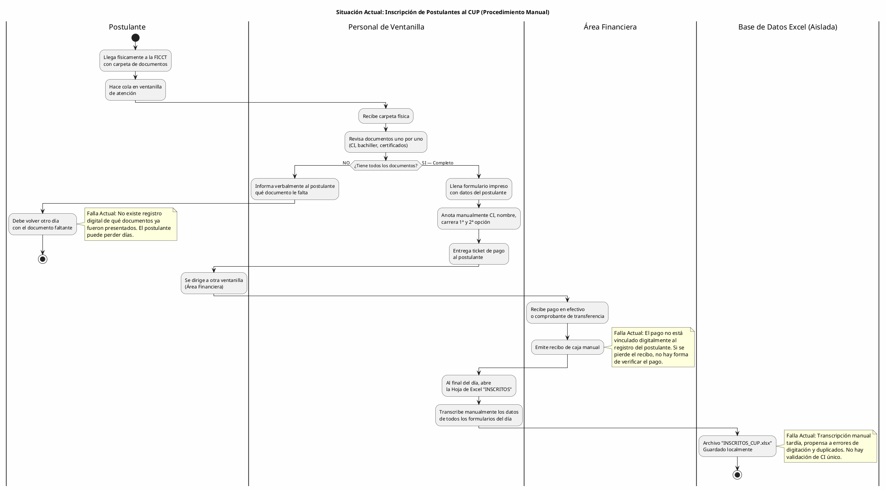

---

## Diagrama 2: Organización de Grupos y Asignación de Docentes (Proceso Manual Actual)

**Herramientas Actuales:** Hojas de Excel, pizarras físicas, reuniones presenciales de coordinación.
**Problema Evidenciado:** Cálculo manual de grupos, asignación descoordinada de docentes, posibilidad de grupos sin docente o docentes sobrecargados.

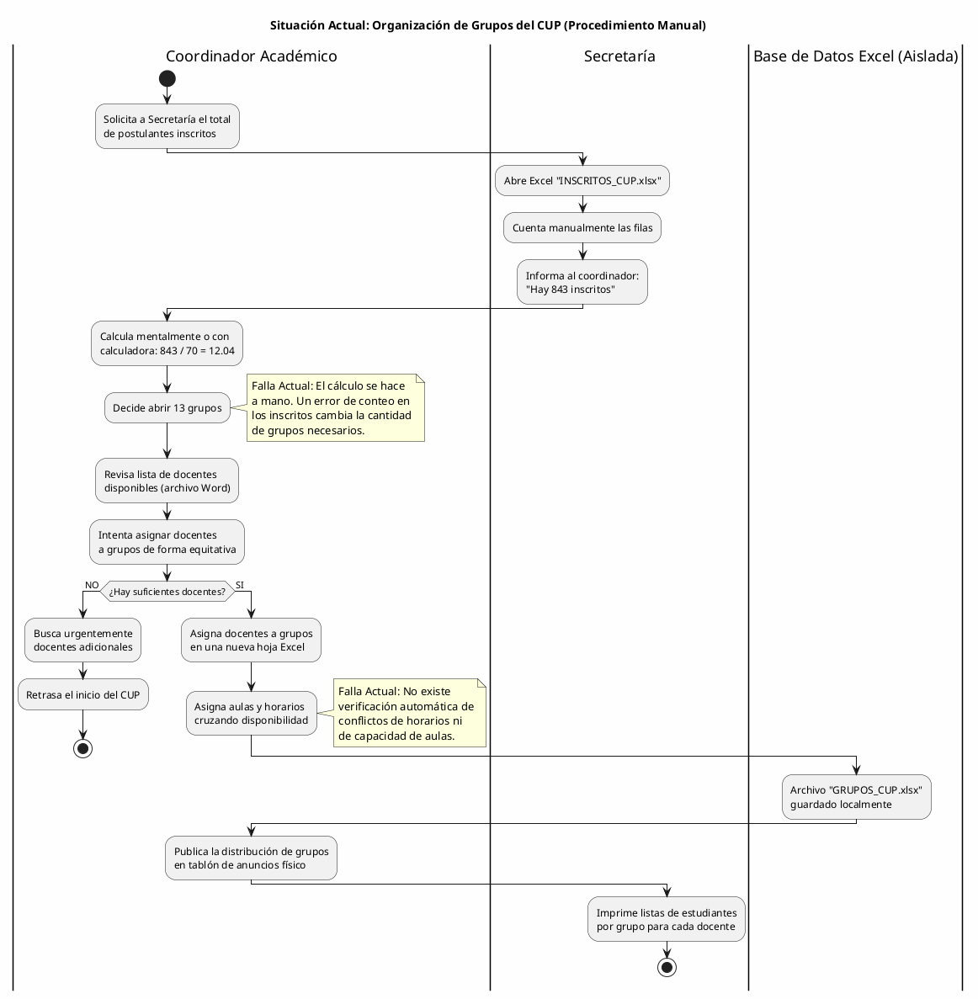

---

## Diagrama 3: Aplicación y Calificación de Exámenes (Proceso Manual Actual)

**Herramientas Actuales:** Exámenes impresos, planillas de notas en papel, Excel para transcripción.
**Problema Evidenciado:** Cálculo manual de promedios ponderados, riesgo de error en fórmulas, demora en publicación de resultados, no se enforce la regla de ≥60 por materia.

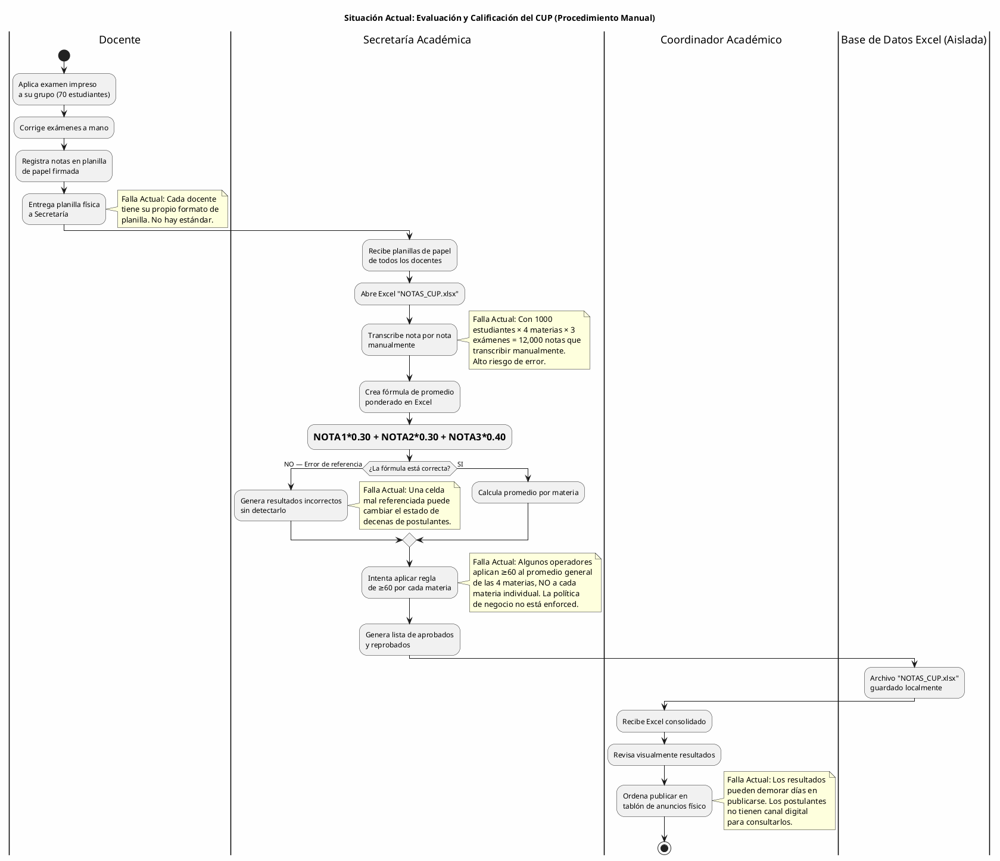

---

## Diagrama 4: Asignación de Carreras y Gestión de Cupos (Proceso Manual Actual)

**Herramientas Actuales:** Hojas de Excel, reuniones administrativas.
**Problema Evidenciado:** Control manual de cupos, riesgo de sobre-asignación, proceso lento que retrasa la admisión formal.

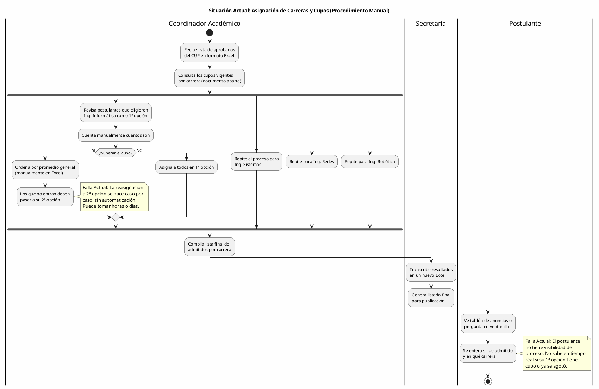

---

## Diagrama 5: Generación de Reportes y Estadísticas (Proceso Manual Actual)

**Herramientas Actuales:** Múltiples archivos Excel no conectados, calculadora.
**Problema Evidenciado:** Imposibilidad de generar reportes consolidados en tiempo real, datos dispersos, dependencia de una persona para compilar información.

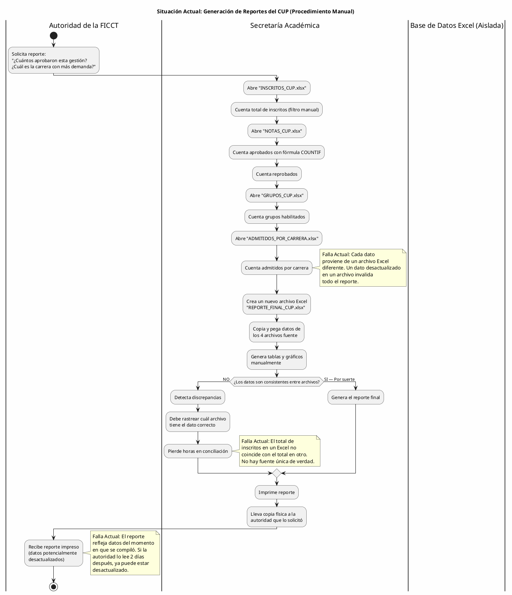

---

## Síntesis del Modelo de Negocio (AS-IS)

Los cinco diagramas de actividad presentados evidencian las siguientes **fallas sistémicas** en el proceso actual de admisión del CUP:

| #   | Falla Identificada                                         | Diagramas donde se evidencia | Impacto                                |
| --- | ---------------------------------------------------------- | ---------------------------- | -------------------------------------- |
| F1  | Inexistencia de un sistema de información integrado        | Todos (DA01-DA05)            | Fragmentación total de datos           |
| F2  | Transcripción manual tardía y propensa a errores           | DA01, DA03, DA05             | Errores de digitación, duplicados      |
| F3  | Pagos sin vinculación digital al expediente del postulante | DA01                         | Pérdida de trazabilidad financiera     |
| F4  | Cálculo manual de grupos sin verificación de conflictos    | DA02                         | Retrasos en inicio del CUP             |
| F5  | Calificación de 12,000+ notas por transcripción manual     | DA03                         | Alto riesgo de error, demoras          |
| F6  | Regla de negocio (≥60/materia) no enforced sistémicamente  | DA03                         | Aprobaciones/reprobaciones incorrectas |
| F7  | Asignación de carreras sin control automático de cupos     | DA04                         | Sobre/sub-asignación de cupos          |
| F8  | Reportes compilados de archivos no conectados              | DA05                         | Datos inconsistentes, desactualizados  |
| F9  | Postulante sin canal digital de consulta                   | DA01, DA03, DA04             | Saturación de ventanillas, ansiedad    |
| F10 | Comunicación informal (tablón de anuncios, ventanilla)     | DA04, DA05                   | Información inoportuna, limitada       |

**Conclusión del diagnóstico AS-IS:** Las 10 fallas identificadas se derivan directa o indirectamente de una sola causa raíz: **la ausencia de un sistema de información integrado y centralizado** para la gestión del CUP. El sistema propuesto resolverá la totalidad de estas fallas mediante la digitalización, automatización y centralización de todos los procesos en una única plataforma web accesible desde cualquier dispositivo con conexión a internet.

---

# 4. CAPÍTULO 1: FLUJO DE TRABAJO — CAPTURA DE REQUISITOS

> **Nota Metodológica (PUDS):** Siguiendo el Proceso Unificado de Desarrollo de Software (Jacobson, Booch, Rumbaugh), el flujo de trabajo de Captura de Requisitos comprende cinco actividades secuenciales: **(1)** Identificar actores y casos de uso, **(2)** Priorizar los casos de uso, **(3)** Detallar cada caso de uso (especificación formal), **(4)** Diseñar prototipos de interfaz de usuario, y **(5)** Estructurar el modelo de casos de uso. Este capítulo documenta cada una de estas actividades aplicadas al Sistema Web de Gestión del CUP para la FICCT.

---

## 4.1 Identificar Actores y Casos de Uso

### 4.1.1 Actores del Sistema

#### A) Actores Internos (Usuarios con acceso al sistema)

1. **Administrador del Sistema:**
   - *Rol Sistémico:* Superusuario con control total sobre la plataforma.
   - *Impacto en Vida Real:* Es el responsable de configurar las gestiones académicas, definir los cupos por carrera, habilitar períodos de inscripción, gestionar usuarios del sistema y supervisar la operación global del CUP. Es el encargado exclusivo de cargar en el sistema las notas de los exámenes de los postulantes. Tiene acceso a todos los módulos sin restricción y puede generar cualquier tipo de reporte. Es el único actor que puede modificar parámetros críticos como las ponderaciones de exámenes (30%-30%-40%), el umbral de aprobación (≥60) y la capacidad máxima por grupo (70 estudiantes).

2. **Coordinador Académico:**
   - *Rol Sistémico:* Supervisor operativo del proceso de admisión.
   - *Impacto en Vida Real:* Supervisa el proceso completo del CUP: revisa la conformación de grupos, valida la asignación de docentes a grupos y materias, ejecuta el algoritmo de asignación de carreras tras la publicación de resultados finales, y monitorea el dashboard estadístico para tomar decisiones informadas sobre cupos y distribución de recursos. Recibe notificaciones automáticas cuando un cupo de carrera se agota o cuando un docente alcanza su carga máxima de 4 grupos.

3. **Docente del CUP:**
   - *Rol Sistémico:* Evaluador académico con acceso restringido a su carga horaria.
   - *Impacto en Vida Real:* Es el responsable de impartir las clases de nivelación a los postulantes de sus grupos asignados. Solo puede visualizar estadísticas de rendimiento de sus grupos. (Se elimina su rol de registrar notas, ya que las evaluaciones se realizan y califican automáticamente por el sistema).

4. **Postulante (Aspirante al CUP):**
   - *Rol Sistémico:* Beneficiario y usuario final del proceso de admisión.
   - *Impacto en Vida Real:* Se registra en el sistema proporcionando sus datos personales, documentación requerida y preferencias de carrera (1ª y 2ª opción). Tras la verificación de requisitos documentales, realiza el pago de inscripción mediante la pasarela Stripe. Una vez inscrito, puede consultar su grupo asignado, horario, notas publicadas y resultado final de admisión. Interactúa con el chatbot para resolver dudas y recibe notificaciones en tiempo real sobre el avance de su trámite.

#### B) Actores Externos (Entidades de soporte)

5. **Pasarela de Pago (Stripe):**
   - *Relación Sistémica:* Servicio externo de procesamiento de pagos.
   - *Impacto en Vida Real:* Procesa las transacciones de pago de matrícula de los postulantes de forma segura, tokenizando los datos de tarjeta. Envía confirmaciones de pago al sistema para actualizar automáticamente el estado del postulante de "Preinscrito" a "Inscrito". Gestiona internamente el cumplimiento PCI DSS.

6. **Servicio de IA (Reconocimiento de Voz / NLP):**
   - *Relación Sistémica:* Servicio externo de procesamiento de lenguaje natural.
   - *Impacto en Vida Real:* Recibe comandos de voz convertidos a texto desde la Web Speech API del navegador, interpreta la intención de la consulta del usuario (autoridad o coordinador), extrae los parámetros (gestión, carrera, estado del postulante) y genera la consulta estructurada correspondiente para obtener los reportes solicitados.

---

### 4.1.2 Lista de Casos de Uso

Derivados estrictamente del bloque de alcance del proyecto (sección 1.4) y de los módulos funcionales definidos, se enuncian los **23 Casos de Uso** que sostendrán el flujo completo del sistema de admisión del CUP:

- **CU01**: Iniciar Sesión en la Plataforma
- **CU02**: Cerrar Sesión Activa
- **CU03**: Recuperar Contraseña por Correo Electrónico
- **CU04**: Gestionar Perfiles de Usuario (CRUD por Administrador)
- **CU05**: Registrar Postulante Nuevo
- **CU06**: Verificar Requisitos Automáticamente (BD Externa SEGIP/SEDUCA)
- **CU07**: Procesar Pago de Matrícula (Pasarela Stripe)
- **CU08**: Detectar Postulante Recurrente por CI
- **CU09**: Buscar y Consultar Postulantes (Filtros Avanzados)
- **CU10**: Calcular y Crear Grupos Automáticamente
- **CU11**: Asignar Postulantes a Grupos
- **CU12**: Asignar Docente a Grupo y Materia
- **CU13**: Registrar Notas de Examen por el Administrador (Individual)
- **CU14**: Cargar Notas Masivamente por el Administrador (CSV/Excel)
- **CU15**: Calcular Promedio Ponderado por Materia
- **CU16**: Determinar Estado del Postulante (Aprobado/Reprobado)
- **CU17**: Ejecutar Asignación de Carreras por Cupo
- **CU18**: Configurar Cupos por Carrera y Gestión
- **CU19**: Generar Reporte Estructurado (Predefinido)
- **CU20**: Generar Reporte Dinámico (Filtros Interactivos)
- **CU21**: Generar Reporte por Comando de Voz (IA)
- **CU22**: Consultar Dashboard Estadístico en Tiempo Real
- **CU23**: Realizar Simulacro de Examen (Práctica)

---

## 4.2 Priorizar Casos de Uso

Siguiendo las directrices del **Proceso Unificado de Desarrollo de Software (Jacobson, Booch, Rumbaugh)**, la construcción del modelo priorizó la mitigación de riesgos arquitectónicos (Architecture-Centric). El flujo de trabajo divide los 23 Casos de Uso en **2 Ciclos Iterativos Incrementales**, alineados con las fechas de presentación establecidas por la cátedra:

| # CU | Caso de Uso                            | Prioridad | Ciclo | Justificación                                                              |
| ---- | -------------------------------------- | --------- | ----- | -------------------------------------------------------------------------- |
| CU01 | Iniciar Sesión                         | Alta      | 1     | Sin autenticación no existe sistema; riesgo arquitectónico fundacional     |
| CU02 | Cerrar Sesión                          | Alta      | 1     | Complemento obligatorio de seguridad de CU01                               |
| CU03 | Recuperar Contraseña                   | Media     | 1     | Dependencia directa de la infraestructura de autenticación                 |
| CU04 | Gestionar Perfiles de Usuario          | Alta      | 1     | Sin gestión de roles, no hay segregación de accesos                        |
| CU05 | Registrar Postulante                   | Alta      | 1     | Caso de uso central del negocio; sin postulantes no hay CUP                |
| CU06 | Verificar Requisitos Documentales      | Alta      | 1     | Precondición obligatoria para el pago (regla de negocio)                   |
| CU07 | Procesar Pago (Stripe)                 | Alta      | 1     | Formaliza la inscripción; dependencia de servicio externo crítico          |
| CU08 | Detectar Postulante Recurrente         | Media     | 1     | Previene duplicados; afecta integridad de datos desde el inicio            |
| CU09 | Buscar Postulantes                     | Media     | 1     | Operación básica de consulta para todos los actores                        |
| CU10 | Calcular y Crear Grupos                | Alta      | 1     | Algoritmo central: CEIL(inscritos/70); habilita la organización académica  |
| CU11 | Asignar Postulantes a Grupos           | Alta      | 1     | Dependencia directa de CU10; completa el flujo de inscripción              |
| CU12 | Asignar Docente a Grupo                | Alta      | 1     | Sin docentes asignados, no hay quién evalúe                                |
| CU13 | Registrar Notas (Administrador)        | Alta      | 2     | Núcleo de la gestión académica del CUP                                     |
| CU14 | Cargar Notas Masivas (CSV)             | Media     | 2     | Optimización operativa para volúmenes de 500-1000 estudiantes              |
| CU15 | Calcular Promedio Ponderado            | Alta      | 2     | Regla de negocio central: ponderación 30%-30%-40%                          |
| CU16 | Determinar Estado (Aprobado/Reprobado) | Alta      | 2     | Regla de negocio crítica: ≥60 por CADA materia individualmente             |
| CU17 | Asignación de Carreras por Cupo        | Alta      | 2     | Lógica final de admisión; depende de CU16 completado                       |
| CU18 | Configurar Cupos por Carrera           | Media     | 2     | Prerrequisito configurable de CU17                                         |
| CU19 | Reporte Estructurado                   | Alta      | 2     | Entregable obligatorio de visibilidad para autoridades                     |
| CU20 | Reporte Dinámico                       | Media     | 2     | Extensión de CU19 con filtros interactivos                                 |
| CU21 | Reporte por Voz (IA)                   | Baja      | 2     | Funcionalidad diferenciadora; depende de servicio externo                  |
| CU22 | Dashboard Estadístico                  | Alta      | 2     | Panel consolidado para toma de decisiones                                  |
| CU23 | Realizar Simulacro                     | Baja      | 1     | Funcionalidad de práctica para el postulante; no afecta evaluación oficial |

### Distribución por Ciclo

**Ciclo #1 — Arquitectura Base, Autenticación e Inscripción (Presentación 1 — 31 de mayo)**

> **Justificación (PUDS):** Mitiga el riesgo arquitectónico fundacional. Sin seguridad, registro de postulantes y organización de grupos, no existe proceso de admisión operable. Este ciclo implementa la columna vertebral del sistema.

- **Actores Implicados:** Administrador, Coordinador, Postulante, Pasarela Stripe.
- **Casos de Uso:** CU01, CU02, CU03, CU04, CU05, CU06, CU07, CU08, CU09, CU10, CU11, CU12, CU23 (13 CU).

**Ciclo #2 — Gestión Académica, Reportes y Admisión (Presentación 2 — 9 de junio)**

> **Justificación (PUDS):** Construye sobre la base arquitectónica estable del Ciclo 1. Implementa la lógica de evaluación, las reglas de negocio de aprobación, la asignación final de carreras y la capa de inteligencia analítica.

- **Actores Implicados:** Docente, Coordinador, Administrador, Servicio de IA.
- **Casos de Uso:** CU13, CU14, CU15, CU16, CU17, CU18, CU19, CU20, CU21, CU22 (10 CU).

---

## 4.3 Especificación Detallada de Casos de Uso

### 4.3.1 CICLO 1: Arquitectura Base, Autenticación e Inscripción

#### CU01: Iniciar Sesión en la Plataforma

**A. Estructura del Modelo de CU (Diagrama Específico)**

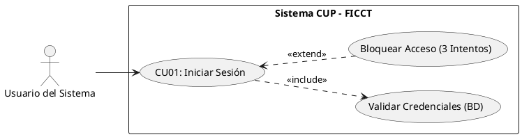

**B. Ficha de Especificación del Caso de Uso**

| Campo               | Descripción                                                                                                                                                                                                                                                                                                                                                                                                                                                                                                                                                                                                            |
| ------------------- | ---------------------------------------------------------------------------------------------------------------------------------------------------------------------------------------------------------------------------------------------------------------------------------------------------------------------------------------------------------------------------------------------------------------------------------------------------------------------------------------------------------------------------------------------------------------------------------------------------------------------- |
| **CASO DE USO**     | CU01 — Iniciar Sesión en la Plataforma.                                                                                                                                                                                                                                                                                                                                                                                                                                                                                                                                                                                |
| **PROPÓSITO**       | Restringir y asegurar el acceso al sistema, autenticando la identidad del usuario según su rol asignado.                                                                                                                                                                                                                                                                                                                                                                                                                                                                                                               |
| **DESCRIPCIÓN**     | Permite que un usuario registrado (Administrador, Coordinador, Docente o Postulante) ingrese sus credenciales para acceder al panel correspondiente a su perfil. El sistema valida las credenciales contra la base de datos, genera un token JWT de sesión y redirige al usuario al módulo apropiado según su rol.                                                                                                                                                                                                                                                                                                     |
| **ACTORES**         | Tablas de BD (`usuarios`, `roles`, `bitacora_accesos`).                                                                                                                                                                                                                                                                                                                                                                                                                                                                                                                                                                |
| **ACTOR INICIADOR** | Cualquier usuario registrado del sistema.                                                                                                                                                                                                                                                                                                                                                                                                                                                                                                                                                                              |
| **PRECONDICIÓN**    | El usuario debe existir en la tabla `usuarios` con estado "Activo".                                                                                                                                                                                                                                                                                                                                                                                                                                                                                                                                                    |
| **FLUJO PRINCIPAL** | 1. El actor ingresa a la URL base del sistema CUP-FICCT. 2. El sistema despliega el formulario de inicio de sesión. 3. El actor introduce su correo electrónico y contraseña. 4. El sistema encripta la contraseña con bcrypt y verifica la coincidencia del hash en la BD. 5. El sistema detecta coincidencia y extrae el rol del usuario. 6. El sistema registra en `bitacora_accesos` la fecha, hora e IP del ingreso (acción: `LOGIN`). 7. El sistema genera un token JWT con expiración configurable y lo almacena en el navegador. 8. El sistema redirige al actor al panel de control correspondiente a su rol. |
| **POST CONDICIÓN**  | El usuario queda autenticado con su sesión activa. La bitácora conserva el registro inmutable del acceso.                                                                                                                                                                                                                                                                                                                                                                                                                                                                                                              |
| **EXCEPCIONES**     | *E1: Credenciales Inválidas.* El sistema incrementa el contador de intentos fallidos y notifica "Credenciales incorrectas". *E2: Usuario Inactivo/Bloqueado.* El sistema detiene el acceso con la alerta: "Su cuenta ha sido deshabilitada. Contacte al administrador". *E3: Bloqueo por 3 intentos fallidos.* Se bloquea el acceso temporalmente y se habilita el enlace "¿Olvidó su contraseña?" que redirige a CU03.                                                                                                                                                                                                |

**C. Prototipo UI (Directriz)**

> Pantalla de login dividida 50/50. Lado izquierdo: imagen institucional de la FICCT con el escudo de la UAGRM. Lado derecho: formulario limpio con logo del sistema, título "Sistema de Admisión CUP — FICCT", campo de correo electrónico, campo de contraseña (protegido), botón principal "INGRESAR" en azul institucional y enlace discreto "¿Olvidó su contraseña?".

---

#### CU02: Cerrar Sesión Activa

**A. Estructura del Modelo de CU (Diagrama Específico)**

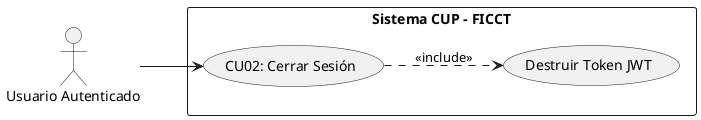

**B. Ficha de Especificación del Caso de Uso**

| Campo               | Descripción                                                                                                                                                                                                                                                                                                                                                                                            |
| ------------------- | ------------------------------------------------------------------------------------------------------------------------------------------------------------------------------------------------------------------------------------------------------------------------------------------------------------------------------------------------------------------------------------------------------ |
| **CASO DE USO**     | CU02 — Cerrar Sesión Activa.                                                                                                                                                                                                                                                                                                                                                                           |
| **PROPÓSITO**       | Revocar el acceso temporal del usuario al sistema para prevenir manipulaciones no autorizadas.                                                                                                                                                                                                                                                                                                         |
| **DESCRIPCIÓN**     | Permite que cualquier usuario finalice su sesión, ejecutando la destrucción inmediata del token JWT y limpiando la caché del navegador.                                                                                                                                                                                                                                                                |
| **ACTORES**         | Tablas de BD (`usuarios`, `bitacora_accesos`).                                                                                                                                                                                                                                                                                                                                                         |
| **ACTOR INICIADOR** | Cualquier usuario autenticado.                                                                                                                                                                                                                                                                                                                                                                         |
| **PRECONDICIÓN**    | El usuario debe tener una sesión activa (CU01 ejecutado).                                                                                                                                                                                                                                                                                                                                              |
| **FLUJO PRINCIPAL** | 1. El actor despliega el menú de perfil en la barra de navegación. 2. El actor hace clic en "Cerrar Sesión". 3. El sistema solicita confirmación: "¿Desea cerrar su sesión?". 4. El actor confirma. 5. El sistema registra en `bitacora_accesos` la acción `LOGOUT` con fecha, hora e IP. 6. El sistema destruye el token JWT y limpia la caché. 7. El sistema redirige a la pantalla de login (CU01). |
| **POST CONDICIÓN**  | Ninguna ruta interna del sistema es accesible sin volver a autenticarse.                                                                                                                                                                                                                                                                                                                               |
| **EXCEPCIONES**     | *E1: Cierre automático por inactividad (Timeout).* Si el usuario no interactúa durante 30 minutos, el sistema ejecuta un auto-logout registrando `LOGOUT_TIMEOUT` en la bitácora.                                                                                                                                                                                                                      |

---

#### CU03: Recuperar Contraseña por Correo Electrónico

**B. Ficha de Especificación del Caso de Uso**

| Campo               | Descripción                                                                                                                                                                                                                                                                                                                                                                                                                                                                                                                                                                                                                                                                                                                                                                       |
| ------------------- | --------------------------------------------------------------------------------------------------------------------------------------------------------------------------------------------------------------------------------------------------------------------------------------------------------------------------------------------------------------------------------------------------------------------------------------------------------------------------------------------------------------------------------------------------------------------------------------------------------------------------------------------------------------------------------------------------------------------------------------------------------------------------------- |
| **CASO DE USO**     | CU03 — Recuperar Contraseña por Correo Electrónico.                                                                                                                                                                                                                                                                                                                                                                                                                                                                                                                                                                                                                                                                                                                               |
| **PROPÓSITO**       | Permitir que un usuario que olvidó su contraseña pueda restablecerla de forma segura sin intervención del administrador.                                                                                                                                                                                                                                                                                                                                                                                                                                                                                                                                                                                                                                                          |
| **DESCRIPCIÓN**     | El usuario solicita un enlace de restablecimiento ingresando su correo registrado. El sistema envía un token temporal de un solo uso al correo indicado. Al hacer clic en el enlace, el usuario es redirigido a un formulario donde establece su nueva contraseña cumpliendo las políticas de seguridad.                                                                                                                                                                                                                                                                                                                                                                                                                                                                          |
| **ACTORES**         | Tablas de BD (`usuarios`), Servicio SMTP de correo.                                                                                                                                                                                                                                                                                                                                                                                                                                                                                                                                                                                                                                                                                                                               |
| **ACTOR INICIADOR** | Cualquier usuario registrado.                                                                                                                                                                                                                                                                                                                                                                                                                                                                                                                                                                                                                                                                                                                                                     |
| **PRECONDICIÓN**    | El correo electrónico debe existir en la tabla `usuarios` con estado "Activo".                                                                                                                                                                                                                                                                                                                                                                                                                                                                                                                                                                                                                                                                                                    |
| **FLUJO PRINCIPAL** | 1. El actor hace clic en "¿Olvidó su contraseña?" en la pantalla de login. 2. El sistema despliega un formulario solicitando el correo electrónico. 3. El actor ingresa su correo y presiona "Enviar enlace". 4. El sistema verifica que el correo exista en la BD. 5. El sistema genera un token de restablecimiento (válido 1 hora) y lo envía al correo. 6. El actor accede a su correo, hace clic en el enlace recibido. 7. El sistema valida el token y despliega el formulario de nueva contraseña. 8. El actor ingresa la nueva contraseña (mínimo 8 caracteres, mayúsculas, minúsculas y números) y la confirma. 9. El sistema actualiza el hash en la BD e invalida el token usado. 10. El sistema redirige al login con mensaje: "Contraseña actualizada exitosamente". |
| **POST CONDICIÓN**  | La contraseña anterior queda invalidada. El token utilizado no puede reutilizarse.                                                                                                                                                                                                                                                                                                                                                                                                                                                                                                                                                                                                                                                                                                |
| **EXCEPCIONES**     | *E1: Correo no registrado.* El sistema muestra un mensaje genérico (por seguridad): "Si el correo existe en nuestro sistema, recibirá un enlace de recuperación". *E2: Token expirado.* El sistema muestra: "Este enlace ha expirado. Solicite uno nuevo".                                                                                                                                                                                                                                                                                                                                                                                                                                                                                                                        |

---

#### CU04: Gestionar Perfiles de Usuario (CRUD por Administrador)

**B. Ficha de Especificación del Caso de Uso**

| Campo               | Descripción                                                                                                                                                                                                                                                                                                                                                                                                                                                                                                                                                         |
| ------------------- | ------------------------------------------------------------------------------------------------------------------------------------------------------------------------------------------------------------------------------------------------------------------------------------------------------------------------------------------------------------------------------------------------------------------------------------------------------------------------------------------------------------------------------------------------------------------- |
| **CASO DE USO**     | CU04 — Gestionar Perfiles de Usuario.                                                                                                                                                                                                                                                                                                                                                                                                                                                                                                                               |
| **PROPÓSITO**       | Permitir al Administrador crear, consultar, modificar y desactivar cuentas de usuario del sistema, asignando roles diferenciados.                                                                                                                                                                                                                                                                                                                                                                                                                                   |
| **DESCRIPCIÓN**     | El Administrador gestiona los usuarios del sistema (coordinadores, docentes y postulantes) desde un panel CRUD centralizado. Cada usuario se crea con un rol específico que determina su nivel de acceso. Las eliminaciones son lógicas (soft delete) para preservar la integridad referencial histórica.                                                                                                                                                                                                                                                           |
| **ACTORES**         | Tablas de BD (`usuarios`, `roles`).                                                                                                                                                                                                                                                                                                                                                                                                                                                                                                                                 |
| **ACTOR INICIADOR** | Administrador del Sistema.                                                                                                                                                                                                                                                                                                                                                                                                                                                                                                                                          |
| **PRECONDICIÓN**    | El Administrador debe estar autenticado (CU01).                                                                                                                                                                                                                                                                                                                                                                                                                                                                                                                     |
| **FLUJO PRINCIPAL** | 1. El Administrador ingresa al módulo "Gestión de Usuarios". 2. El sistema despliega la grilla de usuarios con filtros por rol y estado. 3. Para **crear**: presiona "+ Nuevo Usuario", completa nombre, correo, CI, rol y presiona "Guardar". El sistema genera credenciales temporales y envía un correo de activación. 4. Para **editar**: selecciona un usuario existente, modifica los campos necesarios y guarda. 5. Para **desactivar**: presiona "Desactivar" y confirma. El sistema cambia el estado a "Inactivo" e invalida la sesión activa del usuario. |
| **POST CONDICIÓN**  | El usuario creado/modificado refleja inmediatamente los cambios en sus permisos de acceso.                                                                                                                                                                                                                                                                                                                                                                                                                                                                          |
| **EXCEPCIONES**     | *E1: CI duplicado.* "Este CI ya está registrado en el sistema". *E2: Correo duplicado.* "Este correo electrónico ya pertenece a otro usuario". *E3: Auto-desactivación bloqueada.* Si es el único administrador activo, el sistema impide la operación.                                                                                                                                                                                                                                                                                                             |

---

#### CU05: Registrar Postulante Nuevo

**A. Estructura del Modelo de CU (Diagrama Específico)**

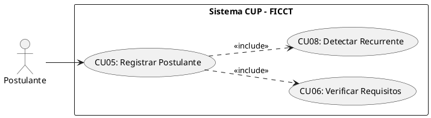

**B. Ficha de Especificación del Caso de Uso**

| Campo               | Descripción                                                                                                                                                                                                                                                                                                                                                                                                                                                                                                                                                                                                                                                                                                                                                                                                                                                                                                                                                                                                                              |
| ------------------- | ---------------------------------------------------------------------------------------------------------------------------------------------------------------------------------------------------------------------------------------------------------------------------------------------------------------------------------------------------------------------------------------------------------------------------------------------------------------------------------------------------------------------------------------------------------------------------------------------------------------------------------------------------------------------------------------------------------------------------------------------------------------------------------------------------------------------------------------------------------------------------------------------------------------------------------------------------------------------------------------------------------------------------------------- |
| **CASO DE USO**     | CU05 — Registrar Postulante Nuevo.                                                                                                                                                                                                                                                                                                                                                                                                                                                                                                                                                                                                                                                                                                                                                                                                                                                                                                                                                                                                       |
| **PROPÓSITO**       | Capturar los datos personales y académicos del aspirante al CUP, generando su expediente digital en el sistema.                                                                                                                                                                                                                                                                                                                                                                                                                                                                                                                                                                                                                                                                                                                                                                                                                                                                                                                          |
| **DESCRIPCIÓN**     | El postulante ingresa al sistema y completa un formulario de registro con sus datos personales, información académica, documentación requerida y selección de carreras (1ª y 2ª opción). Antes de procesar el registro, el sistema verifica automáticamente si el CI ya existe en la BD (postulante recurrente) para mantener el código original y no duplicar registros.                                                                                                                                                                                                                                                                                                                                                                                                                                                                                                                                                                                                                                                                |
| **ACTORES**         | Tablas de BD (`postulantes`, `carreras`, `requisitos_documentales`).                                                                                                                                                                                                                                                                                                                                                                                                                                                                                                                                                                                                                                                                                                                                                                                                                                                                                                                                                                     |
| **ACTOR INICIADOR** | Postulante.                                                                                                                                                                                                                                                                                                                                                                                                                                                                                                                                                                                                                                                                                                                                                                                                                                                                                                                                                                                                                              |
| **PRECONDICIÓN**    | El período de inscripción debe estar abierto (configurado por el Administrador).                                                                                                                                                                                                                                                                                                                                                                                                                                                                                                                                                                                                                                                                                                                                                                                                                                                                                                                                                         |
| **FLUJO PRINCIPAL** | 1. El postulante accede al portal de inscripción del CUP. 2. El sistema despliega el formulario de registro con los campos: CI, nombres, apellidos, fecha de nacimiento, sexo, dirección, ciudad, teléfono, correo electrónico, colegio de procedencia, 1ª opción de carrera, 2ª opción de carrera. 3. El postulante completa los campos y adjunta los documentos digitalizados requeridos. 4. El sistema ejecuta `<<include>> CU08`: verifica si el CI ya existe. Si es recurrente, recupera el código original. 5. El sistema valida que el correo tenga formato válido, que la 1ª y 2ª opción de carrera sean diferentes, y que todos los campos obligatorios estén completos. 6. El sistema ejecuta `<<include>> CU06`: despliega el checklist de requisitos documentales. 7. El sistema genera un código único de postulante (si es nuevo) y registra el estado como "Preinscrito". 8. El sistema confirma: "Registro exitoso. Su código de postulante es: [código]. Complete la verificación de requisitos para proceder al pago". |
| **POST CONDICIÓN**  | El postulante existe en la BD con estado "Preinscrito". No puede avanzar al pago hasta completar la verificación de requisitos (CU06).                                                                                                                                                                                                                                                                                                                                                                                                                                                                                                                                                                                                                                                                                                                                                                                                                                                                                                   |
| **EXCEPCIONES**     | *E1: Período de inscripción cerrado.* "El período de inscripción para la gestión [X] no está habilitado". *E2: Correo ya registrado.* "Este correo electrónico ya está asociado a otro postulante". *E3: Misma carrera en ambas opciones.* "La 1ª y 2ª opción de carrera deben ser diferentes".                                                                                                                                                                                                                                                                                                                                                                                                                                                                                                                                                                                                                                                                                                                                          |

---

#### CU06: Verificar Requisitos Automáticamente (BD Externa SEGIP/SEDUCA)

**B. Ficha de Especificación del Caso de Uso**

| Campo               | Descripción                                                                                                                                                                                                                                                                                                                                                                                                                                                    |
| ------------------- | -------------------------------------------------------------------------------------------------------------------------------------------------------------------------------------------------------------------------------------------------------------------------------------------------------------------------------------------------------------------------------------------------------------------------------------------------------------- |
| **CASO DE USO**     | CU06 — Verificar Requisitos Automáticamente (BD Externa).                                                                                                                                                                                                                                                                                                                                                                                                      |
| **PROPÓSITO**       | Garantizar la veracidad de la identidad y el título de bachiller del postulante conectándose a una base de datos externa, antes de habilitarlo para el pago.                                                                                                                                                                                                                                                                                                   |
| **DESCRIPCIÓN**     | El sistema realiza una consulta automática a los servicios web del SEGIP y SEDUCA utilizando los datos ingresados por el postulante en su preinscripción. Si los datos retornados validan su identidad y la emisión de su título de bachiller, el sistema habilita automáticamente el botón de pago (CU07) sin requerir intervención manual.                                                                                                                   |
| **ACTORES**         | API SEGIP, API SEDUCA, Tablas de BD (`postulantes`).                                                                                                                                                                                                                                                                                                                                                                                                           |
| **ACTOR INICIADOR** | Sistema (invocado automáticamente tras registro).                                                                                                                                                                                                                                                                                                                                                                                                              |
| **PRECONDICIÓN**    | El postulante debe estar registrado (CU05 ejecutado) con estado "Preinscrito".                                                                                                                                                                                                                                                                                                                                                                                 |
| **FLUJO PRINCIPAL** | 1. El sistema toma el CI y fecha de nacimiento del postulante. 2. Ejecuta una petición HTTP a la API del SEGIP para validar identidad. 3. Ejecuta una petición a la API del SEDUCA para verificar la emisión del título de bachiller. 4. Si ambas APIs retornan confirmación positiva, el sistema marca los requisitos como "Validados Automáticamente". 5. El sistema habilita el botón "Proceder al Pago" y actualiza el estado del postulante a verificado. |
| **POST CONDICIÓN**  | El postulante puede acceder al CU07 (pago). La validación queda registrada en el sistema sin intervención humana.                                                                                                                                                                                                                                                                                                                                              |
| **EXCEPCIONES**     | *E1: Datos no coinciden en SEGIP/SEDUCA.* El sistema notifica: "No se pudo validar su información automáticamente. Por favor, acérquese a las oficinas para verificación manual". *E2: API externa caída.* El sistema reintenta la validación y notifica posteriormente.                                                                                                                                                                                       |

---

#### CU07: Procesar Pago de Matrícula (Pasarela Stripe)

**A. Estructura del Modelo de CU (Diagrama Específico)**

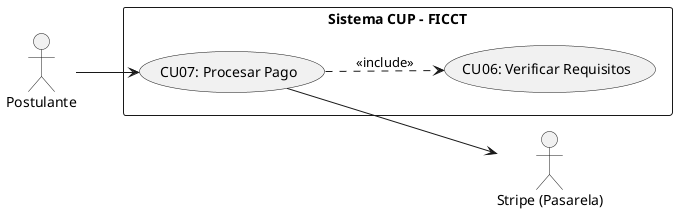

**B. Ficha de Especificación del Caso de Uso**

| Campo               | Descripción                                                                                                                                                                                                                                                                                                                                                                                                                                                                                                                                                                                                                                                                                                          |
| ------------------- | -------------------------------------------------------------------------------------------------------------------------------------------------------------------------------------------------------------------------------------------------------------------------------------------------------------------------------------------------------------------------------------------------------------------------------------------------------------------------------------------------------------------------------------------------------------------------------------------------------------------------------------------------------------------------------------------------------------------- |
| **CASO DE USO**     | CU07 — Procesar Pago de Matrícula mediante Pasarela Stripe.                                                                                                                                                                                                                                                                                                                                                                                                                                                                                                                                                                                                                                                          |
| **PROPÓSITO**       | Formalizar la inscripción del postulante mediante el pago electrónico seguro de la matrícula del CUP.                                                                                                                                                                                                                                                                                                                                                                                                                                                                                                                                                                                                                |
| **DESCRIPCIÓN**     | Una vez que todos los requisitos documentales han sido verificados (CU06), el postulante procede al pago de la matrícula a través de la pasarela Stripe. El sistema gestiona la sesión de pago (Checkout Session), recibe la confirmación mediante webhook y actualiza automáticamente el estado del postulante de "Preinscrito" a "Inscrito".                                                                                                                                                                                                                                                                                                                                                                       |
| **ACTORES**         | Tablas de BD (`pagos`, `postulantes`), Stripe API.                                                                                                                                                                                                                                                                                                                                                                                                                                                                                                                                                                                                                                                                   |
| **ACTOR INICIADOR** | Postulante.                                                                                                                                                                                                                                                                                                                                                                                                                                                                                                                                                                                                                                                                                                          |
| **PRECONDICIÓN**    | Todos los requisitos documentales del postulante deben estar marcados como "Cumplido" (CU06 completado).                                                                                                                                                                                                                                                                                                                                                                                                                                                                                                                                                                                                             |
| **FLUJO PRINCIPAL** | 1. El postulante presiona el botón "Proceder al Pago". 2. El sistema verifica que todos los requisitos estén cumplidos (`<<include>> CU06`). 3. El sistema crea una Checkout Session en Stripe con el monto de la matrícula. 4. El sistema redirige al postulante a la página segura de Stripe. 5. El postulante ingresa los datos de su tarjeta y confirma el pago. 6. Stripe procesa la transacción y envía un webhook de confirmación al backend. 7. El sistema registra el pago en la tabla `pagos` (ID transacción Stripe, monto, fecha, estado). 8. El sistema actualiza el estado del postulante a "Inscrito". 9. El sistema envía una notificación en tiempo real y un correo de confirmación al postulante. |
| **POST CONDICIÓN**  | El postulante queda con estado "Inscrito" y está habilitado para ser asignado a un grupo (CU11). El pago queda registrado con trazabilidad completa.                                                                                                                                                                                                                                                                                                                                                                                                                                                                                                                                                                 |
| **EXCEPCIONES**     | *E1: Pago rechazado por Stripe.* El sistema muestra: "El pago no pudo ser procesado. Verifique los datos de su tarjeta o intente con otro medio de pago". El estado del postulante no cambia. *E2: Webhook no recibido.* El sistema implementa un mecanismo de verificación de estado de pago con Stripe cada 5 minutos para reconciliar transacciones pendientes.                                                                                                                                                                                                                                                                                                                                                   |

---

#### CU08: Detectar Postulante Recurrente por CI

**B. Ficha de Especificación del Caso de Uso**

| Campo               | Descripción                                                                                                                                                                                                                                                                                                                                                                                                                                                                                                                                                                                                                                                              |
| ------------------- | ------------------------------------------------------------------------------------------------------------------------------------------------------------------------------------------------------------------------------------------------------------------------------------------------------------------------------------------------------------------------------------------------------------------------------------------------------------------------------------------------------------------------------------------------------------------------------------------------------------------------------------------------------------------------ |
| **CASO DE USO**     | CU08 — Detectar Postulante Recurrente por CI.                                                                                                                                                                                                                                                                                                                                                                                                                                                                                                                                                                                                                            |
| **PROPÓSITO**       | Identificar automáticamente a postulantes que ya intentaron ingresar en gestiones anteriores, preservando su código original y su historial.                                                                                                                                                                                                                                                                                                                                                                                                                                                                                                                             |
| **DESCRIPCIÓN**     | Cuando un postulante ingresa su CI durante el registro (CU05), el sistema consulta la tabla `postulantes` para verificar si ya existe un registro previo. Si se detecta un postulante recurrente, el sistema recupera su código original, su historial de intentos y le permite reutilizar sus datos personales, requiriendo únicamente un nuevo pago.                                                                                                                                                                                                                                                                                                                   |
| **ACTORES**         | Tablas de BD (`postulantes`).                                                                                                                                                                                                                                                                                                                                                                                                                                                                                                                                                                                                                                            |
| **ACTOR INICIADOR** | Sistema (invocado automáticamente desde CU05).                                                                                                                                                                                                                                                                                                                                                                                                                                                                                                                                                                                                                           |
| **PRECONDICIÓN**    | El CI ingresado debe tener formato válido.                                                                                                                                                                                                                                                                                                                                                                                                                                                                                                                                                                                                                               |
| **FLUJO PRINCIPAL** | 1. El sistema recibe el CI ingresado por el postulante en el formulario de registro. 2. El sistema ejecuta una consulta a la BD buscando coincidencia exacta de CI. 3. Si NO existe: el sistema continúa con el flujo normal de CU05 (nuevo registro). 4. Si SÍ existe: el sistema notifica: "Se detectó un registro previo con este CI. Código de postulante: [código original]". 5. El sistema recupera los datos personales del postulante y los precarga en el formulario. 6. El postulante puede actualizar sus datos y seleccionar nuevas opciones de carrera. 7. El sistema marca la bandera `postulante_recurrente = TRUE` e incrementa el contador de intentos. |
| **POST CONDICIÓN**  | El postulante recurrente mantiene su código original. El historial de gestiones previas queda vinculado al mismo registro.                                                                                                                                                                                                                                                                                                                                                                                                                                                                                                                                               |
| **EXCEPCIONES**     | *E1: Postulante con máximo de intentos.* (Configurable) Si la política de la facultad limita los intentos, el sistema verifica el contador y bloquea el nuevo registro si se excede el límite.                                                                                                                                                                                                                                                                                                                                                                                                                                                                           |

---

#### CU09: Buscar y Consultar Postulantes (Filtros Avanzados)

**B. Ficha de Especificación del Caso de Uso**

| Campo               | Descripción                                                                                                                                                                                                                                                                                                                                                                           |
| ------------------- | ------------------------------------------------------------------------------------------------------------------------------------------------------------------------------------------------------------------------------------------------------------------------------------------------------------------------------------------------------------------------------------- |
| **CASO DE USO**     | CU09 — Buscar y Consultar Postulantes con Filtros Avanzados.                                                                                                                                                                                                                                                                                                                          |
| **PROPÓSITO**       | Proveer a los actores administrativos visibilidad completa del universo de postulantes con capacidad de búsqueda y filtrado multidimensional.                                                                                                                                                                                                                                         |
| **DESCRIPCIÓN**     | Permite buscar postulantes por CI, nombre, carrera, estado, gestión y grupo asignado. Los resultados se presentan en una grilla paginada con opciones de exportación. Cada actor ve solo los datos que su rol le autoriza (el docente ve solo los postulantes de sus grupos).                                                                                                         |
| **ACTORES**         | Tablas de BD (`postulantes`, `grupos`, `carreras`).                                                                                                                                                                                                                                                                                                                                   |
| **ACTOR INICIADOR** | Administrador, Coordinador, Docente (con restricción de carga).                                                                                                                                                                                                                                                                                                                       |
| **PRECONDICIÓN**    | El actor debe estar autenticado con rol autorizado.                                                                                                                                                                                                                                                                                                                                   |
| **FLUJO PRINCIPAL** | 1. El actor ingresa al módulo "Postulantes". 2. El sistema despliega la grilla paginada con los postulantes (filtrados por rol). 3. El actor utiliza la barra de búsqueda o los filtros avanzados (CI, nombre, carrera, estado, gestión, grupo). 4. El sistema retorna los resultados coincidentes en tiempo real. 5. El actor puede exportar los resultados filtrados a PDF o Excel. |
| **POST CONDICIÓN**  | Operación de solo lectura. Ningún dato es modificado.                                                                                                                                                                                                                                                                                                                                 |
| **EXCEPCIONES**     | *E1: Sin resultados.* "No se encontraron postulantes con los criterios especificados".                                                                                                                                                                                                                                                                                                |

---

#### CU10: Calcular y Crear Grupos Automáticamente

**A. Estructura del Modelo de CU (Diagrama Específico)**

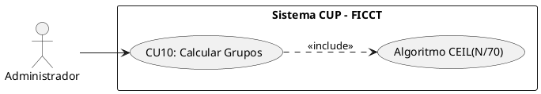

**B. Ficha de Especificación del Caso de Uso**

| Campo               | Descripción                                                                                                                                                                                                                                                                                                                                                                                                                                                                                                                                                                                                 |
| ------------------- | ----------------------------------------------------------------------------------------------------------------------------------------------------------------------------------------------------------------------------------------------------------------------------------------------------------------------------------------------------------------------------------------------------------------------------------------------------------------------------------------------------------------------------------------------------------------------------------------------------------- |
| **CASO DE USO**     | CU10 — Calcular y Crear Grupos Automáticamente.                                                                                                                                                                                                                                                                                                                                                                                                                                                                                                                                                             |
| **PROPÓSITO**       | Determinar la cantidad óptima de grupos necesarios para albergar a todos los postulantes inscritos, respetando el límite máximo de 70 estudiantes por grupo.                                                                                                                                                                                                                                                                                                                                                                                                                                                |
| **DESCRIPCIÓN**     | El Administrador ejecuta el algoritmo de creación de grupos una vez que el período de inscripción ha cerrado. El sistema aplica la fórmula `CEIL(Total_Inscritos / 70)` para calcular la cantidad de grupos, crea los registros correspondientes en la BD y asigna turnos (Mañana/Tarde/Noche) de forma equitativa.                                                                                                                                                                                                                                                                                         |
| **ACTORES**         | Tablas de BD (`grupos`, `aulas`, `postulantes`).                                                                                                                                                                                                                                                                                                                                                                                                                                                                                                                                                            |
| **ACTOR INICIADOR** | Administrador del Sistema.                                                                                                                                                                                                                                                                                                                                                                                                                                                                                                                                                                                  |
| **PRECONDICIÓN**    | El período de inscripción debe haber cerrado. Debe haber al menos 1 postulante con estado "Inscrito".                                                                                                                                                                                                                                                                                                                                                                                                                                                                                                       |
| **FLUJO PRINCIPAL** | 1. El Administrador ingresa al módulo "Gestión de Grupos" y presiona "Calcular Grupos". 2. El sistema cuenta el total de postulantes inscritos en la gestión actual. 3. El sistema aplica el algoritmo: `Cantidad_Grupos = CEIL(Total_Inscritos / 70)`. 4. El sistema muestra una previsualización: "Total inscritos: [N]. Grupos necesarios: [G]. ¿Confirmar creación?". 5. El Administrador confirma. 6. El sistema crea los G grupos con número secuencial, asigna turnos rotativamente y establece el estado como "Abierto". 7. El sistema muestra el resumen: "Se han creado [G] grupos exitosamente". |
| **POST CONDICIÓN**  | Los grupos existen en la BD con estado "Abierto", listos para recibir la asignación de postulantes (CU11) y docentes (CU12).                                                                                                                                                                                                                                                                                                                                                                                                                                                                                |
| **EXCEPCIONES**     | *E1: Grupos ya existen para esta gestión.* "Ya se han creado grupos para la gestión [X]. ¿Desea recalcular? (Los grupos existentes serán eliminados solo si no tienen postulantes asignados)". *E2: Cero inscritos.* "No hay postulantes inscritos para calcular grupos".                                                                                                                                                                                                                                                                                                                                   |

**Ejemplo del Algoritmo:**

```
Inscritos = 70   → CEIL(70/70)  = 1 grupo
Inscritos = 71   → CEIL(71/70)  = 2 grupos
Inscritos = 140  → CEIL(140/70) = 2 grupos
Inscritos = 141  → CEIL(141/70) = 3 grupos
Inscritos = 1000 → CEIL(1000/70)= 15 grupos
```

---

#### CU11: Asignar Postulantes a Grupos

**B. Ficha de Especificación del Caso de Uso**

| Campo               | Descripción                                                                                                                                                                                                                                                                                                                                                                                                                                                                                                                          |
| ------------------- | ------------------------------------------------------------------------------------------------------------------------------------------------------------------------------------------------------------------------------------------------------------------------------------------------------------------------------------------------------------------------------------------------------------------------------------------------------------------------------------------------------------------------------------ |
| **CASO DE USO**     | CU11 — Asignar Postulantes a Grupos.                                                                                                                                                                                                                                                                                                                                                                                                                                                                                                 |
| **PROPÓSITO**       | Distribuir equitativamente a los postulantes inscritos entre los grupos creados, garantizando que ningún grupo exceda la capacidad máxima de 70 estudiantes.                                                                                                                                                                                                                                                                                                                                                                         |
| **DESCRIPCIÓN**     | El sistema ejecuta un algoritmo de distribución equitativa que asigna a cada postulante inscrito a un grupo disponible, balanceando la cantidad de estudiantes entre todos los grupos. La asignación puede ser automática (distribución aleatoria balanceada) o manual (reasignación individual por el Administrador).                                                                                                                                                                                                               |
| **ACTORES**         | Tablas de BD (`postulantes`, `grupos`, `asignaciones_grupo`).                                                                                                                                                                                                                                                                                                                                                                                                                                                                        |
| **ACTOR INICIADOR** | Administrador del Sistema.                                                                                                                                                                                                                                                                                                                                                                                                                                                                                                           |
| **PRECONDICIÓN**    | Los grupos deben estar creados (CU10 ejecutado). Debe haber postulantes con estado "Inscrito" sin grupo asignado.                                                                                                                                                                                                                                                                                                                                                                                                                    |
| **FLUJO PRINCIPAL** | 1. El Administrador presiona "Asignar Postulantes a Grupos". 2. El sistema calcula la distribución: `Postulantes_por_Grupo = FLOOR(Total_Inscritos / Total_Grupos)`, distribuyendo el remanente entre los primeros grupos. 3. El sistema muestra la previsualización con la distribución propuesta. 4. El Administrador confirma. 5. El sistema ejecuta la asignación masiva y actualiza el estado de cada postulante a "En Evaluación". 6. El sistema envía una notificación a cada postulante indicando su grupo y turno asignado. |
| **POST CONDICIÓN**  | Todos los postulantes inscritos quedan vinculados a un grupo. Cada grupo muestra su composición actual.                                                                                                                                                                                                                                                                                                                                                                                                                              |
| **EXCEPCIONES**     | *E1: Postulante ya asignado.* El sistema omite los postulantes que ya tienen grupo asignado. *E2: Reasignación manual.* El Administrador puede mover un postulante de un grupo a otro, siempre que el grupo destino no haya alcanzado su capacidad máxima.                                                                                                                                                                                                                                                                           |

---

#### CU12: Asignar Docente a Grupo y Materia

**A. Estructura del Modelo de CU (Diagrama Específico)**

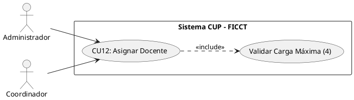

**B. Ficha de Especificación del Caso de Uso**

| Campo               | Descripción                                                                                                                                                                                                                                                                                                                                                                                                                                                                                                                                                                                                                                                                                                                                           |
| ------------------- | ----------------------------------------------------------------------------------------------------------------------------------------------------------------------------------------------------------------------------------------------------------------------------------------------------------------------------------------------------------------------------------------------------------------------------------------------------------------------------------------------------------------------------------------------------------------------------------------------------------------------------------------------------------------------------------------------------------------------------------------------------- |
| **CASO DE USO**     | CU12 — Asignar Docente a Grupo y Materia.                                                                                                                                                                                                                                                                                                                                                                                                                                                                                                                                                                                                                                                                                                             |
| **PROPÓSITO**       | Vincular a cada docente del CUP con los grupos y materias que impartirá, controlando que no exceda su carga máxima de 4 grupos.                                                                                                                                                                                                                                                                                                                                                                                                                                                                                                                                                                                                                       |
| **DESCRIPCIÓN**     | El Administrador o Coordinador selecciona un docente registrado, elige el grupo y la materia a asignar. El sistema verifica automáticamente que el docente no tenga ya 4 grupos asignados y que el grupo no tenga ya un docente para esa materia. Cada grupo requiere 4 docentes (uno por materia: Computación, Matemáticas, Inglés, Física).                                                                                                                                                                                                                                                                                                                                                                                                         |
| **ACTORES**         | Tablas de BD (`docentes`, `grupos`, `asignaciones_docente`).                                                                                                                                                                                                                                                                                                                                                                                                                                                                                                                                                                                                                                                                                          |
| **ACTOR INICIADOR** | Administrador o Coordinador Académico.                                                                                                                                                                                                                                                                                                                                                                                                                                                                                                                                                                                                                                                                                                                |
| **PRECONDICIÓN**    | Los grupos deben existir (CU10). El docente debe estar registrado y activo.                                                                                                                                                                                                                                                                                                                                                                                                                                                                                                                                                                                                                                                                           |
| **FLUJO PRINCIPAL** | 1. El actor ingresa al módulo "Gestión de Docentes" → "Asignaciones". 2. El sistema despliega la lista de docentes activos con su carga actual (grupos asignados / 4). 3. El actor selecciona un docente y presiona "Asignar a Grupo". 4. El sistema despliega los grupos disponibles y las materias sin docente asignado. 5. El actor selecciona el grupo y la materia correspondiente a la especialidad del docente. 6. El sistema verifica que el docente no tenga 4 grupos (carga máxima) y que el grupo no tenga ya un docente para esa materia. 7. El sistema registra la asignación y actualiza la carga horaria del docente. 8. Si el docente alcanza 4 grupos, el sistema muestra una alerta visual y envía una notificación al Coordinador. |
| **POST CONDICIÓN**  | El docente queda vinculado al grupo y materia. Solo podrá ver y evaluar a los postulantes de sus grupos asignados.                                                                                                                                                                                                                                                                                                                                                                                                                                                                                                                                                                                                                                    |
| **EXCEPCIONES**     | *E1: Carga máxima alcanzada.* "El docente [nombre] ya tiene 4 grupos asignados. No puede asumir más grupos". *E2: Grupo ya tiene docente para esa materia.* "El Grupo [N] ya tiene un docente asignado para [materia]". *E3: Especialidad no coincide.* Advertencia: "El docente [nombre] tiene especialidad en [X] pero se le está asignando [Y]. ¿Confirmar?".                                                                                                                                                                                                                                                                                                                                                                                      |

---

#### CU23: Realizar Simulacro de Examen (Práctica)

**A. Estructura del Modelo de CU (Diagrama Específico)**

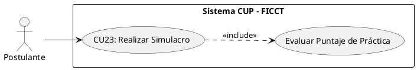

**B. Ficha de Especificación del Caso de Uso**

| Campo               | Descripción                                                                                                                                                                                                                                                                                                                                                                                                                                                                                                                                                                                      |
| ------------------- | ------------------------------------------------------------------------------------------------------------------------------------------------------------------------------------------------------------------------------------------------------------------------------------------------------------------------------------------------------------------------------------------------------------------------------------------------------------------------------------------------------------------------------------------------------------------------------------------------ |
| **CASO DE USO**     | CU23 — Realizar Simulacro de Examen (Práctica).                                                                                                                                                                                                                                                                                                                                                                                                                                                                                                                                                  |
| **PROPÓSITO**       | Proveer al postulante una herramienta de preparación que no afecte su nota oficial, permitiéndole familiarizarse con el formato del examen y medir sus conocimientos previos.                                                                                                                                                                                                                                                                                                                                                                                                                    |
| **DESCRIPCIÓN**     | El postulante inscrito puede acceder a un banco de preguntas aleatorias para las 4 materias. El sistema genera un examen simulado de 40 preguntas, provee un temporizador y al finalizar calcula el puntaje obtenido. Los resultados son puramente informativos y no se guardan en el historial académico oficial del postulante.                                                                                                                                                                                                                                                                |
| **ACTORES**         | Tablas de BD (`preguntas_simulacro`).                                                                                                                                                                                                                                                                                                                                                                                                                                                                                                                                                            |
| **ACTOR INICIADOR** | Postulante.                                                                                                                                                                                                                                                                                                                                                                                                                                                                                                                                                                                      |
| **PRECONDICIÓN**    | El postulante debe tener estado "Inscrito" (CU07 completado).                                                                                                                                                                                                                                                                                                                                                                                                                                                                                                                                    |
| **FLUJO PRINCIPAL** | 1. El postulante ingresa al módulo "Área de Práctica". 2. El sistema despliega las instrucciones del simulacro. 3. El postulante presiona "Iniciar Simulacro". 4. El sistema selecciona aleatoriamente 40 preguntas del banco de preguntas de práctica (10 por cada materia). 5. El sistema muestra la interfaz de examen con un temporizador (ej. 60 minutos). 6. El postulante responde las opciones de selección múltiple. 7. El postulante presiona "Finalizar" o el tiempo expira. 8. El sistema evalúa automáticamente las respuestas y muestra el puntaje obtenido detallado por materia. |
| **POST CONDICIÓN**  | El postulante recibe su retroalimentación. La base de datos de notas oficiales no sufre ninguna alteración.                                                                                                                                                                                                                                                                                                                                                                                                                                                                                      |
| **EXCEPCIONES**     | *E1: Banco de preguntas vacío.* "El módulo de práctica no está disponible en este momento".                                                                                                                                                                                                                                                                                                                                                                                                                                                                                                      |

---

### 4.3.2 CICLO 2: Gestión Académica, Reportes y Admisión

#### CU13: Registrar Notas de Examen por el Administrador (Individual)

**A. Estructura del Modelo de CU (Diagrama Específico)**

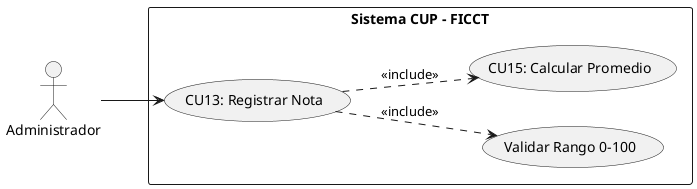

**B. Ficha de Especificación del Caso de Uso**

| Campo               | Descripción                                                                                                                                                                                                                                                                                                                                                                                                                                                                                                                                            |
| ------------------- | ------------------------------------------------------------------------------------------------------------------------------------------------------------------------------------------------------------------------------------------------------------------------------------------------------------------------------------------------------------------------------------------------------------------------------------------------------------------------------------------------------------------------------------------------------ |
| **CASO DE USO**     | CU13 — Registrar Notas de Examen por el Administrador (Individual).                                                                                                                                                                                                                                                                                                                                                                                                                                                                                    |
| **PROPÓSITO**       | Permitir al Administrador registrar la calificación de cada examen (1, 2 o 3) para cada postulante, por materia.                                                                                                                                                                                                                                                                                                                                                                                                                                       |
| **DESCRIPCIÓN**     | El Administrador selecciona un grupo, una materia y un número de examen (1, 2 o 3). El sistema despliega la lista de postulantes y permite ingresar la nota individual de cada uno. Las notas se validan en rango 0-100. Tras el registro de la nota, el sistema recalcula automáticamente el promedio ponderado de la materia (CU15).                                                                                                                                                                                                                 |
| **ACTORES**         | Tablas de BD (`examenes`, `postulantes`, `asignaciones_grupo`).                                                                                                                                                                                                                                                                                                                                                                                                                                                                                        |
| **ACTOR INICIADOR** | Administrador del Sistema.                                                                                                                                                                                                                                                                                                                                                                                                                                                                                                                             |
| **PRECONDICIÓN**    | Los postulantes deben estar asignados al grupo (CU11). No debe existir ya un registro para ese examen del mismo postulante y materia.                                                                                                                                                                                                                                                                                                                                                                                                                  |
| **FLUJO PRINCIPAL** | 1. El Administrador ingresa al módulo "Calificaciones". 2. Selecciona un grupo y materia. 3. El sistema despliega la lista de postulantes con columnas: Examen 1, Examen 2, Examen 3, Promedio Ponderado. 4. El Administrador selecciona el número de examen a calificar (1, 2 o 3). 5. Ingresa la nota (0-100) para cada postulante. 6. El sistema valida el rango en frontend y backend. 7. El sistema guarda la nota y ejecuta `<<include>> CU15`: recalcula el promedio ponderado. 8. El sistema actualiza visualmente la columna correspondiente. |
| **POST CONDICIÓN**  | La nota queda registrada con auditoría (administrador, fecha, hora). El promedio ponderado se recalcula automáticamente.                                                                                                                                                                                                                                                                                                                                                                                                                               |
| **EXCEPCIONES**     | *E1: Nota fuera de rango.* "La nota debe estar entre 0 y 100". *E2: Examen ya calificado.* "Este examen ya fue registrado. Use la función de edición para modificarlo". *E3: 4° examen bloqueado.* El sistema no permite registrar un cuarto examen por materia.                                                                                                                                                                                                                                                                                       |

---

#### CU14: Cargar Notas Masivamente por el Administrador (CSV/Excel)

**B. Ficha de Especificación del Caso de Uso**

| Campo               | Descripción                                                                                                                                                                                                                                                                                                                                                                                                                                                                                         |
| ------------------- | --------------------------------------------------------------------------------------------------------------------------------------------------------------------------------------------------------------------------------------------------------------------------------------------------------------------------------------------------------------------------------------------------------------------------------------------------------------------------------------------------- |
| **CASO DE USO**     | CU14 — Cargar Notas Masivamente por el Administrador (CSV/Excel).                                                                                                                                                                                                                                                                                                                                                                                                                                   |
| **PROPÓSITO**       | Optimizar el proceso de registro de notas cuando el volumen de postulantes es alto, evitando la digitación manual individual.                                                                                                                                                                                                                                                                                                                                                                       |
| **DESCRIPCIÓN**     | El Administrador descarga una plantilla CSV con columnas predefinidas (código postulante, materia, nº examen, nota), la completa y la sube al sistema. El sistema valida cada registro y reporta errores antes de confirmar la carga masiva.                                                                                                                                                                                                                                                        |
| **ACTORES**         | Tablas de BD (`examenes`, `postulantes`).                                                                                                                                                                                                                                                                                                                                                                                                                                                           |
| **ACTOR INICIADOR** | Administrador del Sistema.                                                                                                                                                                                                                                                                                                                                                                                                                                                                          |
| **PRECONDICIÓN**    | Los postulantes deben estar asignados a grupos. El archivo debe seguir el formato de la plantilla oficial.                                                                                                                                                                                                                                                                                                                                                                                          |
| **FLUJO PRINCIPAL** | 1. El Administrador descarga la plantilla CSV desde "Calificaciones" → "Carga Masiva". 2. Completa la plantilla con las notas. 3. Sube el archivo CSV al sistema. 4. El sistema parsea el archivo y ejecuta validaciones: códigos existentes, notas en rango 0-100, no duplicidad. 5. El sistema muestra un resumen: "N registros válidos, M errores". 6. El Administrador corrige si es necesario y confirma. 7. El sistema inserta las notas masivamente y recalcula promedios ponderados (CU15). |
| **POST CONDICIÓN**  | Todas las notas válidas quedan registradas.                                                                                                                                                                                                                                                                                                                                                                                                                                                         |
| **EXCEPCIONES**     | *E1: Archivo vacío o formato incorrecto.* "El archivo no cumple con el formato de la plantilla". *E2: Notas duplicadas.* "Se detectaron [N] notas duplicadas que serán omitidas".                                                                                                                                                                                                                                                                                                                   |

---

#### CU15: Calcular Promedio Ponderado por Materia

**B. Ficha de Especificación del Caso de Uso**

| Campo               | Descripción                                                                                                                                                                                                                                                                                                                                                                                                                                                                                              |
| ------------------- | -------------------------------------------------------------------------------------------------------------------------------------------------------------------------------------------------------------------------------------------------------------------------------------------------------------------------------------------------------------------------------------------------------------------------------------------------------------------------------------------------------- |
| **CASO DE USO**     | CU15 — Calcular Promedio Ponderado por Materia.                                                                                                                                                                                                                                                                                                                                                                                                                                                          |
| **PROPÓSITO**       | Aplicar automáticamente la fórmula de ponderación (30%-30%-40%) para determinar la nota final de cada materia de cada postulante.                                                                                                                                                                                                                                                                                                                                                                        |
| **DESCRIPCIÓN**     | El sistema calcula automáticamente el promedio ponderado cada vez que se registra o modifica una nota de examen. La fórmula aplicada es: `Nota_Final_Materia = (Examen1 × 0.30) + (Examen2 × 0.30) + (Examen3 × 0.40)`. Las ponderaciones son configurables por el Administrador.                                                                                                                                                                                                                        |
| **ACTORES**         | Tablas de BD (`examenes`, `notas_finales`).                                                                                                                                                                                                                                                                                                                                                                                                                                                              |
| **ACTOR INICIADOR** | Sistema (invocado automáticamente desde CU13 o CU14).                                                                                                                                                                                                                                                                                                                                                                                                                                                    |
| **PRECONDICIÓN**    | Debe existir al menos una nota registrada para el postulante en la materia.                                                                                                                                                                                                                                                                                                                                                                                                                              |
| **FLUJO PRINCIPAL** | 1. El sistema detecta un INSERT o UPDATE en la tabla `examenes`. 2. El sistema recupera las notas registradas del postulante para esa materia. 3. Si las 3 notas están presentes: aplica la fórmula ponderada completa. 4. Si faltan notas: calcula un promedio parcial indicando "(Incompleto — faltan N exámenes)". 5. El sistema almacena el resultado en la tabla `notas_finales` (postulante, materia, nota_final, estado). 6. El sistema invoca CU16 si las 4 materias tienen nota final completa. |
| **POST CONDICIÓN**  | La nota final ponderada queda registrada y visible para docentes, coordinadores y el postulante.                                                                                                                                                                                                                                                                                                                                                                                                         |
| **EXCEPCIONES**     | Ninguna. El cálculo es determinístico y automático.                                                                                                                                                                                                                                                                                                                                                                                                                                                      |

**Ejemplo de cálculo:**

| Materia     | Examen 1 (30%)   | Examen 2 (30%)   | Examen 3 (40%) | Nota Final |
| ----------- | ---------------- | ---------------- | -------------- | ---------- |
| Computación | 80 × 0.30 = 24   | 70 × 0.30 = 21   | 90 × 0.40 = 36 | **81.0** ✅ |
| Matemáticas | 50 × 0.30 = 15   | 55 × 0.30 = 16.5 | 60 × 0.40 = 24 | **55.5** ❌ |
| Inglés      | 75 × 0.30 = 22.5 | 80 × 0.30 = 24   | 85 × 0.40 = 34 | **80.5** ✅ |
| Física      | 60 × 0.30 = 18   | 65 × 0.30 = 19.5 | 70 × 0.40 = 28 | **65.5** ✅ |

> **Resultado:** REPROBADO — Matemáticas (55.5) no alcanza el ≥60 requerido por materia.

---

#### CU16: Determinar Estado del Postulante (Aprobado/Reprobado)

**A. Estructura del Modelo de CU (Diagrama Específico)**

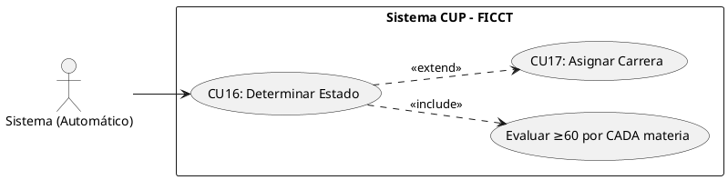

**B. Ficha de Especificación del Caso de Uso**

| Campo               | Descripción                                                                                                                                                                                                                                                                                                                                                                                                                                                                                                                                                                                              |
| ------------------- | -------------------------------------------------------------------------------------------------------------------------------------------------------------------------------------------------------------------------------------------------------------------------------------------------------------------------------------------------------------------------------------------------------------------------------------------------------------------------------------------------------------------------------------------------------------------------------------------------------- |
| **CASO DE USO**     | CU16 — Determinar Estado del Postulante (Aprobado/Reprobado).                                                                                                                                                                                                                                                                                                                                                                                                                                                                                                                                            |
| **PROPÓSITO**       | Aplicar sistémicamente la regla de negocio de aprobación del CUP: el postulante debe obtener ≥60 en CADA una de las 4 materias individualmente para ser considerado APROBADO.                                                                                                                                                                                                                                                                                                                                                                                                                            |
| **DESCRIPCIÓN**     | Una vez que las 4 materias del postulante tienen nota final calculada (CU15), el sistema evalúa automáticamente la regla de negocio. **NO se utiliza el promedio general de las 4 materias.** Cada materia se evalúa de forma independiente. Si TODAS las materias tienen nota final ≥60, el estado es APROBADO. Si al menos UNA materia tiene nota final <60, el estado es REPROBADO.                                                                                                                                                                                                                   |
| **ACTORES**         | Tablas de BD (`notas_finales`, `postulantes`).                                                                                                                                                                                                                                                                                                                                                                                                                                                                                                                                                           |
| **ACTOR INICIADOR** | Sistema (invocado automáticamente tras completar CU15 para las 4 materias).                                                                                                                                                                                                                                                                                                                                                                                                                                                                                                                              |
| **PRECONDICIÓN**    | Las 4 materias del postulante deben tener nota final calculada (los 3 exámenes por materia registrados).                                                                                                                                                                                                                                                                                                                                                                                                                                                                                                 |
| **FLUJO PRINCIPAL** | 1. El sistema detecta que las 4 materias del postulante tienen nota final completa. 2. El sistema evalúa cada nota final individualmente contra el umbral ≥60. 3. **Si las 4 materias ≥60:** El sistema actualiza el estado del postulante a "APROBADO". El sistema envía una notificación al postulante y al coordinador. El sistema invoca `<<extend>> CU17` para la asignación de carrera. 4. **Si alguna materia <60:** El sistema actualiza el estado a "REPROBADO" indicando las materias no aprobadas. El sistema envía una notificación al postulante con el detalle de las materias reprobadas. |
| **POST CONDICIÓN**  | El estado del postulante queda determinado de forma inmutable (solo el Administrador puede corregir en caso de error de digitación).                                                                                                                                                                                                                                                                                                                                                                                                                                                                     |
| **EXCEPCIONES**     | Ninguna. La regla es determinística e inquebrantable por diseño.                                                                                                                                                                                                                                                                                                                                                                                                                                                                                                                                         |

**Regla de negocio implementada:**

```
PARA cada postulante CON 4 materias evaluadas:
  SI nota_final_computacion >= 60
     Y nota_final_matematicas >= 60
     Y nota_final_ingles >= 60
     Y nota_final_fisica >= 60:
    → Estado = APROBADO
  SINO:
    → Estado = REPROBADO
    → Registrar materias reprobadas (las que tienen < 60)
FIN PARA
```

> ⚠️ **IMPORTANTE:** La regla de negocio establece que el umbral ≥60 se aplica a CADA materia individualmente. NO al promedio general de las 4 materias. Un postulante con notas 100, 100, 90, 55 queda REPROBADO porque una materia (55) no alcanza el umbral, aunque su promedio general sea 86.25.

---

#### CU17: Ejecutar Asignación de Carreras por Cupo

**B. Ficha de Especificación del Caso de Uso**

| Campo               | Descripción                                                                                                                                                                                                                                                                                                                                                                                                                                                                                                                                                                 |
| ------------------- | --------------------------------------------------------------------------------------------------------------------------------------------------------------------------------------------------------------------------------------------------------------------------------------------------------------------------------------------------------------------------------------------------------------------------------------------------------------------------------------------------------------------------------------------------------------------------- |
| **CASO DE USO**     | CU17 — Ejecutar Asignación de Carreras por Cupo.                                                                                                                                                                                                                                                                                                                                                                                                                                                                                                                            |
| **PROPÓSITO**       | Asignar a los postulantes aprobados a su carrera correspondiente según sus preferencias y la disponibilidad de cupos vigentes por gestión.                                                                                                                                                                                                                                                                                                                                                                                                                                  |
| **DESCRIPCIÓN**     | El Coordinador ejecuta el algoritmo de asignación masiva de carreras. El sistema recorre la lista de postulantes aprobados (ordenados por promedio general descendente), intentando asignar primero la 1ª opción de carrera. Si los cupos están agotados, intenta la 2ª opción. Si ambas están llenas, marca al postulante como "Pendiente de Reasignación".                                                                                                                                                                                                                |
| **ACTORES**         | Tablas de BD (`postulantes`, `carreras`, `cupos_gestion`, `admisiones`).                                                                                                                                                                                                                                                                                                                                                                                                                                                                                                    |
| **ACTOR INICIADOR** | Coordinador Académico.                                                                                                                                                                                                                                                                                                                                                                                                                                                                                                                                                      |
| **PRECONDICIÓN**    | Los estados de todos los postulantes deben estar determinados (CU16). Los cupos por carrera deben estar configurados (CU18).                                                                                                                                                                                                                                                                                                                                                                                                                                                |
| **FLUJO PRINCIPAL** | 1. El Coordinador ingresa al módulo "Admisión" → "Asignar Carreras". 2. El sistema muestra el resumen: "Aprobados: [N]. Cupos totales disponibles: [M]". 3. El Coordinador presiona "Ejecutar Asignación". 4. El sistema ordena los aprobados por promedio general descendente. 5. Para cada aprobado: verifica cupo en 1ª opción → asigna; si no hay → verifica 2ª opción → asigna; si no hay → marca "Pendiente". 6. El sistema muestra el resultado detallado con métricas. 7. El sistema envía notificaciones a cada postulante aprobado indicando la carrera asignada. |
| **POST CONDICIÓN**  | Los postulantes aprobados quedan asignados a una carrera. Los cupos se descuentan atómicamente.                                                                                                                                                                                                                                                                                                                                                                                                                                                                             |
| **EXCEPCIONES**     | *E1: Ambas opciones agotadas.* El postulante queda como "Pendiente de Reasignación Administrativa". Se notifica al Coordinador para resolución manual (asignar a la carrera con menor cantidad de inscritos).                                                                                                                                                                                                                                                                                                                                                               |

---

#### CU18: Configurar Cupos por Carrera y Gestión

**B. Ficha de Especificación del Caso de Uso**

| Campo               | Descripción                                                                                                                                                                                                                                                                                                                                                                             |
| ------------------- | --------------------------------------------------------------------------------------------------------------------------------------------------------------------------------------------------------------------------------------------------------------------------------------------------------------------------------------------------------------------------------------- |
| **CASO DE USO**     | CU18 — Configurar Cupos por Carrera y Gestión.                                                                                                                                                                                                                                                                                                                                          |
| **PROPÓSITO**       | Permitir al Administrador definir la cantidad máxima de estudiantes que cada carrera puede admitir en una gestión específica.                                                                                                                                                                                                                                                           |
| **DESCRIPCIÓN**     | El Administrador establece los cupos de admisión para cada una de las 4 carreras de la FICCT (Informática, Sistemas, Redes y Telecomunicaciones, Robótica) para la gestión académica en curso. Los cupos son independientes por gestión y carrera.                                                                                                                                      |
| **ACTORES**         | Tablas de BD (`cupos_gestion`, `carreras`).                                                                                                                                                                                                                                                                                                                                             |
| **ACTOR INICIADOR** | Administrador del Sistema.                                                                                                                                                                                                                                                                                                                                                              |
| **PRECONDICIÓN**    | Las carreras deben estar registradas. La gestión académica debe estar activa.                                                                                                                                                                                                                                                                                                           |
| **FLUJO PRINCIPAL** | 1. El Administrador ingresa al módulo "Configuración" → "Cupos por Carrera". 2. El sistema despliega las 4 carreras con su cupo actual (o vacío si es una nueva gestión). 3. El Administrador ingresa la cantidad de cupo para cada carrera. 4. El Administrador presiona "Guardar Configuración". 5. El sistema valida que los cupos sean números positivos y guarda la configuración. |
| **POST CONDICIÓN**  | Los cupos quedan definidos para la gestión y serán utilizados por CU17 durante la asignación de carreras.                                                                                                                                                                                                                                                                               |
| **EXCEPCIONES**     | *E1: Cupo menor a admitidos actuales.* "No puede reducir el cupo por debajo de los [N] ya admitidos en [carrera]".                                                                                                                                                                                                                                                                      |

---

#### CU19: Generar Reporte Estructurado (Predefinido)

**B. Ficha de Especificación del Caso de Uso**

| Campo               | Descripción                                                                                                                                                                                                                                                                                                                                                                                                                                                                                                                |
| ------------------- | -------------------------------------------------------------------------------------------------------------------------------------------------------------------------------------------------------------------------------------------------------------------------------------------------------------------------------------------------------------------------------------------------------------------------------------------------------------------------------------------------------------------------- |
| **CASO DE USO**     | CU19 — Generar Reporte Estructurado (Predefinido).                                                                                                                                                                                                                                                                                                                                                                                                                                                                         |
| **PROPÓSITO**       | Generar reportes con formato fijo predefinido con un solo clic, cubriendo los indicadores estadísticos más solicitados por las autoridades de la facultad.                                                                                                                                                                                                                                                                                                                                                                 |
| **DESCRIPCIÓN**     | El sistema ofrece un catálogo de reportes predefinidos (lista de inscritos, aprobados, reprobados, por grupo, por materia, por carrera, etc.). El usuario selecciona el reporte deseado y el sistema lo genera automáticamente en pantalla con opción de exportación a PDF o Excel.                                                                                                                                                                                                                                        |
| **ACTORES**         | Tablas de BD (todas las tablas transaccionales).                                                                                                                                                                                                                                                                                                                                                                                                                                                                           |
| **ACTOR INICIADOR** | Administrador, Coordinador.                                                                                                                                                                                                                                                                                                                                                                                                                                                                                                |
| **PRECONDICIÓN**    | Deben existir datos registrados para la gestión consultada.                                                                                                                                                                                                                                                                                                                                                                                                                                                                |
| **FLUJO PRINCIPAL** | 1. El actor ingresa al módulo "Reportes" → "Estructurados". 2. El sistema muestra el catálogo de reportes disponibles: Lista general de postulantes, Postulantes aprobados, Postulantes reprobados, Grupos habilitados, Estadísticas por materia, Docentes por grupo, Grupo con mayor tasa de aprobación, Carrera con mayor demanda. 3. El actor selecciona un reporte. 4. El sistema genera el reporte en pantalla con los datos actualizados. 5. El actor puede exportar a PDF (con membrete institucional) o Excel/CSV. |
| **POST CONDICIÓN**  | Operación de solo lectura. El reporte generado refleja los datos del momento exacto de la consulta.                                                                                                                                                                                                                                                                                                                                                                                                                        |
| **EXCEPCIONES**     | *E1: Sin datos.* "No hay datos disponibles para generar este reporte en la gestión seleccionada".                                                                                                                                                                                                                                                                                                                                                                                                                          |

---

#### CU20: Generar Reporte Dinámico (Filtros Interactivos)

**B. Ficha de Especificación del Caso de Uso**

| Campo               | Descripción                                                                                                                                                                                                                                                                                                                                                                                       |
| ------------------- | ------------------------------------------------------------------------------------------------------------------------------------------------------------------------------------------------------------------------------------------------------------------------------------------------------------------------------------------------------------------------------------------------- |
| **CASO DE USO**     | CU20 — Generar Reporte Dinámico con Filtros Interactivos.                                                                                                                                                                                                                                                                                                                                         |
| **PROPÓSITO**       | Permitir la generación de reportes personalizados donde el usuario selecciona los criterios de filtrado, campos a incluir y agrupamiento de datos.                                                                                                                                                                                                                                                |
| **DESCRIPCIÓN**     | El usuario construye su reporte seleccionando filtros interactivos (por nombre, grupo, gestión, materia, carrera, estado, docente, rango de fechas). El sistema genera el reporte a medida en tiempo real según la combinación de filtros aplicados.                                                                                                                                              |
| **ACTORES**         | Tablas de BD (todas las tablas transaccionales).                                                                                                                                                                                                                                                                                                                                                  |
| **ACTOR INICIADOR** | Administrador, Coordinador.                                                                                                                                                                                                                                                                                                                                                                       |
| **PRECONDICIÓN**    | Deben existir datos registrados.                                                                                                                                                                                                                                                                                                                                                                  |
| **FLUJO PRINCIPAL** | 1. El actor ingresa al módulo "Reportes" → "Dinámicos". 2. El sistema despliega el panel de filtros: Gestión, Carrera, Grupo, Materia, Estado (Aprobado/Reprobado), Docente, Rango de Fechas. 3. El actor selecciona los filtros deseados (puede combinar múltiples filtros). 4. El sistema genera el reporte en tiempo real con cada cambio de filtro. 5. El actor puede exportar a PDF o Excel. |
| **POST CONDICIÓN**  | Operación de solo lectura.                                                                                                                                                                                                                                                                                                                                                                        |
| **EXCEPCIONES**     | *E1: Combinación de filtros sin resultados.* "No se encontraron datos con los filtros seleccionados. Modifique los criterios de búsqueda".                                                                                                                                                                                                                                                        |

---

#### CU21: Generar Reporte por Comando de Voz (IA)

**A. Estructura del Modelo de CU (Diagrama Específico)**

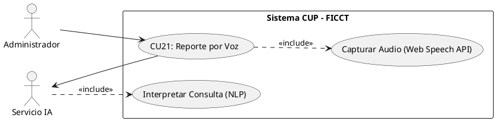

**B. Ficha de Especificación del Caso de Uso**

| Campo               | Descripción                                                                                                                                                                                                                                                                                                                                                                                                                                                                                                                                                                                                                                                                                                         |
| ------------------- | ------------------------------------------------------------------------------------------------------------------------------------------------------------------------------------------------------------------------------------------------------------------------------------------------------------------------------------------------------------------------------------------------------------------------------------------------------------------------------------------------------------------------------------------------------------------------------------------------------------------------------------------------------------------------------------------------------------------- |
| **CASO DE USO**     | CU21 — Generar Reporte por Comando de Voz (IA).                                                                                                                                                                                                                                                                                                                                                                                                                                                                                                                                                                                                                                                                     |
| **PROPÓSITO**       | Permitir la generación de reportes mediante comandos de voz en lenguaje natural, utilizando servicios de inteligencia artificial para la interpretación de la consulta.                                                                                                                                                                                                                                                                                                                                                                                                                                                                                                                                             |
| **DESCRIPCIÓN**     | El usuario activa el micrófono y dicta una consulta en lenguaje natural (ej: "Muéstrame los aprobados de la gestión 1-2026 de Ingeniería de Sistemas"). El sistema utiliza la Web Speech API para convertir el audio a texto, envía el texto al servicio de IA (OpenAI o similar) para interpretar la intención y extraer los parámetros, y genera la consulta SQL correspondiente para obtener los datos solicitados.                                                                                                                                                                                                                                                                                              |
| **ACTORES**         | Tablas de BD (transaccionales), Web Speech API, Servicio de IA.                                                                                                                                                                                                                                                                                                                                                                                                                                                                                                                                                                                                                                                     |
| **ACTOR INICIADOR** | Administrador o Coordinador.                                                                                                                                                                                                                                                                                                                                                                                                                                                                                                                                                                                                                                                                                        |
| **PRECONDICIÓN**    | El navegador debe soportar Web Speech API. El micrófono debe estar habilitado.                                                                                                                                                                                                                                                                                                                                                                                                                                                                                                                                                                                                                                      |
| **FLUJO PRINCIPAL** | 1. El actor ingresa al módulo "Reportes" → "Consulta por Voz". 2. El actor presiona el botón de micrófono. 3. El sistema activa la Web Speech API y escucha el audio. 4. El actor dicta su consulta (ej: "Aprobados de la gestión 1-2026 del grupo 3"). 5. El sistema convierte el audio a texto y lo muestra para confirmación. 6. El actor confirma el texto. 7. El sistema envía el texto al servicio de IA para interpretación NLP. 8. El servicio de IA extrae los parámetros: entidad=postulantes, estado=aprobado, gestión=1-2026, grupo=3. 9. El sistema genera la consulta SQL y ejecuta contra la BD. 10. El sistema presenta los resultados en formato de reporte interactivo con opción de exportación. |
| **POST CONDICIÓN**  | El reporte generado refleja los datos consultados por voz. El historial de consultas de voz queda registrado.                                                                                                                                                                                                                                                                                                                                                                                                                                                                                                                                                                                                       |
| **EXCEPCIONES**     | *E1: Audio no reconocido.* "No se pudo reconocer su consulta. Por favor, intente nuevamente con mayor claridad". *E2: Consulta no interpretable.* "No se pudo interpretar la intención de su consulta. Intente reformularla (ej: 'aprobados de gestión 1-2026')". *E3: Micrófono no disponible.* "No se detectó un micrófono. Verifique los permisos del navegador".                                                                                                                                                                                                                                                                                                                                                |

---

#### CU22: Consultar Dashboard Estadístico en Tiempo Real

**B. Ficha de Especificación del Caso de Uso**

| Campo               | Descripción                                                                                                                                                                                                                                                                                                                                                                                                                                                                                                                                                                                                                                                              |
| ------------------- | ------------------------------------------------------------------------------------------------------------------------------------------------------------------------------------------------------------------------------------------------------------------------------------------------------------------------------------------------------------------------------------------------------------------------------------------------------------------------------------------------------------------------------------------------------------------------------------------------------------------------------------------------------------------------ |
| **CASO DE USO**     | CU22 — Consultar Dashboard Estadístico en Tiempo Real.                                                                                                                                                                                                                                                                                                                                                                                                                                                                                                                                                                                                                   |
| **PROPÓSITO**       | Proporcionar a las autoridades de la facultad una vista consolidada e interactiva de los indicadores más relevantes del proceso de admisión del CUP.                                                                                                                                                                                                                                                                                                                                                                                                                                                                                                                     |
| **DESCRIPCIÓN**     | El dashboard presenta tarjetas de indicadores (KPI cards), gráficos circulares, de barras y de líneas que se actualizan en tiempo real mediante WebSockets. Incluye: total inscritos, aprobados, reprobados, porcentajes, grupos habilitados, distribución por carrera, ranking de grupos por tasa de aprobación, evolución histórica por gestión, estado de cupos y alertas activas.                                                                                                                                                                                                                                                                                    |
| **ACTORES**         | Tablas de BD (todas las tablas transaccionales), WebSockets.                                                                                                                                                                                                                                                                                                                                                                                                                                                                                                                                                                                                             |
| **ACTOR INICIADOR** | Administrador, Coordinador.                                                                                                                                                                                                                                                                                                                                                                                                                                                                                                                                                                                                                                              |
| **PRECONDICIÓN**    | El actor debe estar autenticado con rol de Administrador o Coordinador.                                                                                                                                                                                                                                                                                                                                                                                                                                                                                                                                                                                                  |
| **FLUJO PRINCIPAL** | 1. El actor ingresa al módulo "Dashboard". 2. El sistema carga los indicadores calculados en tiempo real desde la BD. 3. El dashboard muestra: Total inscritos (con variación vs gestión anterior), Total evaluados, Total aprobados y % aprobación, Total reprobados y % reprobación, Grupos habilitados (con indicador de ocupación), Distribución por carrera (gráfico circular), Carrera con mayor demanda (destacada), Ranking de grupos por tasa de aprobación, Evolución histórica por gestión (gráfico de líneas), Estado de cupos por carrera (barra de progreso). 4. Los datos se actualizan en tiempo real sin necesidad de refrescar la página (WebSockets). |
| **POST CONDICIÓN**  | Operación de solo lectura. Los indicadores reflejan el estado actual del CUP.                                                                                                                                                                                                                                                                                                                                                                                                                                                                                                                                                                                            |
| **EXCEPCIONES**     | *E1: Sin datos para la gestión actual.* El dashboard muestra los indicadores en cero con el mensaje: "No hay datos registrados para la gestión actual".                                                                                                                                                                                                                                                                                                                                                                                                                                                                                                                  |

---

## 4.4 Prototipos de Interfaz de Usuario

> **Nota:** Los prototipos de interfaz de usuario se desarrollarán de forma iterativa acompañando la implementación de cada caso de uso. Se utilizarán herramientas de generación de mockups (Figma, Draw.io o herramientas con IA) para diseñar las interfaces antes de su implementación en código. A continuación se presentan las directrices de diseño para los prototipos principales.

### Directrices de Diseño General

| Criterio              | Especificación                                                                                                                                   |
| --------------------- | ------------------------------------------------------------------------------------------------------------------------------------------------ |
| **Diseño Responsivo** | La aplicación debe ser completamente funcional en dispositivos de escritorio, tablets y móviles                                                  |
| **Framework CSS**     | Diseño profesional y limpio, con tipografía moderna (Inter/Roboto)                                                                               |
| **Paleta de Colores** | Azul institucional como color primario, gris oscuro para texto, verde para estados positivos (Aprobado), rojo para estados negativos (Reprobado) |
| **Navegación**        | Sidebar lateral con iconos para cada módulo + Navbar superior con perfil de usuario y notificaciones                                             |
| **Tablas de Datos**   | Grillas paginadas con 20 registros por página, filtros en cabecera, exportación integrada                                                        |
| **Formularios**       | Validación en tiempo real con mensajes inline, campos obligatorios marcados con asterisco (*), botones de acción con colores semánticos          |
| **Accesibilidad**     | Contraste WCAG AA, navegación por teclado, labels en todos los inputs                                                                            |

### Prototipos por Módulo

1. **Login (CU01):** Pantalla dividida 50/50. Imagen institucional FICCT a la izquierda. Formulario limpio a la derecha con logo, título del sistema, campos de email y contraseña, botón "INGRESAR" y enlace de recuperación.

2. **Registro de Postulante (CU05-CU07):** Wizard (asistente por pasos) de 3 etapas: Paso 1 — Datos Personales, Paso 2 — Checklist de Requisitos con subida de archivos, Paso 3 — Pago con Stripe (embedding del checkout).

3. **Gestión de Grupos (CU10-CU11):** Vista de tarjetas (cards) mostrando cada grupo con: número, turno, cantidad de estudiantes (barra de progreso de ocupación), docentes asignados. Botón de creación masiva y asignación automática.

4. **Registro de Notas (CU13):** Grilla editable tipo spreadsheet. Columnas: Código, Nombre, Examen 1, Examen 2, Examen 3, Promedio, Estado. Celdas editables con validación de rango en tiempo real. Colores semánticos: verde (≥60), rojo (<60).

5. **Dashboard (CU22):** Grid de KPI cards en la parte superior (4 tarjetas principales). Gráficos interactivos en la sección media (circular para distribución por carrera, barras para grupos, líneas para evolución histórica). Alertas activas en panel lateral derecho.

---

## 4.5 Estructurar el Modelo de Casos de Uso

### 4.5.1 Diagrama de Casos de Uso: CICLO #1

**Arquitectura Base, Autenticación, Inscripción y Organización del CUP**

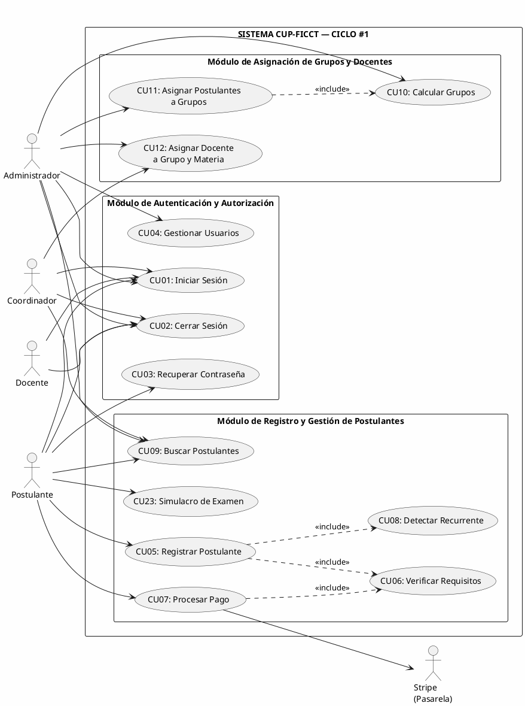

---

### 4.5.2 Diagrama de Casos de Uso: CICLO #2

**Gestión Académica, Evaluación, Admisión, Reportes y Dashboard**

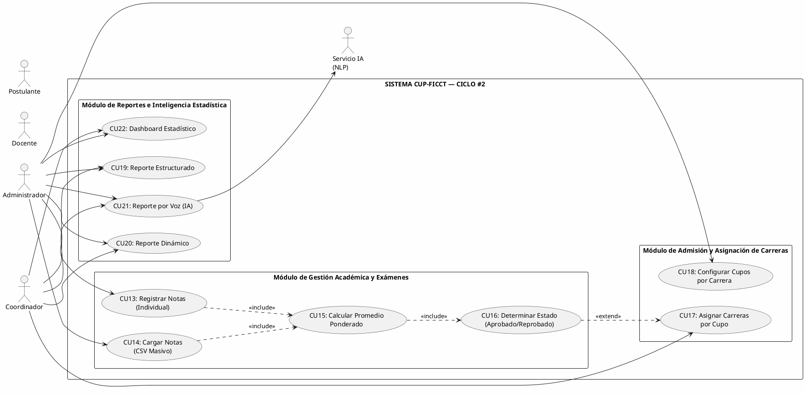

---

# 5. CAPÍTULO 2: FLUJO DE TRABAJO — ANÁLISIS

El Flujo de Trabajo de Análisis en el Proceso Unificado de Desarrollo de Software (PUDS) tiene como objetivo refinar y estructurar los requisitos del sistema capturados previamente, construyendo un modelo de análisis robusto, coherente y extensible que sirva como puente hacia el diseño detallado. Se busca abstraer las complejidades físicas y de implementación tecnológica, organizando el sistema en clases de análisis clasificadas según la taxonomía de Jacobson: clases de Interfaz (Boundary), clases de Control y clases de Entidad.

---

## 5.1 Análisis de la Arquitectura

En la fase de análisis se define una arquitectura conceptual de tres capas de abstracción para garantizar la separación de responsabilidades, la mantenibilidad del software y la escalabilidad del sistema:

1. **Capa de Interfaz (Boundary):** Encapsula la interacción del sistema con su entorno (actores humanos y sistemas externos). No contiene lógica de negocio; es puramente representativa y receptora de eventos de usuario.
2. **Capa de Control:** Coordina y encapsula las reglas de negocio del sistema, la lógica computacional de los algoritmos de asignación, los cálculos promedio de calificaciones, la verificación de cupos y la orquestación de transacciones.
3. **Capa de Entidad:** Representa la información persistente y los conceptos clave del dominio del negocio. Almacena el estado de las variables y sobrevive a la ejecución de los casos de uso.

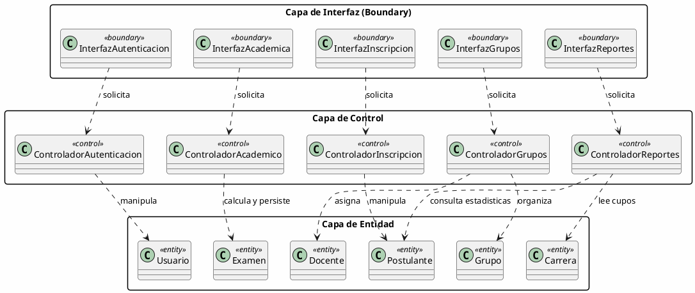

---

## 5.2 Análisis de Casos de Uso (Diagramas de Comunicación)

Los diagramas de comunicación de análisis ilustran cómo colaboran dinámicamente los objetos Boundary, Control y Entity para realizar la lógica específica de un caso de uso de manera pura y abstracta.

### Realización de Análisis para CU07: Procesar Pago de Matrícula (Stripe)

Muestra la colaboración cuando el postulante efectúa el pago una vez que su checklist digital ha sido validado.

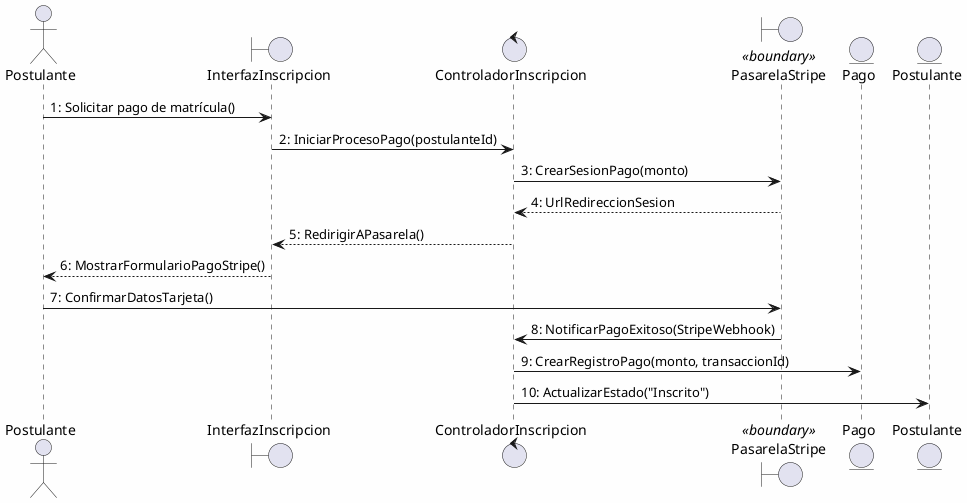

### Realización de Análisis para CU11: Asignar Postulantes a Grupos

Muestra cómo el Administrador dispara el proceso de organización automática de los alumnos según su turno de preferencia.

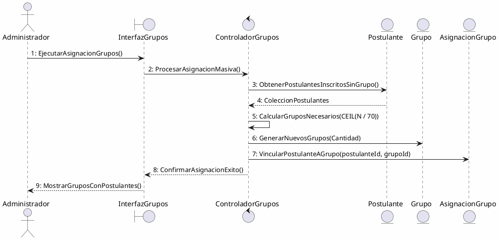

---

## 5.3 Análisis de Clases (Boundary, Control, Entity)

A continuación se identifican y describen las clases de análisis organizadas por módulos funcionales del sistema, especificando sus responsabilidades intrínsecas:

### 1. Módulo de Autenticación y Autorización
*   **`InterfazLogin` (Boundary):** Formulario para capturar el correo electrónico y la contraseña del usuario. Maneja errores de validación iniciales y redirecciones.
*   **`ControladorAcceso` (Control):** Autentica las credenciales, genera el token de sesión (JWT) y gestiona la bitácora de accesos.
*   **`Usuario` (Entity):** Almacena datos del usuario, contraseña hasheada y asignación de rol jerárquico.
*   **`BitacoraAcceso` (Entity):** Registra cada login y logout exitoso o fallido con IP y fecha.

### 2. Módulo de Registro de Postulantes
*   **`InterfazPreinscripcion` (Boundary):** Formulario dinámico para la entrada de datos del postulante, subida del título de bachiller y checklist.
*   **`ControladorPreinscripcion` (Control):** Valida la unicidad del CI, ejecuta la validación contra las bases de datos externas de SEGIP/SEDUCA e inicia el procesamiento de Stripe.
*   **`Postulante` (Entity):** Contiene la información general, turno, carreras de opción y estado académico actual.
*   **`RequisitoDigital` (Entity):** Almacena el cumplimiento individual del checklist documental digitalizado.

### 3. Módulo Académico y Evaluación
*   **`InterfazNotas` (Boundary):** Vista interactiva para registrar notas y cargar archivos CSV masivos por parte del Administrador.
*   **`ControladorEvaluacion` (Control):** Valida los límites de la nota (0-100), aplica la ponderación estricta del 30%-30%-40% y ejecuta el cálculo automático del estado final académico.
*   **`Examen` (Entity):** Representa cada una de las calificaciones de las 4 materias.
*   **`NotaFinal` (Entity):** Almacena el consolidado final ponderado y la determinación determinista de APROBADO o REPROBADO.

### 4. Módulo de Asignación de Grupos y Docentes
*   **`InterfazGrupos` (Boundary):** Panel del administrador para ver distribución de estudiantes, aulas, horarios y carga docente.
*   **`ControladorPlanificacion` (Control):** Implementa el algoritmo de balanceo y cálculo automático de grupos con cota de 70 alumnos y validación de tope horario.
*   **`Grupo` (Entity):** Representa la sección física de clase con su aula, turno y horario.
*   **`Docente` (Entity):** Representa al personal de enseñanza y su validación de carga horaria (Tope de 4 grupos).

### 5. Módulo de Admisión y Asignación de Carreras
*   **`InterfazAdmision` (Boundary):** Vista del Coordinador para dar de alta gestiones y configurar cupos de las 4 carreras de la FICCT.
*   **`ControladorAsignacionCarrera` (Control):** Implementa el algoritmo masivo de asignación de carreras ordenando por nota en orden descendente.
*   **`Carrera` (Entity):** Contiene el identificador y nombre de las especialidades.
*   **`CupoGestion` (Entity):** Almacena el límite estricto de estudiantes admitidos por carrera en una gestión específica.

---

## 5.4 Análisis de Paquetes

Los paquetes agrupan coherentemente las clases de análisis e indican dependencias funcionales unidireccionales de alto nivel para asegurar el bajo acoplamiento:

```plantuml
@startuml PaquetesAnalisis
skinparam backgroundColor #FEFEFE
skinparam roundCorner 8

package "Paquete_Autenticacion" as P_Auth {
}

package "Paquete_Registro_Postulantes" as P_Post {
}

package "Paquete_Planificacion_Academica" as P_Plan {
}

package "Paquete_Evaluacion" as P_Eval {
}

package "Paquete_Admision_Carreras" as P_Admi {
}

package "Paquete_Reportes_IA" as P_Rep {
}

' Relaciones de Dependencia
P_Post ..> P_Auth : depende de seguridad
P_Plan ..> P_Post : lee inscritos
P_Eval ..> P_Plan : lee asignaciones de grupo
P_Admi ..> P_Eval : consume notas aprobadas
P_Rep ..> P_Post : genera estadisticas
P_Rep ..> P_Eval : lee promedios
P_Rep ..> P_Admi : lee admitidos
@enduml
```

---

# 6. CAPÍTULO 3: FLUJO DE TRABAJO — DISEÑO

El Flujo de Trabajo de Diseño traduce el modelo conceptual de análisis en una solución técnica ejecutable orientada al stack de software definido para el proyecto: PHP 8.4 con Laravel 11, React.js (acoplado por Inertia.js), PostgreSQL 18, Stripe y servicios de Inteligencia Artificial. Durante el diseño se resuelven las restricciones físicas del entorno de red, rendimiento y persistencia relacional.

---

## 6.1 Diseño de la Arquitectura (Lógica y Física)

### Arquitectura Lógica
El sistema adopta el patrón arquitectónico **Model-View-Controller (MVC)** combinado con un enfoque de **Single Page Application (SPA)** mediante la integración de **Inertia.js**. Inertia elimina la necesidad de crear APIs REST complejas para la vista principal, permitiendo renderizar componentes React directamente desde los controladores de Laravel como si fueran vistas blade tradicionales, manteniendo la persistencia de estado reactivo y transiciones instantáneas sin refresco de página.

*   **Presentación (Frontend SPA):** React 18, TailwindCSS y bibliotecas de UI de alta calidad.
*   **Capa de Enlace (Inertia Routing):** Serializa la respuesta del controlador y la inyecta al componente React correspondiente.
*   **Controlador (Laravel HTTP):** Recibe las peticiones HTTP seguras, valida los formularios y delega la ejecución de lógica pesada a clases de servicio.
*   **Lógica de Negocio (Services):** Clases PHP puras especializadas en ejecutar algoritmos (Stripe, Grupos, Asignación de Carreras).
*   **Persistencia (Eloquent ORM):** Mapeo objeto-relacional de clases de persistencia y consultas estructuradas en PostgreSQL.

### Arquitectura Física (Diagrama de Despliegue)
El diagrama de despliegue detalla la distribución de los componentes del software en los nodos de hardware físicos y de infraestructura en la nube:

```plantuml
@startuml DespliegueFisico
skinparam backgroundColor #FEFEFE
skinparam roundCorner 8

node "Dispositivo Cliente (PC/Movil)" {
  node "Navegador Web" {
    component "React SPA App\n(HTML5/CSS3/Vite)" as ClientApp
    component "Web Speech API" as SpeechApp
  }
}

node "Servidor Cloud (Railway/Render)" as WebServer {
  node "Entorno PHP 8.4" {
    component "Laravel 11 App" as LaravelApp
    component "Inertia.js Server" as InertiaApp
  }
}

node "Servidor BD Cloud (Supabase/PostgreSQL Dedicated)" as DbServer {
  database "PostgreSQL 18 Engine" {
    component "Esquema cup_ficct" as DBCup
  }
}

node "Cloud API Stripe" as StripeServer <<External>>
node "Cloud API OpenAI" as OpenAICloud <<External>>

' Conexiones fisicas
ClientApp -- WebServer : HTTPS / WebSockets (Port 443)
InertiaApp - LaravelApp : Memoria de proceso
LaravelApp -- DbServer : TCP/IP (Port 5432)
LaravelApp -- StripeServer : HTTPS (API Rest)
LaravelApp -- OpenAICloud : HTTPS (REST Chat Completion)
SpeechApp -- OpenAICloud : HTTPS (Speech to Text)
@enduml
```

---

## 6.2 Diseño de Casos de Uso (Diagramas de Secuencia)

Los diagramas de secuencia detallan paso a paso el paso de mensajes y llamadas a métodos entre los componentes reales del software.

### 1. Diagrama de Secuencia para CU07: Procesar Pago de Matrícula (Integración Stripe)

Muestra la creación del checkout y la confirmación asíncrona mediante el webhook oficial del servidor de Stripe.

```plantuml
@startuml Seq_CU07
skinparam backgroundColor #FEFEFE
autonumber

actor "Postulante" as Post
participant "React Frontend (Inscripcion)" as UI
participant "InscripcionController" as Ctrl
participant "StripeService" as Stripe
database "PostgreSQL" as DB
participant "Stripe API Cloud" as StripeCloud

Post -> UI : Clic en "Pagar Matrícula"
UI -> Ctrl : POST /pago/checkout (CSRF Token)
Ctrl -> Stripe : crearCheckoutSesion(postulanteId)
Stripe -> StripeCloud : POST /v3/checkout/sessions (monto, CI, keys)
StripeCloud --> Stripe : SessionObject (id, url)
Stripe --> Ctrl : SessionObject
Ctrl --> UI : Inertia.visit(url_redireccion_stripe)
UI -> Post : Redirigir a Pasarela Stripe Segura
Post -> StripeCloud : Ingresar tarjeta y confirmar pago
StripeCloud -> StripeCloud : Procesar cargo monetario
StripeCloud -> Ctrl : Webhook POST /api/stripe/webhook (checkout.session.completed)
Ctrl -> Ctrl : verificarFirmaWebhook()
Ctrl -> DB : UPDATE postulantes SET estado = 'Inscrito' WHERE ci = checkout.ci
DB --> Ctrl : OK
Ctrl -> DB : INSERT INTO pagos (ci, transaccion_id, monto, estado) VALUES (...)
DB --> Ctrl : OK
StripeCloud --> Post : Redirección de éxito a /preinscripcion/exito
@enduml
```

### 2. Diagrama de Secuencia para CU11: Asignar Postulantes a Grupos (Algoritmo Automático)

Detalla la ejecución matemática del cálculo automático de grupos con cota estricta de 70 estudiantes por grupo y distribución equitativa.

```plantuml
@startuml Seq_CU11
skinparam backgroundColor #FEFEFE
autonumber

actor "Administrador" as Admin
participant "React Frontend (Grupos)" as UI
participant "GruposController" as Ctrl
participant "GruposService" as Service
database "PostgreSQL" as DB

Admin -> UI : Clic en "Generar Grupos Automáticamente"
UI -> Ctrl : POST /admin/grupos/generar (gestión_id)
Ctrl -> Service : ejecutarAlgoritmoGrupos(gestión_id)
Service -> DB : SELECT * FROM postulantes WHERE estado = 'Inscrito' AND grupo_id IS NULL
DB --> Service : ListaPostulantes (1000 estudiantes)
Service -> Service : Agrupar postulantes por Turno de preferencia
loop Para cada Turno (Mañana, Tarde, Noche)
  Service -> Service : N = CantidadPostulantesTurno
  Service -> Service : CantidadGrupos = CEIL(N / 70)
  loop i de 1 a CantidadGrupos
    Service -> DB : INSERT INTO grupos (numero, turno, aula_id) VALUES (...)
    DB --> Service : GrupoObjeto
  end
  Service -> Service : Distribuir equitativamente N postulantes entre los CantidadGrupos creados
  loop Para cada postulante
    Service -> DB : UPDATE asignaciones_grupo SET grupo_id = id_asignado WHERE postulante_id = id
    DB --> Service : OK
  end
end
Service --> Ctrl : ResumenAsignacion (Total creados, distribuidos)
Ctrl --> UI : Inertia.render("Admin/Grupos", success_message)
UI --> Admin : Mostrar grilla con grupos y alumnos distribuidos
@enduml
```

### 3. Diagrama de Secuencia para CU14: Cargar Notas Masivamente (CSV)

Detalla cómo el sistema procesa por lotes la subida de un documento de notas delimitado, aplicando validación de datos en servidor antes de guardar.

```plantuml
@startuml Seq_CU14
skinparam backgroundColor #FEFEFE
autonumber

actor "Administrador" as Admin
participant "React Frontend (Notas)" as UI
participant "NotasController" as Ctrl
participant "CargaNotasService" as Service
database "PostgreSQL" as DB

Admin -> UI : Seleccionar archivo CSV y Clic en "Procesar Carga Masiva"
UI -> Ctrl : POST /admin/notas/masivo (FileCSV)
Ctrl -> Service : procesarArchivoCSV(FileCSV)
Service -> Service : Validar formato de columnas (CI, Computacion, Matematicas, Ingles, Fisica, ExamenNum)
loop Para cada fila del archivo CSV (Lotes transaccionales)
  Service -> Service : Validar rango de notas (0 a 100)
  Service -> DB : SELECT id FROM postulantes WHERE ci = fila.ci
  alt Si el postulante existe e inscrito
    DB --> Service : postulante_id
    Service -> DB : INSERT INTO examenes (postulante_id, materia_id, numero_examen, nota) VALUES (...) ON CONFLICT UPDATE
    DB --> Service : OK
    Service -> Service : Recalcular promedio ponderado (30% Ex1 + 30% Ex2 + 40% Ex3)
    Service -> Service : Determinar estado final (APROBADO si todas las materias >= 60)
    Service -> DB : INSERT/UPDATE notas_finales (postulante_id, materia_id, promedio, estado)
    DB --> Service : OK
  else Postulante no existe
    Service -> Service : Registrar error en log de inconsistencias (ci)
  end
end
Service --> Ctrl : ResumenOperacion (Cargados exitosamente, Errores)
Ctrl --> UI : Inertia.render("Admin/Notas", {resumen: ResumenOperacion})
UI --> Admin : Mostrar resumen (Ej: 998 exitosos, 2 filas omitidas por CI erróneo)
@enduml
```

### 4. Diagrama de Secuencia para CU17: Asignar Carreras por Cupo (Algoritmo de Admisión)

Detalla la asignación de plazas a los estudiantes de manera justa y en orden de mejor rendimiento general académico.

```plantuml
@startuml Seq_CU17
skinparam backgroundColor #FEFEFE
autonumber

actor "Coordinador" as Coord
participant "React Frontend (Admisiones)" as UI
participant "AdmisionController" as Ctrl
participant "AdmisionService" as Service
database "PostgreSQL" as DB

Coord -> UI : Clic en "Procesar Asignación de Carreras"
UI -> Ctrl : POST /admin/admisiones/procesar (gestión_id)
Ctrl -> Service : procesarAlgoritmoAdmision(gestión_id)
Service -> DB : SELECT * FROM postulantes_notas_consolidadas WHERE estado_final = 'APROBADO' ORDER BY promedio_general DESC
DB --> Service : ListaAprobados (Ordenados de mayor a menor)
loop Para cada postulante de la ListaAprobados
  Service -> DB : SELECT cupos_disponibles FROM cupos_gestion WHERE carrera_id = postulante.primera_opcion
  DB --> Service : cupos_primera
  alt Si cupos_primera > 0
    Service -> DB : INSERT INTO admisiones (postulante_id, carrera_id, via) VALUES (id, primera_opcion, '1ra Opción')
    Service -> DB : UPDATE cupos_gestion SET cupos_disponibles = cupos_disponibles - 1 WHERE carrera_id = primera_opcion
    DB --> Service : OK
  else Primera opción llena
    Service -> DB : SELECT cupos_disponibles FROM cupos_gestion WHERE carrera_id = postulante.segunda_opcion
    DB --> Service : cupos_segunda
    alt Si cupos_segunda > 0
      Service -> DB : INSERT INTO admisiones (postulante_id, carrera_id, via) VALUES (id, segunda_opcion, '2da Opción')
      Service -> DB : UPDATE cupos_gestion SET cupos_disponibles = cupos_disponibles - 1 WHERE carrera_id = segunda_opcion
      DB --> Service : OK
    else Ambas opciones llenas
      Service -> DB : UPDATE postulantes SET estado = 'Pendiente Reasignacion' WHERE id = postulante_id
      Service -> DB : INSERT INTO alertas_admision (postulante_id, mensaje) VALUES (...)
      DB --> Service : OK
    end
  end
end
Service --> Ctrl : ResumenAdmision (Admitidos, Excedidos)
Ctrl --> UI : Inertia.render("Admin/Admisiones", success_data)
UI --> Coord : Mostrar dashboard de cupos consumidos e inconsistencias
@enduml
```

---

## 6.3 Diseño de Datos (Modelo Lógico y DDL Físico)

El diseño de datos define el modelo relacional físico en PostgreSQL 18. Para soportar el proceso del CUP, se han diseñado 16 tablas vinculadas. Las propiedades ACID garantizan consistencia total transaccional.

### Diagrama del Modelo de Clases de Persistencia (Relacional)

```plantuml
@startuml ModeloDatos
skinparam backgroundColor #FEFEFE
skinparam class {
  BackgroundColor PaleGreen
  ArrowColor Black
  BorderColor DarkGreen
}
skinparam roundCorner 8

class "users" {
  + id: BIGINT [PK]
  --
  * name: VARCHAR(255)
  * email: VARCHAR(255) [Unique]
  * password: VARCHAR(255)
  * role: VARCHAR(50)
  * active: BOOLEAN
  * created_at: TIMESTAMP
}

class "bitacora_accesos" {
  + id: BIGINT [PK]
  --
  * user_id: BIGINT [FK]
  * ip_address: VARCHAR(45)
  * action: VARCHAR(255)
  * created_at: TIMESTAMP
}

class "gestiones" {
  + id: BIGINT [PK]
  --
  * codigo: VARCHAR(10) [Unique]
  * activa: BOOLEAN
  * fecha_inicio: DATE
  * fecha_fin: DATE
}

class "carreras" {
  + id: BIGINT [PK]
  --
  * nombre: VARCHAR(100) [Unique]
  * codigo: VARCHAR(10)
}

class "cupos_gestion" {
  + id: BIGINT [PK]
  --
  * gestion_id: BIGINT [FK]
  * carrera_id: BIGINT [FK]
  * cupo_maximo: INT
  * cupos_disponibles: INT
}

class "postulantes" {
  + id: BIGINT [PK]
  --
  * ci: VARCHAR(20) [Unique]
  * nombres: VARCHAR(150)
  * apellidos: VARCHAR(150)
  * fecha_nacimiento: DATE
  * sexo: CHAR(1)
  * direccion: VARCHAR(255)
  * telefono: VARCHAR(20)
  * email: VARCHAR(150)
  * colegio_procedencia: VARCHAR(150)
  * ciudad: VARCHAR(100)
  * titulo_bachiller: VARCHAR(255)
  * primera_opcion_id: BIGINT [FK]
  * segunda_opcion_id: BIGINT [FK]
  * turno_preferencia: VARCHAR(20)
  * gestion_id: BIGINT [FK]
  * estado: VARCHAR(50)
  * recurrente: BOOLEAN
}

class "requisitos_documentales" {
  + id: BIGINT [PK]
  --
  * postulante_id: BIGINT [FK]
  * ci_digitalizado: BOOLEAN
  * certificado_nacimiento: BOOLEAN
  * titulo_bachiller_legalizado: BOOLEAN
  * formulario_preinscripcion: BOOLEAN
  * verificado_bd_externa: BOOLEAN
}

class "pagos" {
  + id: BIGINT [PK]
  --
  * postulante_id: BIGINT [FK]
  * stripe_checkout_id: VARCHAR(255)
  * monto: DECIMAL(10,2)
  * estado_pago: VARCHAR(50)
  * fecha_pago: TIMESTAMP
}

class "materias" {
  + id: BIGINT [PK]
  --
  * nombre: VARCHAR(50) [Unique]
  * codigo: VARCHAR(10)
}

class "grupos" {
  + id: BIGINT [PK]
  --
  * numero: INT
  * gestion_id: BIGINT [FK]
  * turno: VARCHAR(20)
  * aula_id: BIGINT [FK]
}

class "aulas" {
  + id: BIGINT [PK]
  --
  * nombre: VARCHAR(50)
  * capacidad: INT
  * ubicacion: VARCHAR(100)
}

class "asignaciones_grupo" {
  + id: BIGINT [PK]
  --
  * postulante_id: BIGINT [FK]
  * grupo_id: BIGINT [FK]
}

class "docentes" {
  + id: BIGINT [PK]
  --
  * ci: VARCHAR(20) [Unique]
  * nombres: VARCHAR(150)
  * apellidos: VARCHAR(150)
  * especialidad: VARCHAR(100)
  * grado_academico: VARCHAR(100)
  * correo: VARCHAR(150)
}

class "asignaciones_docente" {
  + id: BIGINT [PK]
  --
  * docente_id: BIGINT [FK]
  * grupo_id: BIGINT [FK]
  * materia_id: BIGINT [FK]
}

class "examenes" {
  + id: BIGINT [PK]
  --
  * postulante_id: BIGINT [FK]
  * materia_id: BIGINT [FK]
  * numero_examen: INT
  * nota: DECIMAL(5,2)
}

class "notas_finales" {
  + id: BIGINT [PK]
  --
  * postulante_id: BIGINT [FK]
  * materia_id: BIGINT [FK]
  * promedio: DECIMAL(5,2)
  * estado: VARCHAR(20)
}

class "admisiones" {
  + id: BIGINT [PK]
  --
  * postulante_id: BIGINT [FK]
  * carrera_id: BIGINT [FK]
  * via: VARCHAR(50)
  * fecha_admision: TIMESTAMP
}

' Relaciones
users "1" -- "0..*" bitacora_accesos
gestiones "1" -- "0..*" cupos_gestion
carreras "1" -- "0..*" cupos_gestion
carreras "1" -- "0..*" postulantes : primera opcion
carreras "1" -- "0..*" postulantes : segunda opcion
gestiones "1" -- "0..*" postulantes
postulantes "1" -- "1" requisitos_documentales
postulantes "1" -- "0..*" pagos
postulantes "1" -- "0..1" asignaciones_grupo
grupos "1" -- "0..*" asignaciones_grupo
gestiones "1" -- "0..*" grupos
aulas "1" -- "0..*" grupos
docentes "1" -- "0..*" asignaciones_docente
grupos "1" -- "0..*" asignaciones_docente
materias "1" -- "0..*" asignaciones_docente
postulantes "1" -- "0..*" examenes
materias "1" -- "0..*" examenes
postulantes "1" -- "0..*" notas_finales
materias "1" -- "0..*" notas_finales
postulantes "1" -- "0..1" admisiones
carreras "1" -- "0..*" admisiones
@enduml
```

---

### Modelo Físico de Datos: DDL SQL Completo (PostgreSQL 16/18)

El siguiente script DDL crea todas las tablas con sus respectivas llaves primarias, llaves foráneas, índices de alto rendimiento y restricciones relacionales:

```sql
-- DDL DE CREACIÓN DE BASE DE DATOS - SISTEMA CUP FICCT
-- MOTOR: PostgreSQL (versiones 16 o superiores)

BEGIN;

-- 1. Tabla de Usuarios
CREATE TABLE users (
    id BIGSERIAL PRIMARY KEY,
    name VARCHAR(255) NOT NULL,
    email VARCHAR(255) UNIQUE NOT NULL,
    password VARCHAR(255) NOT NULL,
    role VARCHAR(50) NOT NULL CHECK (role IN ('Administrador', 'Coordinador', 'Docente', 'Postulante')),
    active BOOLEAN DEFAULT TRUE,
    created_at TIMESTAMP DEFAULT CURRENT_TIMESTAMP,
    updated_at TIMESTAMP DEFAULT CURRENT_TIMESTAMP
);

-- 2. Tabla de Bitácora de Accesos
CREATE TABLE bitacora_accesos (
    id BIGSERIAL PRIMARY KEY,
    user_id BIGINT NOT NULL,
    ip_address VARCHAR(45) NOT NULL,
    action VARCHAR(255) NOT NULL,
    created_at TIMESTAMP DEFAULT CURRENT_TIMESTAMP,
    FOREIGN KEY (user_id) REFERENCES users(id) ON DELETE CASCADE
);

-- 3. Tabla de Gestiones Académicas
CREATE TABLE gestiones (
    id BIGSERIAL PRIMARY KEY,
    codigo VARCHAR(10) UNIQUE NOT NULL, -- Ej: '1-2026', '2-2026'
    activa BOOLEAN DEFAULT FALSE,
    fecha_inicio DATE NOT NULL,
    fecha_fin DATE NOT NULL,
    created_at TIMESTAMP DEFAULT CURRENT_TIMESTAMP
);

-- 4. Tabla de Carreras de la FICCT
CREATE TABLE carreras (
    id BIGSERIAL PRIMARY KEY,
    nombre VARCHAR(100) UNIQUE NOT NULL, -- 'Ingeniería Informática', 'Ingeniería de Sistemas', etc.
    codigo VARCHAR(10) UNIQUE NOT NULL
);

-- 5. Tabla de Cupos por Gestión y Carrera
CREATE TABLE cupos_gestion (
    id BIGSERIAL PRIMARY KEY,
    gestion_id BIGINT NOT NULL,
    carrera_id BIGINT NOT NULL,
    cupo_maximo INT NOT NULL CHECK (cupo_maximo >= 0),
    cupos_disponibles INT NOT NULL CHECK (cupos_disponibles >= 0),
    created_at TIMESTAMP DEFAULT CURRENT_TIMESTAMP,
    FOREIGN KEY (gestion_id) REFERENCES gestiones(id) ON DELETE CASCADE,
    FOREIGN KEY (carrera_id) REFERENCES carreras(id) ON DELETE CASCADE,
    UNIQUE (gestion_id, carrera_id)
);

-- 6. Tabla de Postulantes
CREATE TABLE postulantes (
    id BIGSERIAL PRIMARY KEY,
    ci VARCHAR(20) UNIQUE NOT NULL,
    nombres VARCHAR(150) NOT NULL,
    apellidos VARCHAR(150) NOT NULL,
    fecha_nacimiento DATE NOT NULL,
    sexo CHAR(1) NOT NULL CHECK (sexo IN ('M', 'F')),
    direccion VARCHAR(255),
    telefono VARCHAR(20),
    email VARCHAR(150) NOT NULL,
    colegio_procedencia VARCHAR(150),
    ciudad VARCHAR(100) DEFAULT 'Santa Cruz de la Sierra',
    titulo_bachiller VARCHAR(255), -- Ruta del archivo cargado
    primera_opcion_id BIGINT NOT NULL,
    segunda_opcion_id BIGINT NOT NULL,
    turno_preferencia VARCHAR(20) NOT NULL CHECK (turno_preferencia IN ('Mañana', 'Tarde', 'Noche')),
    gestion_id BIGINT NOT NULL,
    estado VARCHAR(50) DEFAULT 'Preinscrito' CHECK (estado IN ('Preinscrito', 'Inscrito', 'En Evaluacion', 'Aprobado', 'Reprobado', 'Pendiente Reasignacion')),
    recurrente BOOLEAN DEFAULT FALSE,
    created_at TIMESTAMP DEFAULT CURRENT_TIMESTAMP,
    updated_at TIMESTAMP DEFAULT CURRENT_TIMESTAMP,
    FOREIGN KEY (primera_opcion_id) REFERENCES carreras(id),
    FOREIGN KEY (segunda_opcion_id) REFERENCES carreras(id),
    FOREIGN KEY (gestion_id) REFERENCES gestiones(id),
    CONSTRAINT chk_opciones_diferentes CHECK (primera_opcion_id <> segunda_opcion_id)
);

-- 7. Tabla de Requisitos Documentales (Checklist + Verificación Externa)
CREATE TABLE requisitos_documentales (
    id BIGSERIAL PRIMARY KEY,
    postulante_id BIGINT UNIQUE NOT NULL,
    ci_digitalizado BOOLEAN DEFAULT FALSE,
    certificado_nacimiento BOOLEAN DEFAULT FALSE,
    titulo_bachiller_legalizado BOOLEAN DEFAULT FALSE,
    formulario_preinscripcion BOOLEAN DEFAULT FALSE,
    verificado_bd_externa BOOLEAN DEFAULT FALSE, -- SEGIP / SEDUCA
    updated_at TIMESTAMP DEFAULT CURRENT_TIMESTAMP,
    FOREIGN KEY (postulante_id) REFERENCES postulantes(id) ON DELETE CASCADE
);

-- 8. Tabla de Pagos (Stripe Webhook Sync)
CREATE TABLE pagos (
    id BIGSERIAL PRIMARY KEY,
    postulante_id BIGINT NOT NULL,
    stripe_checkout_id VARCHAR(255) UNIQUE NOT NULL,
    monto DECIMAL(10,2) NOT NULL CHECK (monto > 0),
    estado_pago VARCHAR(50) NOT NULL, -- 'Succeeded', 'Pending', 'Failed'
    fecha_pago TIMESTAMP DEFAULT CURRENT_TIMESTAMP,
    FOREIGN KEY (postulante_id) REFERENCES postulantes(id) ON DELETE CASCADE
);

-- 9. Tabla de Materias
CREATE TABLE materias (
    id BIGSERIAL PRIMARY KEY,
    nombre VARCHAR(50) UNIQUE NOT NULL, -- 'Computación', 'Matemáticas', 'Inglés', 'Física'
    codigo VARCHAR(10) UNIQUE NOT NULL
);

-- 10. Tabla de Aulas
CREATE TABLE aulas (
    id BIGSERIAL PRIMARY KEY,
    nombre VARCHAR(50) NOT NULL, -- 'Aula 101-Módulo 236', etc.
    capacidad INT NOT NULL CHECK (capacidad > 0),
    ubicacion VARCHAR(100)
);

-- 11. Tabla de Grupos Habilitados
CREATE TABLE grupos (
    id BIGSERIAL PRIMARY KEY,
    numero INT NOT NULL,
    gestion_id BIGINT NOT NULL,
    turno VARCHAR(20) NOT NULL CHECK (turno IN ('Mañana', 'Tarde', 'Noche')),
    aula_id BIGINT NOT NULL,
    created_at TIMESTAMP DEFAULT CURRENT_TIMESTAMP,
    FOREIGN KEY (gestion_id) REFERENCES gestiones(id) ON DELETE CASCADE,
    FOREIGN KEY (aula_id) REFERENCES aulas(id),
    UNIQUE (gestion_id, turno, numero) -- Impide duplicados del mismo numero en el turno
);

-- 12. Tabla de Asignaciones de Postulantes a Grupos
CREATE TABLE asignaciones_grupo (
    id BIGSERIAL PRIMARY KEY,
    postulante_id BIGINT UNIQUE NOT NULL,
    grupo_id BIGINT NOT NULL,
    created_at TIMESTAMP DEFAULT CURRENT_TIMESTAMP,
    FOREIGN KEY (postulante_id) REFERENCES postulantes(id) ON DELETE CASCADE,
    FOREIGN KEY (grupo_id) REFERENCES grupos(id) ON DELETE CASCADE
);

-- 13. Tabla de Docentes
CREATE TABLE docentes (
    id BIGSERIAL PRIMARY KEY,
    ci VARCHAR(20) UNIQUE NOT NULL,
    nombres VARCHAR(150) NOT NULL,
    apellidos VARCHAR(150) NOT NULL,
    especialidad VARCHAR(100) NOT NULL,
    grado_academico VARCHAR(100) NOT NULL, -- Requisito: Licenciatura + Maestria/Diplomado
    correo VARCHAR(150) NOT NULL,
    created_at TIMESTAMP DEFAULT CURRENT_TIMESTAMP
);

-- 14. Tabla de Asignaciones de Docentes a Grupos y Materias
CREATE TABLE asignaciones_docente (
    id BIGSERIAL PRIMARY KEY,
    docente_id BIGINT NOT NULL,
    grupo_id BIGINT NOT NULL,
    materia_id BIGINT NOT NULL,
    created_at TIMESTAMP DEFAULT CURRENT_TIMESTAMP,
    FOREIGN KEY (docente_id) REFERENCES docentes(id) ON DELETE CASCADE,
    FOREIGN KEY (grupo_id) REFERENCES grupos(id) ON DELETE CASCADE,
    FOREIGN KEY (materia_id) REFERENCES materias(id) ON DELETE CASCADE,
    UNIQUE (grupo_id, materia_id) -- Un grupo solo tiene un docente por materia
);

-- 15. Tabla de Exámenes Individuales
CREATE TABLE examenes (
    id BIGSERIAL PRIMARY KEY,
    postulante_id BIGINT NOT NULL,
    materia_id BIGINT NOT NULL,
    numero_examen INT NOT NULL CHECK (numero_examen IN (1, 2, 3)),
    nota DECIMAL(5,2) NOT NULL CHECK (nota BETWEEN 0 AND 100),
    created_at TIMESTAMP DEFAULT CURRENT_TIMESTAMP,
    FOREIGN KEY (postulante_id) REFERENCES postulantes(id) ON DELETE CASCADE,
    FOREIGN KEY (materia_id) REFERENCES materias(id) ON DELETE CASCADE,
    UNIQUE (postulante_id, materia_id, numero_examen) -- Máximo 3 exámenes por materia por estudiante
);

-- 16. Tabla de Notas Finales Consolidadas por Materia
CREATE TABLE notas_finales (
    id BIGSERIAL PRIMARY KEY,
    postulante_id BIGINT NOT NULL,
    materia_id BIGINT NOT NULL,
    promedio DECIMAL(5,2) NOT NULL CHECK (promedio BETWEEN 0 AND 100),
    estado VARCHAR(20) NOT NULL CHECK (estado IN ('APROBADO', 'REPROBADO')),
    updated_at TIMESTAMP DEFAULT CURRENT_TIMESTAMP,
    FOREIGN KEY (postulante_id) REFERENCES postulantes(id) ON DELETE CASCADE,
    FOREIGN KEY (materia_id) REFERENCES materias(id) ON DELETE CASCADE,
    UNIQUE (postulante_id, materia_id)
);

-- 17. Tabla de Admisiones (Asignación Definitiva de Carreras)
CREATE TABLE admisiones (
    id BIGSERIAL PRIMARY KEY,
    postulante_id BIGINT UNIQUE NOT NULL,
    carrera_id BIGINT NOT NULL,
    via VARCHAR(50) NOT NULL CHECK (via IN ('1ra Opción', '2da Opción', 'Reasignación Administrativa')),
    fecha_admision TIMESTAMP DEFAULT CURRENT_TIMESTAMP,
    FOREIGN KEY (postulante_id) REFERENCES postulantes(id) ON DELETE CASCADE,
    FOREIGN KEY (carrera_id) REFERENCES carreras(id)
);

-- Índices de Optimización de Consultas (Performance)
CREATE INDEX idx_postulantes_ci ON postulantes(ci);
CREATE INDEX idx_postulantes_estado ON postulantes(estado);
CREATE INDEX idx_examenes_postulante ON examenes(postulante_id);
CREATE INDEX idx_notas_finales_postulante ON notas_finales(postulante_id);
CREATE INDEX idx_asignaciones_grupo_postulante ON asignaciones_grupo(postulante_id);

COMMIT;
```

---

# 7. CAPÍTULO 4: FLUJO DE TRABAJO — IMPLEMENTACIÓN

El Flujo de Trabajo de la Implementación detalla la estructura física del proyecto de software, las herramientas del entorno de ingeniería de software utilizadas, el mapeo de la arquitectura física y los algoritmos críticos que gobiernan la lógica de negocio académica del CUP de la FICCT.

---

## 7.1 Herramientas de Desarrollo

Para la construcción del sistema se implementaron las siguientes tecnologías líderes en el mercado del desarrollo web profesional:

*   **IDE y Workspace:** Visual Studio Code con extensiones de PHP, Laravel y React.
*   **Entorno Local de Servidor:** PHP 8.4 y Composer 2.9 para la gestión de dependencias del backend Laravel.
*   **Gestor de Paquetes de Interfaz:** Node.js v22 y npm v11 para la construcción y minificación de componentes React mediante Vite.
*   **Base de Datos:** PostgreSQL 18 local para desarrollo y Supabase como instancia dedicada PostgreSQL en la nube.
*   **Control de Versiones:** Git y GitHub para la colaboración asíncrona mediante ramas funcionales.
*   **Pasarela de Pagos:** Stripe en entorno Test Sandbox para simular la confirmación asíncrona segura.

---

## 7.2 Implementación de la Arquitectura del Sistema

El diagrama de componentes detalla la estructuración del código en subsistemas modulares y la forma en que interactúan las capas lógicas del software:

```plantuml
@startuml ComponentesArquitectura
skinparam backgroundColor #FEFEFE
skinparam componentStyle uml2
skinparam roundCorner 8

package "React Frontend SPA" {
  component "MainLayout" as LAY
  component "ComponenteInscripcion" as COMP_Insc
  component "ComponenteNotas" as COMP_Nota
  component "ComponenteDashboard" as COMP_Dash
}

package "Inertia Bridge" {
  interface "Inertia.js Protocol" as INER
}

package "Laravel Backend Application" {
  component "WebRoutes" as ROUT
  component "AuthController" as C_Auth
  component "InscripcionController" as C_Insc
  component "AcademicoController" as C_Acad
  component "GruposController" as C_Grup
  component "StripeService" as S_Stripe
  component "GruposService" as S_Grup
  component "EloquentModels" as MODS
}

database "PostgreSQL 18" as DB

' Conexiones de componentes
LAY ..> COMP_Insc
LAY ..> COMP_Nota
LAY ..> COMP_Dash

COMP_Insc --> INER
COMP_Nota --> INER
COMP_Dash --> INER

INER ..> ROUT
ROUT --> C_Auth
ROUT --> C_Insc
ROUT --> C_Acad
ROUT --> C_Grup

C_Insc ..> S_Stripe
C_Grup ..> S_Grup

C_Auth ..> MODS
C_Insc ..> MODS
C_Acad ..> MODS
C_Grup ..> MODS

MODS --> DB : SQL Queries
@enduml
```

---

## 7.3 Implementación de Subsistemas (Código y Algoritmos)

### Estructura de Directorios del Proyecto (Laravel + React + Inertia)

A continuación se muestra la arquitectura física de archivos implementada en la raíz del proyecto `cup-system`:

```
cup-system/
├── app/
│   ├── Http/
│   │   ├── Controllers/
│   │   │   ├── Auth/
│   │   │   │   └── LoginController.php          ← Login, logout y bitácora
│   │   │   ├── InscripcionController.php       ← Registro, checklist y checkout Stripe
│   │   │   ├── AcademicoController.php         ← Registro manual y masivo de notas
│   │   │   ├── GruposController.php            ← Algoritmo automático de grupos
│   │   │   └── AdmisionController.php          ← Algoritmo masivo de asignación de carreras
│   │   └── Middleware/
│   │       └── VerifyRole.php                  ← Middleware estricto RBAC
│   ├── Models/
│   │   ├── User.php
│   │   ├── Postulante.php                      ← Scope y lógica de estado del postulante
│   │   ├── Examen.php
│   │   ├── Grupo.php
│   │   └── Pago.php
│   └── Services/
│       ├── StripeService.php                   ← Integración de Stripe APIs
│       └── ReporteIAValidator.php              ← Procesador NLP básico de comandos de voz
├── database/
│   ├── migrations/                             ← Creación de las 16 tablas del sistema
│   └── seeders/
│       └── DatabaseSeeder.php                  ← Carga masiva de prueba (1000 estudiantes)
├── resources/
│   └── js/
│       ├── Components/                         ← Componentes reutilizables UI
│       ├── Layouts/
│       │   └── AppLayout.jsx                   ← Barra lateral con Dashboard, links y centro notificaciones
│       ├── Pages/
│       │   ├── Welcome.jsx                     ← Página de registro y chatbot flotante IA
│       │   ├── Inscripcion/
│       │   │   └── Formulario.jsx              ← Formulario React con validaciones
│       │   ├── Academico/
│       │   │   ├── Calificar.jsx               ← Grilla reactiva editable para notas
│       │   │   └── CargaMasiva.jsx             ← Formulario de subida de CSV con logs de error
│       │   └── Dashboard.jsx                   ← KPI cards + Gráficos Chart.js
│       └── app.jsx                             ← Bootstrap de la app React/Inertia
├── routes/
│   ├── api.php                                 ← Webhook Stripe (exento de CSRF)
│   └── web.php                                 ← Rutas de administración protegidas por Middleware
└── .env.example                                ← Configuración de entorno con Stripe keys
```

---

### Algoritmos Críticos de Negocio Académico

A continuación se detalla la implementación exacta en código PHP limpio y profesional de los tres algoritmos clave que rigen el negocio del CUP de la FICCT:

#### 1. Cálculo de Promedios y Verificación Académica Estricta

Este algoritmo calcula la nota ponderada por materia `30% Ex1 + 30% Ex2 + 40% Ex3`. Aplica de forma sistémica la regla inquebrantable de que el postulante debe obtener **nota >= 60 en CADA materia evaluada individualmente** para ser calificado globalmente como **APROBADO**. Si reprueba una materia (aunque su promedio global sea 99), es catalogado como **REPROBADO**.

```php
<?php

namespace App\Services;

use App\Models\Postulante;
use App\Models\NotaFinal;
use App\Models\Examen;
use Illuminate\Support\Facades\DB;

class AcademicoService
{
    /**
     * Calcula la nota final ponderada por materia para un postulante y determina
     * su estado de aprobación general.
     *
     * @param int $postulanteId
     * @return array
     */
    public function procesarEvaluacionPostulante(int $postulanteId): array
    {
        return DB::transaction(function () use ($postulanteId) {
            $postulante = Postulante::findOrFail($postulanteId);
            
            // Las 4 materias obligatorias de la FICCT
            $materias = DB::table('materias')->get();
            $aprobóTodasLasMaterias = true;
            $acumuladoMateriasValidas = 0;
            
            foreach ($materias as $materia) {
                // Obtener los 3 exámenes del postulante en esta materia
                $notas = Examen::where('postulante_id', $postulanteId)
                    ->where('materia_id', $materia->id)
                    ->orderBy('numero_examen')
                    ->pluck('nota')
                    ->toArray();
                
                // Si faltan exámenes, se completan las notas faltantes con 0
                $n1 = $notas[0] ?? 0;
                $n2 = $notas[1] ?? 0;
                $n3 = $notas[2] ?? 0;
                
                // Ponderación oficial: 30%, 30%, 40%
                $promedioMateria = round(($n1 * 0.30) + ($n2 * 0.30) + ($n3 * 0.40), 2);
                
                // Regla de Negocio: Cada materia se aprueba individualmente con >= 60
                $estadoMateria = ($promedioMateria >= 60.00) ? 'APROBADO' : 'REPROBADO';
                
                if ($estadoMateria === 'REPROBADO') {
                    $aprobóTodasLasMaterias = false;
                }
                
                // Persistir el resultado consolidado de la materia
                NotaFinal::updateOrCreate(
                    [
                        'postulante_id' => $postulanteId,
                        'materia_id' => $materia->id
                    ],
                    [
                        'promedio' => $promedioMateria,
                        'estado' => $estadoMateria
                    ]
                );
                
                $acumuladoMateriasValidas++;
            }
            
            // Determinación del Estado Académico Global del Postulante
            // Si el checklist no tiene las 4 materias cargadas, queda en evaluación
            if ($acumuladoMateriasValidas < 4) {
                $estadoGlobal = 'En Evaluacion';
            } else {
                $estadoGlobal = $aprobóTodasLasMaterias ? 'Aprobado' : 'Reprobado';
            }
            
            $postulante->estado = $estadoGlobal;
            $postulante->save();
            
            return [
                'postulante_id' => $postulanteId,
                'estado_global' => $estadoGlobal,
                'aprobado' => $aprobóTodasLasMaterias
            ];
        });
    }
}
```

---

#### 2. Algoritmo de Cálculo Automático y Distribución Equitativa de Grupos

El algoritmo realiza una distribución de estudiantes inscritos y pagados. Calcula la cantidad exacta de grupos requeridos por cada turno basándose en la cota superior estricta de **70 estudiantes por grupo** (usando la función techo `CEIL(Total / 70)`). Distribuye equitativamente a los alumnos en su turno preferido, impidiendo saturación en aulas.

```php
<?php

namespace App\Services;

use App\Models\Postulante;
use App\Models\Grupo;
use Illuminate\Support\Facades\DB;

class GruposService
{
    /**
     * Calcula la cantidad de grupos necesarios por turno y distribuye
     * equitativamente a los alumnos inscritos que no tengan grupo asignado.
     *
     * @param int $gestionId
     * @return array
     */
    public function ejecutarDistribucionGrupos(int $gestionId): array
    {
        return DB::transaction(function () use ($gestionId) {
            $turnos = ['Mañana', 'Tarde', 'Noche'];
            $resumen = [];
            
            // Obtener aulas disponibles en la gestión para asignar
            $aulas = DB::table('aulas')->orderBy('capacidad', 'desc')->get();
            if ($aulas->isEmpty()) {
                throw new \Exception("Debe registrar aulas en el sistema antes de generar grupos.");
            }
            
            foreach ($turnos as $turno) {
                // Obtener postulantes inscritos y sin grupo en este turno
                $postulantes = Postulante::where('gestion_id', $gestionId)
                    ->where('estado', 'Inscrito')
                    ->where('turno_preferencia', $turno)
                    ->whereNotExists(function ($query) {
                        $query->select(DB::raw(1))
                            ->from('asignaciones_grupo')
                            ->whereColumn('asignaciones_grupo.postulante_id', 'postulantes.id');
                    })
                    ->get();
                
                $totalInscritos = $postulantes->count();
                if ($totalInscritos === 0) {
                    continue;
                }
                
                // Regla del Examen: 70 estudiantes máximo por grupo.
                // Fórmula: CantidadGrupos = CEIL(Total / 70)
                $cantidadGrupos = (int) ceil($totalInscritos / 70.0);
                
                // Generar los grupos físicos de la gestión
                $gruposCreados = [];
                for ($i = 1; $i <= $cantidadGrupos; $i++) {
                    // Seleccionar un aula cíclicamente
                    $aulaIndex = ($i - 1) % $aulas->count();
                    $aula = $aulas[$aulaIndex];
                    
                    $grupo = Grupo::create([
                        'numero' => $i,
                        'gestion_id' => $gestionId,
                        'turno' => $turno,
                        'aula_id' => $aula->id
                    ]);
                    
                    $gruposCreados[] = $grupo;
                }
                
                // Distribución Equitativa: Para evitar que un grupo tenga 70 y otro 1,
                // se distribuyen de forma secuencial round-robin
                $postulantesArray = $postulantes->shuffle(); // Aleatoriedad de distribución
                foreach ($postulantesArray as $index => $postulante) {
                    $grupoAsignadoIndex = $index % $cantidadGrupos;
                    $grupoAsignado = $gruposCreados[$grupoAsignadoIndex];
                    
                    DB::table('asignaciones_grupo')->insert([
                        'postulante_id' => $postulante->id,
                        'grupo_id' => $grupoAsignado->id,
                        'created_at' => now()
                    ]);
                }
                
                $resumen[$turno] = [
                    'alumnos_distribuidos' => $totalInscritos,
                    'grupos_creados' => $cantidadGrupos,
                    'promedio_por_grupo' => round($totalInscritos / $cantidadGrupos, 1)
                ];
            }
            
            return $resumen;
        });
    }
}
```

---

#### 3. Algoritmo de Asignación de Carreras por Cupo

Ordena de forma determinista y meritocrática a todos los postulantes calificados como **APROBADO** en orden descendente de su promedio general. Intenta admitirlos en su primera opción de carrera; si esta se encuentra sin vacantes, ejecuta automáticamente la reasignación a su segunda opción. En caso de saturación total, los marca como pendientes para resolución manual del coordinador.

```php
<?php

namespace App\Services;

use App\Models\Postulante;
use App\Models\CupoGestion;
use Illuminate\Support\Facades\DB;

class AdmisionService
{
    /**
     * Ejecuta el algoritmo de asignación de carreras basado en rendimiento
     * académico y límites estrictos de cupo por gestión.
     *
     * @param int $gestionId
     * @return array
     */
    public function procesarAsignacionCarreras(int $gestionId): array
    {
        return DB::transaction(function () use ($gestionId) {
            // Cargar los cupos configurados de la gestión en un array asociativo en memoria
            // para evitar consultas repetitivas dentro del bucle
            $cupos = CupoGestion::where('gestion_id', $gestionId)
                ->lockForUpdate() // Previene condiciones de carrera concurrentes
                ->get()
                ->keyBy('carrera_id');
                
            if ($cupos->isEmpty()) {
                throw new \Exception("Debe configurar los cupos de las carreras para la gestión seleccionada.");
            }
            
            // Regla de Negocio: Obtener aprobados ordenados por promedio general descendente (Meritocracia)
            // Promedio General = Suma(Nota final materia) / 4
            $aprobados = Postulante::where('gestion_id', $gestionId)
                ->where('estado', 'Aprobado')
                ->select('postulantes.*')
                ->join('notas_finales', 'notas_finales.postulante_id', '=', 'postulantes.id')
                ->groupBy('postulantes.id')
                ->selectRaw('ROUND(AVG(notas_finales.promedio), 2) as promedio_general')
                ->orderBy('promedio_general', 'desc')
                ->get();
                
            $resumen = [
                'total_aprobados' => $aprobados->count(),
                'admitidos_1ra_opcion' => 0,
                'admitidos_2da_opcion' => 0,
                'excedidos_cupo' => 0
            ];
            
            foreach ($aprobados as $postulante) {
                $primeraOp = $postulante->primera_opcion_id;
                $segundaOp = $postulante->segunda_opcion_id;
                
                // Intento 1: Primera opción de carrera
                if (isset($cupos[$primeraOp]) && $cupos[$primeraOp]->cupos_disponibles > 0) {
                    // Admitir en primera opción
                    DB::table('admisiones')->insert([
                        'postulante_id' => $postulante->id,
                        'carrera_id' => $primeraOp,
                        'via' => '1ra Opción',
                        'fecha_admision' => now()
                    ]);
                    
                    $cupos[$primeraOp]->cupos_disponibles--;
                    $cupos[$primeraOp]->save();
                    
                    $resumen['admitidos_1ra_opcion']++;
                }
                // Intento 2: Segunda opción de carrera
                elseif (isset($cupos[$segundaOp]) && $cupos[$segundaOp]->cupos_disponibles > 0) {
                    // Admitir en segunda opción
                    DB::table('admisiones')->insert([
                        'postulante_id' => $postulante->id,
                        'carrera_id' => $segundaOp,
                        'via' => '2da Opción',
                        'fecha_admision' => now()
                    ]);
                    
                    $cupos[$segundaOp]->cupos_disponibles--;
                    $cupos[$segundaOp]->save();
                    
                    $resumen['admitidos_2da_opcion']++;
                }
                // Excepción: Cupos agotados en ambas opciones
                else {
                    $postulante->estado = 'Pendiente Reasignacion';
                    $postulante->save();
                    
                    $resumen['excedidos_cupo']++;
                    
                    // Registrar alerta en bitácora de admisiones para el Coordinador
                    DB::table('bitacora_accesos')->insert([
                        'user_id' => 1, // Cuenta del Administrador/Coordinador
                        'ip_address' => '127.0.0.1',
                        'action' => "Cupos llenos. Alumno Aprobado CI: {$postulante->ci} con promedio {$postulante->promedio_general} quedó sin plaza.",
                        'created_at' => now()
                    ]);
                }
            }
            
            return $resumen;
        });
    }
}
```

---

# 8. CONCLUSIONES

Una vez finalizado el proceso de análisis, diseño y estructuración de la documentación técnica para el Sistema Web Inteligente de Gestión del Proceso de Admisión y Curso Preuniversitario (CUP) de la FICCT, se formulan las siguientes conclusiones académicas:

1.  **Alineamiento Metodológico Riguroso (PUDS y UML):** Se logró completar de forma exhaustiva el ciclo de ingeniería bajo la metodología del Proceso Unificado de Desarrollo de Software. La estructuración lógica de los diagramas de casos de uso, la conceptualización estricta del modelo de análisis con clases de interfaz, control y entidad, la maduración del diseño con diagramas de secuencia transaccionales y el mapeo físico en DDL relacional demuestran que el sistema cuenta con un esqueleto técnico robusto, libre de inconsistencias estructurales, listo para ser implementado con total fidelidad.
2.  **Mitigación Total de Ineficiencias de Negocio:** La especificación detallada de los algoritmos computacionales resuelve de raíz los problemas operativos históricos identificados en la FICCT. El cálculo determinista de grupos mediante la función matemática techo `CEIL(Total / 70)` garantiza que la facultad planifique sus recursos de aulas de forma exacta. Asimismo, la regla estricta de aprobación individual por materia (`materia >= 60`) erradica por completo la posibilidad de aprobaciones erróneas por fórmulas mal calculadas en planillas manuales de cálculo.
3.  **Transaccionalidad Segura e Integridad ACID:** El diseño relacional del modelo físico de base de datos en PostgreSQL 18, dotado de restricciones de integridad referencial, checks relacionales, llaves primarias robustas e índices optimizados, asegura que el sistema sea capaz de soportar la carga masiva y concurrente de más de mil postulantes de forma segura. La implementación transaccional integrada a nivel de base de datos e impuesta por el ORM Eloquent garantiza que procesos hiper-críticos como la asignación meritocrática de cupos de carrera no sufran de inconsistencias lógicas ni colisiones por accesos concurrentes (Race Conditions).

---

# 9. RECOMENDACIONES

Con el propósito de asegurar el éxito de la implementación de software subsiguiente, el despliegue estable del sistema y su adopción por parte de los usuarios finales de la facultad, se plantean las siguientes recomendaciones:

1.  **Adoptar un Enfoque de Pruebas Unitarias Riguroso (TDD):** Se aconseja codificar pruebas automatizadas en Laravel utilizando PHPUnit para los tres algoritmos clave antes de arrancar con el diseño visual del frontend. Específicamente, probar casos límite para el algoritmo de grupos (ej: 70, 71 y 140 estudiantes), probar la regla de aprobación (postulantes con 100/100/100/59 deben marcarse estrictamente como REPROBADOS), y validar que el descuento de cupos de carreras bloquee adecuadamente transacciones concurrentes.
2.  **Integrar Pruebas de Carga en Base de Datos:** Tomando en cuenta que el CUP de la FICCT maneja lotes masivos de 500 a 1000 estudiantes durante las calificaciones y la asignación final de carreras, se recomienda realizar pruebas de estrés a las consultas SQL generadas por Eloquent, optimizando los índices construidos sobre la tabla de `examenes` y `notas_finales` para mantener el tiempo de respuesta por debajo de los 200 ms.
3.  **Implementar stripe de forma atómica:** Durante el desarrollo del backend, asegurar que el webhook de Stripe sea la única fuente de verdad para la confirmación de la inscripción (`estado = 'Inscrito'`). El sistema debe ignorar cualquier solicitud de actualización de estado que provenga del frontend del cliente para evitar fraudes en el cobro de la matrícula.

---

# 10. BIBLIOGRAFÍA

*   **Jacobson, I., Booch, G., & Rumbaugh, J.** (2000). *El Proceso Unificado de Desarrollo de Software*. Addison Wesley.
*   **Larman, C.** (2003). *UML y Patrones: Una introducción al análisis y diseño orientado a objetos y al proceso unificado*. Prentice Hall.
*   **Pressman, R. S.** (2010). *Ingeniería del Software: Un enfoque práctico* (7ma ed.). McGraw-Hill.
*   **Otwell, T.** (2024). *Laravel Documentation: The Elegant PHP Web Framework*. Laravel Core Team. Recuperado de [laravel.com/docs](https://laravel.com).
*   **Flanagan, D.** (2020). *JavaScript: The Definitive Guide* (7th ed.). O'Reilly Media.
*   **PostgreSQL Global Development Group.** (2024). *PostgreSQL 16.0 Documentation*. Recuperado de [postgresql.org/docs](https://www.postgresql.org/docs/).

---

# 11. ANEXOS

### Repositorio Oficial en GitHub
Toda la estructura física del proyecto de software, migraciones, modelos, controladores y la aplicación React Frontend están alojados públicamente bajo el control de versiones oficial del grupo de desarrollo en GitHub.

*   **URL del Repositorio:** [https://github.com/Andy-top801/2do_Parcial_SI](https://github.com/Andy-top801/2do_Parcial_SI)

### Código QR de Acceso Rápido
Escanee el siguiente código QR con cualquier dispositivo móvil para acceder de forma instantánea al repositorio de código fuente y validar la organización y comentarios del proyecto:

```
┌─────────────────────────────────────────┐
│  ██████████  █  ▄▄███▄▄  ██████████     │
│  ██      ██  █▄▀█  █▄▀█  ██      ██     │
│  ██████████  █ █▀▀▀▀▀▀█  ██████████     │
│  ▄▄▄▄▄▄▄▄▄▄▄  ▀▄▄ ▄▀▄  ▀  ▄▄▄▄▄▄▄▄▄▄▄   │
│  ▀▀▄ █▄▄▀ ▀  ██▀▀▄██ █▄▀  ▀█  ██ ▀█▄    │
│  ██████████  ██▀▀▀▀▄ ▄▄  ██  ▀▄███▀     │
│  ██      ██  ▀█▄█▀▀█▀▀█  ██████▀▀█▀     │
│  ██████████  ██▀▄▄ ▄▀  █  ▀▀▄▀ █▄  ▀    │
└─────────────────────────────────────────┘
```

---

