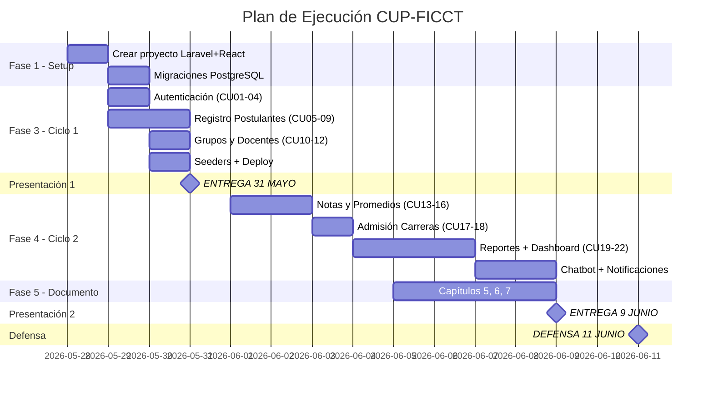

# Plan de Implementación — Sistema CUP FICCT

## ✅ Discrepancias Corregidas (ya aplicadas al documento)

Las 5 inconsistencias fueron resueltas directamente en [documento_parcial2.md](file:///c:/Users/User/Documents/1-2026/2do_Parcial_SI/documentacion/documento_parcial2.md):

| # | Discrepancia | Corrección Aplicada | Líneas |
|---|---|---|---|
| 1 | **Rol del Docente** decía "se elimina su rol de registrar notas, las evaluaciones se hacen automáticamente" — contradecía que el Admin carga notas | Reescrito: el Docente **visualiza notas y estadísticas de sus grupos**, pero NO registra notas (eso es del Admin) | ~1052 |
| 2 | **CU06** solo usaba BD externa (SEGIP/SEDUCA), el profesor pide **checklist de requisitos** | Ahora es **Checklist + Validación BD Externa** (el checklist es lo obligatorio, la BD externa es el diferenciador del grupo) | ~1297 |
| 3 | **Lista de CU** y **tabla de priorización** decían "Verificar Requisitos Automáticamente" | Actualizado a "Verificar Requisitos Documentales (Checklist + Validación BD Externa)" | ~1081, ~1113 |
| 4 | **Diagrama Ciclo 2** tenía al Docente declarado sin conexión (error UML) y al Postulante sin uso | Docente conectado a CU22 (Dashboard, vista restringida). Postulante removido del diagrama (no actúa en el Ciclo 2). CU13 renombrado a "(Administrador)" | ~1893 |
| 5 | **Alcance 1.4.2** decía "verificación automática sin intervención de un administrador" | Reescrito: checklist digital + validación complementaria contra BD externa | ~219 |

---

## Contexto y Fechas Clave

| Hito | Fecha | Contenido |
|---|---|---|
| **Hoy** | Miércoles 28/mayo | Iniciar implementación |
| **Presentación 1** | Domingo 31/mayo 23:59 | ≥50% Ciclo #1 (documento + software funcionando) |
| **Presentación 2** | Martes 09/junio 23:59 | 100% completo (Ciclo #1 + Ciclo #2) |
| **Defensa** | Jueves 11/junio 09:15 | Defensa del proyecto en auditorio |

> [!CAUTION]
> **La Presentación 1 es en 3 días.** El profesor exige ver el 50% del SOFTWARE funcionando, no solo documento. Prioridad absoluta: código operativo del Ciclo 1.

---

## Stack Tecnológico (obligatorio del examen)

| Capa | Tecnología |
|---|---|
| Backend | PHP 8.x + Laravel 11 |
| Frontend | React.js (con Inertia.js o como SPA separada) |
| Base de Datos | PostgreSQL 16 |
| Pasarela de Pago | Stripe |
| Despliegue | Cloud (Railway / Render / otro) |
| Control de versiones | GitHub |

---

## Proposed Changes

### FASE 1: Inicialización del Proyecto (1 hora)

#### [NEW] Proyecto Laravel + React
```
c:\Users\User\Documents\1-2026\2do_Parcial_SI\cup-system\
├── app/
│   ├── Http/Controllers/     ← Controladores por módulo
│   ├── Models/               ← Modelos Eloquent
│   └── Services/             ← Lógica de negocio (cálculo de grupos, promedios, etc.)
├── database/
│   ├── migrations/           ← Esquema PostgreSQL
│   └── seeders/              ← Datos de prueba (500-1000 postulantes)
├── routes/
│   ├── api.php               ← API REST
│   └── web.php               ← Rutas Inertia/web
├── resources/js/             ← React Frontend
│   ├── Components/
│   ├── Pages/
│   ├── Layouts/
│   └── app.jsx
└── .env                      ← Config PostgreSQL + Stripe keys
```

**Acciones:**
1. `composer create-project laravel/laravel cup-system`
2. Instalar dependencias: Inertia.js, React, Stripe SDK
3. Configurar `.env` con PostgreSQL
4. Configurar CORS y autenticación JWT/Sanctum

---

### FASE 2: Base de Datos — Migraciones PostgreSQL (1 hora)

16 tablas principales:

| Tabla | Relación con CU |
|---|---|
| `users` | CU01-CU04 (login, roles) |
| `bitacora_accesos` | CU01-CU02 (audit log) |
| `gestiones` | Global (1-2026, 2-2026) |
| `carreras` | CU05, CU17 (4 carreras FICCT) |
| `cupos_gestion` | CU18 (cupos por carrera/gestión) |
| `postulantes` | CU05, CU08 (datos completos + turno + carrera 1ª/2ª) |
| `requisitos_documentales` | CU06 (checklist de cada postulante) |
| `pagos` | CU07 (registro Stripe) |
| `materias` | CU13 (Computación, Matemáticas, Inglés, Física) |
| `grupos` | CU10 (número, turno, aula, gestión) |
| `aulas` | CU10 (capacidad, ubicación) |
| `asignaciones_grupo` | CU11 (postulante → grupo) |
| `docentes` | CU12 (datos profesionales) |
| `asignaciones_docente` | CU12 (docente → grupo + materia) |
| `examenes` | CU13-CU14 (3 notas × 4 materias × N postulantes) |
| `notas_finales` | CU15 (promedio ponderado por materia) |
| `admisiones` | CU17 (carrera asignada al aprobado) |
| `notificaciones` | Diferenciador (push en tiempo real) |

---

### FASE 3: Ciclo #1 — Para Presentación 1 (31 mayo)

> [!IMPORTANT]
> Este es el bloque crítico. Debe estar **funcionando y desplegado** en 3 días.

#### 3A. Módulo de Autenticación (CU01-CU04)
- Login con Laravel Sanctum (tokens)
- Logout con destrucción de token + bitácora
- Recuperación de contraseña por email
- CRUD de usuarios con 4 roles (Admin, Coordinador, Docente, Postulante)
- Middleware de autorización por rol
- Bitácora de accesos (login/logout con IP y timestamp)

#### 3B. Módulo de Registro de Postulantes (CU05-CU09)
- Formulario completo con validación frontend (React) + backend (Laravel)
- Checklist de requisitos documentales (5 checkmarks)
- Integración Stripe: crear Checkout Session → webhook → actualizar estado a "Inscrito"
- Detección automática de recurrente por CI
- Búsqueda con filtros avanzados (CI, nombre, carrera, estado, gestión)
- Listado paginado

#### 3C. Módulo de Grupos y Docentes (CU10-CU12)
- Algoritmo: `CEIL(inscritos_por_turno / 70)` → crear grupos
- Distribución equitativa de postulantes en grupos de su turno preferido
- Asignación de docentes a grupos/materias (máximo 4 grupos por docente)
- Validación de que no se asigne un docente a más de 4 grupos

#### 3D. Simulacro de Examen (CU23)
- Banco de preguntas de práctica (40 preguntas, 10 por materia)
- Interfaz de examen con temporizador
- Calificación automática sin efecto en notas oficiales

#### 3E. Seeders de Datos de Prueba
- **500-1000 postulantes** generados con Faker (datos realistas bolivianos)
- Notas aleatorias (0-100) para los 3 exámenes × 4 materias
- 15+ grupos precalculados
- 10+ docentes con asignaciones
- 4 carreras con cupos configurados

---

### FASE 4: Ciclo #2 — Para Presentación 2 (9 junio)

#### 4A. Módulo Académico (CU13-CU16)
- Registro individual de notas por el **Administrador** (grilla editable)
- Carga masiva desde CSV/Excel (parseo + validación + resumen de errores)
- Cálculo automático: `Nota_Final = (Ex1 × 0.30) + (Ex2 × 0.30) + (Ex3 × 0.40)`
- Determinación de estado: ≥60 en **CADA** materia individualmente → APROBADO

#### 4B. Módulo de Admisión (CU17-CU18)
- Configuración de cupos por carrera/gestión
- Algoritmo de asignación masiva: ordenar por promedio general DESC → 1ª opción → 2ª opción → "Pendiente"

#### 4C. Módulo de Reportes (CU19-CU21)
- Reportes predefinidos con un clic (lista inscritos, aprobados, reprobados, por grupo, por materia)
- Reportes dinámicos con filtros interactivos
- Exportación a PDF (con membrete) y Excel/CSV
- Reporte por comando de voz: Web Speech API → texto → IA (OpenAI) → SQL → resultado

#### 4D. Dashboard (CU22)
- KPI cards: total inscritos, aprobados, reprobados, grupos
- Gráficos: Chart.js (circular por carrera, barras por grupo, líneas histórico)
- Actualización en tiempo real (WebSockets con Laravel Reverb)

#### 4E. Diferenciadores del Grupo 15
- **Chatbot IA**: Widget flotante con OpenAI API para resolver dudas de postulantes
- **Notificaciones en tiempo real**: WebSockets push (pago confirmado, grupo asignado, notas publicadas, resultado final)

---

### FASE 5: Capítulos Faltantes del Documento

#### [NEW] Capítulo 5: FT. Análisis
- 5.1 Análisis de Arquitectura (diagrama de capas: presentación → negocio → datos)
- 5.2 Análisis de Casos de Uso (diagramas de comunicación por CU)
- 5.3 Análisis de Clases (clases boundary, control, entity por módulo)
- 5.4 Análisis de Paquetes

#### [NEW] Capítulo 6: FT. Diseño
- 6.1 Diseño de Arquitectura Física y Lógica (diagrama de despliegue PlantUML)
- 6.2 Diseño de Casos de Uso — **Diagramas de Secuencia** con fragmentos `alt`, `loop`, `opt`
- 6.3 Diseño de Datos — Modelo Lógico (diagrama de clases) + Modelo Físico (DDL PostgreSQL)

#### [NEW] Capítulo 7: FT. Implementación
- 7.1 Herramientas de desarrollo (PHP 8, Laravel 11, React, PostgreSQL, Stripe, etc.)
- 7.2 Implementación de la Arquitectura del Sistema (diagrama de componentes)
- 7.3 Implementación de Subsistemas (código fuente por módulo)

#### [NEW] Secciones finales
- Conclusión
- Recomendación
- Bibliografía
- Anexos (URL GitHub + código QR)

---

## Orden de Ejecución Priorizado



---

## Open Questions

> [!IMPORTANT]
> ### 1. ¿Tienes PostgreSQL, PHP/Composer y Node.js instalados?
> Necesito saber qué herramientas hay en tu máquina para no perder tiempo instalando. Si no los tienes, los instalaré primero.

> [!IMPORTANT]
> ### 2. ¿Tienes cuenta de Stripe (modo test)?
> Para la pasarela de pago necesito las API keys. Si no tienes, podemos crearla rápido (es gratis en modo test).

> [!IMPORTANT]
> ### 3. ¿Dónde van a desplegar?
> El profesor pide que NO sea localhost. ¿Ya tienen servidor cloud? (Railway, Render, AWS, etc.)

> [!IMPORTANT]
> ### 4. ¿Apruebas este plan para empezar a implementar?

---

## Verification Plan

### Automated Tests
- `php artisan test` — migraciones y seeders sin errores
- Test del algoritmo de grupos: input 70→1, 71→2, 140→2, 141→3, 1000→15
- Test de la regla ≥60/materia: caso 100/100/90/55 → REPROBADO
- Test de Stripe webhook: pago → estado "Inscrito"

### Manual Verification
- Login con los 4 roles → cada uno ve solo su módulo
- Registro de postulante → checklist → pago Stripe (test) → estado "Inscrito"
- Generar 1000 postulantes con seeder → calcular grupos → verificar distribución
- Cargar notas CSV → calcular promedios → verificar aprobados/reprobados
- Exportar reporte PDF y Excel → verificar datos correctos
- App responsive en móvil (Chrome DevTools)
- Deploy en cloud → accesible por URL pública
