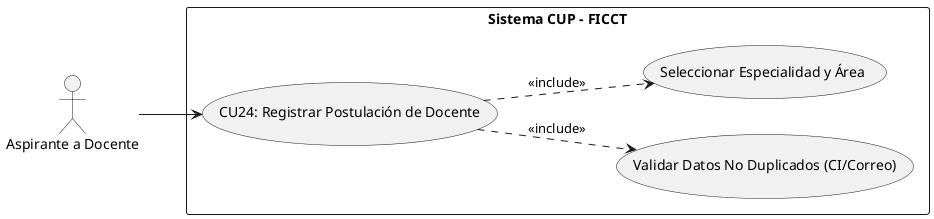
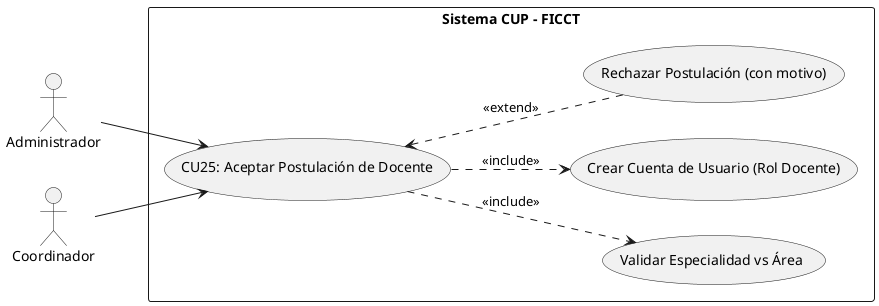
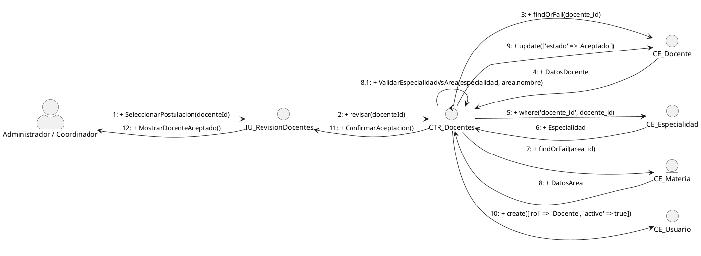
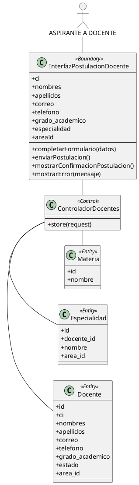
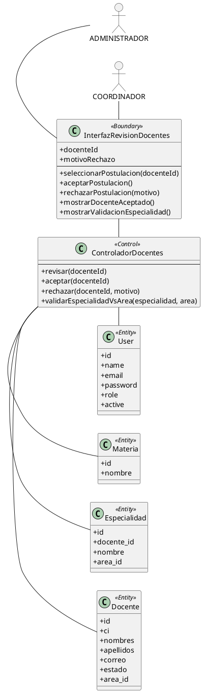
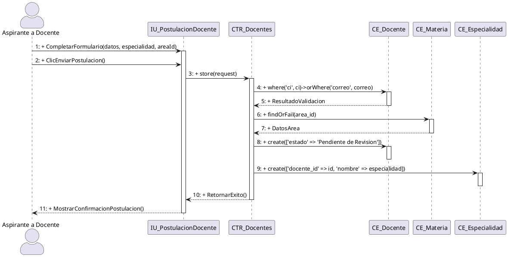
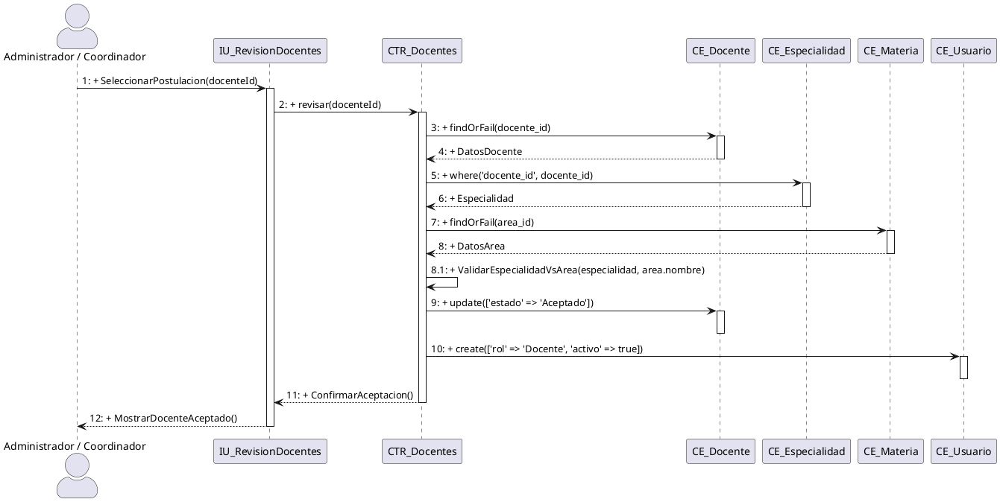

IMPLEMENTAR BASANDOTE LOS CASOS DE USOS 24 Y 25 BASANTOTE EN LO SIGUIENTE

#### CU24: Registrar Postulación de Docente

**A. Estructura del Modelo de CU (Diagrama Específico)**

**B. Ficha de Especificación del Caso de Uso**

| **CASO DE USO**     | CU24 — Registrar Postulación de Docente. 
| **PROPÓSITO**       | Capturar los datos personales y académicos del aspirante a docente del CUP, registrando su postulación con la especialidad y el área (materia) en la que desea enseñar, generando su expediente en estado "Pendiente de Revisión".  
| **DESCRIPCIÓN**     | El aspirante a docente accede de forma pública (sin autenticación previa) al portal de convocatoria docente. Completa sus datos personales (CI, nombres, apellidos, correo, teléfono), su grado académico y, lo más importante, declara su **especialidad** y selecciona el **área/materia** en la que desea enseñar (Computación, Matemáticas, Inglés o Física), adjuntando su hoja de vida y respaldos académicos. Antes de procesar el registro, el sistema verifica que el CI y el correo no estén duplicados. La postulación NO genera una cuenta de usuario: queda almacenada en estado "Pendiente de Revisión" a la espera de ser evaluada y aceptada por el Administrador o Coordinador (CU25). 
| **ACTORES**         | Tablas de BD (`docentes`, `especialidades`, `areas` / `materias`).
| **ACTOR INICIADOR** | Aspirante a Docente (Público). 
| **PRECONDICIÓN**    | El período de convocatoria docente debe estar abierto (configurado por el Administrador). No requiere inicio de sesión. 
| **FLUJO PRINCIPAL** | 1. El aspirante accede al portal y hace clic en "Postular como Docente". 2. El sistema despliega el formulario de postulación con los campos: CI, nombres, apellidos, fecha de nacimiento, correo electrónico, teléfono, grado académico, especialidad y el área/materia en la que desea enseñar (Computación, Matemáticas, Inglés, Física), además de la carga de hoja de vida y respaldos. 3. El aspirante completa los campos y adjunta los documentos. 4. El sistema ejecuta `<<include>>` la validación de que el CI y el correo no estén ya registrados como docente. 5. El sistema valida que se haya declarado una especialidad y seleccionado al menos un área. 6. El sistema registra la postulación en la tabla `docentes` con estado "Pendiente de Revisión". 7. El sistema muestra el mensaje: "Su postulación fue registrada exitosamente y será revisada por la coordinación". |
| **POST CONDICIÓN**  | La postulación del docente queda registrada con estado "Pendiente de Revisión", vinculada a su especialidad y área declaradas, lista para ser evaluada en CU25. Aún no existe cuenta de usuario asociada. 
| **EXCEPCIONES**     | *E1: Convocatoria cerrada.* "La convocatoria docente para la gestión [X] no está habilitada". *E2: CI ya registrado como docente.* "Ya existe una postulación o un docente registrado con este CI". *E3: Correo duplicado.* "Este correo electrónico ya está asociado a otra postulación docente". *E4: Sin especialidad/área.* "Debe declarar su especialidad y seleccionar el área en la que desea enseñar".                                                                                                    
**C. Prototipo UI (Directriz)**

> Formulario público de postulación docente en tarjeta blanca amplia con tipografía limpia (Inter/Roboto). Campos para datos personales, un selector de "Grado Académico", un campo de "Especialidad" y un selector de "Área en la que desea enseñar" (Computación, Matemáticas, Inglés, Física), además de una zona de arrastre para adjuntar hoja de vida y respaldos. Botón principal "Enviar Postulación" en azul institucional y mensaje de confirmación tras el envío indicando que la postulación quedará en revisión.

#### CU25: Aceptar Postulación de Docente

**A. Estructura del Modelo de CU (Diagrama Específico)**

**B. Ficha de Especificación del Caso de Uso**

| **CASO DE USO**     | CU25 — Aceptar Postulación de Docente.
| **PROPÓSITO**       | Permitir al Administrador o Coordinador revisar y validar las postulaciones de docentes, aceptando únicamente a quienes acrediten una especialidad correspondiente al área en la que desean enseñar, y generando su cuenta de usuario con rol Docente. 
| **DESCRIPCIÓN**     | El Administrador o Coordinador accede al módulo de "Revisión de Postulaciones Docentes" y consulta las postulaciones en estado "Pendiente de Revisión". Revisa los datos, la hoja de vida y los respaldos de cada aspirante y valida la **regla de negocio crítica**: el docente debe poseer una especialidad que corresponda al área/materia en la que se postula (p. ej. una especialidad en Álgebra/Cálculo para postular a Matemáticas). Si la especialidad es coherente con el área, **acepta** la postulación: el sistema cambia el estado a "Aceptado", crea automáticamente la cuenta de usuario con rol "Docente" (credenciales autogeneradas y enviadas por correo) y deja al docente habilitado para ser asignado a grupos y materias (CU12). Si la especialidad no corresponde al área o faltan respaldos, **rechaza** la postulación indicando el motivo.                                  |
| **ACTORES**         | Tablas de BD (`docentes`, `users`, `especialidades`, `areas` / `materias`), Servicio SMTP de correo. 
| **ACTOR INICIADOR** | Administrador o Coordinador Académico.
| **PRECONDICIÓN**    | El actor debe estar autenticado (CU01) con rol Administrador o Coordinador. Debe existir al menos una postulación docente en estado "Pendiente de Revisión" (CU24).
| **FLUJO PRINCIPAL** | 1. El actor ingresa al módulo "Gestión de Docentes" → "Postulaciones Pendientes". 2. El sistema despliega la grilla de postulaciones en estado "Pendiente de Revisión" con su especialidad y área declaradas. 3. El actor selecciona una postulación y presiona "Revisar". 4. El sistema muestra el detalle del aspirante (datos, hoja de vida, respaldos, especialidad y área). 5. El sistema ejecuta `<<include>>` la validación de coincidencia entre la especialidad del docente y el área a la que postula. 6. Si la especialidad corresponde al área, el actor presiona "Aceptar Postulación". 7. El sistema cambia el estado del docente a "Aceptado". 8. El sistema ejecuta `<<include>>` la creación de la cuenta de usuario en `users` con rol "Docente" y credenciales autogeneradas. 9. El sistema envía un correo al docente con sus accesos y muestra: "Docente aceptado y notificado correctamente". |
| **POST CONDICIÓN**  | El docente queda con estado "Aceptado" y con una cuenta de usuario activa de rol "Docente". Queda habilitado para ser asignado a grupos y materias (CU12) conforme a su especialidad.
| **EXCEPCIONES**     | *E1: Especialidad no corresponde al área.* El sistema advierte: "La especialidad del docente [X] no corresponde al área [Y]. No es posible aceptar la postulación en esta área". *E2: Respaldos incompletos.* El sistema impide la aceptación: "La postulación no cuenta con los respaldos académicos requeridos". *E3: Rechazo de postulación (`<<extend>>`).* El actor presiona "Rechazar", el sistema solicita el motivo, cambia el estado a "Rechazado" y notifica al aspirante por correo. *E4: Docente ya aceptado.* "Esta postulación ya fue procesada anteriormente".                                                                                                                                                                                                    
**C. Prototipo UI (Directriz)**
> Vista de administración de "Revisión de Postulaciones Docentes" con sidebar institucional y panel principal. Tabla de postulaciones pendientes con columnas Nombre, CI, Especialidad, Área Postulada y un Badge de estado ("Pendiente" en ámbar). Al abrir el detalle, mostrar una ficha del aspirante con su hoja de vida embebida y un indicador semántico de validación "Especialidad ↔ Área" (verde si coincide, rojo si no). Dos botones de acción: "Aceptar Postulación" (verde, crea la cuenta de usuario) y "Rechazar" (rojo, abre un modal para capturar el motivo).

#### Realización de Análisis para CU24: Registrar Postulación de Docente

**Descripción detallada de la colaboración y dinámica:**
El flujo inicia cuando el actor *Aspirante a Docente* completa el formulario público en la `IU_PostulacionDocente`. La frontera delega al `CTR_Docentes`, el cual primero valida en la entidad `CE_Docente` que el CI y el correo no se encuentren duplicados. Si la validación es exitosa, el controlador obtiene el área/materia seleccionada desde `CE_Materia`, registra la postulación en `CE_Docente` con estado "Pendiente de Revisión" y persiste la especialidad declarada en `CE_Especialidad`. Finalmente, la interfaz confirma el envío de la postulación al aspirante.

#### Realización de Análisis para CU25: Aceptar Postulación de Docente

**Descripción detallada de la colaboración y dinámica:**
El flujo inicia cuando el actor *Administrador* o *Coordinador* interactúa con la `IU_RevisionDocentes` para revisar una postulación pendiente. La frontera delega al `CTR_Docentes`, el cual recupera la postulación y su especialidad desde `CE_Docente` y `CE_Especialidad`, y obtiene el área desde `CE_Materia`. El controlador ejecuta el auto-mensaje `ValidarEspecialidadVsArea()` para verificar la regla de negocio crítica (la especialidad debe corresponder al área). Si coincide, actualiza el estado del docente a "Aceptado" y crea la cuenta de usuario con rol "Docente" en la entidad `CE_Usuario`, dejándolo habilitado para CU12. Finalmente, la interfaz confirma la aceptación y la notificación al docente.

##### CU24: Registrar Postulación de Docente

##### CU25: Aceptar Postulación de Docente

#### 24. Diagrama de Secuencia para CU24: Registrar Postulación de Docente

#### 25. Diagrama de Secuencia para CU25: Aceptar Postulación de Docente

